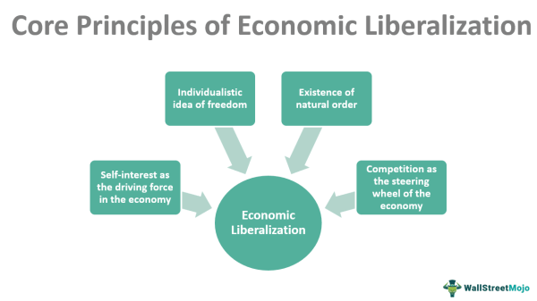

Algorithmic trading, also known as automated trading, refers to the use of computer algorithms to manage trading orders in financial markets. This methodology has significantly influenced the financial sector by enhancing the speed, accuracy, and efficiency of trading activities. It involves complex mathematical models and rapid data analysis, allowing traders to capitalize on market conditions faster than human cognition allows. Algorithms, which make decisions based on pre-set rules and market data, govern the buying or selling of financial instruments without human intervention. 

The importance of contract law in trading, particularly concerning algorithmic contracts, cannot be overstated. One crucial aspect of these contracts is the liberalization clause, often used in insurance policies to allow adjustments in response to legislative changes without needing to rewrite the whole contract. Liberalization clauses facilitate adaptability and compliance amidst regulatory changes, which is vital in the fast-paced environment of financial markets. In the context of algorithmic trading, these clauses could ensure that automated systems remain within legal bounds even as regulations evolve.

Legal terms are pivotal in shaping algorithmic contracts due to their role in defining obligations, rights, and liabilities. The intersection of contract law, with its focus on agreements and enforcement, and the automation of trading through algorithms raises significant considerations for both compliance and risk management. These legal frameworks must be precise yet adaptable to accommodate the rapid changes inherent in algorithmic trading environments. Consequently, understanding how these legal instruments can be integrated into trading algorithms is essential for maintaining legal and operational integrity.

The objective of this article is to explore the intersection of contract law, liberalization clauses, and algorithmic trading. It aims to discuss how legal terms, especially liberalization clauses, can be pivotal in managing the dynamic nature of algorithmic trading contracts. This exploration will provide insights into the current legal frameworks governing algorithmic trading, their loopholes, and the potential for integrating adaptive clauses to enhance compliance and accountability. By examining these aspects, the article aims to highlight the necessity for a robust legal structure that evolves alongside technological advancements in financial trading.

## Table of Contents

## Understanding Liberalization Clauses

A liberalization clause is an essential provision in insurance contracts, particularly within property insurance. Its primary function is to allow for automatic adjustments to the policy terms to accommodate regulatory changes or enhancements in coverage offered by the insurer, without necessitating the execution of a new contract. This mechanism ensures that the policyholders can benefit from improved terms that emerge due to legislative amendments or updates in the insurer's offerings.

The general purpose of a liberalization clause is to streamline the application of regulatory improvements, ensuring that the insurance policy remains compliant with current laws and reflects the most favorable terms available to the insured. This clause acts as a safeguard for both insurers and policyholders by facilitating the automatic modification of a contract in response to legal or regulatory updates.

The benefits of incorporating liberalization clauses are manifold for both insurers and policyholders. For insurers, such clauses help maintain regulatory compliance efficiently, minimizing administrative burdens and potential liabilities associated with outdated policy terms. They can also enhance customer satisfaction by demonstrating a commitment to providing up-to-date and robust coverage options without requiring tedious renegotiations or additional paperwork.

For policyholders, liberalization clauses offer the advantage of receiving improved coverage without the need to constantly monitor regulatory changes or engage in contract renegotiations. This ensures that their insurance policy always reflects the latest benefits, providing peace of mind and a sense of security.

To illustrate the concept, consider an example from property insurance: Suppose an insurance company updates its policy to provide coverage for a new type of natural disaster due to a recent statutory regulation. A liberalization clause in an existing property insurance policy would automatically extend this new coverage to all current policyholders, effective from the date the regulation was enacted, without requiring any action from the policyholders themselves. This automatic update streamlines processes for the insurer and ensures that policyholders are adequately protected under the latest terms.

In conclusion, liberalization clauses serve as vital components within insurance contracts, ensuring flexibility and compliance in a dynamic regulatory landscape, while enhancing the overall value and effectiveness of insurance coverage for both parties involved.

## Algorithmic Contracts in Trading

Algorithmic contracts represent a sophisticated integration of technology and finance, specifically tailored to streamline operations within high-speed trading environments. These contracts utilize computer algorithms to automate decision-making processes and execute trades based on predefined criteria without human intervention. In high-frequency trading ([HFT](/wiki/high-frequency-trading-strategies)) contexts, algorithms can analyze market data, assess risks, and determine trading obligations in fractions of a second, offering unprecedented speed and efficiency.

The nature of algorithmic contracts is fundamentally rooted in the ability to automate trade decisions, thereby mitigating human error, and enhancing execution speed. This capability is particularly beneficial in volatile markets where timely decision-making is crucial. The algorithms operate using a set of programmed instructions that consider various market factors such as price fluctuations, trading [volume](/wiki/volume-trading-strategy), and [liquidity](/wiki/liquidity-risk-premium). They can execute complex trading strategies, including [arbitrage](/wiki/arbitrage), [statistical arbitrage](/wiki/statistical-arbitrage), and market-making strategies, with precision and speed that far surpass human capabilities.

Traditional contract law faces significant challenges with the advent of these 'black box' [algorithmic trading](/wiki/algorithmic-trading) systems. A black box system, characterized by its complex and often opaque operational processes, makes it difficult to ascertain the exact parameters under which decisions are made. This opacity presents legal conundrums, especially concerning the assignment of liability in cases of erroneous trades or market manipulation. Traditional legal frameworks were designed to interpret explicit human actions and intentions, which are not directly applicable to the algorithm-driven actions executed autonomously by machines.

The Uniform Electronic Transactions Act (UETA) plays a pivotal role in addressing some of these challenges by providing a legal framework for the electronic formation of contracts. UETA facilitates the use of electronic signatures and records, ensuring that legally binding agreements can be established and executed digitally. For algorithmic contracts, UETA's emphasis on the legitimacy of electronic records is fundamental, as these contracts exist entirely within digital environments. The act ensures that electronic interactions, including those by algorithms, are granted the same legal standing as their paper-based counterparts, thereby offering a modicum of legal recognition and enforceability to algorithmic transactions.

However, the direct application of UETA presents various implications for algorithmic contracts. While it validates electronic records, it does not fully address the complexities introduced by algorithmic trading systems, such as the assignment of liability in the absence of human oversight and the element of unforeseeable outcomes inherent in complex algorithms. These gaps underscore the necessity for evolving legal doctrines that can accommodate the unique challenges posed by algorithmic contracts in high-frequency trading environments.

## Legal Frameworks Governing Algorithmic Trading

Algorithmic trading operates within a complex legal environment primarily governed by traditional contract law doctrines. These doctrines were originally designed for human-to-human agreements and are now being tested by the rapid advancement of technology, particularly in high-frequency trading and automated transactions. One of the core principles of contract law is mutual consent, which asserts that both parties involved in a transaction must knowingly agree to the terms. In the context of algorithmic trading, where decisions are made in fractions of a second by autonomous systems, the very notion of mutual consent becomes challenging to uphold. 

Moreover, the traditional doctrines do not account for unique characteristics of algorithmic systems, such as their "black box" nature. These systems often make decisions based on complex, proprietary algorithms that not even their operators fully understand, making accountability difficult in cases of error or fraud. This opacity can lead to manipulation and a lack of accountability, as illustrated by past incidents of algorithmic malfunctions causing market disruptions, such as the Flash Crash of 2010.

Current legal frameworks, including the Uniform Electronic Transactions Act (UETA), offer some guidance but are not sufficiently comprehensive to address the nuances of algorithmic trading. The UETA, which validates electronic signatures and records, recognizes the legitimacy of contracts formed electronically. However, it does not adequately address issues specific to algorithms, such as liability for autonomous decision-making or the intricacies of [machine learning](/wiki/machine-learning) affecting trading decisions.

Legal scholars propose several solutions to adapt contract law to the digital age. Notably, experts from institutions like Stanford University advocate for a rethinking of contract structures to incorporate more robust mechanisms for ensuring accountability. Suggestions include establishing clearer liability frameworks that specify the parties responsible for decisions made by algorithms and advancements in regulatory oversight to mandate transparent algorithms.

Furthermore, enhancing existing legal frameworks with greater emphasis on adaptability, such as introducing liberalization clauses, could ensure contracts remain compliant with evolving regulations. These clauses would allow for adjustments to contracts in line with new regulatory requirements, thus reducing the risk of legal exposure due to outdated contract terms.

A future-focused approach involves cross-disciplinary collaboration between legal experts, technologists, and policymakers to develop standardized practices that integrate technological advancements into existing legal doctrines. Such a collaborative effort aims to craft a legal infrastructure resilient to the dynamic changes characteristic of the financial markets driven by technological innovation.

## Integrating Liberalization Clauses into Algorithmic Contracts

The incorporation of liberalization clauses into algorithmic trading contracts presents a significant opportunity to enhance contractual adaptability and compliance. Liberalization clauses, commonly found in insurance contracts, enable policy adjustments in response to regulatory changes without necessitating a new contract. This concept can be effectively applied to algorithmic trading environments, where speed and adaptability are paramount.

### Enhancing Adaptability and Compliance

Algorithmic trading operates at high speeds, often involving complex and automated decision-making processes. In such environments, maintaining compliance with evolving regulations is a substantial challenge. By integrating liberalization clauses, trading contracts can automatically accommodate regulatory changes, reducing the need for manual contract amendments and minimizing the risk of non-compliance.

For instance, in countries experiencing frequent changes in financial regulations, a liberalization clause might stipulate that any regulatory update in trading practices is automatically applied to the existing contract. This ensures that the contract remains valid and legally enforceable without renegotiation, saving time and resources for all parties involved.

### Hypothetical Scenarios

Consider a scenario where a governmental body imposes a new trading restriction, such as limits on the volume of transactions per day. A liberalization clause embedded in algorithmic trading contracts could automatically adjust the algorithm's parameters to comply with these new restrictions, thereby preventing legal infractions.

Another hypothetical scenario involves changes in data protection laws impacting algorithmic data usage. A liberalization clause designed to reflect data compliance requirements would enable automatic updates to data handling and storage procedures within trading algorithms, ensuring immediate compliance with data protection regulations.

By crafting algorithmic trading contracts with built-in liberalization clauses, firms can manage risks associated with regulatory changes more effectively. Such clauses provide a proactive strategy to address compliance and operational risks, reduce legal uncertainties, and enhance overall trading efficiency.

Ultimately, the integration of liberalization clauses into algorithmic trading contracts represents a forward-thinking approach to navigating the legal complexities of modern trading environments. It ensures that contracts can swiftly adapt to regulatory changes, maintaining their validity and enforceability while aligning with the dynamic nature of global financial markets.

## Case Studies and Examples

In examining the practical application of liberalization clauses within the financial sector, specific case studies highlight their benefits and challenges, particularly when these clauses intersect with algorithmic trading contracts.

### Case Study 1: Benefits in Risk Management

A notable example can be drawn from a major global investment bank that integrated liberalization clauses into its algorithmic trading framework. The bank faced a rapidly changing regulatory environment due to new international trade policies and financial regulations. By embedding liberalization clauses in their trading contracts, the bank achieved a dynamic compliance mechanism, allowing automatic adjustments to contractual terms in response to regulatory updates. This adaptive approach significantly reduced potential compliance risks and ensured a streamlined trading process, even amid substantial regulatory shifts. The case underscores the potential of liberalization clauses to enhance the resilience of trading operations against external legal changes.

### Case Study 2: Challenges and Negative Impacts

Contrastingly, an incident involving a [hedge fund](/wiki/hedge-fund-trading-strategies) demonstrated the pitfalls when liberalization clauses are absent in algorithmic trading contracts. The fund relied on complex high-frequency trading (HFT) algorithms, which, due to a lack of adaptable legal mechanisms, suffered significant operational disruptions following abrupt regulatory amendments on trading margins. The absence of a liberalization clause forced the fund to renegotiate numerous contracts under time pressure, leading to financial losses and legal disputes. This example illustrates the critical vulnerability of algorithmic trading systems to fixed legal frameworks that lack flexibility and underscores the necessity for adaptable clauses to mitigate such risks.

### Insights and Need for Adaptive Legal Clauses

These cases reveal a fundamental need for legal adaptability in algorithmic trading. The positive outcomes in scenarios where liberalization clauses were present highlight their role in fostering a responsive and compliant trading environment. In contrast, the challenges faced in situations lacking such adaptability stress the importance of evolving legal frameworks to accommodate the nuances of algorithmic operations. 

The integration of liberalization clauses could provide a pragmatic solution, offering a scalable way to ensure compliance and operational continuity. As regulatory landscapes continue to evolve, these clauses seem indispensable for mitigating risks associated with legal rigidity. The financial sector may benefit from adopting a forward-thinking approach, encouraging the incorporation of adaptive legal clauses to safeguard against potential disruptions and legal discrepancies.

## Conclusion

In summarizing the exploration of algorithmic trading and its intersection with contract law, it becomes evident that the adaptability of legal frameworks is crucial. As financial markets become increasingly driven by high-speed, algorithm-based trading systems, conventional legal doctrines face challenges in keeping pace with technological advancements. Traditional contract laws, often rooted in manual transactions, struggle to address the complexities introduced by automated, 'black box' trading systems, where algorithms dictate contractual obligations and trading decisions often without the need for human intervention.

Integrating liberalization clauses within algorithmic trading contracts presents a promising solution. These clauses allow for the dynamic adjustment of contracts in response to evolving regulatory landscapes. This adaptability ensures that trading operations remain compliant with legal requirements without necessitating the negotiation of new contracts, thereby reducing operational frictions and enhancing agility. Such provisions could prove beneficial not only to traders but also to regulators who seek to oversee increasingly complex financial markets with greater efficacy.

Moreover, the potential benefits of liberalization clauses are not merely theoretical. The ability to adjust algorithmic contracts in line with regulatory changes on-the-fly offers a clear path toward mitigating risks associated with regulatory non-compliance and market manipulation. These clauses can also foster transparency and accountability by ensuring that contractual terms remain relevant and enforceable as market conditions and regulations evolve.

To realize these benefits, there is a pressing need for further research into the integration of legal adaptability within automated trading frameworks. Policymakers, legal scholars, and financial technologists must collaborate to develop comprehensive legal standards that address the unique challenges of algorithmic trading. By prioritizing adaptable legal structures, the financial sector can better navigate the complexities of modern trading environments, thereby promoting a more stable and equitable marketplace.

The article calls for a proactive approach, urging stakeholders to recognize the transformative impact of algorithmic trading on financial markets and to advocate for robust legal structures that safeguard against the inherent risks of this technology-driven landscape. Continuous efforts in research and policy-making are essential to ensure that legal frameworks not only accommodate but also enhance the safe and efficient functioning of today's fast-evolving trading systems.

## References & Further Reading

[1]: Narang, R. (2013). ["Inside the Black Box: A Simple Guide to Quantitative and High-Frequency Trading"](https://onlinelibrary.wiley.com/doi/book/10.1002/9781118662717). Wiley.

[2]: Hull, J. C. (2017). ["Options, Futures, and Other Derivatives"](https://www.semanticscholar.org/paper/Options%2C-Futures%2C-and-Other-Derivatives-Hull/89bdee500c8623864fc9eb7a471546aa713acc44). Pearson Education.

[3]: MacCarthy, M. (2020). ["AI, Algorithms, and Equity: Not too fast"](https://www.brookings.edu/articles/ai-needs-more-regulation-not-less/). Brookings Institution.

[4]: Kishan, R. (2010). ["The Flash Crash: A New Regulatory in Wake of Market Meltdown"](https://www.researchgate.net/publication/320965956_The_flash_crash_a_review).

[5]: Scopino, G. (2015). ["The Algo Arms Race: Trading Execution, Market Regulation, and Innovation"](https://link.springer.com/article/10.1007/s11408-021-00401-8). CFA Institute.