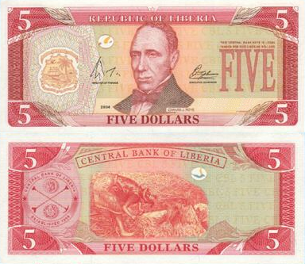

## Table of Contents

## What is the Liberian Dollar?

The Liberian Dollar is the official currency of Liberia, a country in West Africa. It is used every day by people in Liberia to buy things like food, clothes, and other necessities. The Liberian Dollar is shown with the symbol "L$" and is divided into 100 cents. The Central Bank of Liberia is in charge of making and managing this currency.

The Liberian Dollar has been around since 1943. Before that, Liberia used the United States Dollar. Even now, the US Dollar is still used a lot in Liberia alongside the Liberian Dollar. This is because Liberia has close ties with the United States. The value of the Liberian Dollar can change, and sometimes it is worth less compared to the US Dollar. This can make things more expensive for people in Liberia.

## When was the Liberian Dollar first introduced?

The Liberian Dollar was first introduced in 1943. Before 1943, people in Liberia used the United States Dollar for buying things. The Liberian Dollar was created to help Liberia have its own money and to show that it was an independent country.

When the Liberian Dollar was first made, it was equal to the US Dollar. This meant that one Liberian Dollar could be traded for one US Dollar. Over time, the value of the Liberian Dollar changed and it became worth less than the US Dollar. Even though Liberia has its own currency, the US Dollar is still used a lot in the country.

## What is the symbol and currency code for the Liberian Dollar?

The symbol for the Liberian Dollar is "L$". This symbol is used every day by people in Liberia when they are buying things like food or clothes. It helps them know how much something costs in their own currency.

The currency code for the Liberian Dollar is "LRD". This code is used by banks and businesses when they are doing money transactions. It helps them keep track of the Liberian Dollar when they are working with other currencies.

## How does the Liberian Dollar compare to the US Dollar?

The Liberian Dollar (L$) and the US Dollar ($) are both used in Liberia, but they are not the same. When the Liberian Dollar was first introduced in 1943, it was equal to the US Dollar. This meant that one Liberian Dollar could be traded for one US Dollar. Over time, the value of the Liberian Dollar changed and it became worth less than the US Dollar. For example, in 2023, one US Dollar could be traded for around 150 Liberian Dollars. This means that things bought with Liberian Dollars can become more expensive if the value of the Liberian Dollar goes down.

Because the US Dollar is still used a lot in Liberia, people often compare prices in both currencies. If the Liberian Dollar loses value, it can make things like food, clothes, and other necessities more expensive for people in Liberia who use Liberian Dollars. This is why many people in Liberia prefer to use US Dollars for big purchases or to save money, even though the Liberian Dollar is the official currency of the country.

## What are the denominations of Liberian Dollar banknotes and coins?

Liberian Dollar banknotes come in different amounts, like 5, 10, 20, 50, 100, and 500 Liberian Dollars. These banknotes are used every day by people in Liberia to buy things. The banknotes have pictures of important people and places in Liberia on them. This helps show the country's history and culture.

Liberian Dollar coins also come in different amounts. There are coins for 1, 5, 10, 25, and 50 cents, and also for 1 Liberian Dollar. People use these coins to buy smaller things or to make change. The coins have different sizes and shapes, and they often have symbols or images that represent Liberia.

## Who issues the Liberian Dollar?

The Liberian Dollar is issued by the Central Bank of Liberia. This bank is in charge of making and managing the Liberian Dollar. They decide how many Liberian Dollars to print and put into the economy. The Central Bank of Liberia works to make sure that the Liberian Dollar stays stable and that people can use it every day to buy things.

The Central Bank of Liberia also helps control inflation, which is when prices for things go up. By managing the Liberian Dollar, the bank tries to keep prices stable so that people in Liberia can afford what they need. The bank works hard to make sure the Liberian Dollar is trusted and used widely in the country.

## What factors influence the exchange rate of the Liberian Dollar?

The exchange rate of the Liberian Dollar is influenced by many things. One big [factor](/wiki/factor-investing) is the economy of Liberia. If the economy is doing well, more people want to buy Liberian Dollars, and this can make the Liberian Dollar stronger compared to other currencies like the US Dollar. On the other hand, if the economy is not doing well, people might not want to buy Liberian Dollars, and this can make the Liberian Dollar weaker. Another factor is inflation. If prices in Liberia are going up a lot, this can make the Liberian Dollar worth less compared to other currencies.

Another thing that affects the exchange rate is how much Liberia trades with other countries. If Liberia is selling a lot of goods to other countries, this can make the Liberian Dollar stronger because other countries need Liberian Dollars to buy those goods. But if Liberia is buying more from other countries than it is selling, this can make the Liberian Dollar weaker. Also, political stability plays a role. If there is a lot of peace and stability in Liberia, people might trust the Liberian Dollar more, which can make it stronger. But if there is a lot of unrest or uncertainty, people might not trust the Liberian Dollar as much, and this can make it weaker.

## How has the value of the Liberian Dollar changed historically?

When the Liberian Dollar was first introduced in 1943, it was equal to the US Dollar. This meant that one Liberian Dollar could be traded for one US Dollar. At that time, Liberia was trying to show that it was an independent country with its own currency. Over the years, the value of the Liberian Dollar started to change. By the 1980s, the Liberian Dollar began to lose value compared to the US Dollar. This meant that more Liberian Dollars were needed to buy one US Dollar.

In the 1990s and 2000s, Liberia went through a lot of changes and difficulties, including civil wars. These events made the Liberian Dollar even weaker. By the early 2000s, one US Dollar could be traded for around 50 Liberian Dollars. As time went on, the value of the Liberian Dollar kept going down. By 2023, one US Dollar could be traded for around 150 Liberian Dollars. This shows that the Liberian Dollar has lost a lot of its value over time, making things more expensive for people in Liberia who use Liberian Dollars.

## What are the economic impacts of the Liberian Dollar's fluctuations?

When the value of the Liberian Dollar goes up and down a lot, it can make life harder for people in Liberia. If the Liberian Dollar gets weaker, things like food, clothes, and other things people need can become more expensive. This is because more Liberian Dollars are needed to buy the same amount of goods from other countries. When prices go up, people might not be able to afford as much, and this can make life harder for families. Businesses in Liberia also have a hard time when the Liberian Dollar is weak. They might find it more expensive to buy things they need to make their products, which can make it harder for them to make money.

On the other hand, if the Liberian Dollar gets stronger, it can help the economy in some ways. When the Liberian Dollar is strong, it can be cheaper for Liberia to buy things from other countries. This can help businesses because their costs go down, and it can also help people because the things they need might not cost as much. But a strong Liberian Dollar can also make it harder for Liberia to sell its own goods to other countries. If Liberian products become more expensive for people in other countries to buy, they might not want to buy them as much. This can hurt businesses that rely on selling things to other countries.

## How does the Liberian Dollar affect trade and commerce in Liberia?

The Liberian Dollar plays a big role in how trade and commerce work in Liberia. When the Liberian Dollar is weak, it can make it harder for businesses in Liberia to buy things they need from other countries. This is because they need more Liberian Dollars to buy the same amount of goods. This can make things more expensive for businesses, which can lead to higher prices for customers. Also, when the Liberian Dollar is weak, it can be good for selling Liberian products to other countries because those products become cheaper for people in other countries to buy. But if the Liberian Dollar is too weak, it can cause problems because people in Liberia might not be able to afford the things they need.

On the other hand, when the Liberian Dollar is strong, it can help businesses in Liberia buy things from other countries more cheaply. This can lower their costs and make it easier for them to make money. It can also help people in Liberia because the things they need might not cost as much. But a strong Liberian Dollar can make it harder for Liberia to sell its own products to other countries. If Liberian products become more expensive for people in other countries to buy, they might not want to buy them as much. This can hurt businesses that rely on selling things to other countries. So, the value of the Liberian Dollar can have a big impact on how well businesses in Liberia can trade and do commerce.

## What monetary policies are used to manage the Liberian Dollar?

The Central Bank of Liberia uses different ways to manage the Liberian Dollar. One way is by changing the interest rates. If the Central Bank wants to make the Liberian Dollar stronger, it might raise the interest rates. This makes it more expensive for people and businesses to borrow money, so they spend less. When people spend less, there is less money going around, and this can help make the Liberian Dollar stronger. On the other hand, if the Central Bank wants to make the Liberian Dollar weaker, it might lower the interest rates. This makes it cheaper for people and businesses to borrow money, so they spend more. When people spend more, there is more money going around, and this can help make the Liberian Dollar weaker.

Another way the Central Bank of Liberia manages the Liberian Dollar is by buying and selling foreign currency, like the US Dollar. If the Central Bank wants to make the Liberian Dollar stronger, it might sell US Dollars and buy Liberian Dollars. This means there are more Liberian Dollars in the market, which can make the Liberian Dollar stronger. If the Central Bank wants to make the Liberian Dollar weaker, it might buy US Dollars and sell Liberian Dollars. This means there are fewer Liberian Dollars in the market, which can make the Liberian Dollar weaker. By doing these things, the Central Bank tries to keep the Liberian Dollar stable so that people in Liberia can use it every day to buy things.

## What are the future prospects for the Liberian Dollar in the global economy?

The future of the Liberian Dollar in the global economy depends on many things. One big thing is how well Liberia's economy does. If Liberia can grow its economy and make more things to sell to other countries, the Liberian Dollar might become stronger. Also, if Liberia can keep its prices stable and not let them go up too fast, this can help the Liberian Dollar stay strong. Another thing that can help is if Liberia can keep its country peaceful and stable. When a country is peaceful, people trust its money more, and this can make the Liberian Dollar stronger.

But there are also things that can make the Liberian Dollar weaker in the future. If Liberia's economy does not do well, or if it has to buy more things from other countries than it sells, the Liberian Dollar might lose value. Also, if prices in Liberia go up a lot, this can make the Liberian Dollar worth less compared to other currencies. Political problems or unrest can also make people not trust the Liberian Dollar as much, which can make it weaker. So, the future of the Liberian Dollar will depend a lot on how well Liberia can manage these things.

## References & Further Reading

[1]: ["Economic Growth in Liberia: Challenges and Opportunities"](https://www.afdb.org/en/countries/west-africa/liberia/liberia-economic-outlook) - African Development Bank

[2]: ["Challenges of Dual Currency Systems and Currency Substitution"](https://en.wikipedia.org/wiki/Currency_substitution) by Eduardo Levy Yeyati

[3]: ["Central Bank of Liberia: Historical Overview"](https://www.cbl.org.lr/general/brief-history-central-bank-liberia) - Central Bank of Liberia Official Website

[4]: ["The Story of Liberia: Economy Overview and Data"](https://www.worldbank.org/en/country/liberia/overview) - World Bank

[5]: ["Algorithmic Trading: Winning Strategies and Their Rationale"](https://www.amazon.com/Algorithmic-Trading-Winning-Strategies-Rationale-ebook/dp/B00CY5HC0U) by Ernie Chan

[6]: ["Liberia and the United States: A Complex Relationship"](https://en.wikipedia.org/wiki/Liberia%E2%80%93United_States_relations) - Oxford Academic

[7]: ["Impact of Inflation in West African Economies"](https://www.imf.org/en/Publications/selected-issues-papers/Issues/2023/06/19/Inflation-Dynamics-in-the-West-African-Economic-and-Monetary-Union-WAEMU-534876) by Kwame Nkrumah University of Science and Technology

[8]: ["International Monetary Fund Assessment Reports for Liberia"](https://www.imf.org/en/Countries/LBR) - International Monetary Fund

[9]: ["Global Effects on National Policy: The Impact of War on Developing Nations in Africa"](https://www.sciencedirect.com/science/article/pii/S2949753124000523) by Larry Diamond

[10]: ["Mobile Banking and Financial Inclusion in Sub-Saharan Africa"](https://www.sciencedirect.com/science/article/pii/S0167624523000495) - The Brookings Institution