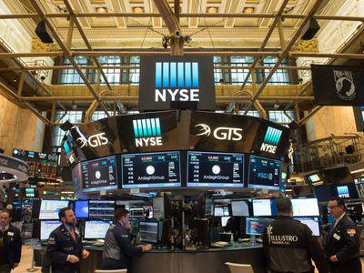

This article explores the role of the Liberian Dollar (LRD) in Liberia's economy. As the primary currency of the nation, the LRD plays a vital role in daily transactions, economic policies, and the broader financial landscape. Understanding its history, current value, and application in financial markets is essential for a comprehensive grasp of Liberia's economic picture.

The influence of the LRD extends beyond simple currency exchange. Its history is deeply intertwined with Liberia's political and economic evolution, reflecting the country's socio-economic trials and transformations over the years. Notably, its coexistence with the US dollar within the Liberian economy presents unique challenges and opportunities, especially in times of economic instability.

Financial markets offer an arena where the LRD's dynamics can be observed closely, particularly through trading mechanisms such as algorithmic trading. Algorithmic trading, which uses complex mathematical models and strategies to automate the trading process, can be significantly impactful. Its application to the LRD holds potential implications for both the currency's performance and the broader Liberian economy.

In light of Liberia's existing economic challenges, such as high inflation and unemployment rates, comprehending the dynamics of the LRD is critical. These challenges highlight the importance of informed economic strategies and the potential benefits that can be reaped through targeted financial interventions and innovations like algorithmic trading.

This article aims to provide valuable insights into the Liberian Dollar for both economic enthusiasts and traders. By analyzing the currency through various lenses, from historical aspects to modern technological applications in financial markets, we aspire to equip our readers with the knowledge needed to understand and navigate the complexities associated with the LRD. Understanding these dynamics is crucial for making informed decisions and fostering economic resilience in Liberia.

## Table of Contents

## Historical Background of the Liberian Dollar

The Liberian Dollar (LRD) holds a significant place in the history and economy of Liberia. Established in 1847, shortly after the nation's declaration of independence, the Liberian Dollar was crafted as the official currency to solidify economic independence and identity. Its introduction marked a crucial step in establishing a national financial system, considering Liberia's historical ties with the United States and the concurrent circulation of the U.S. Dollar (USD) within its economy.

In the late 19th and early 20th centuries, Liberia's economic landscape was heavily influenced by its relationship with the United States, leading to co-circulation of the Liberian Dollar and the U.S. Dollar. This unique arrangement persisted due to both economic convenience and historical ties, especially since the country was founded by formerly enslaved persons and free people of color from the U.S. This coexistence was particularly significant because it reflected how Liberia negotiated its monetary policy amidst external influences.

Major changes in the usage of the Liberian Dollar occurred in 1907 and later in 1943. The former year marked a revision of the monetary system to better integrate with international standards, adjusting to socioeconomic needs. This reform aimed to streamline and stabilize the currency, helping it cater to both domestic requirements and foreign trade. In 1943, World War II's global economic impact induced further reform, reflecting both internal adaptations and external pressures on Liberia's economy, such as inflationary pressures and trade dynamics. These changes were indicative of broader socio-political shifts and economic strategies as Liberia sought to maintain monetary sovereignty while navigating global influences.

The establishment of the Central Bank of Liberia in 1999 marked a pivotal point in the management of the Liberian Dollar. This institution was tasked with overseeing the country's monetary policy, ensuring the stability of the Liberian Dollar, and fostering economic growth. The Central Bank's creation aimed to provide a robust regulatory framework to handle challenges such as inflation and foreign exchange fluctuations, fundamental to maintaining the financial health of the nation.

The historical evolution of the Liberian Dollar showcases a tapestry of monetary policy adaptations against a backdrop of socio-economic and political changes. This history is pivotal in understanding how the currency has shaped and been shaped by national and international events.

## The Role of the Liberian Dollar in the Current Economy

Today, the Liberian Dollar (LRD) and the United States Dollar (USD) circulate concurrently within Liberia's economy, reflecting the nation's complex monetary landscape. The USD is predominantly preferred for larger transactions due to its perceived stability and global acceptance, while the LRD is typically utilized for everyday, smaller transactions. This dual currency system is a historical remnant shaped by Liberia's ties with the United States.

Fluctuations in the LRD's value significantly affect Liberia's economic stability and the purchasing power of its citizens. These fluctuations can lead to shifts in consumer prices and influence the cost of imports and exports. The current shortage and appreciation of the LRD have escalated concerns among economic stakeholders. A strong LRD against the USD can increase the cost of Liberia's exports, making them less competitive globally, while a weaker LRD can lead to higher import prices, further exacerbating inflationary pressures.

Multiple factors contribute to the availability and value of the LRD. Remittances from Liberians abroad play a crucial role, as these inflows increase the domestic supply of foreign currency, which can directly impact the exchange rate dynamics between the LRD and USD. Seasonal demands, especially during festive periods, can also influence the currency's availability as the demand for local currency typically rises, putting pressure on its value.

Furthermore, banking system challenges exacerbate these issues. Limited access to reliable banking services and a lack of trust in financial institutions can hinder efficient currency distribution, affecting [liquidity](/wiki/liquidity-risk-premium) levels. Banking infrastructure and policy measures need strengthening to support the effective management of currency operations, stabilize the LRD, and ensure that monetary mechanisms meet the economic demands of the population.

In conclusion, the LRD plays a pivotal role in Liberia's current economy but faces various challenges that necessitate careful management and strategic policy interventions. Understanding these dynamics is essential for addressing economic uncertainties and achieving financial stability.

## Challenges and Economic Implications

Liberia's economy faces multifaceted challenges that significantly affect its overall stability and growth prospects. High unemployment rates and persistent inflation are among the most pressing issues, attributable to both internal and external factors. The dual currency system, wherein the Liberian Dollar (LRD) and the United States Dollar (USD) are in circulation, imposes additional complexities on economic planning and stability. A key concern is the recurrent shortage and subsequent appreciation of the LRD, which complicates fiscal and monetary policy adjustments.

The structural inefficiencies within Liberia's banking system further compound these challenges. Banking infrastructure is often inadequate, with limited access to financial services for a considerable portion of the population. This inadequacy leads to inefficiencies in currency distribution and contributes to the liquidity crisis involving the LRD. The limitations within the banking sector hinder effective implementation of monetary policy, making it difficult for the Central Bank of Liberia to manage inflation and stabilize the currency.

Efforts to address these issues have led to several governmental and policy measures aimed at stabilizing the value of the LRD. The Central Bank has been actively involved in interventions to maintain currency stability and control inflation through open market operations and other monetary tools. However, the dual currency practice remains a fundamental challenge. Dependence on the USD for significant transactions affects monetary policy efficacy and limits the impacts of policy measures aimed exclusively at the LRD.

Understanding these challenges is crucial for stakeholders, including policymakers, investors, and international partners. Addressing high unemployment and inflation requires a multifaceted approach, focusing not only on currency stability but also on broader economic reforms. Enhancing banking infrastructure to improve access and efficiency is vital, alongside promoting diversification and strengthening governance frameworks to foster economic resilience.

Strategic reforms aimed at reinforcing Liberia's institutional capabilities can create a conducive environment for sustainable economic development. This involves not only stabilizing currency value but also ensuring that the financial system effectively supports economic activities across all sectors. By doing so, Liberia can better navigate the challenges posed by its dual currency system and move towards a more stable and prosperous economic future.

## Algorithmic Trading and the Liberian Dollar

Algorithmic trading represents a significant advancement for those interested in trading the Liberian Dollar (LRD). By using sophisticated algorithms, traders can efficiently analyze market trends and execute trades with precision. These algorithms utilize statistical models and real-time data to identify profitable trading opportunities. Common techniques include mean reversion, [momentum](/wiki/momentum) trading, and [arbitrage](/wiki/arbitrage).

Traders exploring [algorithmic trading](/wiki/algorithmic-trading) with the LRD must acknowledge the unique characteristics of the Liberian financial market. Factors such as liquidity constraints, currency [volatility](/wiki/volatility-trading-strategies), and economic conditions heavily influence market dynamics. As a result, models must incorporate these elements to accurately predict market movements and manage risk.

Despite these opportunities, challenges such as market volatility are prevalent. The LRD's value is affected by external factors like global economic conditions and domestic monetary policy, which can lead to unpredictable price swings. Traders utilizing algorithms must implement robust risk management strategies. This might include the use of stop-loss orders, dynamic hedging techniques, and portfolio diversification to mitigate potential losses.

Future advancements in financial technology hold the potential to further enhance trading strategies for the LRD. Developments in [machine learning](/wiki/machine-learning) and [artificial intelligence](/wiki/ai-artificial-intelligence) can refine algorithmic models by providing deeper insights into complex market patterns. Machine learning algorithms can adapt to changing market conditions, providing traders with a competitive edge.

Moreover, increased access to low-latency data feeds and improvements in computational power will enable faster and more accurate decision-making processes. These advancements are likely to make algorithmic trading not only more efficient but also more accessible to a broader range of traders interested in the LRD.

Overall, algorithmic trading offers a promising avenue for trading the Liberian Dollar, provided that traders carefully consider the specificities of the Liberian market and invest in ongoing technological advancements.

## Future Outlook and Conclusion

The Liberian Dollar (LRD) continues to be an integral part of the nation's economic framework. With ongoing efforts to enhance financial inclusion and stability, the government and financial institutions are focusing on strategies to improve access to financial services. Initiatives aimed at expanding mobile banking and digital payment systems are expected to increase financial participation among Liberians, thus contributing to the broader economic stability.

Currency diversification and economic reforms are also essential for Liberia's future growth. Initiatives to diversify the currency could reduce over-reliance on the US dollar, which often dominates large transactions in Liberia. By strengthening the LRD's domestic and international standing, the country could enhance its economic sovereignty. This could involve reforms in monetary policy, improving foreign exchange reserves, and strategic partnerships with international financial institutions.

Understanding and leveraging the LRD in trading could bring significant benefits. Traders and financial professionals can explore algorithmic trading strategies tailored to the peculiarities of the Liberian market. By utilizing sophisticated algorithms, traders might better navigate the market's unique challenges and capitalize on opportunities. However, these strategies must be adaptable to the market's volatility and economic dynamics.

Lastly, balancing the use of the US dollar and the LRD is critical for ensuring economic resilience. While the USD provides stability, a balanced approach that strengthens the LRD is necessary to protect the country's monetary policy interests. Promoting a dual currency system effectively could safeguard Liberia's economy against external shocks and enable more sustainable growth. Maintaining this balance would require ongoing evaluation of currency policies and a commitment to sound economic practices.

## References & Further Reading

[1]: ["Economic Growth in Liberia: Challenges and Opportunities"](https://www.afdb.org/en/countries/west-africa/liberia/liberia-economic-outlook) - African Development Bank

[2]: ["Challenges of Dual Currency Systems and Currency Substitution"](https://en.wikipedia.org/wiki/Currency_substitution) by Eduardo Levy Yeyati

[3]: ["Central Bank of Liberia: Historical Overview"](https://www.cbl.org.lr/general/brief-history-central-bank-liberia) - Central Bank of Liberia Official Website

[4]: ["The Story of Liberia: Economy Overview and Data"](https://www.worldbank.org/en/country/liberia/overview) - World Bank

[5]: ["Algorithmic Trading: Winning Strategies and Their Rationale"](https://www.amazon.com/Algorithmic-Trading-Winning-Strategies-Rationale-ebook/dp/B00CY5HC0U) by Ernie Chan

[6]: ["Liberia and the United States: A Complex Relationship"](https://en.wikipedia.org/wiki/Liberia%E2%80%93United_States_relations) - Oxford Academic

[7]: ["Impact of Inflation in West African Economies"](https://www.imf.org/en/Publications/selected-issues-papers/Issues/2023/06/19/Inflation-Dynamics-in-the-West-African-Economic-and-Monetary-Union-WAEMU-534876) by Kwame Nkrumah University of Science and Technology

[8]: ["International Monetary Fund Assessment Reports for Liberia"](https://www.imf.org/en/Countries/LBR) - International Monetary Fund

[9]: ["Global Effects on National Policy: The Impact of War on Developing Nations in Africa"](https://www.sciencedirect.com/science/article/pii/S2949753124000523) by Larry Diamond

[10]: ["Mobile Banking and Financial Inclusion in Sub-Saharan Africa"](https://www.sciencedirect.com/science/article/pii/S0167624523000495) - The Brookings Institution