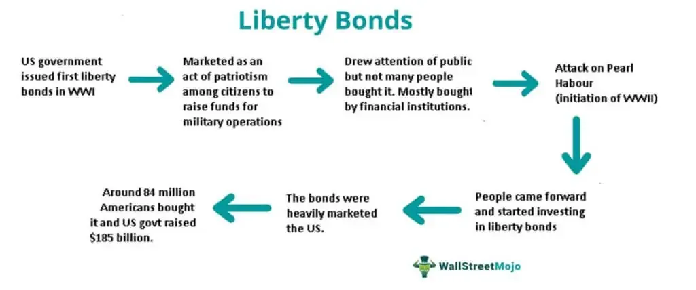

In this article, we explore government financing through war bonds and Liberty Bonds, along with the modern landscape of algorithmic trading. War bonds and Liberty Bonds have historically played a crucial role in financing military operations. These financial instruments enabled ordinary citizens to contribute to their country's wartime efforts while engaging with national financial systems. For instance, during World War I, the U.S. government introduced Liberty Bonds to fund military activities, fostering both economic participation and patriotic sentiment among the populace.

Algorithmic trading represents a significant shift in investment strategies, leveraging advanced technology to execute trades with unprecedented speed and precision. Algorithms analyze vast amounts of market data, enabling traders to identify optimal opportunities and execute trades faster than human capabilities. This technological advancement has reshaped bond markets today, enhancing market liquidity and pricing efficiency.



By the end of this article, readers will gain a comprehensive understanding of how historical financial instruments like war bonds and Liberty Bonds have evolved over time and how their principles are adapted in the modern context through innovations such as algorithmic trading.

## Table of Contents

## Understanding Liberty Bonds

Liberty Bonds were a pivotal financial tool introduced by the United States government during World War I to finance military operations. Their issuance marked a significant turning point in American financial history, representing the first widespread engagement of ordinary citizens with securities markets. These bonds were released in a series of issues, each catering to different phases of the war effort. They served not only to fund military expenditures but also as an educational instrument facilitating Americans’ understanding of investments and financial markets.

The U.S. government launched extensive marketing campaigns to promote the sale of Liberty Bonds. These campaigns used patriotic messaging and involved notable celebrities of the time, enhancing public awareness and encouraging participation. The promotional activities fostered a sense of national duty, encouraging citizens to contribute to the war effort financially. This approach was instrumental in generating widespread public support and ensuring the financial success of the bond issuances.

Despite offering returns that were lower compared to other investment options available at the time, Liberty Bonds were positioned as a patriotic duty. The bonds were sold on the premise that by purchasing them, citizens were directly contributing to the success of the national military objectives. This strategy not only aided in mobilizing essential funds for the war effort but also played a vital role in enhancing financial literacy among the American populace. The heightened awareness and involvement with Liberty Bonds laid the foundation for future engagement in securities and understanding of government bonds as financial instruments.

## Exploring War Bonds

War bonds have long served as an essential instrument for governments to finance military activities. Their roots trace back to the American Civil War, when the U.S. government first employed this method to raise funds for war expenditures. However, the use of war bonds reached its zenith during the World Wars, when they became a pivotal tool in mobilizing financial resources on a massive scale. These bonds were not just financial instruments; they embodied a sense of national duty, allowing citizens to contribute to the war effort in a meaningful way. By investing in war bonds, individuals felt they were playing a direct role in supporting their nation's military operations, which bolstered national morale and unity.

Governments skillfully leveraged extensive propaganda campaigns to market war bonds. These campaigns utilized various media outlets, including newspapers, radio, and films, to disseminate persuasive messages. The widespread use of posters with evocative imagery further reinforced the emotional appeal of purchasing war bonds. Additionally, endorsements from celebrities and prominent public figures served to amplify these messages, making the act of buying bonds synonymous with patriotism. This strategy of connecting financial investment with national pride effectively encouraged broad public participation across different socio-economic groups.

The structure of war bonds was designed to prioritize accessibility and emotional appeal over immediate financial return. Typically offered at a discount, these bonds provided lower yields compared to other investment options. This approach was intentional; the primary incentive for investors was often not the financial gain but the patriotic duty of supporting the war effort. The low-interest rates were offset by the government's backing, which assured investors of eventual repayment, thereby minimizing the perceived risk. The successful deployment of war bonds underscored the power of national identity and collective action in financial mobilization.

Overall, war bonds exemplified a strategic financial approach that balanced the exigencies of military funding with the patriotic engagement of the citizenry. By channeling national sentiment into a financial mechanism, governments effectively mitigated the need for more drastic fiscal measures, such as significant tax increases, while also cultivating a sense of unity and shared responsibility among the population.

## Algorithmic Trading in Bond Markets

Algorithmic trading has significantly redefined the operational dynamics of bond markets by leveraging cutting-edge technology to enhance the efficiency and precision of trade execution. This form of trading utilizes computer algorithms to analyze massive volumes of market data autonomously and swiftly, identifying optimal trading opportunities without human intervention. The impact on market [liquidity](/wiki/liquidity-risk-premium) is profound, as [algorithmic trading](/wiki/algorithmic-trading) enables faster pricing mechanisms. This contributes to a more liquid market where assets can be bought and sold more seamlessly.

Algorithms in trading translate market data into actionable insights through computational methodologies. These algorithms use a variety of factors, such as historical data, market trends, and price variations, to forecast market movements with a level of speed and accuracy beyond human capability. For example, a typical algorithm might use historical price data to predict future movements using statistical models such as moving averages or complex [machine learning](/wiki/machine-learning) techniques. Here's a simple example of a moving average in Python:

```python
import numpy as np

def moving_average(data, window_size):
    return np.convolve(data, np.ones(window_size)/window_size, mode='valid')

# Example: Calculate the 5-day moving average
prices = [10, 20, 30, 40, 50, 60, 70]
ma = moving_average(prices, 5)
print(ma)
```

Despite the advantages, algorithmic trading introduces certain challenges. One significant issue is increased market [volatility](/wiki/volatility-trading-strategies), as the speed and [volume](/wiki/volume-trading-strategy) of trades can lead to rapid price fluctuations. High-frequency trading ([HFT](/wiki/high-frequency-trading-strategies)), a subset of algorithmic trading, exemplifies this by executing a vast number of orders in fractions of a second, potentially creating swings in market prices and raising questions of inequity among traders without access to similar technology.

Regulatory bodies have sought to address these concerns. Regulations aim to ensure fair trading practices and protect market stability while allowing the benefits of technological advancements. This involves implementing measures such as circuit breakers to halt trading in extremely volatile conditions and scrutinizing algorithms for unfair trading advantages.

Governments and financial institutions are continually evolving the regulatory landscape to strike a balance between technological advancements and ensuring a stable and fair trading environment. This ongoing evolution is crucial to fostering trust and resilience in bond markets, enabling both institutional and individual investors to participate confidently. As algorithmic trading becomes increasingly sophisticated, maintaining this balance will remain a significant focus for policymakers and stakeholders in the financial ecosystem.

## The Role of War Bonds in National Economies

War bonds serve as an essential mechanism for sustaining national economies during times of military conflict. One of their primary roles is to pool financial resources from individuals and institutions, thereby minimizing immediate impacts on taxation and reducing the necessity for governments to borrow from external entities. This process is particularly valuable during extended military engagements, where economic strain can be considerable.

The issuance of war bonds helps cultivate a sense of national unity and shared responsibility among the population. By investing in these bonds, citizens contribute directly to the war effort, transforming into financial stakeholders in their nation's objectives. This collective psychological and financial engagement reinforces societal bonds and maintains morale during prolonged periods of conflict.

Despite their benefits, war bonds [carry](/wiki/carry-trading) inherent risks. A critical concern is the potential for default if a government fails to meet its financial commitments after the conflict has ended. Should the anticipated post-war economic prosperity not materialize, or if the resolution of the conflict adversely affects public finances, the likelihood of default increases. Thus, the issuance of war bonds must be carefully calibrated, assessing both immediate fiscal needs and long-term economic prospects.

The decision to issue war bonds represents a strategic economic maneuver, balancing the necessity of immediate military funding with the potential future financial obligations of the state. Successfully leveraging war bonds can stabilize a national economy under duress, but requires diligent management to avoid adverse long-term consequences.

## Advantages and Disadvantages of War Bonds

War bonds, often backed by government assurance, present a relatively secure form of investment with minimal risk of default. This security stems from the government's commitment to honor its debts, which is crucial during periods of military conflict when financial stability is vital. However, this security generally comes with the trade-off of lower interest rates compared to other investment options. Investors who purchase war bonds do so with the understanding that their financial returns will be modest, reflecting the bonds' emphasis on patriotic support rather than profit maximization.

A key characteristic of war bonds is their lack of liquidity. Due to limited trading mechanisms available for these securities, holders typically cannot cash them out easily before they reach maturity. This aspect contrasts with more liquid investments, where investors have greater flexibility to respond to market changes. The restricted liquidity of war bonds means that investors must be prepared to commit their funds for the duration of the bond's term, a [factor](/wiki/factor-investing) that could deter those seeking more dynamic financial engagement.

Despite these limitations in liquidity and returns, war bonds serve as an important financial tool. They enable citizens to contribute directly to national defense efforts, aligning individual financial actions with broader patriotic and societal goals. In considering war bonds for their portfolios, investors must balance the typically lower financial yields with the more stable, government-backed nature of the bonds, along with the intrinsic motive of supporting national interests during times of conflict. This dual appeal of security and patriotism often makes war bonds an attractive, albeit conservative, choice for risk-averse investors or those motivated by civic duty.

## Conclusion

The study of government financing techniques such as Liberty Bonds and war bonds, alongside the advent of algorithmic trading, highlights the dynamic nature of financial markets. These financial instruments have historically played a key role in mobilizing national resources during crises, impacting not only economies but also the public sentiment. Liberty Bonds and war bonds, with their patriotic undertones, have been instrumental in rallying public support and funding military operations without overburdening the state with immediate taxation. This approach allowed countries to stabilize their finances and foster a sense of collective responsibility during times of conflict.

In contrast, algorithmic trading represents the cutting edge of market technology, characterized by its speed and precision in executing trades. This technological shift has dramatically increased market efficiency, providing quicker price discovery and enhanced liquidity. However, it has also introduced new challenges, such as potential market volatility and concerns regarding equitable access to trading benefits, particularly within the context of high-frequency trading.

Understanding the historical evolution of financial instruments like bonds and the technological advancements of algorithmic trading is essential for current and future market participants. Awareness of past financial strategies enables investors to better comprehend the economic policies shaping national reactions to crises. Moreover, staying informed of technological developments ensures that investors can effectively adapt their strategies to capitalize on modern efficiencies while mitigating potential risks. As financial markets continue to evolve, a balanced perspective encompassing both historical insights and technological prowess will be vital for navigating the complexities of modern finance.

## References & Further Reading

[1]: Rockoff, H. (2014). ["Until it's Over, Over There: The U.S. Economy in World War I."](https://www.cambridge.org/core/books/economics-of-world-war-i/until-its-over-over-there-the-us-economy-in-world-war-i/7C4FCF367775916D7DA12E5E2982E7D7) National Bureau of Economic Research Working Paper No. 10580.

[2]: ["A History of Interest Rates"](https://www.amazon.com/History-Interest-Rates-Fourth-Finance/dp/0471732834) (4th Edition) by Sidney Homer and Richard Sylla.

[3]: ["Principles of Financial Regulation"](https://academic.oup.com/book/35860) by John Armour, Dan Awrey, and others.

[4]: Aldridge, I. (2013). ["High-Frequency Trading: A Practical Guide to Algorithmic Strategies and Trading Systems."](https://www.amazon.com/High-Frequency-Trading-Practical-Algorithmic-Strategies/dp/1118343506) Wiley Finance, 2nd Edition.

[5]: Leins, S., & Luz, S. J. (2019). ["financialization and the US Bond Market."](https://www.semanticscholar.org/paper/%E2%80%98Responsible-investment%E2%80%99%3A-ESG-and-the-post-crisis-Leins/f1af30d6dc135e5dcca9b1fb66aa43a6d29caa31) Socio-Economic Review, Volume 17, Issue 2, April 2019.