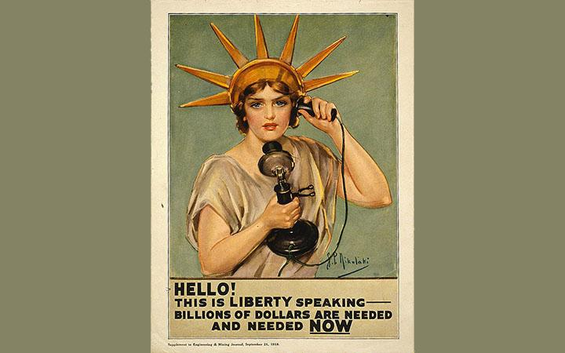

## Table of Contents

## What are Liberty Bonds?

Liberty Bonds were special loans that the United States government sold to its citizens during World War I. They were a way for the government to borrow money from the people to help pay for the war. People who bought these bonds were lending money to the government, and in return, the government promised to pay them back with interest after a certain period of time.

These bonds were very popular and were used as a way to make people feel like they were helping with the war effort. The government used big advertising campaigns to encourage people to buy them. Celebrities and public figures often promoted Liberty Bonds, making them seem like a patriotic duty. By buying these bonds, people felt they were directly supporting their country during a difficult time.

## When were Liberty Bonds first issued?

Liberty Bonds were first issued in 1917, during World War I. The U.S. government needed money to help pay for the war, so they decided to borrow money from the people. They created these special bonds that people could buy, and in return, the government promised to pay them back with some extra money, called interest, after a few years.

The first Liberty Bond was issued on April 24, 1917, just a few weeks after the United States entered the war. People were excited to help their country, and many bought these bonds. It was a way for everyday Americans to feel like they were part of the war effort, even if they weren't fighting on the front lines.

## Why were Liberty Bonds created?

Liberty Bonds were created because the United States needed money to pay for World War I. When the country joined the war in 1917, the government needed a lot of money to buy things like weapons, food, and supplies for the soldiers. Instead of raising taxes, which might have been unpopular, the government decided to borrow money from its own people by selling these special bonds.

These bonds were a way for everyday Americans to help their country during the war. When people bought Liberty Bonds, they were lending money to the government. In return, the government promised to pay them back with a little extra money, called interest, after a few years. This made people feel like they were doing their part to support the war effort, even if they weren't fighting on the front lines.

## How did Liberty Bonds help fund World War I?

Liberty Bonds helped fund World War I by allowing the U.S. government to borrow money from its own people. When the United States joined the war in 1917, the government needed a lot of money to buy things like weapons, food, and supplies for the soldiers. Instead of raising taxes, which might have upset people, the government decided to sell these special bonds. People who bought Liberty Bonds were lending money to the government, and in return, the government promised to pay them back with a little extra money, called interest, after a few years.

The bonds were very popular because they made people feel like they were helping their country during the war. The government used big advertising campaigns to encourage people to buy Liberty Bonds. Celebrities and public figures often promoted these bonds, making them seem like a patriotic duty. By buying these bonds, everyday Americans felt like they were doing their part to support the war effort, even if they weren't fighting on the front lines. This way, Liberty Bonds helped the government raise the money it needed to pay for the war.

## What was the process for purchasing Liberty Bonds?

Buying Liberty Bonds was pretty easy. People could go to a bank or a post office to buy them. They would choose how much they wanted to spend, and the bank or post office would give them a bond certificate. This certificate was like a promise from the government that said, "We will pay you back with some extra money after a few years." People could buy bonds for different amounts, so everyone could help, no matter how much money they had.

The government made it fun and exciting to buy Liberty Bonds. They had big advertising campaigns with posters, movies, and even celebrities telling people to buy them. It was like a big event, and people felt proud to be part of it. By buying a bond, people felt like they were helping their country win the war, even if they weren't fighting on the front lines. It was a way for everyone to do their part.

## What were the different series of Liberty Bonds?

There were five different series of Liberty Bonds. The first one was called the First Liberty Loan, and it was issued in 1917. The second one was the Second Liberty Loan, also in 1917. Then came the Third Liberty Loan in 1918, followed by the Fourth Liberty Loan later that year. The last one was the Victory Liberty Loan, issued in 1919 after the war was over. Each series had different interest rates and lengths of time before they paid back the money.

People could buy these bonds at banks or post offices. Each series was a new chance for people to help their country during World War I. The government used big advertising campaigns to make people excited about buying these bonds. They wanted everyone to feel like they were part of the war effort, even if they weren't fighting on the front lines. By buying a Liberty Bond, people felt like they were doing something important to help their country win the war.

## How did the interest rates on Liberty Bonds work?

The interest rates on Liberty Bonds were how the government said thank you for lending them money. Each series of Liberty Bonds had its own [interest rate](/wiki/interest-rate-trading-strategies). For example, the First Liberty Loan had an interest rate of 3.5%, and the Second Liberty Loan had an interest rate of 4%. This meant that if you bought a bond for $100, the government would pay you back $100 plus a little extra money, like $3.50 or $4, every year until the bond was paid off.

The interest was paid out every six months, so if you had a bond with a 4% interest rate, you would get $2 every six months for every $100 you lent. The bonds had different lengths of time before they were paid back, usually between 10 to 30 years. This way, people who bought Liberty Bonds knew they would get their money back with a little extra over time, which helped them feel good about helping their country during the war.

## What was the role of propaganda in promoting Liberty Bonds?

Propaganda played a big role in getting people to buy Liberty Bonds. The government used posters, movies, and even famous people to make buying bonds seem exciting and important. They wanted everyone to feel like they were part of the war effort, even if they weren't fighting. The posters showed pictures of soldiers and talked about how buying bonds would help win the war. They made people feel proud and patriotic, like they were doing something really important by lending money to the government.

Celebrities and public figures also helped promote Liberty Bonds. They would speak at events and appear in ads, telling people to buy bonds. This made it seem like a big deal and something that everyone should do. The government knew that if they could make buying bonds fun and exciting, more people would want to help. So, they used all kinds of ways to spread the word and make people feel good about helping their country during World War I.

## How were Liberty Bonds redeemed and what were the terms?

Liberty Bonds were redeemed when the government paid back the money people had lent them, plus the interest they had earned. Each series of Liberty Bonds had its own term, which was the length of time before the bond would be paid back. For example, some bonds had terms of 10 years, while others might have terms of 30 years. When the term was up, people could take their bond certificate to a bank or a post office and get their money back, along with the interest they had earned over the years.

The interest on Liberty Bonds was paid out every six months. If someone bought a bond with a 4% interest rate, they would get 2% of the bond's value every six months. So, if they bought a $100 bond, they would get $2 every six months. This interest was a way for the government to thank people for lending them money. By the end of the bond's term, people would have gotten all their money back, plus a little extra, which made buying Liberty Bonds a good way to help the country and earn some money at the same time.

## What impact did Liberty Bonds have on the U.S. economy during and after World War I?

Liberty Bonds had a big impact on the U.S. economy during World War I. They helped the government raise a lot of money to pay for the war without raising taxes too much. This was important because the war was very expensive, and the government needed money to buy things like weapons, food, and supplies for the soldiers. By selling these bonds, the government got the money it needed from everyday people who wanted to help their country. This also helped keep the economy going because people were spending money on bonds instead of saving it, which kept money moving around.

After the war, Liberty Bonds continued to affect the economy. When people got their money back from the bonds, plus the interest, they had more money to spend. This helped the economy grow because people could buy more things. Also, the government paid back the bonds over many years, which helped spread out the cost of the war and made it easier for the economy to recover. Overall, Liberty Bonds were a smart way for the government to get the money it needed during the war and helped the economy in the years that followed.

## How did Liberty Bonds influence future government borrowing practices?

Liberty Bonds showed the government that it could borrow money from its own people during tough times. This was a big lesson because it meant the government could ask citizens for help when it needed money fast, like during a war. The success of Liberty Bonds made the government think about using bonds more often to borrow money. They saw that people were willing to lend money if they felt it was important and if the government promised to pay them back with interest.

After World War I, the government used what it learned from Liberty Bonds to create new ways of borrowing money. For example, during World War II, the government issued War Bonds, which were similar to Liberty Bonds. They also started using bonds to pay for big projects like building roads and schools. The idea of borrowing money from the public became a normal part of how the government managed its money, all thanks to the success of Liberty Bonds.

## What are the key differences between Liberty Bonds and modern government securities?

Liberty Bonds and modern government securities both help the government borrow money, but they have some key differences. Liberty Bonds were created during World War I to help pay for the war. They were sold to everyday people through big advertising campaigns that made buying them feel like a patriotic duty. The interest rates on Liberty Bonds were fixed, meaning they stayed the same over the life of the bond. Also, Liberty Bonds had long terms, usually between 10 to 30 years, before the government paid back the money.

Modern government securities, like Treasury bonds, notes, and bills, are used for many different reasons, not just for wars. They are sold through more formal channels, like banks and online platforms, without the same kind of big advertising campaigns. The interest rates on modern securities can be fixed or variable, meaning they might change over time. Also, modern securities come in different lengths, from short-term bills that last a few months to long-term bonds that can last up to 30 years. This gives people more choices depending on how long they want to lend their money to the government.

## References & Further Reading

[1]: Rockoff, H. (2014). ["Until it's Over, Over There: The U.S. Economy in World War I."](https://www.cambridge.org/core/books/economics-of-world-war-i/until-its-over-over-there-the-us-economy-in-world-war-i/7C4FCF367775916D7DA12E5E2982E7D7) National Bureau of Economic Research Working Paper No. 10580.

[2]: ["A History of Interest Rates"](https://www.amazon.com/History-Interest-Rates-Fourth-Finance/dp/0471732834) (4th Edition) by Sidney Homer and Richard Sylla.

[3]: ["Principles of Financial Regulation"](https://academic.oup.com/book/35860) by John Armour, Dan Awrey, and others.

[4]: Aldridge, I. (2013). ["High-Frequency Trading: A Practical Guide to Algorithmic Strategies and Trading Systems."](https://www.amazon.com/High-Frequency-Trading-Practical-Algorithmic-Strategies/dp/1118343506) Wiley Finance, 2nd Edition.

[5]: Leins, S., & Luz, S. J. (2019). ["financialization and the US Bond Market."](https://www.semanticscholar.org/paper/%E2%80%98Responsible-investment%E2%80%99%3A-ESG-and-the-post-crisis-Leins/f1af30d6dc135e5dcca9b1fb66aa43a6d29caa31) Socio-Economic Review, Volume 17, Issue 2, April 2019.