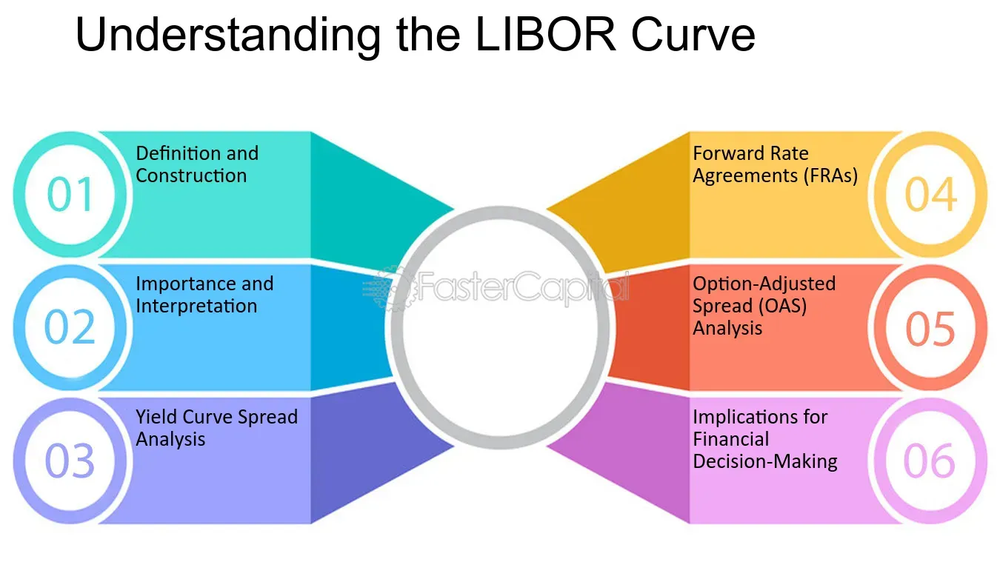

## Table of Contents

## What is the LIBOR Curve?

The LIBOR Curve, or London Interbank Offered Rate Curve, is a graphical representation that shows the interest rates at which banks lend to each other in the London market. It is used as a benchmark for setting rates on various financial products like loans, mortgages, and derivatives. The curve is constructed using different LIBOR rates for various maturities, ranging from overnight to one year. By plotting these rates, the LIBOR Curve helps in understanding the market's expectation of future interest rates.

The LIBOR Curve is important for financial institutions and investors because it helps them make decisions about pricing and managing risk. For example, if the curve is steep, it might suggest that interest rates are expected to rise in the future, which could influence decisions on whether to borrow or lend money. The curve is also used to value financial instruments like interest rate swaps, where payments are based on the difference between the LIBOR rate and a fixed rate. Although the use of LIBOR is being phased out and replaced by alternative reference rates, understanding the LIBOR Curve remains relevant for historical analysis and transition purposes.

## How is the LIBOR Curve constructed?

The LIBOR Curve is made by putting together different LIBOR rates for different times, like overnight, one week, one month, and up to one year. Each of these rates is the average interest rate that banks say they would charge other banks for loans in the London market. To make the curve, you start with the shortest time period and go to the longest, plotting each rate on a graph. This shows how interest rates change over time, from short-term to long-term loans.

Once the rates are plotted, the LIBOR Curve shows a line that goes up or down, depending on whether the rates are getting higher or lower as the time gets longer. This curve helps people see what the market thinks will happen with interest rates in the future. If the curve goes up a lot, it means people expect rates to go up. If it's flat or goes down, it might mean rates will stay the same or go down. This information is useful for banks, businesses, and investors when they make decisions about borrowing, lending, and investing money.

## What are the different tenors of the LIBOR Curve?

The LIBOR Curve has different tenors, which are the lengths of time for which the interest rates are set. These tenors range from very short periods like overnight and one week, to longer periods like one month, two months, three months, six months, and up to one year. Each tenor represents a different LIBOR rate that banks use when they lend money to each other.

These different tenors help create a full picture of what interest rates might be in the future. By looking at the LIBOR rates for all these different times, people can see if rates are expected to go up or down. This information is important for banks and businesses when they decide on things like loans and investments.

## How does the LIBOR Curve function in financial markets?

The LIBOR Curve is like a map that shows what banks think interest rates will be in the future. It's made by looking at different LIBOR rates for different times, like a day, a week, a month, and up to a year. When people in finance see the curve going up, it means they think interest rates will go up. If the curve is flat or going down, it might mean rates will stay the same or go down. This helps banks, businesses, and investors decide when to borrow or lend money and how to plan for the future.

In the financial world, the LIBOR Curve is really important because it helps set prices for things like loans, mortgages, and special financial deals called derivatives. For example, if a bank wants to give someone a loan, they might look at the LIBOR Curve to decide what [interest rate](/wiki/interest-rate-trading-strategies) to charge. The curve also helps with something called interest rate swaps, where two people agree to exchange money based on different interest rates. Even though people are starting to use other ways to set rates instead of LIBOR, the curve is still useful for understanding how things worked in the past and how to move to new systems.

## What is the role of the LIBOR Curve in interest rate swaps?

The LIBOR Curve plays a big role in interest rate swaps, which are agreements between two people or companies to swap interest payments. In an interest rate swap, one side pays a fixed interest rate, while the other side pays a floating rate, which is often based on LIBOR. The LIBOR Curve helps figure out what these floating rates might be in the future. By looking at the curve, people can guess if rates will go up or down, which helps them decide if they want to do the swap and what terms to agree on.

For example, if the LIBOR Curve shows that rates are expected to go up, someone might want to swap their floating rate payments for a fixed rate to avoid paying more later. On the other hand, if the curve suggests rates will stay the same or go down, they might prefer to keep the floating rate. The curve helps both sides of the swap understand the risks and make smart choices. Even though LIBOR is being replaced by other rates, understanding how it worked with swaps is still important for moving to new systems.

## How does the LIBOR Curve affect loan pricing?

The LIBOR Curve helps banks decide how much to charge for loans. It shows what interest rates might be in the future for different times, like a day, a week, or a year. When banks see the curve going up, they think interest rates will go up too. This makes them charge more for loans because they want to make sure they're not losing money if rates go up later. If the curve is flat or going down, it might mean rates will stay the same or go down, so banks might charge less for loans.

This curve is really important for setting prices on things like mortgages and business loans. For example, if someone wants a mortgage, the bank might look at the LIBOR Curve to decide what interest rate to give them. If the curve shows rates might go up, the bank will set a higher rate to protect itself. This way, the LIBOR Curve helps banks make sure they're charging the right amount based on what they think will happen with interest rates.

## What are the main criticisms of the LIBOR Curve?

One big problem with the LIBOR Curve is that it can be manipulated. Banks report the rates they think they would pay to borrow money, but sometimes they lie about these rates to make themselves look better or to make money. This happened a lot during the 2008 financial crisis, and it made people not trust the LIBOR Curve. When banks lie about rates, it messes up the whole curve and makes it hard for other people to make good decisions about loans and investments.

Another issue is that the LIBOR Curve doesn't always show what's really happening in the market. It's based on what banks say they would charge each other, not on actual loans. This can make the curve different from real market conditions, which can be confusing. Because of these problems, people are moving away from using LIBOR and looking for other ways to set interest rates that are more reliable and based on real transactions.

## How has the LIBOR scandal impacted the credibility of the LIBOR Curve?

The LIBOR scandal really hurt how much people trust the LIBOR Curve. Back in 2008, some banks were caught lying about the rates they would charge each other. They did this to make themselves look better or to make money. When people found out, it made them doubt if the LIBOR Curve was showing the real picture of interest rates. If banks can lie about the rates, then the whole curve can be wrong, and that's a big problem for anyone using it to make decisions about loans and investments.

Because of the scandal, people started looking for other ways to set interest rates that are more reliable. The LIBOR Curve used to be a big deal in finance, but now, many are moving to new systems that are based on actual market transactions instead of what banks say they would do. This change is happening because trust in the LIBOR Curve was broken, and people want a better way to understand and predict interest rates.

## What alternatives to the LIBOR Curve have been proposed or implemented?

Because of the problems with LIBOR, people have been looking for other ways to set interest rates. One big alternative that's being used more and more is the Secured Overnight Financing Rate, or SOFR. SOFR is based on actual transactions in the market, not just what banks say they would do. This makes it more reliable and harder to manipulate. SOFR is used in the United States, and it's becoming the go-to rate for things like loans and derivatives that used to rely on LIBOR.

In other parts of the world, different alternatives are being used. In the UK, they're using the Sterling Overnight Index Average, or SONIA, which is also based on real market transactions. In the Eurozone, the Euro Short-Term Rate, or €STR, is being used. These new rates are all about making sure that interest rates are set in a way that people can trust. They're part of a big move away from LIBOR to create a more honest and clear system for setting interest rates.

## How do changes in the LIBOR Curve influence financial strategies?

Changes in the LIBOR Curve can really shake things up for people in finance. If the curve starts to go up, it means banks think interest rates will go up too. This can make banks charge more for loans because they want to protect themselves from losing money if rates get higher later. Businesses and people looking to borrow money might decide to do it sooner, before rates go up, or they might choose to wait if they think rates will come back down. Investors also watch the curve to decide if they should put their money into things that do well when rates are high or low.

On the other hand, if the LIBOR Curve is flat or going down, it might mean interest rates will stay the same or go down. This can make banks lower their loan rates to attract more borrowers. People and businesses might feel more comfortable taking out loans because they think they'll pay less interest. Investors might also change their strategies, maybe moving their money into investments that do well when rates are low. So, the LIBOR Curve helps everyone in finance plan their next moves based on what they think will happen with interest rates.

## What are the technical challenges in transitioning from the LIBOR Curve to alternative rates?

Moving from the LIBOR Curve to new rates like SOFR, SONIA, or €STR is a big deal and comes with some tricky problems. One big challenge is that the new rates are based on actual market deals, not just what banks say they would do. This means the new rates can be a bit jumpy and not as smooth as LIBOR. People in finance have to figure out how to handle this and make sure their computer systems can work with these new, sometimes unpredictable rates. They also need to change a lot of old contracts and agreements that used LIBOR to use the new rates instead, which takes a lot of time and can be confusing.

Another challenge is that the new rates don't work the same way as LIBOR in some important ways. For example, LIBOR has rates for different times, like a month or a year, but the new rates are usually just for overnight. This means people have to come up with new ways to guess what rates will be in the future, which is harder and different from what they're used to. Plus, everyone has to learn about these new rates and how to use them, which can be tough because it's a big change from what they've been doing for a long time.

## How can financial institutions prepare for the phase-out of the LIBOR Curve?

Financial institutions can prepare for the phase-out of the LIBOR Curve by first understanding the new rates like SOFR, SONIA, and €STR. They need to learn how these new rates work and how they're different from LIBOR. This means updating their computer systems to handle the new rates, which can be a bit unpredictable because they're based on real market deals. They also need to look at all their old contracts and agreements that used LIBOR and change them to use the new rates. This can take a lot of time and effort, but it's important to make sure everything keeps working smoothly.

Another important step is to train their staff about the new rates and how to use them. Everyone needs to know how to adjust their financial strategies based on these new rates. Financial institutions should also start using the new rates in their new deals and products as soon as possible. This will help them get used to the new system before LIBOR is completely gone. By planning ahead and making these changes, financial institutions can make sure they're ready for the switch and can keep doing business without big problems.

## References & Further Reading

[1]: Duffie, D., & Stein, J. (2015). ["Reforming LIBOR and Other Financial Market Benchmarks."](https://scholar.harvard.edu/files/stein/files/libor_duffie_stein_jep_2015.pdf) National Bureau of Economic Research.

[2]: Hou, D., & Skeie, D. (2014). ["LIBOR: Origins, Economics, Crisis, Scandal, and Reform."](https://www.newyorkfed.org/medialibrary/media/research/staff_reports/sr667.pdf) Federal Reserve Bank of New York Staff Reports.

[3]: Gyntelberg, J., & Wooldridge, P. (2008). ["Interbank Rate Fixings During the Recent Turmoil."](https://www.bis.org/publ/qtrpdf/r_qt0803g.pdf) BIS Quarterly Review.

[4]: ["Algorithmic Trading: Winning Strategies and Their Rationale"](https://www.wiley.com/en-us/Algorithmic+Trading%3A+Winning+Strategies+and+Their+Rationale-p-9781118746912) by Ernest P. Chan

[5]: ["Understanding the Yield Curve: The Elements that Make It Change"](https://www.schwab.com/learn/story/understanding-yield-curve) by Joseph G. Haubrich, Federal Reserve Bank of Cleveland

[6]: ["Financial Derivatives and the Global Financial Crisis"](https://www.cambridge.org/core/books/economics-of-derivatives/role-of-derivatives-in-the-global-financial-crisis-of-2008/BE8F5DB55F65CF0E7B50C4D4B8E8D3DB) by Alexander During 

[7]: ["Reference Rates and the Transition away from LIBOR"](https://kpmg.com/kpmg-us/content/dam/kpmg/pdf/2021/libor-transition-regalert.pdf) by Andrew Bailey, Bank of England

[8]: ["Securities Industry and Financial Markets Association (SIFMA) - LIBOR Transition"](https://www.sifma.org/)