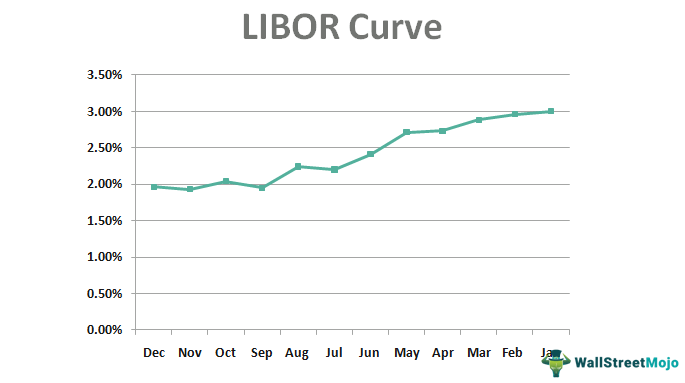

In an era of highly interconnected financial systems, a comprehensive understanding of core components such as financial curves, interest rates, and algorithmic trading has become indispensable. These elements form the backbone of modern financial markets, influencing everything from loan pricing to investment strategies. This article examines the pivotal roles played by LIBOR interest rates and financial curves in shaping the dynamics of algorithmic trading. 

Financial professionals are increasingly required to be adept in these complex topics to navigate the rapidly evolving landscape. The London Interbank Offered Rate (LIBOR) has historically been a critical benchmark for determining interest rates on various financial products. However, with its impending transition to alternative benchmarks, the need to understand its historical significance and current implications has never been more pressing. These changes necessitate a recalibration of traditional financial models and strategies.

Moreover, algorithmic trading, which involves executing orders based on pre-set conditions using advanced algorithms, relies heavily on financial metrics like interest rates and yield curves to optimize decision-making processes. The forthcoming shift from LIBOR to new benchmarks will require these algorithms to adapt swiftly, highlighting the necessity for both flexibility and innovation in financial strategies moving forward.

As the financial sector anticipates these changes, the article provides insights that are vital for both seasoned finance professionals and enthusiasts keen on understanding the intricacies of these transitions. It is not merely the understanding of current systems that will define success but also the ability to anticipate and incorporate future developments that will set market participants apart.

## Table of Contents

## Understanding Financial Curves

Financial curves are essential graphical tools used in finance to represent the relationship between interest rates, yield, and maturities. They provide insights into economic activities and interest rate movements, which are crucial for thorough financial analysis. Traders and financial institutions use these curves to assess market conditions and make informed decisions.

Yield curves, one of the most common types of financial curves, depict the yields of bonds having equal credit quality but differing maturity dates. The shape of the yield curve gives investors an idea about the future direction of interest rates and economic activity. The primary types of yield curves include normal, inverted, and flat, each carrying distinct implications for the economy.

A normal yield curve is upward sloping and suggests that longer-term securities have a higher yield compared to short-term ones. This pattern indicates that the economy is expected to grow steadily, with potential future increases in interest rates. Financial institutions often interpret this as a signal of economic health, resulting in strategic allocation of portfolios to optimize returns.

Conversely, an inverted yield curve slopes downward, with short-term interest rates surpassing long-term rates. Historically, an inverted curve has been a precursor to economic recessions. When traders observe an inversion, they may become cautious, anticipating tighter credit conditions and slower economic growth. In certain markets, it may also signal a flight to quality, where investors prefer long-term securities, anticipating future [interest rate](/wiki/interest-rate-trading-strategies) declines.

The flat yield curve indicates that there is little difference between short- and long-term interest rates. This scenario suggests economic uncertainty, where the future path of interest rates is unclear. Market participants may view a flat curve as an indication of a transitional phase in the economy, possibly preceding either growth acceleration or a downturn. Strategic flexibility becomes pivotal for traders during such uncertain periods.

Understanding financial curves extends beyond merely observing their shapes. It's about the interpretation of macroeconomic indicators and market sentiment. For instance, curve steepness can impact hedging strategies and risk management in trading firms. By analyzing the spread between various maturities, traders can gauge potential changes in market [volatility](/wiki/volatility-trading-strategies) and asset prices.

The mathematical foundation of these curves is based on bond yields and interest rate calculation, which can be modeled using Python. The finance industry often employs various techniques like spline curves or regression analysis to construct smooth yield curves from discrete data points. For example, utilizing Python's SciPy library, one can use the `scipy.interpolate.UnivariateSpline` function to effectively create a yield curve from market data points.

In conclusion, financial curves serve as indispensable analytical tools, enabling market participants to predict and navigate the complex financial landscape. Mastery of interpreting and applying these curves is crucial for informed trading strategies and optimizing financial outcomes.

## LIBOR Interest Rates: An Overview

LIBOR, the London Interbank Offered Rate, has historically served as a benchmark interest rate that profoundly influences the financial landscape. It is the average interest rate at which leading banks in London are willing to lend unsecured short-term loans to each other. LIBOR's significance extends to loans and financial derivatives, affecting both individual borrowers and institutional investors globally.

Calculated in multiple currencies across different maturities, LIBOR has been pivotal in determining the cost of borrowing. These currencies include the U.S. Dollar (USD), Euro (EUR), British Pound Sterling (GBP), Japanese Yen (JPY), and Swiss Franc (CHF). The maturity periods range from overnight to one year, providing a spectrum of interest rate benchmarks that cater to various financial instruments. The process involves contributions from a panel of banks, after which the highest and lowest 25% of quotes are excluded, and the remaining rates are averaged to determine the LIBOR for each currency and maturity combination.

However, despite its integral role, LIBOR is set to be phased out by the end of 2021 due to significant controversies surrounding its reliability. From 2005 to 2012, LIBOR was subject to manipulation by participating banks. They reported false interest rates to profit from trades or to appear more creditworthy than they were in reality. This manipulation scandal severely undermined the credibility of LIBOR, prompting regulatory bodies to seek more reliable and transparent benchmarks.

The transition away from LIBOR involves the adoption of alternative reference rates, such as the Secured Overnight Financing Rate (SOFR) in the United States and the Sterling Overnight Index Average (SONIA) in the United Kingdom. These new benchmarks are based on actual transactions rather than estimated borrowing rates, reducing susceptibility to manipulation.

For market participants, understanding LIBOR's transition is crucial as they adapt to new standards. It impacts the pricing models of derivatives, the structuring of loans, and other financial contracts. The transition requires extensive systems updates, revising contracts, and managing the complexities of new benchmark integrations.

Overall, while LIBOR's contribution to the financial markets is undeniable, its phase-out reflects the industry's shift toward more robust and transparent metrics. Adapting to these changes is essential for maintaining the stability and integrity of the global financial system.

## Algorithmic Trading and Financial Curves

Algorithmic trading employs computational algorithms to execute orders in financial markets with optimal timing, speed, and efficiency. These algorithms leverage extensive datasets to make rapid, data-driven decisions. A critical element in their operation is the analysis of financial curves, which offer fundamental insights into market conditions and facilitate informed decision-making.

Financial curves, including the LIBOR (London Interbank Offered Rate) curve, encapsulate data on interest rate trends and yield patterns over various maturities. For algorithms, these curves serve as indicators of potential market movements. By tracking changes in these financial curves, algorithms can anticipate interest rate fluctuations and adjust trading strategies accordingly. This predictive capability is essential in refining trading approaches and managing associated risks.

The LIBOR curve historically played an essential role, providing benchmarks that influenced the valuation of numerous financial instruments. However, the financial landscape is undergoing a substantial transformation as benchmarks transition from LIBOR to new alternatives like the Secured Overnight Financing Rate (SOFR). This shift necessitates adaptations within [algorithmic trading](/wiki/algorithmic-trading) systems. Algorithms must update their data inputs to reflect these new benchmarks accurately. As these new benchmarks gradually replace LIBOR, algorithmic platforms are being reconfigured to incorporate and analyze these [alternative data](/wiki/best-alternative-data) points effectively.

Such transition poses both challenges and opportunities. On one hand, the integration of new benchmarks requires significant updates in algorithmic infrastructure and strategy development. On the other hand, these changes can enhance the robustness and transparency of financial systems, offering traders novel avenues for developing innovative trading strategies. The ongoing evolution of financial curves and benchmark rates underscores the importance of adaptability in maintaining the efficacy of algorithmic trading in global markets.

## Challenges and Opportunities in the LIBOR Transition

The transition from LIBOR to alternative benchmark rates like the Secured Overnight Financing Rate (SOFR) presents both challenges and opportunities for the financial industry. LIBOR has long been embedded within the financial system, serving as the basis for interest rate derivatives, loans, and various financial products. Its phase-out requires significant adjustments by financial institutions globally.

**Challenges**: A primary challenge involves updating legacy systems and contractual agreements. Many financial systems and contracts are calibrated to LIBOR, which means transitioning to an alternative rate like SOFR necessitates revising the underlying agreements and the computational mechanisms that calculate interest and pricing. This requires substantial resource allocation and the potential for legal disputes if all parties involved in a contract do not agree on the changes.

Another significant challenge is the valuation and risk management of financial instruments previously linked to LIBOR. Current models and algorithms, which use historical LIBOR data, must be recalibrated to incorporate new benchmarks. This is crucial for financial entities to maintain accurate valuations and risk assessments.

**Opportunities**: The transition also opens avenues for innovation within financial markets. New financial products can be developed based on these alternative rates, potentially creating fresh opportunities for revenue and risk management strategies. The shift encourages the creation of more transparent and fair benchmarks which could enhance investor confidence.

Furthermore, algorithmic trading platforms stand at the forefront of adapting to these new benchmarks. These platforms must be reconfigured to include data from alternative rates like SOFR, ensuring the systems can still efficiently execute trades and manage risk. There is an opportunity to enhance these algorithms to better predict market conditions using the new benchmarks, improving trading accuracy and efficiency.

Moreover, the overhaul presents a chance to construct more robust and transparent financial systems. Lessons learned from the past, especially concerning benchmark manipulation, can guide the establishment of mechanisms that ensure reliability and transparency. Industry participants can collaborate to build frameworks that are resistant to manipulation and adapt to changing economic conditions more efficiently.

In summary, while the transition from LIBOR introduces operational and legal challenges, it also offers financial markets the opportunity to innovate and enhance the integrity of their systems. By effectively managing these changes, institutions can identify new areas for growth and ensure long-term stability in the ever-evolving financial landscape.

## Conclusion

Understanding the interplay between financial curves, LIBOR interest rates, and algorithmic trading is crucial for any market participant aiming to remain relevant in today's rapidly evolving financial landscape. The transition from LIBOR to alternative benchmarks represents a pivotal moment, demanding adaptability and comprehensive knowledge to seize new opportunities effectively.

The significance of mastering these elements cannot be overstated, as they collectively form the bedrock of modern financial analysis and decision-making processes. Financial curves serve as indispensable tools for predicting economic activities through the relationship between interest rates and maturities. Simultaneously, interest rate benchmarks like LIBOR have historically underpinned global financial transactions, guiding pricing and risk assessment. With LIBOR's impending phase-out, understanding the alternative rates and their implications has become a necessity for navigating future market environments.

Algorithmic trading, which relies heavily on data inputs from financial curves and interest rate benchmarks, stands at the forefront of this transition. Its capability to execute large orders with precision and speed is enriched by accurate financial data, making the upcoming benchmarks integral to its strategies. As traders adopt new reference rates, the agility and accuracy of algorithmic trading systems must evolve, focusing on maintaining competitive edges and optimizing trading outcomes.

To stay competitive, traders and financial institutions must prioritize education and adaptation in the face of these changes. Continuous learning and strategic planning will be indispensable as the global financial system undergoes this significant transformation. The ability to leverage new opportunities will hinge on understanding not only historical trends but also future developments in the financial markets. Thus, those who effectively integrate this knowledge into their operational frameworks will be well-positioned to thrive in this dynamic environment.

## References & Further Reading

[1]: Duffie, D., & Stein, J. (2015). ["Reforming LIBOR and Other Financial Market Benchmarks."](https://scholar.harvard.edu/files/stein/files/libor_duffie_stein_jep_2015.pdf) National Bureau of Economic Research.

[2]: Hou, D., & Skeie, D. (2014). ["LIBOR: Origins, Economics, Crisis, Scandal, and Reform."](https://www.newyorkfed.org/medialibrary/media/research/staff_reports/sr667.pdf) Federal Reserve Bank of New York Staff Reports.

[3]: Gyntelberg, J., & Wooldridge, P. (2008). ["Interbank Rate Fixings During the Recent Turmoil."](https://www.bis.org/publ/qtrpdf/r_qt0803g.pdf) BIS Quarterly Review.

[4]: ["Algorithmic Trading: Winning Strategies and Their Rationale"](https://www.wiley.com/en-us/Algorithmic+Trading%3A+Winning+Strategies+and+Their+Rationale-p-9781118746912) by Ernest P. Chan

[5]: ["Understanding the Yield Curve: The Elements that Make It Change"](https://www.schwab.com/learn/story/understanding-yield-curve) by Joseph G. Haubrich, Federal Reserve Bank of Cleveland

[6]: ["Financial Derivatives and the Global Financial Crisis"](https://www.cambridge.org/core/books/economics-of-derivatives/role-of-derivatives-in-the-global-financial-crisis-of-2008/BE8F5DB55F65CF0E7B50C4D4B8E8D3DB) by Alexander During 

[7]: ["Reference Rates and the Transition away from LIBOR"](https://kpmg.com/kpmg-us/content/dam/kpmg/pdf/2021/libor-transition-regalert.pdf) by Andrew Bailey, Bank of England

[8]: ["Securities Industry and Financial Markets Association (SIFMA) - LIBOR Transition"](https://www.sifma.org/)