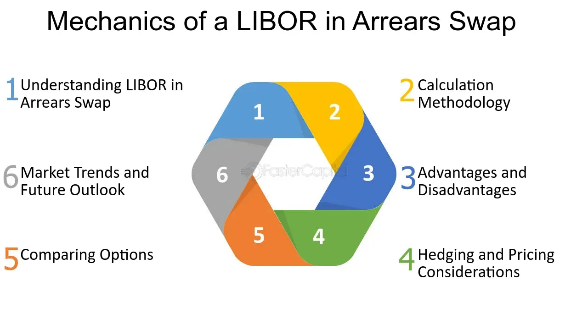

## Table of Contents

## What is a LIBOR-in-Arrears Swap?

A LIBOR-in-Arrears Swap is a type of interest rate swap where the floating rate payments are based on the LIBOR rate that is determined at the end of the interest period, rather than at the beginning. In a regular interest rate swap, the floating rate is set at the start of the period, and this rate is used for the entire period. However, in a LIBOR-in-Arrears Swap, the rate is not known until the end of the period, which adds a layer of uncertainty and complexity to the swap.

This type of swap can be useful for certain financial strategies because it more closely aligns the interest payments with the actual market rates at the time of payment. For example, if interest rates rise during the period, the payer of the floating rate in a LIBOR-in-Arrears Swap will end up paying more than they would in a standard swap. Conversely, if rates fall, they will pay less. This can be advantageous for parties who want to hedge against or speculate on short-term interest rate movements.

## How does a LIBOR-in-Arrears Swap differ from a standard LIBOR Swap?

A LIBOR-in-Arrears Swap and a standard LIBOR Swap both involve exchanging interest payments based on the LIBOR rate, but they differ in when the floating rate is set. In a standard LIBOR Swap, the floating rate is determined at the beginning of each interest period. This means that once the period starts, the rate is fixed and known to both parties for the entire duration of that period. For example, if the period is three months, the rate set at the start will apply for all three months.

On the other hand, a LIBOR-in-Arrears Swap sets the floating rate at the end of the interest period. This means that the rate is not known until the payment is due. If the interest period is three months, the rate that applies for those three months won't be known until the end of the period. This can make the swap more complex because the payment amount is uncertain until the very end, which can be both a risk and an opportunity depending on how interest rates move during the period.

## What are the key components of a LIBOR-in-Arrears Swap?

A LIBOR-in-Arrears Swap has a few main parts. One part is the fixed rate that one side agrees to pay. This rate stays the same for the whole time of the swap. The other part is the floating rate, which changes. In this kind of swap, the floating rate is based on the LIBOR rate, but it's not set until the end of each period. This means you don't know what the rate will be until it's time to pay.

Another key part is the interest period, which is the time between payments. It could be a few months or a year. Because the floating rate is set at the end of this period, it can make the swap a bit tricky. The last part to know about is the notional amount, which is the pretend amount of money the swap is based on. You don't actually exchange this money, but it's used to figure out how much interest to pay.

## How is the interest rate determined in a LIBOR-in-Arrears Swap?

In a LIBOR-in-Arrears Swap, the interest rate is figured out differently than in a regular swap. Instead of setting the rate at the start of the period, the floating rate in this swap is based on the LIBOR rate at the very end of the period. This means that you don't know what the rate will be until it's time to make the payment. For example, if you have a three-month period, the rate for those three months won't be set until the last day of that period.

This way of setting the rate can make things more complicated because it adds uncertainty. If interest rates go up during the period, the person paying the floating rate will end up paying more than they would have if the rate was set at the beginning. If rates go down, they'll pay less. This can be good or bad depending on what you're hoping to do with the swap. It's all about timing and how rates move over the period.

## What are the advantages of using a LIBOR-in-Arrears Swap?

One big advantage of using a LIBOR-in-Arrears Swap is that it can help you match the interest payments more closely with what's happening in the market. Since the floating rate is set at the end of the period, it reflects the actual LIBOR rate at the time of payment. This can be really useful if you think interest rates are going to change a lot. If rates go up, you'll pay more, but if they go down, you'll pay less. This can be a good way to protect yourself or take a chance on short-term changes in interest rates.

Another benefit is that it can be a good tool for certain financial strategies. For example, if you're trying to hedge against the risk of interest rates going up, a LIBOR-in-Arrears Swap might work better than a regular swap. It lets you deal with the real rate at the end of the period, not a rate that was set months ago. This can be especially helpful for businesses or investors who need to manage their cash flow closely and want to make sure their interest payments match the current market conditions as closely as possible.

## What are the potential risks associated with LIBOR-in-Arrears Swaps?

One big risk with LIBOR-in-Arrears Swaps is the uncertainty about the interest rate. Because the floating rate isn't set until the end of the period, you don't know how much you'll have to pay until the last minute. This can make it hard to plan your finances because you might end up paying more if interest rates go up during the period. If you're the one paying the floating rate, this can be stressful because you're not sure what your costs will be.

Another risk is the complexity of these swaps. They're harder to understand and manage than regular swaps where the rate is set at the start. This can lead to mistakes or misunderstandings, especially if you're not used to dealing with financial products like this. It's important to really know what you're getting into because the uncertainty and complexity can make things go wrong if you're not careful.

## How do you calculate the cash flows in a LIBOR-in-Arrears Swap?

To calculate the cash flows in a LIBOR-in-Arrears Swap, you need to know the notional amount, the fixed rate, and the floating rate that's set at the end of each period. The notional amount is like a pretend amount of money that you use to figure out the interest payments. The fixed rate stays the same for the whole time of the swap. The floating rate, though, is different because it's based on the LIBOR rate at the very end of the period. So, for each period, you wait until the end to see what the LIBOR rate is, and that's the rate you use for the floating part of your payment.

Once you have the floating rate at the end of the period, you can figure out the cash flows. For the fixed leg of the swap, you multiply the notional amount by the fixed rate and then by the length of the period. For example, if the notional amount is $1 million, the fixed rate is 2%, and the period is 3 months (or 0.25 years), you would calculate $1,000,000 * 0.02 * 0.25 = $5,000. For the floating leg, you do the same thing but use the LIBOR rate that you find out at the end of the period. If the LIBOR rate turns out to be 2.5%, you would calculate $1,000,000 * 0.025 * 0.25 = $6,250. The difference between these two amounts is the net cash flow for that period.

## What is the impact of interest rate volatility on LIBOR-in-Arrears Swaps?

Interest rate [volatility](/wiki/volatility-trading-strategies) can have a big impact on LIBOR-in-Arrears Swaps. Since the floating rate in these swaps is set at the end of each period, any changes in interest rates during that time directly affect what you pay or receive. If interest rates go up a lot, the person paying the floating rate will have to pay more than they expected. On the other hand, if rates go down, they'll pay less. This means that if rates are moving around a lot, it can make it really hard to predict how much money you'll need for the swap payments.

This kind of swap can be a good tool if you want to take advantage of or protect yourself from interest rate changes. But because the rate is set at the end, it adds a layer of uncertainty that can be stressful. If you're the one paying the floating rate and rates are volatile, you might find it hard to plan your finances. You have to be ready for the possibility that your costs could change a lot from one period to the next.

## How does the timing of rate setting affect the valuation of LIBOR-in-Arrears Swaps?

The timing of when the rate is set in a LIBOR-in-Arrears Swap makes a big difference in how much the swap is worth. In these swaps, the floating rate isn't known until the end of the period, which means you have to wait to see what the LIBOR rate is before you can figure out the payment. This adds a lot of uncertainty because you can't predict exactly what the rate will be. If interest rates are expected to go up, the value of the swap might be lower for the person paying the floating rate because they might have to pay more. On the other hand, if rates are expected to go down, the swap could be worth more to them because they'll pay less.

Because the rate is set at the end, the valuation of a LIBOR-in-Arrears Swap depends a lot on what people think will happen with interest rates in the future. If there's a lot of uncertainty or if rates are expected to change a lot, it can make the swap harder to value. People use special models and calculations to try to guess what the rates might be at the end of the period, but it's still a bit of a guess. This makes the swap more complex and can affect how much someone is willing to pay for it or how much they think it's worth.

## What are the considerations for hedging a LIBOR-in-Arrears Swap?

Hedging a LIBOR-in-Arrears Swap means trying to protect yourself from the risks that come with the swap. Since the floating rate in this swap is set at the end of the period, it can be tricky to hedge because you don't know what the rate will be until the last minute. One way to hedge is to use other financial tools that also depend on interest rates, like futures or options. These can help you manage the risk of the rate going up or down, but you have to be careful because they might not match the swap perfectly. You need to think about how well the hedge will work and how much it will cost.

Another thing to consider is how often you want to hedge. Because the rate in a LIBOR-in-Arrears Swap is set at the end of each period, you might want to hedge more often than with a regular swap. This can help you adjust to changes in interest rates more quickly. But hedging more often can also be more expensive and complicated. You have to balance the cost and complexity of the hedge with how much protection you need. It's important to think about your overall financial strategy and how the swap fits into it.

## How do regulatory changes impact the use of LIBOR-in-Arrears Swaps?

Regulatory changes can have a big impact on LIBOR-in-Arrears Swaps because they can change how these swaps are used and managed. For example, the move away from LIBOR to other benchmark rates like SOFR (Secured Overnight Financing Rate) means that the floating rate in these swaps might be based on a different rate in the future. This change can make it harder to predict what the rate will be at the end of the period, adding more uncertainty to the swap. Also, new rules might require more detailed reporting or stricter risk management, which can make using these swaps more complicated and expensive.

Because of these changes, people who use LIBOR-in-Arrears Swaps need to keep up with what's happening in the world of financial regulations. They might need to adjust their strategies or find new ways to hedge their risks. For example, if a new benchmark rate is used, they'll have to understand how it works and how it might affect their swaps. Keeping an eye on regulatory changes is important to make sure that using these swaps stays a good choice for their financial plans.

## What advanced strategies can be employed to optimize the performance of LIBOR-in-Arrears Swaps?

One advanced strategy to optimize the performance of LIBOR-in-Arrears Swaps is to use dynamic hedging. This means adjusting your hedge as interest rates change. Because the floating rate in these swaps is set at the end of the period, you can watch the market closely and make small changes to your hedge to match what's happening with rates. This can help you manage the risk better and maybe even take advantage of small changes in rates. It's a bit like steering a boat through waves, making little turns to stay on [course](/wiki/best-algorithmic-trading-courses).

Another strategy is to use interest rate options to manage the uncertainty of the floating rate. Options give you the right, but not the obligation, to buy or sell at a certain rate. You can use them to protect yourself if rates go up a lot, or to take advantage if rates go down. This can be especially useful with LIBOR-in-Arrears Swaps because the rate isn't known until the end. By using options, you can set up a plan that helps you no matter which way rates move. It's like having a safety net that catches you if things go the wrong way.

## What is an Interest Rate Swap?

Interest rate swaps are a type of financial derivative that involves agreements between two parties to exchange cash flows based on differing interest rates. The primary purpose of these swaps is to manage [interest rate](/wiki/interest-rate-trading-strategies) exposures and stabilize cash flows, offering financial institutions and corporations a tool for optimizing their financial strategies.

Typically, in an interest rate swap, one party agrees to pay a fixed interest rate while receiving a floating interest rate, and the other party pays the floating rate while receiving the fixed rate. The floating rate is commonly tied to benchmark interest rates such as the London Interbank Offered Rate (LIBOR) or the Secured Overnight Financing Rate (SOFR). This exchange allows parties to hedge against interest rate volatility; for example, a company with a variable-rate loan might use a swap to effectively convert it to a fixed-rate loan, providing predictable debt servicing costs.

The cash flows are calculated based on a notional principal amount, which is not exchanged but acts as a reference for calculating the payments. The payment calculations generally involve the following formulas:

$$
\text{Fixed Rate Payment} = \left( \text{Notional Principal} \times \frac{\text{Fixed Rate}}{n} \right)
$$

$$
\text{Floating Rate Payment} = \left( \text{Notional Principal} \times \frac{\text{Floating Rate}}{n} \right)
$$

Where:
- The fixed and floating rates are annualized percentages.
- $n$ represents the number of payment periods within a year.

For instance, in a simple Python script, the net cash flow for each period of the swap might be calculated as follows:

```python
def calculate_swap_payments(notional_principal, fixed_rate, floating_rate, periods_per_year):
    fixed_payment = notional_principal * (fixed_rate / periods_per_year)
    floating_payment = notional_principal * (floating_rate / periods_per_year)
    net_cash_flow = floating_payment - fixed_payment
    return net_cash_flow

# Example usage:
notional = 1000000
fixed_rate_annual = 0.05  # 5%
floating_rate_annual = 0.03  # 3%
periods_per_year = 4  # quarterly payments
net_cash_flow = calculate_swap_payments(notional, fixed_rate_annual, floating_rate_annual, periods_per_year)
print("Net Cash Flow per Period:", net_cash_flow)
```

Through interest rate swaps, companies can align these payment exchanges with their financial strategies, ensuring more predictable cash flow management in uncertain interest rate environments. As such, these swaps form a critical component of modern financial risk management practices.

## What are some real-world examples of interest rate swaps?

Companies like PepsiCo utilize interest rate swaps to effectively manage borrowing costs and enhance financial stability, a practice widely adopted across various industries. These financial instruments allow corporations to exchange cash flows based on fixed and floating interest rates, thereby mitigating risks associated with volatile interest rate markets.

### Interest Rate Swaps in Practice

Interest rate swaps play a crucial role in managing financial risks by transforming payment obligations. For instance, a company with a fixed interest obligation might enter into a swap to benefit from potentially declining floating interest rates. Conversely, organizations facing floating rate expenses may seek the predictability of fixed rate payments.

### Mathematical Representation

Mathematically, an interest rate swap can be represented by the net cash flow difference between a fixed rate $r_f$ and a floating rate $r_{\text{float}}$. Assuming swap notional principal $N$, the cash flow from the fixed side is:

$$
\text{Cash Flow}_{\text{fixed}} = \frac{N \times r_f \times t}{360}
$$

and for the floating side:

$$
\text{Cash Flow}_{\text{floating}} = \frac{N \times r_{\text{float}} \times t}{360}
$$

where $t$ is the time period. The net cash flow to the party receiving fixed is:

$$
\text{Net Cash Flow} = \text{Cash Flow}_{\text{fixed}} - \text{Cash Flow}_{\text{floating}}
$$

Through the use of such formulas, companies can quantitatively assess the potential financial impacts of entering a swap agreement.

### Financial Stability and Planning

By employing interest rate swaps, organizations like PepsiCo can stabilize their financial statements. This stability comes from shielding themselves against unpredictable rate changes, which can significantly influence their cost of capital and overall financial health.

In practical terms, if a company's debt profile is primarily based on floating rates, a sudden increase in market rates could dramatically raise its interest expenses. By swapping to fixed rates, the company ensures a stable expense line, facilitating more accurate forecasting and budgeting.

### Strategic Considerations

Interest rate swaps are not merely tactical financial instruments but strategic tools that support long-term financial planning and control. They enable companies to reshape their interest rate exposures in alignment with broader corporate strategies, such as capital structure optimization or cash flow management.

Overall, the application of interest rate swaps within financial management underscores the importance of strategic risk management practices in maintaining corporate financial equilibrium and enhancing financial performance.

## References & Further Reading

Resources for understanding and navigating the complexities of financial derivatives and [algorithmic trading](/wiki/algorithmic-trading) are integral for both beginners and seasoned professionals. Notable [books](/wiki/algo-trading-books), such as "Principles of Financial Engineering" by Salih N. Neftci, provide comprehensive insights into the structuring and application of financial derivatives. This book covers a range of topics essential for mastering financial engineering, including pricing, risk management, and the integration of derivative instruments into financial strategies.

Another crucial resource is "Advances in Financial Machine Learning" by Marcos Lopez de Prado, which investigates into the innovative intersection between finance and [machine learning](/wiki/machine-learning). This book provides a framework for applying machine learning techniques in financial contexts, instructing readers on how to exploit complex data patterns for better financial decision-making. It includes practical examples and algorithms that are particularly relevant for professionals engaged in algorithmic trading. 

Additional learning can be augmented by engaging with academic articles and industry reports that focus on the specifics of interest rate swaps and algorithmic trading. Journals like the Journal of Financial Economics and The Review of Financial Studies often publish research articles that address the latest developments in these areas. These sources provide empirical data, case studies, and theoretical advancements, supplying a well-rounded perspective on current market practices.

Industry reports from major financial institutions, consultancy firms, and regulatory bodies also serve as valuable resources. These documents offer recent insights into market trends, regulatory changes, and technological advancements affecting the use of derivatives and algorithmic trading strategies. 

Engaging with these resources not only enriches one's understanding of financial derivatives and their integration with algorithmic trading but also equips individuals with the tools necessary to adapt to and capitalize on the rapidly evolving financial landscape.

