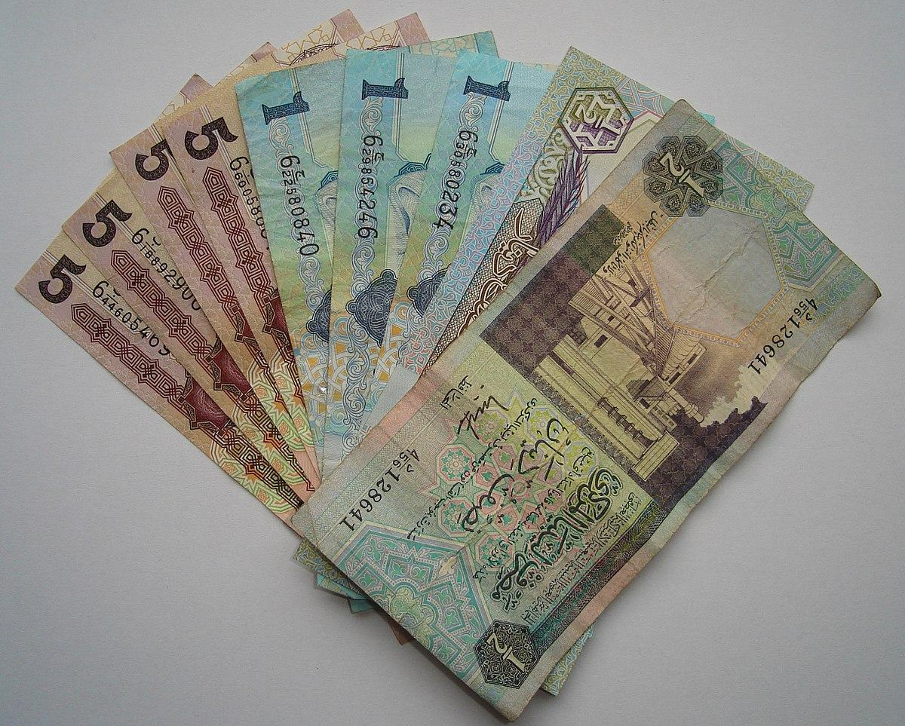

The Libyan economy has been a subject of global interest due to its unique challenges and opportunities. As a nation primarily driven by oil and petroleum exports, Libya's economic landscape is largely shaped by the complexities of global energy markets and domestic political instability. This intricate setting provides both potential and obstacles for economic growth and financial development, making it a pivotal focus for international traders, policymakers, and investors.

This article explores the Libyan economy with a particular focus on the Libyan Dinar (LYD), the country's official currency. Introduced in 1971 to replace the Libyan Pound, the LYD plays a crucial role in the nation's financial system. Our examination will highlight the significance of the LYD in both official and unofficial markets, revealing the challenges it faces such as depreciation in black market dealings due to socio-political factors and fluctuating oil prices.



In discussing the LYD, we will also consider the emerging role of algorithmic trading, a method employing advanced technology and algorithms to optimize trade execution in financial markets. Given Libya's volatile market conditions, algorithmic trading represents a potential tool for enhancing efficiency and minimizing risks when dealing with LYD transactions.

Understanding these elements is crucial for traders aiming to navigate Libya's currency markets effectively. It also holds significance for policymakers seeking to stabilize the economy and for investors assessing the opportunities within this oil-rich nation. By analyzing these dynamics in detail, the article aims to provide the essential insights necessary for engaging with the Libyan economy and its financial prospects.

## Table of Contents

## Understanding the Libyan Economy

Libya's economy is heavily reliant on the oil and petroleum sector, which forms the backbone of its gross domestic product (GDP). As of recent reports, the oil industry accounts for approximately 95% of Libya's export earnings and over 60% of its GDP. This heavy dependence on a single industry makes the economy particularly vulnerable to fluctuations in global oil prices, which can significantly impact national revenue.

Political instability has further compounded these economic vulnerabilities. Since the fall of Muammar Gaddafi's regime in 2011, Libya has experienced prolonged internal conflicts characterized by competing governments, militia fighting, and regional divisions. These conflicts have disrupted oil production and exports, causing instability in the currency markets and hindering foreign investment. The frequent shutdowns of oil fields due to security issues have exacerbated the volatility of oil exports, further weakening Libya's economic stability.

Economic challenges are intensified by the internal strife, which affects currency stability and hampers foreign trade. The Libyan Dinar (LYD) has been subjected to substantial depreciation, especially in the black market, as the central bank struggles to maintain a stable exchange rate amidst the political and economic crises. This depreciation reflects the broader uncertainty about Libya's economic future, deterring international business and trade relations.

Overall, the combination of dependency on oil exports, political instability, and internal conflicts presents profound challenges to the Libyan economy. Addressing these issues is crucial to stabilizing the country's economic environment, improving the currency's value, and enhancing the prospects for foreign trade and investment.

## The Libyan Dinar (LYD): Currency Overview

The Libyan Dinar (LYD) serves as the official currency of Libya, succeeding the Libyan Pound in 1971. As a key component of the national economy, the LYD is intricately linked to the country’s economic health, especially given Libya's heavy reliance on oil exports. Economic and political uncertainties have led to several challenges for the LYD, most notably its depreciation in unofficial or black market exchanges. This depreciation is largely attributed to fluctuations in global oil prices and political instability, which undermine confidence in the currency and result in its diminished value against foreign currencies.

The official exchange rate for the LYD is determined by the Central Bank of Libya, but there exists a significant disparity between this rate and the rates prevalent in the black market. Black market trading of the LYD is driven by factors such as economic sanctions, limited [liquidity](/wiki/liquidity-risk-premium), and the public's lack of trust in the financial system amid civil unrest. These issues exacerbate the supply-demand discrepancies that cause the LYD to depreciate further in unofficial markets.

Oil exports, accounting for a substantial portion of Libya’s GDP, are pivotal in influencing the LYD’s value. Disruptions in oil production or global price hikes frequently lead to economic instability. For instance, when oil revenues are compromised, the country's ability to accumulate foreign reserves is impaired, impacting the LYD’s strength. Conversely, stable or high oil prices bolster the country's fiscal position, potentially stabilizing the currency.

In response to these challenges, Libya faces the ongoing task of managing currency [volatility](/wiki/volatility-trading-strategies) while navigating complex political and economic landscapes. Understanding these dynamics is crucial for any stakeholders involved in trading or policy-making, with an emphasis on devising strategies to mitigate the impacts of external shocks on the LYD.

## Algorithmic Trading in Libyan Currency Markets

Algorithmic trading in the Libyan currency markets represents a modern approach to managing the complexities of foreign exchange (Forex) trading, particularly amidst the volatile conditions affecting the Libyan Dinar (LYD). By employing sophisticated computer algorithms, traders can analyze vast datasets and execute trades at high speeds, optimizing for factors such as timing, order size, and market trends. This technological advancement provides a strategic edge in navigating fluctuating currency values exacerbated by Libya’s economic and political landscape.

The implementation of [algorithmic trading](/wiki/algorithmic-trading) involves several key components. At its core, the process relies on the ability to process large volumes of data efficiently. Traders utilize algorithms to sift through market data, including historical prices, trading volumes, and macroeconomic indicators, to identify patterns and signals indicative of potential trading opportunities. These algorithms can also incorporate technical analysis, utilizing tools like moving averages, Bollinger Bands, and other statistical indicators to forecast price movements.

Consider a simple example of a moving average crossover strategy, which is widely used in algorithmic trading. This strategy involves two moving averages – a short-term and a long-term moving average. The basic rule is to buy when the short-term average crosses above the long-term average and sell when the opposite occurs. In Python, this strategy can be implemented as follows:

```python
import pandas as pd

def moving_average_cross_strategy(data, short_window=40, long_window=100):
    # Calculate short and long moving averages
    data['short_mavg'] = data['Close'].rolling(window=short_window, min_periods=1).mean()
    data['long_mavg'] = data['Close'].rolling(window=long_window, min_periods=1).mean()

    # Buy signal
    data['signal'] = 0
    data['signal'][short_window:] = np.where(data['short_mavg'][short_window:] > data['long_mavg'][short_window:], 1, 0)

    # Generate trading orders
    data['positions'] = data['signal'].diff()

    return data

# Assume 'data' is a DataFrame containing the LYD exchange rate time series data with a 'Close' column for closing prices.
```

In the context of LYD, algorithmic trading also benefits from risk management protocols that help mitigate the adverse effects of rapid market swings. Such protocols include setting triggers for stop-loss orders, which automatically liquidate positions at predetermined prices to cap potential losses.

Furthermore, the integration of [machine learning](/wiki/machine-learning) (ML) and [artificial intelligence](/wiki/ai-artificial-intelligence) (AI) enhances the capabilities of algorithmic trading systems. These technologies allow for adaptive learning from real-time data, continually refining strategies to better predict market behavior. This feature is particularly advantageous in Libya’s dynamic environment, where geopolitical events can abruptly influence currency valuations.

Despite its advantages, algorithmic trading in Libya faces distinct challenges. The primary issues include liquidity constraints and limited market depth, which can inhibit the effective execution of large trades without significantly impacting prices. Additionally, regulatory hurdles and technological infrastructure limitations pose challenges. Thus, a robust risk management framework and adherence to compliance standards are vital.

Overall, algorithmic trading represents a potent tool for navigating the LYD markets. By leveraging advanced computational techniques, traders can enhance their decision-making processes, capitalize on market inefficiencies, and manage risks effectively amidst the inherent uncertainties of the Libyan economy.

## Challenges and Opportunities in Algo Trading with LYD

Algorithmic trading in the Libyan Dinar (LYD) markets presents a mix of challenges and opportunities for traders. Algorithmic trading, while offering efficient execution and strategic advantages, encounters significant hurdles in the Libyan context due to liquidity issues and regulatory constraints. These challenges arise from the economic and political volatility that characterizes Libya, making it difficult to maintain stable trading volumes and consistent market participation.

Liquidity is a primary concern in the LYD market. In financial terms, liquidity refers to the ease with which an asset can be bought or sold in the market without affecting its price. For algorithmic traders, liquidity is vital because algorithms rely on quick execution of trades to capitalize on market inefficiencies. However, the Libyan currency market is often marked by insufficient liquidity, especially in unofficial markets where the LYD might be traded at different rates compared to the official rate set by the Central Bank of Libya.

Regulatory constraints further complicate the landscape for algorithmic trading. Libya's regulatory framework may not yet be fully equipped to manage and oversee the complexities of algorithmic trading, posing potential risks for traders. Regulations may be underdeveloped or inconsistently enforced due to the country's ongoing political instability and governance issues. This scenario requires traders to be cautious and well-informed about legal requirements and restrictions when engaging in algorithmic trading involving the LYD.

Despite these challenges, significant opportunities exist for traders willing to navigate the complexities of Libya's currency markets. The advancement of data analytics provides traders with the tools to harness vast amounts of market data to predict trends and identify profitable trading opportunities. By employing sophisticated algorithms and machine learning models, traders can analyze historical data, assess market sentiment, and generate predictive insights, thus enhancing their ability to make informed decisions.

Investors can capitalize on market inefficiencies by employing strategies such as statistical [arbitrage](/wiki/arbitrage), where traders exploit price differences of the LYD in different markets, or trend-following strategies that leverage directional price movements. These strategies benefit greatly from algorithmic execution, which allows for rapid response to market conditions.

Staying informed about local economic policies and global market influences is crucial for investors dealing with the LYD. Political decisions, changes in oil prices, and shifts in global financial markets can significantly impact the LYD’s value. Thus, a comprehensive awareness of both local and international factors is essential to mitigating risks and maximizing the potential benefits of algorithmic trading in the Libyan currency market.

In conclusion, while the road to successful algorithmic trading with the LYD is fraught with challenges, the careful application of data-driven strategies and a keen awareness of regulatory and market conditions can unlock substantial opportunities for informed and innovative traders.

## Impact of Political Instability on the Currency

Political instability has profound effects on the Libyan economy, particularly influencing the Libyan Dinar (LYD). The currency's volatility is significantly heightened by ongoing political conflicts and shifts in governance. Libya's complex political landscape, marked by fragmented authority and regional disputes, directly impacts fiscal policy and economic stability. This instability is evident in the LYD's performance, where frequent power changes and governmental disagreements lead to inconsistent economic measures and policies.

The Central Bank of Libya plays a crucial role in maintaining currency stability, but internal divisions and conflicting agendas can undermine its effectiveness. Discrepancies within the bank itself, coupled with varying factional interests, often result in divergent monetary policies. Such discord exacerbates the LYD's volatility, making it a challenging environment for traders. The interference of multiple power centers in monetary policy complicates efforts to achieve a uniform and predictable financial strategy.

For traders, both algorithmic and traditional, understanding these political dynamics is essential. Algorithmic trading systems seeking to optimize transactions in LYD markets must account for sudden political developments that can cause abrupt currency fluctuations. Traders must incorporate political risk analysis into their decision-making processes to better anticipate potential disruptions. Traditional traders similarly need to stay informed about political events to effectively manage their exposure to currency risks.

Given the underlying political instability, it is critical for participants in the LYD markets to remain vigilant. This requires keeping abreast of political events and central bank announcements, adopting flexible trading strategies, and utilizing robust risk management frameworks. Recognizing the intertwined nature of politics and currency markets in Libya can help traders safeguard against potential losses triggered by political turbulence.

## The Future of Lybian Economy and Currency

As global oil prices and local political dynamics continue to evolve, the future of Libya's economy and its currency, the Libyan Dinar (LYD), remains intricately linked to these factors. The volatility in global oil markets has a profound effect on Libya's economy, given that oil exports constitute the backbone of the country's GDP. Therefore, fluctuations in oil prices directly impact national revenue, economic growth, and currency stability. 

Political stabilization within Libya offers a potential pathway to economic improvement. A more consistent and unified government can lead to better management of oil resources, attract foreign investments, and facilitate economic reforms necessary for financial stability. With effective governance, Libya could enhance its infrastructure, diversify its economy beyond oil, and improve its trade balance. These developments would likely bolster the LYD and increase investor confidence in Libyan markets.

Implementing advanced trading strategies could further influence Libya's economic trajectory. Algorithmic trading, which utilizes computer algorithms for executing trades at optimized intervals, provides an avenue for navigating the uncertainties of currency markets. Integrating such technologies can help in capitalizing on market inefficiencies and managing risks associated with currency volatility. Moreover, enhancing data analytics capabilities could play a critical role in predicting market trends and making informed trading decisions, providing a competitive edge to those involved in LYD trading.

Improving economic policies is equally crucial for strengthening Libya's financial standing. Measures such as establishing a stable regulatory environment, maintaining transparent fiscal practices, and fostering international trade relations are essential components of a robust economic strategy. By aligning economic policies with technological advancements and market demands, Libya can create a conducive environment for sustainable growth, thus ensuring a stable and resilient LYD.

In conclusion, while Libya's economic future is fraught with uncertainties, there are significant opportunities for growth. The stabilization of local politics, adoption of advanced technology in financial markets, and reformation of economic policies can collectively fortify Libya's economic position and enhance the value of its currency. The ongoing efforts to unify political factions and improve governance structures are pivotal in unlocking these potentials, thereby shaping a promising future for the Libyan economy and its currency.

## Conclusion

Navigating the Libyan economy and its currency requires a comprehensive understanding of its complex challenges, primarily driven by political instability, dependency on oil exports, and fluctuating currency markets. The integration of algorithmic trading offers a modern, strategic advantage for those engaging in the Libyan currency markets, particularly with the Libyan Dinar (LYD). This technology facilitates efficient and timely trades, allowing participants to mitigate some of the risks posed by the volatile economic environment. However, it is essential to remain aware of issues such as liquidity constraints and regulatory hurdles, which can impede the effectiveness of algorithmic trading in Libya.

To unlock the full potential of Libya's economy, collaboration between investors and policymakers is crucial. Investors must stay informed on local economic conditions and global market trends to effectively use trading strategies, while policymakers must focus on creating a stable political environment and implementing conducive economic policies. By aligning interests and efforts, stakeholders can work towards stabilizing the LYD, enhancing the overall economic landscape, and positioning Libya competitively in the global market.

## References & Further Reading

[1]: Vasileios, S. (2019). ["Libya’s Economy Returns to the Wilderness."](https://en.wikipedia.org/wiki/Vassilis_Toliopoulos) Atlantic Council.

[2]: Bhattacharya, J., Kakani, R. K., & Malik, S. (2021). ["Algorithmic Trading and Market Quality in an Emerging Market: Evidence from India"](https://frenchmoments.eu/ile-de-france/) Risks and Regulation.

[3]: Bassil, N., & Mourad, W. (2020). ["Political Economy of Libya’s Post-2011 Fragmentation."](https://www.tandfonline.com/doi/full/10.1080/10357718.2021.1882385) Carnegie Middle East Center.

[4]: "Economic Governance & Stability Monitor February 2023." (2023). [Libya Desk](https://libya.liveuamap.com/en/2024/23-december-21-french-presidents-envoy-affirms-his-countrys).

[5]: "Libya Economic Monitor, Fall 2022: Resilience or Stagnation?" (2022). [World Bank](https://www.arabnews.com/node/2425331/%7B%7B).