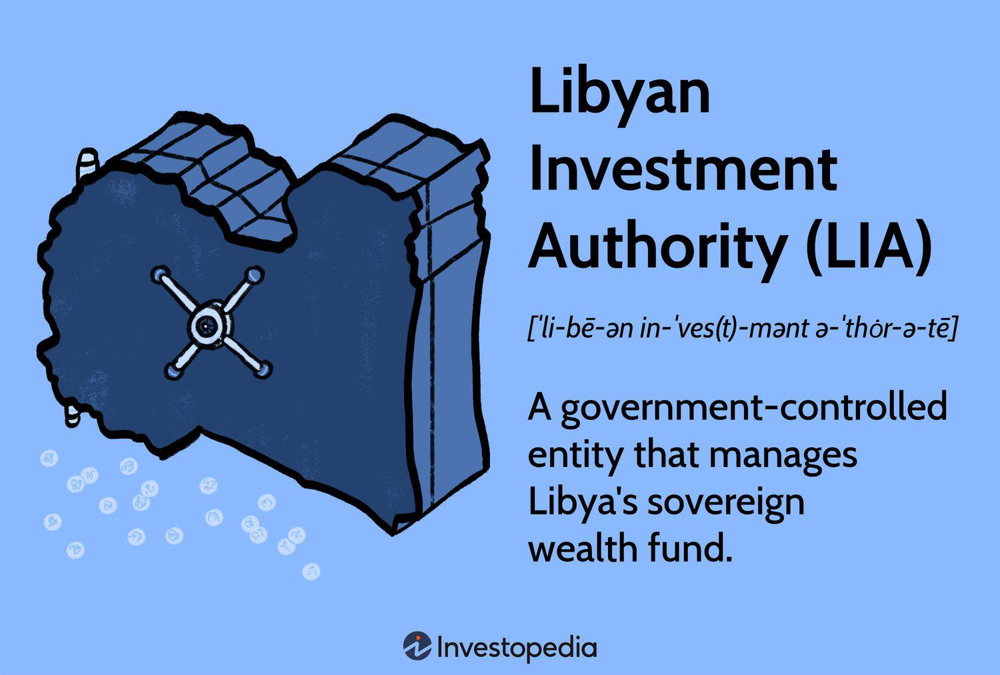

The Libyan Investment Authority (LIA) stands as one of Africa's largest sovereign wealth funds, with assets exceeding $67 billion. Established in 2006, the LIA was conceived as a vehicle to transform Libya's substantial oil revenues into diverse investment opportunities aimed at sustaining financial stability for future generations. The LIA's expansive portfolio encompasses sectors such as real estate, financial services, and technology, reflecting its commitment to economic diversification amidst the country's reliance on oil.

This article aims to provide a comprehensive examination of the multifaceted role the LIA plays in Libya's efforts to diversify its economy, a vital objective given the significant challenges facing the nation. These challenges include political instability, economic sanctions, and geopolitical tensions. Despite these difficulties, the LIA has continued to pursue strategies to maximize returns and foster economic development, underscoring its resilience and adaptability.

In confronting these challenges, the LIA seeks to utilize modern financial practices, particularly in the area of algorithmic trading. Algorithmic trading has the potential to revolutionize the way the fund manages its assets, offering enhanced efficiency, reduced risk, and refined compliance with international standards. This article will explore how integrating such technologies could shape the future operational strategies of the LIA, potentially elevating its capability to navigate the volatile landscape of global investments.

## Table of Contents

## Overview of the Libyan Investment Authority

The Libyan Investment Authority (LIA) was established in 2006 with the objective of managing and investing the nation's wealth derived from its oil resources. The mission of the LIA is centered on ensuring long-term financial security for future generations by diversifying Libya's economy beyond its reliance on oil revenues.

The LIA stands as Africa's largest sovereign wealth fund, with diverse assets spanning various sectors. These include investments in real estate, financial services, and technology. This broad range of asset allocations is designed to mitigate risks and enhance the potential for stable returns, aligning with the fund's overarching goal of economic diversification.

However, the operations of the LIA are significantly impacted by the political instability that has persisted in Libya over recent decades. The country has been embroiled in prolonged periods of civil unrest and armed conflict, which have disrupted the Authority's ability to execute its investment strategies effectively. International sanctions have compounded these difficulties, resulting in the freezing of a substantial portion of the LIA's assets. This has greatly impeded the fund's financial flexibility and its capacity to respond to market opportunities.

Despite these formidable challenges, the Libyan Investment Authority remains steadfast in its commitment to maximizing returns on its investments. The organization endeavors to play an instrumental role in fostering Libya's economic development. Its efforts are directed towards overcoming current obstacles and prudently managing its portfolio to support the nation's socioeconomic objectives.

By focusing on strategic asset management, the LIA aims to contribute positively to the stabilization and growth of Libya's economy, even amid the adversities it faces. The Authority continues to explore avenues to enhance its operational effectiveness and optimize its asset utilization for the long-term prosperity of Libya.

## Challenges Faced by the LIA

The Libyan Investment Authority (LIA) faces considerable challenges in executing its investment strategies due to several interconnected factors. The ongoing Libyan Civil War and persistent political unrest have drastically impeded the LIA's operational effectiveness. These socio-political conditions have disrupted the economic landscape, putting significant constraints on the Authority's ability to plan and implement long-term investment strategies.

International sanctions have imposed additional hurdles, freezing a substantial portion of the LIA's assets. These sanctions restrict financial flexibility and limit the availability of capital for new investments and economic initiatives. Consequently, LIA's capacity to pursue international investment opportunities or diversify its portfolio is severely curtailed.

Moreover, leadership disputes within the organization have historically fragmented the Authority, leading to a lack of cohesive strategy and implementation. This internal dissension complicates decision-making processes, delays project development, and undermines the operational coherence necessary for a sovereign wealth fund of this scale.

To navigate these multifaceted challenges, the LIA needs to seek international support and advocate for the lifting of sanctions. Diplomatic efforts to engage with global powers and financial institutions are essential. Building international relationships could help provide the LIA with access to untapped financial markets and resources, enabling it to stabilize and potentially thrive amidst adversity. Efforts to mitigate leadership conflicts and reassure stakeholders could further solidify the Authority's position and operational efficiency.

## Algorithmic Trading: A Potential Solution

Algorithmic trading involves leveraging computer programs and algorithms to execute trades at optimal prices and speeds, offering a substantial advantage in the modern financial landscape. For the Libyan Investment Authority (LIA), adopting [algorithmic trading](/wiki/algorithmic-trading) can significantly enhance the efficiency of trading operations and serve as a potent tool to mitigate market [volatility](/wiki/volatility-trading-strategies).

One of the primary benefits of algorithmic trading is its ability to optimize asset management through automation. By automating trading processes, the LIA can achieve faster and more precise execution of trades, which is crucial in volatile markets where timing is key. Algorithms can analyze vast amounts of market data in real time, identifying lucrative trading opportunities that may not be evident through manual analysis. This capability allows the LIA to react swiftly to market changes, thereby maximizing returns on its investments.

Moreover, algorithmic trading can play a vital role in risk management. Automated systems can implement hedging strategies that protect the LIA’s portfolio from adverse market movements. For instance, statistical [arbitrage](/wiki/arbitrage) algorithms can exploit pricing inefficiencies between related financial instruments, enhancing profitability while minimizing risk. This not only helps stabilize the portfolio performance but also aligns with global financial compliance standards by ensuring that trades are executed transparently and in accordance with regulatory requirements.

The strategic adoption of algorithmic trading could also empower the LIA to achieve greater portfolio diversification. By dynamically reallocating assets based on quantitative models, the Authority can optimize its investment spread across various sectors, reducing dependence on any single asset class or geographic region. This diversified approach can enhance return on investment and ensure consistent portfolio growth, even amid economic uncertainties.

In conclusion, algorithmic trading offers the LIA a robust mechanism to enhance its investment strategies. By integrating modern trading technologies, the LIA can increase operational efficiency, optimize risk management, and diversify its portfolio, thereby reinforcing its commitment to supporting Libya’s economic development.

## Steps Towards Integration of Algo Trading

To implement algorithmic trading, the Libyan Investment Authority (LIA) could consider several strategic actions that focus on collaboration, skill development, technological advancements, and regulatory compliance.

Collaboration with international financial technology firms presents a crucial step toward integrating algorithmic trading. These collaborations can provide the LIA with access to cutting-edge trading algorithms and expertise in executing high-frequency transactions. Such partnerships can enable the LIA to adopt best practices in algorithmic trading, which are essential for effectively managing and optimizing large-scale investment portfolios.

Training programs for internal staff are equally important to ensure the smooth adoption of new trading technologies. These programs can focus on enhancing the skills of the LIA's trading team, covering areas such as quantitative analysis, programming, and risk management. Skills in programming languages like Python, widely used in financial modeling and algorithm development, can be particularly beneficial. For example, Python libraries such as Pandas and NumPy can be used for data analysis, while libraries like Scikit-learn can aid in developing [machine learning](/wiki/machine-learning) models for predictive trading strategies.

The development of a robust IT infrastructure is pivotal in supporting advanced trading algorithms. This infrastructure should include high-speed data processing capabilities, secure data storage, and reliable communication networks. A robust IT framework enables the efficient execution of algorithms and real-time data analysis, both critical for making timely and informed trading decisions. Moreover, utilizing cloud computing services can enhance computational power and scalability, facilitating seamless operations of algorithmic trading systems.

Transparency and compliance with global financial regulations are crucial for effective algorithmic trading integration. The LIA must adhere to international standards such as the Markets in Financial Instruments Directive (MiFID II) in Europe or the Securities and Exchange Commission (SEC) regulations in the United States. Compliance ensures that the LIA's trading activities are conducted within legal bounds, fostering trust with stakeholders and avoiding potential legal repercussions. Implementing comprehensive risk assessment and monitoring systems can help maintain compliance, ensuring that trading strategies align with governance and ethical standards.

In summary, the successful integration of algorithmic trading at the LIA hinges on strategic collaborations, skill enhancements, robust infrastructure, and stringent compliance with financial regulations. These efforts can position the LIA to effectively leverage algorithmic trading, enhancing its investment capabilities and contributing to Libya's economic development.

## Conclusion

The Libyan Investment Authority (LIA) faces numerous challenges but stands at a promising juncture where embracing algorithmic trading could lead to substantial benefits. This strategic move can help the LIA optimize its asset management through enhanced technology and international collaboration. As Libya's largest sovereign wealth fund, the integration of algorithmic trading can potentially transform how the LIA manages assets, executing trades with improved precision and speed.

By investing in cutting-edge technology and forming strategic alliances with global financial technology firms, the LIA can enhance its investment capabilities. This advancement is crucial for stabilizing Libya's economy, particularly considering the geopolitical and economic instability the country has faced. Algorithmic trading allows for efficient portfolio diversification, enabling the LIA to better hedge against market volatility and improve returns.

The successful integration of algorithmic trading also means aligning with modern financial practices. The use of algorithmic models can facilitate compliance with international financial regulations, ensuring the LIA operates within global standards. Moreover, the automation of trading activities can significantly reduce operational risks.

In conclusion, the LIA has an opportunity to leverage modern technological advancements to not only improve its own asset management practices but also contribute significantly to Libya's economic development. By embracing algorithmic trading, the LIA sets a developmental trajectory aligned with global financial trends, promising a future of greater economic stability and growth for Libya.

## References & Further Reading

[1]: Marcos, M., & Lopez de Prado, M. (2018). ["Advances in Financial Machine Learning."](https://www.amazon.com/Advances-Financial-Machine-Learning-Marcos/dp/1119482089) Wiley.

[2]: Aronson, D. R. (2006). ["Evidence-Based Technical Analysis: Applying the Scientific Method and Statistical Inference to Trading Signals."](https://www.amazon.com/Evidence-Based-Technical-Analysis-Scientific-Statistical/dp/0470008741) Wiley.

[3]: Jansen, S. (2020). ["Machine Learning for Algorithmic Trading: Predictive models to extract signals from market and alternative data for systematic trading strategies with Python."](https://www.amazon.com/Machine-Learning-Algorithmic-Trading-alternative/dp/1839217715) Packt Publishing.

[4]: Chan, E. P. (2009). ["Quantitative Trading: How to Build Your Own Algorithmic Trading Business."](https://github.com/ftvision/quant_trading_echan_book) Wiley.

[5]: Bergstra, J., Bardenet, R., Bengio, Y., & Kégl, B. (2011). ["Algorithms for Hyper-Parameter Optimization."](https://dl.acm.org/doi/10.5555/2986459.2986743) Advances in Neural Information Processing Systems, 24.