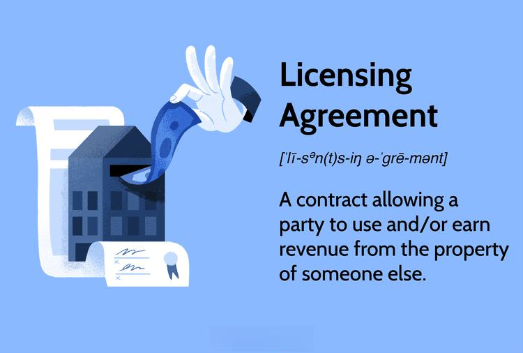

## Table of Contents

## What is a licensing agreement?

A licensing agreement is a contract between two parties where one party, called the licensor, gives permission to the other party, called the licensee, to use their property. This property can be things like a brand name, a piece of technology, or a creative work like a book or a song. The agreement sets out the rules for how the licensee can use the property, how long they can use it, and how much they need to pay the licensor.

These agreements are important because they help protect the rights of the licensor while allowing the licensee to benefit from using the property. For example, a company might license a popular cartoon character to put on their products. This helps the company sell more items, and the owner of the cartoon character gets paid for letting their character be used. Licensing agreements need to be clear and detailed to avoid any misunderstandings or legal problems.

## Why are licensing agreements important?

Licensing agreements are important because they help set clear rules between the person who owns something and the person who wants to use it. The owner, called the licensor, can make sure their property, like a brand or a song, is used in a way they agree with. The person using the property, called the licensee, knows exactly what they can and cannot do. This helps avoid confusion and fights over how the property should be used.

These agreements also help the licensor make money. By letting others use their property, the licensor can get paid through fees or royalties. This can be a big source of income, especially if the property is popular. For the licensee, using someone else's property can help them make their own products or services better or more appealing to customers. So, licensing agreements are good for both sides because they create a fair way to share and benefit from valuable property.

## What are the common types of licensing agreements?

Licensing agreements come in different types, depending on what is being shared. One common type is a trademark license. This is when a company lets another company use their brand name or logo. For example, a clothing company might pay to put a famous cartoon character on their t-shirts. This helps them sell more shirts, and the cartoon's owner gets paid for letting their character be used.

Another type is a patent license, which is used for inventions or technology. If someone invents a new gadget, they can let other companies make and sell it by giving them a patent license. In return, the inventor gets money from the sales. A third type is a copyright license, which is for things like [books](/wiki/algo-trading-books), music, or movies. If a musician writes a song, they can let others use it in commercials or movies by giving them a copyright license. This way, the musician earns money while others use their song.

## Who are the parties involved in a licensing agreement?

In a licensing agreement, there are two main parties involved: the licensor and the licensee. The licensor is the person or company that owns the property, like a brand, a technology, or a creative work. They are the ones who give permission to someone else to use their property. The licensee is the person or company that wants to use the property owned by the licensor. They need to follow the rules set in the agreement to use the property.

These two parties come together because the licensor wants to make money by letting others use their property, and the licensee wants to benefit from using that property. The agreement helps them work together by setting clear rules on how the property can be used, how much the licensee needs to pay, and how long they can use it. This way, both the licensor and the licensee know what to expect and can avoid any misunderstandings or problems.

## What are the key components of a licensing agreement?

A licensing agreement has several important parts that help both the licensor and the licensee understand their rights and responsibilities. One key part is the scope of the license, which explains what the licensee is allowed to do with the property. This could include details like where they can use it, how they can use it, and for how long. Another important part is the financial terms, which talk about how much the licensee needs to pay. This could be a one-time fee, regular payments, or royalties based on sales.

Another key component is the duration of the agreement, which sets the start and end date of the license. This helps both parties know how long they are committed to the agreement. The agreement also includes terms about how it can be ended early, like if one party does not follow the rules. Finally, there are usually rules about how to handle disagreements, like going to mediation or court. All these parts work together to make sure both the licensor and the licensee know what to expect and can use the property fairly and safely.

## How does a licensing agreement protect intellectual property?

A licensing agreement protects intellectual property by setting clear rules on how it can be used. The owner of the property, called the licensor, gives permission to someone else, called the licensee, to use their property. This agreement says exactly what the licensee can do with the property, like where they can use it and for how long. By making these rules clear, the licensor can stop others from using their property in ways they don't want. This helps keep their intellectual property safe and under their control.

The agreement also has rules about what happens if someone breaks the agreement. If the licensee does not follow the rules, the licensor can take action to stop them. This might mean ending the agreement or even taking them to court. Having these rules in place makes it easier for the licensor to protect their intellectual property. It also makes sure that the licensee knows what they can and cannot do, so they are less likely to use the property in the wrong way.

## What are the typical terms and conditions found in licensing agreements?

Licensing agreements have many important terms and conditions that both the licensor and the licensee need to follow. One key term is the scope of the license, which explains what the licensee can do with the property. This includes where they can use it, how they can use it, and for how long. Another important term is the financial part, which says how much the licensee needs to pay. This could be a one-time fee, regular payments, or royalties based on how much they sell. The agreement also sets the duration, which tells when the license starts and ends. This helps both parties know how long they are committed to the agreement.

Another set of terms deals with how the agreement can be ended early. If the licensee does not follow the rules, the licensor can end the agreement or take legal action. The agreement also has rules about how to handle disagreements, like going to mediation or court. This helps both parties know what to do if they have a problem. Finally, the agreement might have rules about how the property should be used to keep its value and reputation. All these terms and conditions work together to make sure the intellectual property is used fairly and safely, and that both the licensor and the licensee know what to expect.

## How can a licensing agreement be negotiated?

Negotiating a licensing agreement starts with both the licensor and the licensee talking about what they want from the deal. The licensor wants to make sure their property, like a brand or a song, is used in a way they agree with and that they get paid fairly. The licensee wants to use the property to make their own products or services better, but they also want to make sure they can afford it. They talk about things like how long the license will last, how much it will cost, and what the licensee can do with the property. Both sides might go back and forth, trying to find a deal that works for everyone.

Once they start to agree on the big points, they can move on to the smaller details. This might include how they will handle disagreements, what happens if one side doesn't follow the rules, and any other special conditions. It's important for both sides to be clear and honest about what they need. Sometimes, they might need to bring in lawyers to help make sure the agreement is fair and legal. In the end, the goal is to come up with a licensing agreement that both the licensor and the licensee are happy with and that protects the value of the property.

## What are the potential risks and pitfalls of licensing agreements?

Licensing agreements can have risks and problems for both the licensor and the licensee. One big risk is that the licensee might not follow the rules of the agreement. If they use the property in a way that the licensor does not like, it can hurt the property's value or reputation. For example, if a company uses a famous cartoon character in a bad way, it could make people think less of the character. Another risk is that the licensee might not pay the licensor on time or at all. This can cause money problems for the licensor who was counting on that income.

Another problem can happen if the agreement is not clear or detailed enough. If the rules are not written down well, the licensee might not know what they can and cannot do. This can lead to fights between the licensor and the licensee. Also, if the agreement does not say what happens if one side breaks the rules, it can be hard to fix the problem. Both sides need to be careful and make sure the agreement covers all the important points to avoid these risks and pitfalls.

## How do licensing agreements vary across different industries?

Licensing agreements can be different depending on the industry. In the technology industry, licensing agreements often focus on patents and software. A tech company might license its software to another company, setting rules on how it can be used, how many people can use it, and how much the licensee needs to pay. These agreements need to be very specific to protect the technology and make sure it is used correctly. In the entertainment industry, licensing agreements are usually about copyrights for things like movies, music, or books. A musician might license their song to be used in a movie or a commercial. The agreement would say how the song can be used, how long it can be used, and how much the musician will get paid.

In the fashion industry, licensing agreements often involve trademarks. A famous designer might license their brand name to a company that makes clothes or accessories. This lets the company use the designer's name on their products, which can help them sell more. The agreement would set rules on what products can [carry](/wiki/carry-trading) the brand name, how they should be made, and how much the designer will be paid. Each industry has its own needs and concerns, so the licensing agreements need to be tailored to fit those specific situations. This makes sure that both the licensor and the licensee get what they need from the deal.

## What are the international considerations in licensing agreements?

When a licensing agreement involves different countries, there are special things to think about. One big thing is the laws in each country. Different places have different rules about how to protect things like brand names, inventions, and creative works. So, the agreement needs to make sure it follows the laws of all the countries involved. This can be tricky because what is okay in one country might not be okay in another. Also, there might be language differences, so the agreement might need to be written in more than one language to make sure everyone understands it.

Another important thing is how to handle money across borders. The agreement needs to say what currency to use for payments and how to deal with taxes and other fees. Sometimes, the value of money can change between countries, so the agreement might need to have rules about how to handle this. It's also important to think about how to solve problems if they happen. If the licensor and licensee are in different countries, they might need to agree on where to go to court or how to use mediation if there is a disagreement. All these things make international licensing agreements more complicated, but they are important to make sure the deal works well for everyone involved.

## How can one ensure compliance with a licensing agreement?

To make sure a licensing agreement is followed, both the licensor and the licensee need to understand and agree on the rules. The licensor should check regularly to see if the licensee is using the property the right way. This could mean looking at how the property is being used, asking for reports, or even visiting where the licensee is working. The licensee needs to keep good records and be ready to show the licensor that they are following the rules. If the licensee does not follow the agreement, the licensor can take action, like sending a warning or ending the agreement.

It's also important to have clear ways to handle problems. The agreement should say what happens if someone breaks the rules, like paying a fine or going to court. Both sides should talk openly if there are any issues, so they can fix them before they get worse. By making sure everyone knows the rules and follows them, the licensing agreement can work well and protect the property.

## References & Further Reading

[1]: Korper, S., & Ellis, J. (2000). ["The E-Commerce Book: Building the E-Empire."](https://archive.org/details/ecommercebook00stef) Academic Press.

[2]: Fisher, D. (2022). ["Licensing Best Practices: Strategic, Territorial, and Technology Issues"](https://lesi.org/licensing-best-practices-strategic-territorial-and-technology-issues/) by Lesley Garner.

[3]: ["Intellectual Property Licensing Strategies"](http://www.marcelbogers.com/Pubs/Bogers-Bekkers-Granstrand_2012_ch3_Intellectual-Property-and-Licensing-Strategies-in-Open-Collaborative-Innovation.pdf) Harvard Business Review.

[4]: Schilling, M.A. (2016). ["Strategic Management of Technological Innovation"](https://www.researchgate.net/publication/298786885_Strategic_Management_of_Technological_Innovation) McGraw-Hill Education.

[5]: ["Everything is a Remix: Fair Use"](https://www.everythingisaremix.info/articles/everything-is-a-remix-fair-use) by Kirby Ferguson.

[6]: Thumm, N. (2001). ["Patent and Trademark Licensing in the European Union."](https://www.semanticscholar.org/paper/Interrelation-between-patenting-and-standardisation-Blind-Thumm/c4a1c32daf3ea58e77735707cdf263fbefa0ad74) European Patent Office.