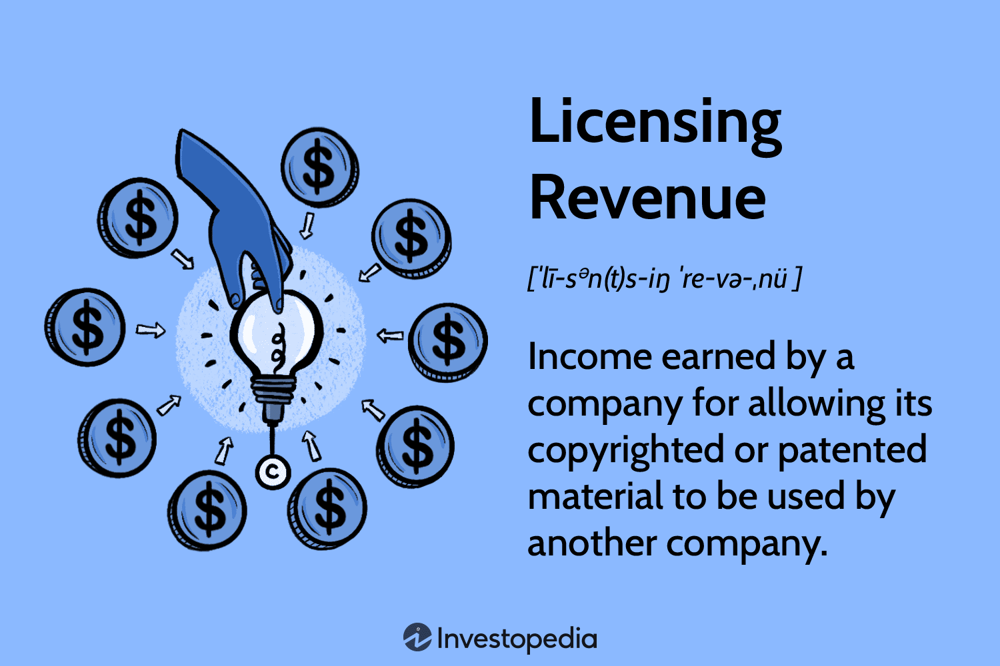

Algorithmic trading has significantly transformed the financial markets by facilitating rapid and efficient execution of trades. This evolution emphasizes speed and precision, often surpassing human capabilities. Crucial to this advancement is the role of Intellectual Property (IP), particularly proprietary algorithms that furnish firms with a competitive edge. These algorithms, embodying derivative strategies and data-driven insights, remain a closely guarded secret and are often zealously protected as intellectual assets.

By licensing these innovative algorithms, firms can monetize their intellectual property without investing in extensive internal development. This approach not only offers a stream of revenue but also enables firms to leverage cutting-edge technologies developed externally, thereby optimizing operational efficiency and market performance. Licensing arrangements permit companies to broaden their technological reach without incurring prohibitive costs, fostering an environment ripe for innovation and competitive superiority.

This article will examine the interconnectedness of revenue generation through licensing, intellectual property management, and algorithmic trading. It will uncover the mutually reinforcing synergies and evolving opportunities that exist within this dynamic space. Through strategic licensing agreements, firms can harness the power of AI-driven trading algorithms, thus driving growth and maintaining relevance in an ever-changing financial landscape.

## Table of Contents

## Understanding Licensing Revenue

Licensing revenue is generated when a company authorizes another entity to utilize its intellectual property in return for a fee. This revenue stream plays a crucial role in monetizing intangible assets such as copyrighted materials and patented technologies. Licensing arrangements are mutually beneficial. Licensors can unlock the financial potential of their innovations, turning static assets into dynamic sources of income. Licensees, on the other hand, gain access to pre-existing, valuable intellectual property (IP), enabling them to enhance their offerings and competitive stature without incurring the time and expense associated with in-house development.

For instance, technology companies frequently engage in licensing to extend the reach of their innovations and diversify their revenue sources. By doing so, they are not limited to generating income solely through direct sales. Instead, they can earn by allowing third parties to deploy their intellectual property through licensing arrangements. This strategy can lead to expanded market presence and increased financial returns without the necessity of direct market involvement.

This approach to revenue generation is not limited to technology alone. Sectors such as pharmaceuticals, media, and software development widely use licensing to attain economic benefits while fostering innovation. In pharmaceuticals, for example, smaller firms may license drug formulations from larger entities, accelerating their ability to offer effective treatments. Similarly, in media, content creators and distributors leverage licensing to distribute their works across multiple platforms and geographies.

A successful licensing strategy requires a well-structured agreement that stipulates the terms of usage, financial considerations, and obligations of both parties. Ensuring that agreed royalties reflect the true value of the intellectual property is vital. These royalties can be structured as upfront payments, ongoing usage fees, or based on the licensee’s revenue, allowing flexible and context-sensitive deployment. Such versatility in revenue structuring offers licensors the incentive to keep innovating and licensees manageable financial commitments aligned with their profitability and growth.

## The Role of Licensing in Algorithmic Trading

Licensing within [algorithmic trading](/wiki/algorithmic-trading) enables developers to monetize their proprietary algorithms, offering traders access to advanced computational technologies that drive financial market operations. These licensing agreements are meticulously crafted to delineate the scope and limitations of how these algorithms may be used, ensuring that intellectual property rights are safeguarded while maximizing the economic potential of these innovations.

The contractual agreements often specify terms related to the duration, purpose, and conditions of use of the licensed algorithms. This clarity ensures that the licensor maintains control over the use of their innovation, thereby preventing unauthorized replication or misuse. Protective measures embedded within these agreements are vital, as they uphold the integrity and security of the intellectual property, while also providing legal recourse in case of breaches or disputes.

Licensing mechanisms are particularly beneficial for smaller firms or new entrants in the financial markets. Developing such algorithms in-house requires significant investments in research and development, computational infrastructure, and expert personnel, which can be prohibitively expensive. Through licensing, these smaller entities can bypass the formidable barriers associated with algorithm development. Instead, they can access sophisticated technologies that enhance their trading capabilities, which would be otherwise unattainable. Consequently, licensing functions as a democratizing force in the financial sphere, leveling the playing field by allowing more participants to deploy cutting-edge algorithmic strategies.

Moreover, licensing can incentivize continuous innovation among developers. Knowing there is a viable market for licensure of their products, developers are encouraged to refine and enhance their algorithms. This ongoing innovation cycle not only benefits the developers financially but also enriches the trading ecosystem with enhanced tools and methodologies that contribute to market efficiency and competitiveness.

## Benefits of Royalty Agreements in Algo Trading

Royalty agreements in algorithmic trading present significant advantages by creating consistent revenue streams from licensed algorithms. This financial stability encourages continuous innovation and development, as developers and firms have clear incentives to refine and optimize their trading algorithms. 

These contractual arrangements effectively align the interests of both licensors and licensees, allowing both parties to share in the financial success of the algorithms. When the algorithms perform well, licensors earn royalties, while licensees benefit by utilizing cutting-edge tools that enhance their trading strategies. This mutual benefit fosters collaboration and continuous improvement, enhancing overall market efficiency.

Structuring these agreements offers flexibility, allowing payment through fixed fees or percentage-based royalties tied to trading profits. Fixed fee arrangements provide predictable income for licensors, crucial for budgeting and planning. Conversely, percentage-based royalties offer an attractive option, as they directly correlate to the performance and profitability of the algorithms. This performance-based incentive ensures that both parties are motivated to work towards improving algorithm efficiency and effectiveness.

For example, consider a Python-based algorithm where royalties are determined by a percentage of the trading profits, $P$. If the royalty rate is $r$, the royalties $R$ are calculated as:

$$
R = r \times P
$$

This structure allows revenue to scale with the success of the trading strategy, encouraging parties to invest in performance optimization. Furthermore, technology can streamline royalty calculations and distribution, ensuring transparency and accuracy in financial reporting. By fostering a collaborative environment between licensors and licensees, royalty agreements promote a culture of innovation and shared success in algorithmic trading.

## Emerging Trends: DeFi and Tokenization of IP

Decentralized finance (DeFi) is significantly impacting intellectual property (IP) management by enabling the digital tokenization of IP assets. Tokenization refers to the process of converting rights to an asset into a digital token on a blockchain. This innovation allows for fractional ownership, where investors can own smaller, divisible parts of an IP rather than requiring whole ownership. This fractionalization increases [liquidity](/wiki/liquidity-risk-premium), making IP investments more accessible to a diverse audience. 

Through tokenization, IP owners can raise capital by selling tokenized shares of their IP assets, thus democratizing access to investment opportunities that were previously restricted. The ability to trade these tokens on blockchain platforms enhances market accessibility and increases the fluidity with which IP assets can be exchanged.

The implementation of blockchain and smart contracts in IP licensing is pivotal in enhancing transparency. Blockchain’s immutable ledger provides a trustworthy record of all transactions, ensuring all parties have real-time access to the history of an IP asset’s use and ownership. Smart contracts, programmable contracts that automatically execute terms and conditions encoded within them, streamline processes by automating royalty payments and other contractual obligations. This automation reduces administrative costs and mitigates the risk of human error or manipulation.

Smart contracts work by executing predefined actions when certain conditions are met. For instance, a smart contract for IP licensing may automatically distribute royalties to the rights holder each time revenue is generated from that IP, based on agreed terms. This efficiency not only reduces overhead but also assures timely and accurate payment flows.

In summary, DeFi's introduction of IP tokenization represents a transformative shift in IP management, facilitating greater access, improved liquidity, and enhanced transparency and automation through blockchain technology and smart contracts. This evolution opens novel pathways for monetizing IP assets while reducing transactional complexities and costs.

## Challenges in Royalty IP Licensing for Algorithmic Trading

Setting fair royalty rates in the context of algorithmic trading involves navigating several complexities due to the swiftly changing landscape of financial markets and continuous technological advancements. The fluctuating nature of these markets demands a robust understanding of both the intrinsic and extrinsic factors influencing an algorithm's value.

To effectively structure balanced agreements, it is necessary to conduct thorough evaluations of the market value of algorithms. This involves assessing not only the historical performance but also potential future trends and innovations that could impact the algorithm's efficacy and relevance. Legal complexities, such as intellectual property rights protection and the jurisdictional differences in IP laws, further complicate this task. It is crucial to define clear terms that protect the ownership rights of the developers while allowing for the practical application by the licensees.

In the era of decentralized finance (DeFi), new regulatory challenges have emerged, transforming IP management and protection strategies. As DeFi platforms facilitate peer-to-peer transactions without traditional intermediaries, they bring transparency, speed, and efficiency but also introduce risks related to compliance with existing legal frameworks. The absence of established regulations can lead to uncertainty, and firms must stay informed about potential changes in the legal landscape to protect their interests effectively.

Adapting to these challenges requires leveraging technology, such as blockchain, to enhance the transparency and security of licensing agreements. Smart contracts can automate royalty payments and ensure that transactions adhere to pre-established terms, mitigating the risks of disputes and discrepancies. However, companies must remain vigilant to the evolving regulations that could affect these technologies' application and alignment with international compliance standards.

In summary, the complexities in setting fair royalty rates and structuring legally sound agreements are compounded by the rapid evolution of financial markets and the nascent regulatory environment of DeFi. Effective IP management in this dynamic field requires a proactive approach to valuation, legal protection, and adaptation to technological and regulatory advancements.

## Conclusion

Licensing agreements in algorithmic trading are essential mechanisms for monetizing intellectual property, serving as a bridge between innovation and practical application in the financial industry. By providing a structured approach to IP commercialization, these agreements enable developers to capitalize on their proprietary algorithms while delivering cutting-edge tools to traders and investors. As decentralized finance (DeFi) and intellectual property tokenization continue to evolve, they present fresh opportunities to enhance IP management. The tokenization process allows for fractional ownership of algorithms, making it possible to diversify and liquify the investment landscape in IP.

Moreover, the integration of blockchain technology and smart contracts in intellectual property licensing is reshaping traditional approaches. These technologies offer enhanced transparency and efficiency, automating transactions and minimizing the administrative overhead associated with royalty payments. However, stakeholders must remain vigilant to overcome inherent challenges. Establishing equitable royalty rates is complex amid the rapid advancements in financial technologies, requiring a keen understanding of both market dynamics and the intrinsic value of algorithms.

Additionally, navigating the evolving legal frameworks presents another layer of complexity. The rise of DeFi models introduces new regulatory considerations that need to be addressed proactively to ensure compliance and safeguard intellectual property rights. By effectively managing these challenges, stakeholders can unlock the potential of licensing agreements, thereby fostering growth and driving innovation in the rapidly progressing field of algorithmic trading.

## References & Further Reading

[1]: Bergstra, J., Bardenet, R., Bengio, Y., & Kégl, B. (2011). ["Algorithms for Hyper-Parameter Optimization."](https://dl.acm.org/doi/10.5555/2986459.2986743) Advances in Neural Information Processing Systems 24.

[2]: ["Advances in Financial Machine Learning"](https://www.amazon.com/Advances-Financial-Machine-Learning-Marcos/dp/1119482089) by Marcos Lopez de Prado

[3]: ["Evidence-Based Technical Analysis: Applying the Scientific Method and Statistical Inference to Trading Signals"](https://www.amazon.com/Evidence-Based-Technical-Analysis-Scientific-Statistical/dp/0470008741) by David Aronson

[4]: ["Machine Learning for Algorithmic Trading"](https://github.com/stefan-jansen/machine-learning-for-trading) by Stefan Jansen

[5]: ["Quantitative Trading: How to Build Your Own Algorithmic Trading Business"](https://www.amazon.com/Quantitative-Trading-Build-Algorithmic-Business/dp/1119800064) by Ernest P. Chan