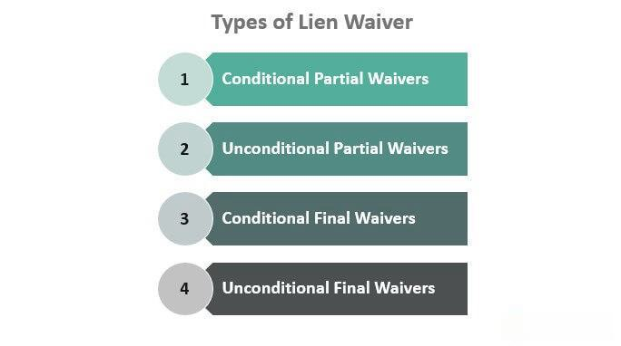

In the dynamic world of construction, ensuring seamless financial transactions is paramount. Lien waivers play a crucial role in safeguarding payments for services rendered. These legal instruments are pivotal in maintaining financial clarity and preventing payment disputes by waiving a contractor or supplier's lien rights on a property once payment is received. This article explores the types of lien waivers used in construction and the legal frameworks that govern them, ensuring that industry professionals are equipped to handle these documents effectively.

Beyond traditional construction practices, the principles underlying lien waivers find resonance in the emerging field of algorithmic trading. Similar to construction, where clear financial transactions are vital, algorithmic trading relies heavily on contracts and conditions to execute transactions efficiently and minimize financial risk. By understanding the similarities between lien waiver processes and algorithmic trading methodologies, professionals can ensure robust stakeholder relations and smoother execution of projects across fields.



This article serves as a comprehensive guide for industry professionals navigating the intricacies of lien waivers and algorithmic trading. It emphasizes the importance of understanding these key elements to foster trust and integrity in financial transactions, thereby preventing disputes and promoting successful project completion.

## Table of Contents

## Understanding Lien Waivers in Construction

Lien waivers are pivotal legal instruments in the construction industry, serving to waive a contractor's or supplier's right to file a lien on a property in exchange for payment received. This practice is essential in preserving financial clarity and protecting property owners from potential claims for unpaid work or materials. By providing reassurance that the contractor or supplier will not pursue further claims once payment is received, lien waivers facilitate smoother transactions and enhance trust among project participants.

There are four primary types of lien waivers utilized in construction, each designed to serve specific functions and levels of legal protection:

1. **Unconditional Waiver and Release Upon Progress Payment**: This waiver is utilized when a contractor or supplier receives an interim, or progress, payment. By signing this waiver, they immediately relinquish any lien rights for the amount specified, regardless of whether the payment has been fully processed. This type of waiver provides property owners with immediate assurance that all claims related to the specified payment period are settled.

2. **Conditional Waiver and Release Upon Progress Payment**: Unlike its unconditional counterpart, this waiver only becomes effective once the specified progress payment is actually received. It ensures that the contractor or supplier retains their lien rights until they have confirmed payment, offering a safeguard in situations where payment processing may be delayed or uncertain.

3. **Unconditional Waiver and Release Upon Final Payment**: This waiver comes into effect upon receipt of the final payment for a construction project. By signing, the contractor or supplier waives lien rights to the property immediately for the total project amount. It provides a clear closure to financial obligations from the property owner's perspective, effectively sealing the deal.

4. **Conditional Waiver and Release Upon Final Payment**: Similar to the conditional progress payment waiver, this version stipulates that the waiver only becomes effective once the full payment is confirmed. This condition protects the contractor or supplier's rights until the final project payment is acknowledged.

Understanding these types of lien waivers is crucial for stakeholders to choose the appropriate form of protection based on the payment status and ensure compliance with the legal standards pertaining to lien rights. Each waiver type serves a specific operational role, offering varying degrees of security and financial transparency, thereby contributing significantly to the robust management and resolution of financial transactions in construction.

## Types of Lien Waivers Explained

### Types of Lien Waivers Explained

Lien waivers serve as essential tools in the construction industry by facilitating secure financial transactions and minimizing the risk of disputes regarding payment. There are four primary types of lien waivers, each designed to address specific stages of payment within a construction project: 

1. **Unconditional Waiver and Release Upon Progress Payment**: This type of waiver is executed to immediately relinquish the claimant's lien rights for a progress payment upon signing. It is crucial for the signing party to verify receipt of payment before executing this waiver because it becomes effective immediately, regardless of whether the payment has been received or not. This waiver provides property owners and contractors with assurance that no liens will be claimed for the specified payment amount, thus ensuring project continuity without financial encumbrances.

2. **Conditional Waiver and Release Upon Progress Payment**: Unlike its unconditional counterpart, this waiver becomes effective only after the payment is received and cleared. It offers a safety mechanism for the claimant by ensuring that lien rights are only waived once the corresponding payment is confirmed. This protects the claimant from potential non-receipt of funds while still giving assurance to the paying party that lien rights will be released once payment conditions are met.

3. **Unconditional Waiver and Release Upon Final Payment**: This is used when the final payment for a project segment or the whole project is completed, immediately waiving any lien rights. The enforceability of this waiver does not depend on whether the payment check has cleared, placing the risk on the party relinquishing their lien rights. It's imperative for parties to confirm receipt and clearance of the final payment before executing this waiver to avoid relinquishing their lien rights without actual payment receipt.

4. **Conditional Waiver and Release Upon Final Payment**: This waiver type safeguards the claimant until the final payment's receipt and clearance are confirmed. It provides a conditional waiver of lien rights contingent on the final payment being processed and accepted, thus protecting contractors and suppliers against the risk of non-payment while ensuring that lien rights are released upon payment completion.

Choosing the correct lien waiver is integral to managing financial risk in construction projects. Each waiver type functions to protect different interests depending on the payment stage, thereby requiring stakeholders to carefully assess the appropriate waiver document based on the progress and completion of payment transactions. This differentiation in waiver types allows for tailored protection against financial disputes, ensuring that all parties retain their rights until payments are conclusively made. Understanding these distinctions aids industry professionals in effectively managing their financial and legal interests throughout the project lifecycle.

## Legal Implications of Lien Waivers

The legal implications of lien waivers are notably influenced by varying jurisdictional laws, which necessitate a thorough understanding of state-specific regulations for effective management. In essence, lien waivers serve as a legal acknowledgment by contractors or suppliers that they have received payment and waive their right to file a lien against the property. However, the legal validity and requirements for these waivers can differ significantly from one jurisdiction to another, impacting their enforceability and the protection they offer to involved parties.

Unconditional waivers are arguably the most straightforward but risky type. Upon signing an unconditional waiver, the signer immediately relinquishes their lien rights, irrespective of whether payment has been received. This immediate effect underscores the importance of confirming payment before executing such waivers. The absence of a prerequisite payment verification means that the signing party undertakes the risk of non-payment, making these waivers potentially perilous if misused.

Conversely, conditional waivers provide an added layer of security as they maintain lien rights until the payment is verified. This stipulation acts as a safety net, ensuring that the rights to claim a lien are only relinquished once there is confirmation of the transaction. Conditional waivers reduce the risk of non-payment disputes, making them a preferable option in uncertain financial transactions or when dealing with unfamiliar parties.

However, mismanagement of lien waivers can result in significant disputes or even render waivers invalid. Incorrect execution, misunderstanding the terms, or failing to adhere to specific jurisdictional requirements can complicate matters, leading to potential financial and legal repercussions. Therefore, possessing a high degree of legal acumen is essential when handling lien waivers to ensure they are appropriately executed and their intended legal protections are upheld.

## Application of Lien Waivers in Construction

Lien waivers are an integral component of the construction payment process, acting as safeguards for both property owners and contractors. These documents serve to document and confirm that payments have been received by contractors or suppliers for services rendered or materials provided. Their function is critical in protecting property owners from future claims of non-payment by ensuring that all stakeholders involved in a construction project have been compensated appropriately.

For property owners, lien waivers provide a layer of financial protection. Once a lien waiver is signed, it effectively extinguishes the signatory's option to place a lien on the property for the amount specified, thereby preventing future payment disputes. This is crucial as it ensures that the property remains free of encumbrances that could potentially affect its marketability or refinance prospects.

Subcontractors, who are often more vulnerable to delayed payments due to being further down the payment chain, benefit substantially from adhering to lien waiver protocols. These protocols establish a formalized process for documenting payment receptions, significantly mitigating the risk of payment disputes. By routinely exchanging lien waivers, subcontractors can ensure that their financial claims are recognized and that their rights remain protected until full payment is confirmed.

To optimize the use of lien waivers, it is advisable to exercise several best practices. A primary recommendation is to verify payment before signing an unconditional waiver. Once this type of waiver is signed, the signer relinquishes their right to claim a lien, regardless of subsequent payment issues. Therefore, ensuring that payment has been successfully processed and received is essential in safeguarding one's financial interests.

Additionally, maintaining meticulous records of all lien waiver exchanges and payment proofs is vital. These records act as a comprehensive audit trail that can support any future claims or disputes that arise. Employing precise documentation practices helps in clarifying the terms under which waivers are signed and prevents misinterpretations that could lead to legal complications.

Overall, by incorporating these practices, stakeholders can foster a transparent and efficient payment process within construction projects, ultimately promoting a project environment where trust and accountability are prioritized.

## Algorithmic Trading: Drawing Parallels

Algorithmic trading, often referred to as algo trading, leverages computer algorithms to automate the execution of financial transactions. This automation offers precision and speed, creating clear contractual agreements much like those seen in construction lien waivers. Both fields emphasize the importance of clear-cut transactions to guarantee smooth financial operations and avoid disputes.

In [algorithmic trading](/wiki/algorithmic-trading), conditional operations resemble the mechanisms of conditional lien waivers. These algorithms are designed to execute trades only when specific criteria are met. For example, an algorithm might be set to buy a stock only if its price falls below a certain value or if a particular market index rises by a predefined percentage. This is parallel to a Conditional Waiver and Release Upon Progress Payment, which becomes effective only upon receipt of payment. The condition precedents have to be fulfilled before any action is executed, ensuring legal compliance and financial security.

Transactional reliability is essential in both algo trading and the management of lien waivers. In trading, algorithms are checked and tested for their robustness and ability to handle varying market conditions, to mitigate risks of significant financial loss. This reliability is also paramount in the management of lien waivers, where careful documentation and verification processes are required to avoid disputes or enforcement issues. 

For example, in Python, one might simulate a basic algorithmic trading strategy with conditions using a script such as the following:

```python
def simple_moving_average(prices, window):
    return [sum(prices[i:i+window])/window for i in range(len(prices) - window + 1)]

def trading_strategy(prices, sma_short, sma_long):
    if sma_short[-1] > sma_long[-1]:
        return "Buy"
    elif sma_short[-1] < sma_long[-1]:
        return "Sell"
    else:
        return "Hold"

# Historical price data
prices = [120, 121, 119, 116, 118, 122, 121]

# Calculate short-term and long-term moving averages
sma_short = simple_moving_average(prices, 3)
sma_long = simple_moving_average(prices, 5)

# Determine trade action
action = trading_strategy(prices, sma_short, sma_long)
print(action)
```

This script uses simple moving averages to decide whether to buy, sell, or hold a position in the market based on predefined conditions. Similarly, in construction, one must ensure all financial obligations are met before waiving rights, to protect both property owners and contractors. By mastering conditional execution, both fields mitigate financial risks and ensure secure transactions.

## Best Practices for Managing Lien Waivers

Effective management of lien waivers is essential for ensuring financial stability and legal compliance in construction projects. One of the foundational practices is the verification of payments before signing any unconditional waivers. This precautionary step protects a contractor or supplier's financial interests by confirming that payment has indeed been received before relinquishing lien rights. Avoiding premature signing prevents scenarios where payments are delayed or disputed, leaving the signing party without recourse.

Documentation accuracy is another cornerstone of lien waiver management. Detailed records of waiver exchanges, including dates, amounts, and relevant contract terms, are crucial for preventing misinterpretation and misunderstandings. Comprehensive documentation serves as a reliable point of reference if any discrepancies or disputes arise, ensuring that all parties have a clear understanding of their responsibilities and agreements.

Education and training for staff involved in processing lien waivers cannot be overstated. Providing employees with thorough knowledge of waiver types and the legal consequences associated with each can significantly reduce errors and non-compliance issues. Training sessions should emphasize the importance of verifying conditions before signing and highlight the legal obligations and risks associated with waiver mismanagement.

Incorporating digital systems can significantly streamline the management of lien waivers, enhancing both accuracy and efficiency. Digital platforms allow for automated tracking of waiver status, secure storage of documentation, and easy access for all stakeholders involved. By utilizing technology solutions, companies can reduce human error, expedite processing times, and ensure that all actions taken are documented and traceable.

Implementing these best practices offers a robust framework for managing lien waivers effectively, safeguarding financial interests, and fostering a culture of compliance and transparency within construction projects.

## Conclusion

Lien waivers play a vital role in ensuring the integrity and continuity of financial transactions in the construction industry. By understanding the different types of lien waivers and their legal implications, contractors, suppliers, and property owners can protect themselves from unpaid claims and foster trust among all parties involved. These waivers act as a safeguard, preventing disputes before they arise and ensuring that all stakeholders receive their due payments in a timely manner.

Similarly, the principles found in algorithmic trading, such as clear communication and conditional transactions, offer insights into how financial risk can be mitigated in various fields. In trading, the use of algorithms to execute trades only when specific conditions are met mirrors the use of conditional waivers in construction. Such mechanisms help prevent financial losses by ensuring that actions are contingent upon the fulfillment of pre-defined criteria, thus maintaining transactional reliability.

By mastering the intricacies of both construction lien waivers and algorithmic trading principles, professionals in these fields can ensure the success of their projects or trades. Such expertise minimizes the risk of disputes and financial setbacks, leading to smoother operations and stronger stakeholder relationships. In this way, understanding and applying these important concepts facilitates successful, dispute-free project deliverables and financial transactions.

## References & Further Reading

[1]: "Lien Waivers in Construction" by the American Bar Association. Retrieved from [American Bar Association](https://www.americanbar.org/groups/construction_industry/publications/construction-lawyer/).

[2]: Haseeb, N. (Year Unspecified). "Types of Lien Waivers." Retrieved from [LienItNow](https://getbuilt.com/lien-waivers/).

[3]: "Understanding Lien Waivers" by Levelset. Retrieved from [Levelset website](https://academy.levelset.com/courses/lien-waiver-fundamentals/).

[4]: "Construction Law and Risk Management: Lien Waivers" by B. Sweeney. Retrieved from [Sweeney's Law Blog](https://www.duffysweeney.com/practice-areas/construction-law/).

[5]: Hull, J. C. (2006). "Options, Futures, and Other Derivatives" (6th Edition). Upper Saddle River: Prentice Hall.

[6]: Chan, E. P. (2009). ["Quantitative Trading: How to Build Your Own Algorithmic Trading Business"](https://github.com/ftvision/quant_trading_echan_book). Hoboken: John Wiley & Sons.

[7]: Jansen, S. (2020). ["Machine Learning for Algorithmic Trading"](https://github.com/stefan-jansen/machine-learning-for-trading). Packt Publishing.

[8]: López de Prado, M. (2018). ["Advances in Financial Machine Learning"](https://www.amazon.com/Advances-Financial-Machine-Learning-Marcos/dp/1119482089). Wiley.

[9]: Aronson, D. R. (2006). ["Evidence-Based Technical Analysis: Applying the Scientific Method and Statistical Inference to Trading Signals"](https://www.amazon.com/Evidence-Based-Technical-Analysis-Scientific-Statistical/dp/0470008741). Wiley.