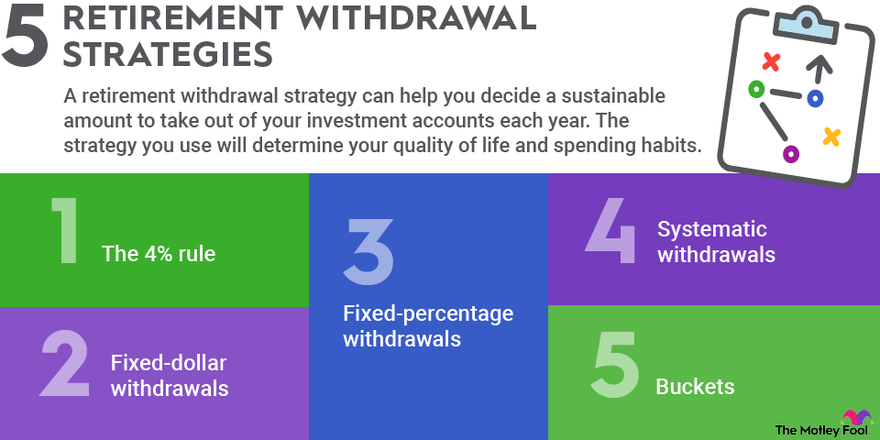

## Table of Contents

## What is a Life Income Fund (LIF)?

A Life Income Fund (LIF) is a type of retirement account in Canada that people use to manage the money they have saved in their pension plans. When someone retires, they can move their pension money into a LIF. This helps them take out money each year to live on, but it also makes sure the money lasts for their whole life. The government sets rules about how much money you can take out each year, so you don't spend it all too quickly.

The main benefit of a LIF is that it gives you control over your retirement savings. You can choose how to invest the money inside the LIF, and you can decide how much to take out each year, as long as you stay within the government's rules. This flexibility can help you plan your retirement better. However, you need to be careful not to take out too much money too soon, or you might run out of money later in life.

## How does a Life Income Fund differ from a Registered Retirement Income Fund (RRIF)?

A Life Income Fund (LIF) and a Registered Retirement Income Fund (RRIF) are both used to manage retirement savings in Canada, but they have some key differences. A LIF is specifically designed for people who have money from a pension plan that they want to manage themselves. The main difference is that a LIF has rules set by the government about how much money you can take out each year. These rules make sure you don't spend all your money too quickly. On the other hand, a RRIF gives you more freedom to decide how much money to take out each year, as long as you take out a minimum amount set by the government.

Another difference is where the money comes from. Money in a LIF usually comes from a locked-in retirement account (LIRA), which is money from a pension plan that you can't access until you retire. In contrast, money in a RRIF can come from a Registered Retirement Savings Plan (RRSP), which is a type of savings account that you can contribute to while you're working. Both LIFs and RRIFs let you invest your money and take out income during retirement, but the rules about withdrawals and the source of the funds are different.

## What are the basic requirements to set up a LIF?

To set up a Life Income Fund (LIF), you need to have money from a pension plan. This money is usually in a locked-in retirement account (LIRA). When you retire, you can move the money from your LIRA into a LIF. You can't just put any money into a LIF; it has to be pension money that's been locked in.

Once you have the right kind of money, you need to find a financial institution that offers LIFs. This could be a bank, a credit union, or an investment company. They will help you set up the LIF and explain the rules about how much money you can take out each year. The government sets these rules to make sure your money lasts throughout your retirement.

## How do you calculate the minimum withdrawal from a LIF?

The minimum withdrawal from a Life Income Fund (LIF) is calculated using a formula set by the government. It's similar to the formula used for a Registered Retirement Income Fund (RRIF). The minimum amount you have to take out each year depends on your age and the total value of your LIF at the start of the year. The government gives you a percentage that you multiply by the value of your LIF to find the minimum withdrawal amount. For example, if you're 71 years old, the percentage is about 5.4%, so if your LIF is worth $100,000, you would have to take out at least $5,400 that year.

There's also a maximum amount you can take out from a LIF each year, but the minimum is what we're focusing on here. The minimum withdrawal percentage increases as you get older, which means you'll have to take out more money each year. This is to make sure you use up your retirement savings over time. If you don't take out at least the minimum amount each year, you could face penalties from the government. So, it's important to know your minimum withdrawal and plan your retirement income accordingly.

## What is the maximum withdrawal limit for a LIF?

The maximum withdrawal limit for a Life Income Fund (LIF) is set by the government to make sure you don't spend all your retirement money too quickly. Each year, there's a certain amount you can take out, and it depends on your age and how much money is in your LIF. The government uses a special formula to figure out this maximum amount. For example, if you're younger, the maximum you can take out might be less than if you're older.

The idea behind the maximum limit is to help your money last longer. If you take out too much money too soon, you might run out of money later in life when you still need it. So, the government sets these rules to protect you and make sure you have enough money throughout your retirement. If you want to know the exact maximum amount you can take out, you should talk to your financial institution or a financial advisor who can help you with the calculations.

## Can you explain the withdrawal process for a LIF?

When you want to take money out of your Life Income Fund (LIF), you need to follow certain rules set by the government. Each year, you have to take out at least a minimum amount of money. This amount is calculated based on your age and the total value of your LIF at the start of the year. You can't take out less than this minimum, or you might have to pay a penalty. On the other hand, there's also a maximum amount you can take out each year, which is also based on your age and the value of your LIF. This maximum amount is there to make sure you don't spend all your money too quickly.

To actually take the money out, you need to contact the financial institution where your LIF is held. They will help you figure out how much you can take out and process your withdrawal. You can usually choose to take out the money in regular payments, like monthly or yearly, or you can take it all out at once if it's within the allowed limits. It's important to plan your withdrawals carefully so your money lasts throughout your retirement. If you're not sure about how much to take out or how to do it, talking to a financial advisor can be really helpful.

## What happens if you withdraw more than the maximum allowed from a LIF?

If you take out more money from your Life Income Fund (LIF) than the government allows, you could get in trouble. The rules are there to make sure your money lasts a long time. If you break these rules, you might have to pay a big fine or penalty. This can be a lot of money, and it can make your retirement savings smaller.

It's really important to follow the rules about how much you can take out of your LIF each year. If you're not sure how much you can take, you should talk to the people at your bank or a financial advisor. They can help you figure out the right amount and make sure you don't take out too much. This way, you can avoid any penalties and make sure your money lasts as long as you need it.

## How does the age of the LIF owner affect withdrawal rules?

The age of the LIF owner is really important when it comes to deciding how much money you can take out each year. When you're younger, the government says you can only take out a smaller amount of money from your LIF. This is to make sure you don't use up all your savings too quickly. As you get older, the rules change, and you're allowed to take out more money each year. The government wants to make sure you can use your savings while you're still around to enjoy them.

The minimum amount you have to take out each year goes up as you get older. For example, if you're 71, you might have to take out about 5.4% of your LIF's value. But if you're 90, that number could be closer to 11%. The maximum amount you can take out also changes with your age, but it's always less than what you could take from a RRIF. So, your age affects both the minimum and maximum amounts you can withdraw, helping you plan your retirement income carefully.

## What are the tax implications of withdrawals from a LIF?

When you take money out of your Life Income Fund (LIF), you have to pay taxes on it. The money in your LIF is considered income, so when you withdraw it, the government treats it like you earned that money that year. This means you'll have to add the amount you took out to your total income for the year, and then you'll pay taxes based on your tax rate. The more money you take out, the more taxes you might have to pay.

It's important to plan your withdrawals carefully to manage your taxes. If you take out a lot of money in one year, it could push you into a higher tax bracket, which means you'll pay more in taxes. On the other hand, if you spread out your withdrawals over several years, you might stay in a lower tax bracket and pay less in taxes overall. Talking to a tax advisor or financial planner can help you figure out the best way to take money out of your LIF without paying too much in taxes.

## How can one manage their LIF to ensure it lasts throughout retirement?

To make sure your Life Income Fund (LIF) lasts throughout your retirement, it's important to plan carefully. You need to think about how much money you'll need each year and how long your retirement might last. The government sets rules about how much you can take out each year, so you should stick to these rules to avoid penalties and make your money last longer. It's a good idea to take out the minimum amount each year if you don't need more, especially when you're younger. This way, your LIF can grow over time, and you'll have more money when you're older.

Another important thing is to invest the money in your LIF wisely. You can choose different investments inside your LIF, like stocks, bonds, or mutual funds. Talking to a financial advisor can help you pick the right investments that match how much risk you're willing to take and how long you want your money to last. By balancing your withdrawals and investments, you can make sure your LIF provides you with income throughout your retirement without running out too soon.

## What are the investment options available within a LIF?

Inside a Life Income Fund (LIF), you have different choices for where to put your money. You can invest in things like stocks, which are shares in companies, or bonds, which are loans to governments or companies. There are also mutual funds, which are a mix of stocks and bonds managed by professionals. Each of these options has its own level of risk and potential for growth. Stocks can grow a lot but can also lose value quickly, while bonds are usually safer but don't grow as much. Mutual funds can give you a balance between risk and growth.

Choosing the right investments for your LIF depends on how much risk you're okay with and how long you want your money to last. If you're younger and have a long time until you need all your money, you might want to invest more in stocks for growth. But if you're older and want to keep your money safe, you might choose more bonds. Talking to a financial advisor can help you pick the best mix of investments for your LIF. They can look at your whole financial situation and help you make a plan that fits your needs.

## How do changes in legislation affect LIF withdrawal rules and strategies?

Changes in the law can really change how you take money out of your Life Income Fund (LIF) and how you plan for your retirement. If the government makes new rules, it might change the minimum or maximum amounts you can take out each year. For example, if they raise the minimum amount, you'll have to take out more money every year, which could mean paying more taxes or using up your savings faster. On the other hand, if they lower the maximum amount, you won't be able to take out as much money as before, which might make you rethink your retirement plans.

Because of these changes, it's important to keep up with any new laws that come out. If the rules change, you might need to adjust your withdrawal strategy. Maybe you'll need to take out less money each year to make your LIF last longer, or maybe you'll need to invest your money differently to get the best growth. Talking to a financial advisor can help you understand these changes and figure out the best way to manage your LIF so it lasts throughout your retirement.

## What are Life Income Funds (LIFs) and how do they work?

A Life Income Fund (LIF) is a specialized Canadian financial instrument designed to convert locked-in pension funds into a retirement income stream. Locked-in pension funds typically originate from employer-sponsored pension plans and are transferred to a LIF to ensure long-term retirement income. The primary goal of a LIF is to provide retirees with a stable annual income while adhering to specific regulations that control withdrawal limits.

The key feature of a LIF is its structured withdrawal rules that offer a balance between providing continuous income and preserving funds for as long as possible. The Canadian government, in conjunction with provincial authorities, sets rules regarding the minimum and maximum withdrawal amounts. These controls are intended to prevent premature depletion of retirement funds and ensure a consistent flow of income throughout an individual's retirement years.

The withdrawal limits are recalibrated each year based on factors such as the retiree's age, the account balance at the beginning of the year, and the applicable government-determined percentages. For instance, the minimum withdrawal is calculated using a percentage that increases with age, which can be defined by:

$$
\text{Minimum Withdrawal} = \text{Account Balance} \times \text{Minimum Percentage Factor}
$$

Conversely, the maximum withdrawal [factor](/wiki/factor-investing) ensures that the strategy aligns with the individual's long-term financial goals and legal requirements. It's important to remember that these withdrawal limits are designed to provide flexibility while helping retirees manage their financial resources responsibly.

LIFs are an essential component of retirement planning in Canada, offering retirees a structured means of accessing their pension savings over time. By understanding the rules governing LIFs, retirees can make informed decisions about their financial futures, ensuring that their retirement needs are sustainably met.

## How do LIF withdrawals work?

Life Income Fund (LIF) withdrawals adhere to specific rules governed by both Canadian federal and provincial regulations. These rules are designed to ensure that retirees receive a stable income over their lifetime, rather than a one-time lump sum. Understanding these regulations is crucial for optimizing retirement income and managing tax implications effectively.

### Regulations and Withdrawal Limits

LIFs are subject to minimum and maximum withdrawal limits set annually. These limits are intended to provide consistent income throughout retirement while protecting the longevity of the fund. The minimum withdrawal amount is determined by the Canadian Income Tax Act, similar to Registered Retirement Income Fund (RRIF) regulations, and is calculated based on the account holder’s age and the value of the fund at the beginning of the year.

The maximum withdrawal limit is specified in the LIF regulations and can vary by province. It is also based on a percentage of the LIF’s balance at the beginning of the year. For instance, Ontario regulations follow a formula where the maximum annual withdrawal is calculated to provide lifetime benefits.

### No Lump Sum Withdrawals

A critical stipulation of LIFs is the prohibition of full lump sum withdrawals. This ensures that the funds provide a steady stream of income during retirement years. Instead, withdrawals must be made regularly, often annually or monthly, allowing for long-term financial planning and stability.

### Tax Implications

Withdrawals from a LIF are considered taxable income in the year they are taken. This necessitates careful planning to minimize tax liabilities. By understanding the withdrawal rules and calculating potential tax impacts, retirees can better manage their cash flow and avoid higher tax brackets.

### Example Calculation

To illustrate, suppose a retiree is 70 years old with a LIF balance of $200,000 at the beginning of the year. Assuming the minimum withdrawal percentage for a 70-year-old is 5%, the minimum withdrawal for that year would be:

$$
\text{Minimum Withdrawal} = 200,000 \times 0.05 = 10,000
$$

If the provincial guidelines set a maximum withdrawal percentage of 6.5% for that age, the maximum withdrawal would be:

$$
\text{Maximum Withdrawal} = 200,000 \times 0.065 = 13,000
$$

The retiree must withdraw at least $10,000 but no more than $13,000 from their LIF that year. Understanding these calculations aids retirees in making informed decisions about their disbursement strategies.

### Strategic Planning

Strategically planning withdrawals can help extend the life of the fund while maintaining an adequate income. Retirees should consider factors such as life expectancy, investment performance, and other income sources during their planning process. Employing financial advisors or utilizing algorithmic tools can enhance decision-making processes to optimize both income and tax implications.

## What is the role of algorithmic trading in managing LIF investments?

Algorithmic trading is increasingly recognized for its potential to enhance the management of investments within a Life Income Fund (LIF). By utilizing complex algorithms and high-frequency trading systems, investors can navigate the intricacies of market dynamics more effectively. This method leverages computer programs that follow a defined set of rules for executing trades, thereby optimizing returns within the regulatory framework of a LIF.

Algorithmic trading allows for making data-driven, automated decisions that are less susceptible to emotional biases. These algorithms analyze multiple market variables, including historical and real-time data, to identify profitable trading opportunities. For example, a Mean Reversion strategy might look for stocks that deviate from their historical averages, anticipating that they will revert back. Consider the formula used in a simple mean reversion strategy:

$$
\text{Signal} = \frac{\text{Current Price} - \text{Moving Average}}{\text{Standard Deviation}}
$$

When the Signal exceeds a certain threshold, it triggers a buy or sell decision, which is executed automatically, ensuring that the LIF investment strategy remains consistent and efficient.

Moreover, [algorithmic trading](/wiki/algorithmic-trading) can help manage risk by setting stop-loss and take-profit levels mechanically, thereby protecting the principal amount in the fund. For instance, a strategy might implement a Trailing Stop mechanism to safeguard gains. This can be crucial for LIFs, where preserving capital is as important as achieving returns due to withdrawal constraints.

Python, often favored for implementing algorithmic trading strategies due to its robust libraries like Pandas for data manipulation and NumPy for numerical calculations, allows investors to back-test their strategies. This ensures they perform well before being applied to actual LIF investments. Here is a basic Python snippet demonstrating a mean reversion strategy:

```python
import numpy as np
import pandas as pd

# Sample data creation
data = pd.DataFrame({'closing_prices': [100, 102, 101, 105, 98, 110, 108, 105]})
data['moving_average'] = data['closing_prices'].rolling(window=3).mean()
data['std_dev'] = data['closing_prices'].rolling(window=3).std()

# Mean Reversion Signal
data['signal'] = (data['closing_prices'] - data['moving_average']) / data['std_dev']

# Example logic to act on the signal
data['trade_signal'] = np.where(data['signal'] > 1, 'Sell', np.where(data['signal'] < -1, 'Buy', 'Hold'))

print(data[['closing_prices', 'signal', 'trade_signal']])
```

In summary, algorithmic trading systems offer a framework for systematically exploiting market inefficiencies. By automating trading decisions, these systems can potentially enhance the performance of investments held in LIFs. While the approach is not without risks, notably from model errors and market conditions not anticipated by the algorithms, it supports the strategic objective of maximizing returns within the confines of regulatory requirements.

## What are the investment options within a Life Income Fund?

Life Income Funds (LIFs) in Canada offer a range of investment options that can cater to different risk profiles and investment strategies. The primary investment vehicles suitable for LIFs include cash, mutual funds, exchange-traded funds (ETFs), and bonds. These options provide flexibility in how the funds are managed and allow for diversified investment approaches.

### Cash
Cash or cash-equivalent investments within a LIF provide stability and [liquidity](/wiki/liquidity-risk-premium). Although the returns on cash investments are generally lower than other asset classes, they are secure and easily accessible, which is crucial for managing short-term needs and maintaining liquidity.

### Mutual Funds
Mutual funds are popular in LIFs due to their diversified nature. They pool money from multiple investors to purchase a variety of securities, which can include stocks, bonds, or other assets. The diversification offered by mutual funds can reduce risk and enhance potential returns, especially when they are actively managed to adjust for market conditions.

### ETFs (Exchange-Traded Funds)
ETFs within a LIF present an efficient way to invest in a broad market index or sector. Like mutual funds, ETFs offer diversification but often come with lower fees because they are typically passively managed. They trade like regular stocks, allowing for real-time valuation and liquidity.

### Bonds
Bonds provide a fixed income component within a LIF portfolio. They tend to offer greater stability than equities and can be a source of steady income. Depending on the type and duration of bonds—such as government or corporate bonds—they can have different risk and return profiles.

### Tax-Deferred Growth
One of the significant advantages of investing within a LIF is the tax-deferred growth of investments. Contributions to the fund and reinvested earnings grow on a tax-deferred basis, meaning that taxes on gains and income are only paid upon withdrawal. This allows the investments to compound more efficiently over time.

The formula for compound interest, which is applicable for understanding the growth potential within a LIF, is:

$$
A = P \left(1 + \frac{r}{n}\right)^{nt}
$$

Where:
- $A$ is the amount of money accumulated after n years, including interest.
- $P$ is the principal amount (initial investment).
- $r$ is the annual interest rate (in decimal).
- $n$ is the number of times that interest is compounded per year.
- $t$ is the time the money is invested for in years.

### Example in Python
Below is a basic example of how one might use Python to calculate the future value of an investment within a LIF using compound interest:

```python
def compound_interest(principal, rate, times_compounded, years):
    amount = principal * (1 + rate/times_compounded)**(times_compounded*years)
    return amount

# Example usage
principal = 10000  # Initial investment
rate = 0.05        # Annual interest rate of 5%
times_compounded = 1  # Compounded annually
years = 20         # Duration of investment in years

future_value = compound_interest(principal, rate, times_compounded, years)
print(f"The future value of the investment is: ${future_value:.2f}")
```

This diversity in investment options, coupled with the tax-deferred growth advantages, positions LIFs as a robust vehicle for retirement planning, allowing for sustained financial growth until funds are withdrawn.

## References & Further Reading

[1]: Lopez de Prado, M. (2018). ["Advances in Financial Machine Learning."](https://www.amazon.com/Advances-Financial-Machine-Learning-Marcos/dp/1119482089) Wiley.

[2]: Chan, E. P. (2008). ["Quantitative Trading: How to Build Your Own Algorithmic Trading Business."](https://github.com/ftvision/quant_trading_echan_book) Wiley.

[3]: Jansen, S. (2020). ["Machine Learning for Algorithmic Trading."](https://github.com/stefan-jansen/machine-learning-for-trading) Packt Publishing.

[4]: Aronson, D. R. (2006). ["Evidence-Based Technical Analysis: Applying the Scientific Method and Statistical Inference to Trading Signals."](https://www.amazon.com/Evidence-Based-Technical-Analysis-Scientific-Statistical/dp/0470008741) Wiley.

[5]: Bergstra, J., Bardenet, R., Bengio, Y., & Kégl, B. (2011). ["Algorithms for Hyper-Parameter Optimization."](https://dl.acm.org/doi/10.5555/2986459.2986743) Advances in Neural Information Processing Systems 24.