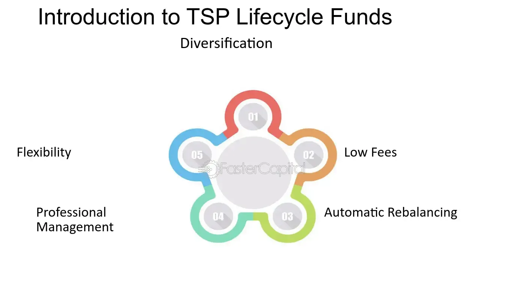

## Table of Contents

## What are lifecycle funds?

Lifecycle funds, also known as target-date funds, are investment options designed to help people save for retirement. They automatically adjust the mix of investments over time, becoming more conservative as the target retirement date approaches. This means that when you're young and far from retirement, the fund might invest more in stocks, which can be riskier but offer higher potential returns. As you get closer to retirement, the fund shifts towards bonds and other safer investments to protect your savings.

These funds are popular because they are easy to use. You pick a fund with a target date close to when you plan to retire, and the fund managers handle the rest. This can be a good choice for people who don't want to manage their investments actively or who are not sure how to balance their portfolio. However, it's important to check the fees associated with these funds, as they can vary and impact your returns over time.

## How do lifecycle funds work?

Lifecycle funds, or target-date funds, are a type of investment that helps people save for retirement. They work by automatically changing the mix of investments over time. When you start, and you're far from retiring, the fund puts more money into stocks. Stocks can go up and down a lot, but they also have a chance to grow more than other investments. As you get closer to the date you want to retire, the fund slowly moves money from stocks to bonds. Bonds are safer and don't change as much in value, so they help protect your savings as you near retirement.

These funds are easy to use because you just pick one based on when you want to retire. For example, if you plan to retire in 2050, you would choose a 2050 target-date fund. The people who manage the fund take care of changing the investments for you. This can be really helpful if you don't know much about investing or if you don't want to spend time managing your money. But, it's a good idea to look at the fees these funds charge, because they can be different and can affect how much money you end up with when you retire.

## What is the purpose of lifecycle funds?

Lifecycle funds are made to help people save for when they stop working. They are easy to use because you just pick a fund that matches the year you want to retire. For example, if you plan to retire in 2040, you would choose a 2040 fund. The people who manage the fund take care of everything else. This is good for people who don't know a lot about investing or who don't want to spend time managing their money.

The main goal of lifecycle funds is to grow your savings when you are young and then keep them safe as you get older. When you first start saving, the fund puts more money into stocks. Stocks can go up and down a lot, but they also have a chance to grow more than other investments. As you get closer to retiring, the fund slowly moves money from stocks to bonds. Bonds are safer and don't change as much in value, so they help protect your savings as you near retirement. This way, the fund does the work of changing your investments for you, making it easier to save for the future.

## Who should invest in lifecycle funds?

Lifecycle funds are a good choice for people who want to save for retirement but don't want to spend a lot of time managing their investments. They are especially helpful for people who are new to investing or who find it hard to pick the right mix of stocks and bonds. All you need to do is choose a fund with a target date that matches when you plan to retire, and the fund will take care of the rest.

These funds are also great for people who want their investments to automatically adjust as they get closer to retirement. When you're young, the fund will invest more in stocks, which can grow a lot but are riskier. As you get older, it will shift to bonds, which are safer and help protect your savings. This makes lifecycle funds a good option for anyone looking for a simple and hands-off way to save for the future.

## What are the different types of lifecycle funds?

Lifecycle funds come in different types, mainly based on when you want to retire. They are often named after the year you plan to stop working, like 2030, 2040, or 2050 funds. Each type has its own mix of stocks and bonds, which changes over time. The closer you get to your retirement year, the more the fund will shift from stocks to bonds to keep your savings safe.

Some lifecycle funds are made by big companies like Vanguard or Fidelity. These funds might have slightly different ways of changing the mix of investments, but they all aim to help you save for retirement without you having to do much work. It's a good idea to look at the fees and the past performance of different funds to find the one that's right for you.

## How are lifecycle funds managed?

Lifecycle funds are managed by professional money managers who work for big companies like Vanguard or Fidelity. These managers decide how to split the money in the fund between stocks and bonds. When you first start saving, they put more money into stocks because stocks can grow a lot over time, even though they can be risky. As you get closer to the year you want to retire, the managers slowly move money from stocks to bonds. Bonds are safer and don't change as much in value, so they help protect your savings as you near retirement.

The managers use a plan called a "glide path" to decide when and how to change the mix of investments. This plan is set up to match the fund's target date, which is the year you plan to retire. The managers keep an eye on the markets and the economy, but they follow the glide path to make sure the fund gets more conservative as time goes on. This way, you don't have to worry about making changes to your investments yourself. The managers do it all for you, making lifecycle funds an easy way to save for the future.

## What are the fees associated with lifecycle funds?

Lifecycle funds come with fees that you need to pay for the management of your investments. These fees are usually taken out of your money in the fund before you see your returns. The main fee you will see is called the expense ratio, which is a percentage of your total investment. This fee covers the costs of running the fund, like paying the managers and other expenses. The expense ratio can be different for each lifecycle fund, but it's usually between 0.05% and 1% of your money each year.

Some lifecycle funds might also have other fees, like sales charges or redemption fees. A sales charge, also called a load, is a fee you might pay when you buy or sell shares of the fund. A redemption fee is a fee you might pay if you take your money out of the fund too soon. These extra fees can make a big difference in how much money you have when you retire, so it's a good idea to look at all the fees before you choose a lifecycle fund.

## How do lifecycle funds adjust their asset allocation over time?

Lifecycle funds change their mix of investments as you get closer to the year you want to retire. When you first start saving, these funds put more money into stocks. Stocks can go up and down a lot, but they also have a chance to grow more than other investments. This is good when you are young and have a long time before you retire because you can handle the ups and downs of the stock market.

As you get closer to your retirement date, the fund slowly moves money from stocks to bonds. Bonds are safer and don't change as much in value, so they help protect your savings as you near retirement. The people who manage the fund follow a plan called a "glide path" to decide when and how to change the mix of investments. This way, the fund gets more conservative over time, making sure your savings are safer as you get ready to stop working.

## Can you provide examples of lifecycle funds?

One example of a lifecycle fund is the Vanguard Target Retirement 2050 Fund (VFIFX). This fund is designed for people who plan to retire around the year 2050. When you start saving with this fund, it puts more of your money into stocks to help it grow. As you get closer to 2050, the fund slowly moves your money from stocks to bonds to keep your savings safe. The managers at Vanguard take care of all these changes for you, so you don't have to do anything.

Another example is the Fidelity Freedom 2040 Fund (FFFFX). This fund is for people who want to retire around the year 2040. Like the Vanguard fund, it starts with more money in stocks when you're young. Over time, as you get closer to 2040, it shifts more of your money into bonds to protect your savings. Fidelity's managers follow a plan to make these changes, so you can focus on other things while they handle your investments.

## What are the risks associated with investing in lifecycle funds?

Investing in lifecycle funds comes with some risks that you should know about. One big risk is that the stock market can go down a lot, and since lifecycle funds put a lot of money into stocks when you're young, you could lose money. Even though the fund managers try to make the fund safer as you get closer to retiring, there's still a chance that the market could drop right before you need your money. This means you might not have as much money as you planned when you retire.

Another risk is the fees you have to pay. Lifecycle funds charge fees for managing your money, and these fees can be different for each fund. If the fees are high, they can take away a lot of your returns over time. It's important to look at the fees before you choose a fund because they can make a big difference in how much money you end up with when you retire.

## How do lifecycle funds compare to other investment options like target-date funds?

Lifecycle funds and target-date funds are actually the same thing. Both are designed to help you save for retirement by automatically changing the mix of investments over time. When you're young and far from retiring, these funds put more money into stocks because stocks can grow a lot, even though they can be risky. As you get closer to your retirement date, the funds slowly move your money from stocks to bonds, which are safer and help protect your savings.

The main difference between lifecycle funds and other investment options is how hands-off they are. With lifecycle funds, you just pick a fund based on when you want to retire, and the managers take care of everything else. This is different from other options like mutual funds or ETFs, where you might need to keep an eye on your investments and make changes yourself. Lifecycle funds are a good choice if you want a simple way to save for the future without having to manage your money actively.

## What advanced strategies can be used to optimize returns from lifecycle funds?

To get the most out of lifecycle funds, you can start by looking at the fees. Lifecycle funds have different fees, and lower fees mean more money stays in your pocket. So, choose funds with low expense ratios. You can also think about adding other investments to your portfolio. Lifecycle funds are good because they change over time, but you might want to mix in some other funds or stocks that you think will do well. This can help you grow your money even more.

Another way to boost your returns is to keep an eye on how the fund is doing compared to others. If you see that your fund isn't doing as well as similar funds, you might want to switch to a better-performing one. Also, think about how much risk you're okay with. Some lifecycle funds are more aggressive and put more money into stocks, while others are more conservative. If you're okay with more risk, [picking](/wiki/asset-class-picking) a more aggressive fund might help your money grow faster. Just remember, it's important to check your investments every now and then to make sure they're still a good fit for your goals.

## What are Lifecycle Funds?

Lifecycle funds, also identified as target-date funds, are investment vehicles designed to simplify retirement investing by automatically adjusting the asset mix in accordance with a predetermined timeline. As the name suggests, these funds target a specific retirement date, and their asset allocation shifts over time to align with the changing risk tolerance and financial needs of the investor.

### Asset Allocation Approach

Initially, lifecycle funds adopt an aggressive investment strategy, favoring higher equity allocations. This approach exploits the potential for capital appreciation in the earlier stages of the investment horizon, where the ability to absorb short-term market [volatility](/wiki/volatility-trading-strategies) is greater. As depicted in Figure 1, a typical lifecycle fund may start with an allocation of 80% equities and 20% bonds.

$$
\text{Initial Allocation} = \begin{cases} 
80\% \text{ Equities} \\
20\% \text{ Fixed Income}
\end{cases}
$$

As the target date approaches, the fund gradually shifts its allocation towards more conservative investments, increasing the proportion in fixed-income securities such as bonds. This reallocation process is vital for risk mitigation as the investor nears retirement, a period where preserving capital typically takes precedence over aggressive growth. By the target date, the allocation may resemble a more balanced or conservative mix.

$$
\text{Final Allocation} = \begin{cases} 
30\% \text{ Equities} \\
70\% \text{ Fixed Income}
\end{cases}
$$

The key mechanism guiding this gradual shift in asset allocation is known as the "glide path." Lifecycle funds typically have a glide path defined from the inception of the fund, which outlines the predetermined schedule of how the fund's asset mix will change over time.

### Advantages and Popularity

One of the primary reasons lifecycle funds are popular with investors planning for retirement is their automated and hands-off nature. By selecting a single target-date fund, investors can benefit from a diversified portfolio that adjusts without requiring ongoing intervention. This makes lifecycle funds particularly appealing to those with limited time, investment expertise, or desire to actively manage their retirement savings.

The adaptability of lifecycle funds to an investor's career and life stage contributes to their widespread adoption. They provide a straightforward solution by maintaining a risk profile that matches the investor's timeline and retirement objectives.

### Case Study: Vanguard Target Retirement Funds

An exemplary model of lifecycle funds is the Vanguard Target Retirement Funds series. Vanguard offers a range of target-date funds that cater to different retirement goals, organized by five-year target intervals (e.g., 2025, 2030, 2035). Each fund follows a specific glide path that gradually adjusts the asset allocation. Vanguard's approach typically begins with a higher exposure to international and domestic equities and evolves toward a higher allocation in bonds as investors near their designated retirement year.

In conclusion, lifecycle funds streamline retirement planning by automatically shifting investment strategies over a defined period. This feature, combined with their built-in diversification and reduced need for maintenance, underscores their role as a favored choice in retirement portfolios, allowing investors to focus on their career and life without the necessity of managing complex investment decisions.

## References & Further Reading

[1]: Bergstra, J., Bardenet, R., Bengio, Y., & Kégl, B. (2011). ["Algorithms for Hyper-Parameter Optimization."](https://dl.acm.org/doi/10.5555/2986459.2986743) Advances in Neural Information Processing Systems 24.

[2]: ["Advances in Financial Machine Learning"](https://www.amazon.com/Advances-Financial-Machine-Learning-Marcos/dp/1119482089) by Marcos Lopez de Prado

[3]: ["Evidence-Based Technical Analysis: Applying the Scientific Method and Statistical Inference to Trading Signals"](https://www.amazon.com/Evidence-Based-Technical-Analysis-Scientific-Statistical/dp/0470008741) by David Aronson

[4]: ["Machine Learning for Algorithmic Trading"](https://github.com/stefan-jansen/machine-learning-for-trading) by Stefan Jansen

[5]: ["Quantitative Trading: How to Build Your Own Algorithmic Trading Business"](https://github.com/LucindaYa/quant-resources/blob/master/Quantitative%20Trading%20How%20to%20Build%20Your%20Own%20Algorithmic%20Trading%20Business.pdf) by Ernest P. Chan