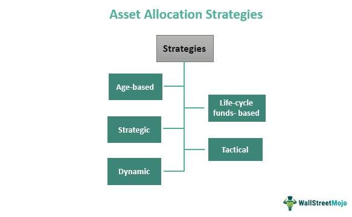

Investing wisely is essential for anyone aiming to achieve long-term financial objectives. With the financial landscape in constant flux, understanding the available investment strategies is paramount for making informed decisions. This article focuses on two distinct yet innovative investment strategies: lifecycle funds and algorithmic trading. These strategies demonstrate different approaches, addressing varied risk appetites and investment timelines.

Lifecycle funds, also known as target-date funds, offer a strategic approach, particularly suited for retirement planning. These funds automatically adjust their asset allocation over time, transitioning from a growth-oriented posture to a more conservative stance as the designated retirement date approaches. This automatic adjustment is designed to align with the changing risk tolerance of investors as they age, offering a hands-off investment solution for those who prefer a gradual reduction in risk exposure.



On the other hand, algorithmic trading represents a more dynamic and active investment strategy. It involves the use of complex computer algorithms to execute trades based on predefined criteria. This approach is gaining popularity due to its ability to process and act upon vast amounts of market data at high speeds, often capitalizing on short-term market opportunities. Algorithmic trading strategies can be tailored to specific financial instruments and are appreciated for their precision and efficiency.

This article seeks to explore the intricacies of these two strategies, assessing their mechanisms, benefits, and potential drawbacks. By understanding lifecycle funds and algorithmic trading, investors can gain insights into how they might be integrated into a robust and diversified investment portfolio. Through analysis and comparison, we aim to provide potential investors with the tools needed to make choices that align with their financial goals and personal risk profiles. Let us begin by exploring how lifecycle funds can be instrumental in retirement planning.

## Table of Contents

## What are Lifecycle Funds?

Lifecycle funds, also identified as target-date funds, are investment vehicles designed to simplify retirement investing by automatically adjusting the asset mix in accordance with a predetermined timeline. As the name suggests, these funds target a specific retirement date, and their asset allocation shifts over time to align with the changing risk tolerance and financial needs of the investor.

### Asset Allocation Approach

Initially, lifecycle funds adopt an aggressive investment strategy, favoring higher equity allocations. This approach exploits the potential for capital appreciation in the earlier stages of the investment horizon, where the ability to absorb short-term market [volatility](/wiki/volatility-trading-strategies) is greater. As depicted in Figure 1, a typical lifecycle fund may start with an allocation of 80% equities and 20% bonds.

$$
\text{Initial Allocation} = \begin{cases} 
80\% \text{ Equities} \\
20\% \text{ Fixed Income}
\end{cases}
$$

As the target date approaches, the fund gradually shifts its allocation towards more conservative investments, increasing the proportion in fixed-income securities such as bonds. This reallocation process is vital for risk mitigation as the investor nears retirement, a period where preserving capital typically takes precedence over aggressive growth. By the target date, the allocation may resemble a more balanced or conservative mix.

$$
\text{Final Allocation} = \begin{cases} 
30\% \text{ Equities} \\
70\% \text{ Fixed Income}
\end{cases}
$$

The key mechanism guiding this gradual shift in asset allocation is known as the "glide path." Lifecycle funds typically have a glide path defined from the inception of the fund, which outlines the predetermined schedule of how the fund's asset mix will change over time.

### Advantages and Popularity

One of the primary reasons lifecycle funds are popular with investors planning for retirement is their automated and hands-off nature. By selecting a single target-date fund, investors can benefit from a diversified portfolio that adjusts without requiring ongoing intervention. This makes lifecycle funds particularly appealing to those with limited time, investment expertise, or desire to actively manage their retirement savings.

The adaptability of lifecycle funds to an investor's career and life stage contributes to their widespread adoption. They provide a straightforward solution by maintaining a risk profile that matches the investor's timeline and retirement objectives.

### Case Study: Vanguard Target Retirement Funds

An exemplary model of lifecycle funds is the Vanguard Target Retirement Funds series. Vanguard offers a range of target-date funds that cater to different retirement goals, organized by five-year target intervals (e.g., 2025, 2030, 2035). Each fund follows a specific glide path that gradually adjusts the asset allocation. Vanguard's approach typically begins with a higher exposure to international and domestic equities and evolves toward a higher allocation in bonds as investors near their designated retirement year.

In conclusion, lifecycle funds streamline retirement planning by automatically shifting investment strategies over a defined period. This feature, combined with their built-in diversification and reduced need for maintenance, underscores their role as a favored choice in retirement portfolios, allowing investors to focus on their career and life without the necessity of managing complex investment decisions.

## How Lifecycle Funds Work

Lifecycle funds, commonly known as target-date funds, employ a systematic investment strategy based on a 'glide path' model. This approach is designed to manage risk and optimize returns by adjusting the asset allocation of the fund as the target retirement date approaches. The glide path determines how aggressively or conservatively a portfolio is positioned over time, beginning with a higher allocation in equities and transitioning to a higher bond allocation as the investor nears retirement.

Initially, lifecycle funds are composed predominantly of equities, often as much as 80% or more. This initial allocation leverages the potential for higher returns associated with stocks, capitalizing on the longer investment horizon available to younger investors. The assumption is that younger investors have a greater capacity to absorb market volatility, given the longer period before they begin withdrawing funds for retirement.

As the investor ages, the glide path dictates a gradual shift towards fixed-income assets such as bonds. This reallocation process typically happens automatically within the fund and is structured to decrease risk in alignment with the investor's decreasing risk tolerance. For instance, a typical lifecycle fund might transition from an 80% stock allocation at the outset to a more conservative 40% stock allocation by the time the target retirement date is reached. The remaining 60% would then be composed of more stable investments like bonds. This shift helps protect the accumulated capital from market downturns as withdrawal needs approach.

The convenience of lifecycle funds stems from their passive management and automatic rebalancing feature. Investors need not make active decisions regarding asset allocation or worry about market timing; instead, they benefit from a hands-off investment approach that continuously aligns with their evolving financial goals. This makes lifecycle funds particularly appealing for investors seeking simplicity and a predefined risk management strategy over the [course](/wiki/best-algorithmic-trading-courses) of their investing lives. 

The glide path is pivotal in determining the ultimate effectiveness of a lifecycle fund. It must be carefully designed to balance the trade-offs between growth potential and risk exposure, accounting for factors such as economic conditions, life expectancy, and changing income needs over time. Through this well-orchestrated mechanism, lifecycle funds facilitate a structured and disciplined approach to retirement planning.

## Benefits and Drawbacks of Lifecycle Funds

Lifecycle funds, commonly known as target-date funds, are designed to simplify the investment process by automatically adjusting the asset allocation according to a predefined timeline. This passive investment method offers numerous benefits while also posing certain drawbacks that investors must consider prior to trusting their retirement or long-term savings to these financial vehicles.

One of the primary benefits of lifecycle funds is their simplicity. Investors are relieved from the stress of continually modifying their portfolios to match their risk tolerance as they age, as these funds automatically rebalance their asset mix. Typically, lifecycle funds start with a higher allocation in stocks, which are riskier but have the potential for higher returns, and shift towards bonds and other fixed-income securities as the target date approaches. This gradual adjustment, known as the "glide path," aligns with the decreasing risk tolerance expected as investors near retirement, offering peace of mind to those preferring a more hands-off investment strategy.

Further, lifecycle funds provide diversification. They usually contain a mix of asset classes, including domestic and international equities, bonds, and sometimes real estate investment trusts (REITs). This diversification helps to spread risk and potentially enhances returns, as different asset classes tend to perform differently under various economic conditions.

Despite these benefits, lifecycle funds have certain limitations. A significant criticism is their tendency to oversimplify investment management. The one-size-fits-all approach might not suit the personal investment goals, risk tolerance, or financial situations of individual investors. For instance, two investors targeting the same retirement year might have very different financial circumstances, yet a lifecycle fund would offer them the same asset allocation strategy.

Moreover, lifecycle funds may not adequately adjust to significant market changes. The automatic rebalancing does not account for economic or market condition shifts that might necessitate a more aggressive or conservative approach at various times. This rigidity can prevent investors from optimizing their returns based on broad market opportunities or risks.

Cost is another aspect to consider. Although lifecycle funds offer convenience, they might come with higher expense ratios than simply maintaining a static diversified portfolio, especially when considering fees layered on top of the underlying funds within the lifecycle fund. These costs can accumulate over time, impacting the net growth of an investor's capital.

In conclusion, while lifecycle funds offer a simplified, diversified approach to long-term investing with automatic risk adjustments, investors should weigh these benefits against their potential drawbacks. Those who have a fundamental understanding of personal finance and who wish to tailor their investment strategy according to specific goals and market conditions might find lifecycle funds too generic for their needs. Conversely, individuals seeking a straightforward, low-effort option to align with retirement planning may find lifecycle funds an appropriate choice within a broader, well-considered investment portfolio.

 to Algorithmic Trading

Algorithmic trading employs computer algorithms to execute trades automatically based on predefined criteria and strategies. The primary appeal of this approach lies in its ability to perform trades with high speed and precision, managing large volumes of data and trading signals efficiently. By utilizing complex mathematical models and high-frequency trading systems, [algorithmic trading](/wiki/algorithmic-trading) enhances market [liquidity](/wiki/liquidity-risk-premium) and minimizes human error in trading decisions.

The development of algorithmic trading strategies involves a structured approach where financial theories and historical data are analyzed to identify patterns or opportunities. These strategies are subsequently coded into algorithms using programming languages like Python, which is favored for its robust libraries and ease of use. A typical algorithm might analyze technical indicators—such as moving averages or relative strength indices—and execute trades based on specified thresholds.

Various financial instruments can be targeted by algorithmic trading strategies, ranging from stocks and commodities to foreign exchange and derivative products. The flexibility of algorithmic trading allows it to adapt to multiple markets and assets, leveraging its computational efficiency to identify [arbitrage](/wiki/arbitrage) opportunities or respond swiftly to market fluctuations.

Here is a simple example of how an algorithm might be structured using Python:

```python
import pandas as pd

def moving_average_strategy(prices, short_window=40, long_window=100):
    signals = pd.DataFrame(index=prices.index)
    signals['signal'] = 0.0

    # Short moving average
    signals['short_mavg'] = prices['Close'].rolling(window=short_window, min_periods=1).mean()

    # Long moving average
    signals['long_mavg'] = prices['Close'].rolling(window=long_window, min_periods=1).mean()

    # Generate signals
    signals['signal'][short_window:] = np.where(signals['short_mavg'][short_window:] > signals['long_mavg'][short_window:], 1.0, 0.0)

    # Signal differences to reflect buy/sell actions
    signals['positions'] = signals['signal'].diff()

    return signals
```

This simplistic strategy implements a moving average cross-over strategy where buy signals are generated when a shorter-term moving average crosses above a longer-term average and sell signals are generated when the opposite occurs.

Algorithmic trading continues to gain traction due to its potential for optimizing trading efficiency and capitalizing on rapid market changes. However, it is crucial for developers and traders to rigorously test these algorithms under varied market conditions to ensure reliability and effectiveness.

## Common Algorithmic Trading Strategies

Algorithmic trading involves a range of strategies designed to optimize trading decisions and outcomes by leveraging data and computational power. Here, we examine three prominent algorithmic trading strategies: [momentum](/wiki/momentum) trading, [trend following](/wiki/trend-following), and mean reversion.

**Momentum Trading**

Momentum trading exploits the inertia of market prices to drive profits. The foundational principle is that assets experiencing upward price movements will continue to rise, and those trending downwards will continue to fall. Algorithms designed for momentum trading analyze historical price data to identify stocks showing strong movement trends. Once identified, the algorithm executes buy or sell orders to capitalize on these trends, aiming for short-term gains. Here is a basic Python example of a momentum trading strategy that buys a stock if its short-term moving average surpasses its long-term moving average:

```python
import pandas as pd

def calculate_moving_average(data, window):
    return data.rolling(window=window).mean()

def momentum_strategy(data, short_window, long_window):
    short_mavg = calculate_moving_average(data['Close'], short_window)
    long_mavg = calculate_moving_average(data['Close'], long_window)

    signals = pd.DataFrame(index=data.index)
    signals['signal'] = 0.0
    signals['signal'][short_window:] = np.where(short_mavg[short_window:] > long_mavg[short_window:], 1.0, 0.0)
    signals['positions'] = signals['signal'].diff()

    return signals

# Example usage
# data could be a DataFrame containing stock price data with a 'Close' column
signals = momentum_strategy(data, short_window=40, long_window=100)
```

**Trend Following**

Trend following operates on the concept that markets exhibit trends over time, whether upward (bullish) or downward (bearish). Algorithmic trading systems that employ trend following rely on technical indicators such as moving averages, Bollinger Bands, or relative strength index (RSI) to discern buy and sell signals. A common trend-following setup might look for a security's price to cross a specified moving average, triggering a trade in the direction of the trend. For instance, a simple moving average crossover strategy might involve buying when a short-term moving average crosses above a long-term moving average:

```python
def trend_following_strategy(data, short_window, long_window):
    short_mavg = calculate_moving_average(data['Close'], short_window)
    long_mavg = calculate_moving_average(data['Close'], long_window)

    signals = pd.DataFrame(index=data.index)
    signals['signal'] = 0.0
    signals['signal'][short_window:] = np.where(short_mavg[short_window:] > long_mavg[short_window:], 1.0, -1.0)
    signals['positions'] = signals['signal'].diff()

    return signals

# Example usage
signals = trend_following_strategy(data, short_window=50, long_window=200)
```

**Mean Reversion**

Mean reversion is based on the premise that asset prices will revert to their long-term mean or average price level. Algorithms that employ this strategy seek to identify securities that have deviated from their historical average and bet on their return. Techniques such as Bollinger Bands help to define the standard deviation of prices from their moving average, indicating overbought or oversold conditions. An algorithm might buy a stock when its price falls below the lower band and sell when it rises above the upper band.

Each of these strategies carries inherent risks, such as the potential for trend reversals in momentum trading or prolonged deviations in mean reversion. Therefore, a comprehensive understanding of market behavior and sound risk management principles is crucial for customizing and successfully implementing algorithmic trading systems.

## Lifecycle Funds vs. Algorithmic Trading

Lifecycle funds and algorithmic trading represent two distinct methods for investors aiming to achieve their financial objectives, each catering to different strategic preferences and market conditions.

Lifecycle funds are designed to simplify the investment experience by automatically adjusting the asset allocation over time. They start with a larger proportion of higher-risk, growth-oriented assets such as equities and gradually shift towards lower-risk, income-producing assets like bonds as the retirement date approaches. This passive investment strategy aligns with long-term goals, minimizing risk as investors age. The primary focus of lifecycle funds is capital preservation and steady growth, making them suitable for investors with a low to moderate risk tolerance and a preference for a set-and-forget approach.

In contrast, algorithmic trading embodies an active investment strategy that capitalizes on short-term market fluctuations. By utilizing computer algorithms, trades are executed based on predefined conditions at very high speeds, allowing investors to exploit fleeting market opportunities. Common algorithmic strategies include momentum trading, trend following, and mean reversion. These strategies focus on generating immediate gains, often necessitating a higher risk tolerance due to the volatile nature of short-term trading. As such, algorithmic trading is particularly attractive to those who seek capitalizing on rapid changes in the market rather than gradual, stable growth.

Comparing their goals, lifecycle funds aim for long-term growth and capital protection, which aligns well with retirement planning or any investment horizon spanning several decades. Algorithmic trading, however, is more suited for investors interested in leveraging market inefficiencies to achieve short-term profits, often holding positions from milliseconds to several days.

Regarding risk profiles, lifecycle funds offer a relatively low-risk trajectory by progressively reducing exposure to volatile asset classes as the target date nears. On the other hand, algorithmic trading involves higher risks due to its exposure to market volatilities and execution errors, hence requiring sophisticated risk management systems.

Potential returns from lifecycle funds tend to be more stable and predictable, given their conservative asset allocation as the maturity date approaches. Conversely, algorithmic trading can potentially yield significant returns over short periods, though it can also lead to losses if market trends do not align with the algorithm’s assumptions.

Investors should consider their risk tolerance, investment timeline, and the desired level of portfolio management when choosing between these strategies. A balanced investment plan could involve integrating both approaches, using lifecycle funds for steady growth and retirement planning while dabbling in algorithmic trading for additional, albeit riskier, returns.

## Combining Strategies for Diversified Investments

Combining lifecycle funds with algorithmic trading offers a unique opportunity for investors to tap into the benefits of both long-term financial stability and short-term market adaptability. Lifecycle funds are designed to adjust asset allocation based on the investor's age or target retirement date, gradually shifting from equities to fixed-income securities as the investor nears retirement. This structured and predictable approach provides a solid underpinning of risk management for long-term investments.

Algorithmic trading, however, enhances this foundation by exploiting market inefficiencies via high-speed, data-driven trade executions. Algorithms meticulously analyze market conditions and execute trades based on predefined criteria, capturing short-term gains that might be overlooked by traditional investment methods. By integrating algorithmic trading into a portfolio anchored by lifecycle funds, investors can achieve diversified exposure to various asset classes and investment horizons.

### Enhancing Portfolio Diversification

A mixed investment strategy incorporating both lifecycle funds and algorithmic trading can improve portfolio diversification by spreading investments across different asset types and investment timelines. Lifecycle funds automatically adjust the investment mix over time, typically reducing risk as the target date approaches. Meanwhile, algorithmic strategies can aggressively pursue opportunities in equities, commodities, or foreign exchange markets, reacting instantaneously to market changes.

### Balancing Long-term and Short-term Objectives

The combination allows for balancing long-term objectives with short-term trading opportunities. Lifecycle funds steadily build wealth towards long-term goals like retirement, while algorithmic approaches actively seek to augment returns through tactical trading. This synergy ensures that while the core investments remain protected against market fluctuations over decades, there are still opportunities to boost returns through short-term trades.

### Implementation Tips

To effectively implement a strategy that combines both lifecycle funds and algorithmic trading, investors should consider the following:

1. **Risk Assessment**: Evaluate how each strategy fits within your overall risk tolerance. Lifecycle funds reduce risks over time, whereas algorithmic trading involves higher short-term risks.

2. **Rebalancing Frequency**: Determine how often to rebalance investments between lifecycle funds and algorithmic trading based on performance outcomes and changes in market conditions.

3. **Algorithm Selection**: Choose algorithms that complement the long-term holdings of lifecycle funds. For instance, momentum-based algorithms might be suitable for capturing quick market movements, offering gains independent of broader market trends.

4. **Technology and Costs**: Ensure access to the necessary technology for executing algorithmic trades and consider the costs associated, such as transaction fees, which could impact overall returns.

### Scenarios for Combining Strategies

Consider scenarios such as an investor planning for retirement who wants to maintain a stable growth trajectory using lifecycle funds while experimenting with algorithmic trading to hedge against market downturns. Another example could be an investor who uses algorithms to capitalize on market volatility during economic disruptions while maintaining a secure base in lifecycle funds.

In conclusion, merging lifecycle funds with algorithmic trading can significantly enhance a portfolio's robustness and adaptability. This approach allows investors to protect their long-term financial goals while exploiting short-term market inefficiencies, leading to potentially improved overall portfolio performance.

## Conclusion

Investment strategy funds, such as lifecycle funds and algorithmic trading, offer distinct approaches tailored to diverse financial goals. Lifecycle funds, with their automated reallocation of assets over time, provide a hassle-free option for those focused on long-term stability and retirement objectives. Their strategy of adjusting asset allocation in alignment with aging investor profiles allows for reduced risk as the target date approaches. Conversely, algorithmic trading utilizes computer algorithms to facilitate quick, data-driven trades, optimizing short-term market opportunities by executing trades based on predefined metrics.

Understanding the mechanisms and potential benefits of these investment strategies enables investors to make decisions that align with their risk tolerance and investment horizons. Lifecycle funds cater to a passive investment strategy, offering long-term growth and risk minimization, whereas algorithmic trading demands a more active approach, suitable for those seeking to capitalize on the rapid fluctuations of the financial market.

As market conditions and personal financial circumstances are subject to change, investors must remain vigilant about reassessing their strategies to ensure alignment with their evolving goals. Selection should not only consider the immediate potential returns but also long-term financial stability and adaptability to changing market dynamics. Thus, integrating lifecycle funds and algorithmic trading into a broader investment strategy can provide balance and diversity, enabling investors to harness the benefits of both approaches for comprehensive portfolio management.

## References & Further Reading

[1]: Bergstra, J., Bardenet, R., Bengio, Y., & Kégl, B. (2011). ["Algorithms for Hyper-Parameter Optimization."](https://dl.acm.org/doi/10.5555/2986459.2986743) Advances in Neural Information Processing Systems 24.

[2]: ["Advances in Financial Machine Learning"](https://www.amazon.com/Advances-Financial-Machine-Learning-Marcos/dp/1119482089) by Marcos Lopez de Prado

[3]: ["Evidence-Based Technical Analysis: Applying the Scientific Method and Statistical Inference to Trading Signals"](https://www.amazon.com/Evidence-Based-Technical-Analysis-Scientific-Statistical/dp/0470008741) by David Aronson

[4]: ["Machine Learning for Algorithmic Trading"](https://github.com/stefan-jansen/machine-learning-for-trading) by Stefan Jansen

[5]: ["Quantitative Trading: How to Build Your Own Algorithmic Trading Business"](https://github.com/LucindaYa/quant-resources/blob/master/Quantitative%20Trading%20How%20to%20Build%20Your%20Own%20Algorithmic%20Trading%20Business.pdf) by Ernest P. Chan