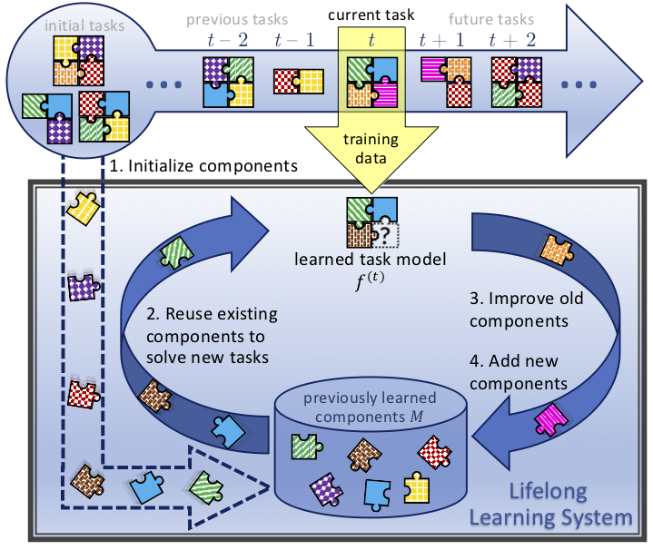

## Table of Contents

## What is lifelong learning in the context of machine learning?

Lifelong learning, also known as continuous learning, is a concept in machine learning where an AI system keeps learning and improving over time. Instead of being trained on a fixed dataset and then used without further changes, a lifelong learning system can take in new data as it becomes available and use it to get better at its tasks. This is important because the world changes, and what was true or useful yesterday might not be the same today. So, an AI that can keep learning is more useful and adaptable.

For example, think about a spam email filter. If it only learned from emails up to a certain date, it might miss new types of spam that appear later. But if it uses lifelong learning, it can keep looking at new emails and learning from them. This way, it stays good at catching spam even as spammers come up with new tricks. Lifelong learning helps AI stay relevant and effective in a world that's always changing.

## How does lifelong learning differ from traditional machine learning approaches?

Lifelong learning and traditional machine learning approaches differ mainly in how they handle data and learning over time. In traditional machine learning, a model is trained on a specific dataset, and once the training is complete, the model is used to make predictions or decisions without further changes. This means that if new data becomes available or if the environment changes, the model does not automatically update or improve. It would need to be retrained from scratch with the new data, which can be time-consuming and inefficient.

On the other hand, lifelong learning allows a model to continuously learn and adapt as new data comes in. This means that the model can keep improving its performance over time without needing to be completely retrained. For example, a lifelong learning model can learn from new examples of spam emails as they appear, making it better at filtering out spam over time. This approach is more flexible and better suited to environments where data and conditions are constantly changing.

To illustrate the difference, imagine a traditional [machine learning](/wiki/machine-learning) model as a student who studies for an exam and then stops learning once the exam is over. In contrast, a lifelong learning model is like a student who keeps learning new things every day, adapting to new information and improving their knowledge continuously. This ongoing learning process makes lifelong learning models more effective in real-world applications where change is the norm.

## What are the key challenges faced in implementing lifelong learning systems?

One of the main challenges in implementing lifelong learning systems is dealing with the problem of catastrophic forgetting. This happens when a model learns new information and, in the process, forgets what it learned before. Imagine if you learned a new language and then forgot your first language. That's what catastrophic forgetting is like for AI. To prevent this, researchers need to find ways to make the model remember old information while learning new stuff. This can be hard because the model has to balance between keeping old knowledge and adapting to new data.

Another challenge is managing the growing amount of data that a lifelong learning system needs to handle. As time goes on, the system keeps getting more and more data to learn from. This can make the system slow and hard to manage. Imagine trying to read every new book that comes out while still remembering all the old ones. It's a lot of information! So, researchers need to find smart ways to select which data is important to keep and which can be forgotten, without losing the ability to learn and improve.

Lastly, there's the challenge of keeping the system stable and reliable. As a lifelong learning system keeps changing and learning, it can become unstable if not managed properly. It's like trying to keep a bike steady while riding on a bumpy road. The system needs to keep performing well even as it learns new things. This requires careful monitoring and adjustment to make sure the system doesn't start making bad predictions or decisions as it evolves.

## Can you explain the concept of self-learning in lifelong learning?

Self-learning in lifelong learning is when an AI system can learn new things on its own without needing someone to teach it directly. Imagine a robot that can figure out how to do new tasks by watching people or trying things out by itself. This is important because it lets the AI keep getting better at what it does, even if the world around it changes. The AI doesn't need to wait for someone to give it new data or instructions; it can explore and learn from its environment on its own.

For example, a self-learning system might start by knowing how to sort different types of objects. Over time, it might see new kinds of objects and, without any new training from humans, figure out how to sort them too. This kind of learning helps the AI stay useful and effective, even as things change. It's like a kid who learns to do new things by trying them out and seeing what works, rather than always needing a teacher to show them exactly what to do.

## What is CLASSP and how does it contribute to lifelong learning?

CLASSP stands for Class-Incremental Learning with Synaptic Stabilization and Plasticity. It's a way to help AI systems learn new things without forgetting what they already know. Imagine you're learning new math formulas every day. CLASSP helps the AI remember old formulas while it learns new ones, so it doesn't forget the basics as it moves on to harder stuff.

CLASSP works by balancing two important things: stability and plasticity. Stability means the AI keeps its old knowledge, and plasticity means it can learn new things. CLASSP uses special techniques to make sure the AI doesn't forget what it learned before. This is really helpful for lifelong learning because it lets the AI keep getting better and better, even as the world changes and new information comes in.

## How does LIMix enhance lifelong learning models?

LIMix, or Lifelong Learning with Mixture of Experts, helps lifelong learning models by letting them use different parts of the model for different tasks. Imagine you have a toolbox with different tools for different jobs. LIMix is like having a smart toolbox that knows which tool to use for each new task it sees. This way, the model can keep learning new things without forgetting the old ones because each part of the model can focus on its own job.

By using this mixture of experts approach, LIMix makes it easier for the model to adapt to new data and tasks over time. It's like having a team of experts where each expert gets better at their own specialty. This helps the model stay good at what it does, even as the world changes and new information comes in. LIMix makes lifelong learning more effective and helps the model keep improving without losing what it already knows.

## What are some practical applications of lifelong learning in machine learning?

Lifelong learning is really useful in things like spam filters for email. Imagine you have an email app that stops spam from reaching your inbox. With lifelong learning, this app can keep learning from new spam emails as they come in. This means it gets better and better at spotting spam over time, even if spammers change their tricks. So, your email stays clean and safe without you having to do anything extra.

Another practical use is in self-driving cars. These cars need to learn from the roads they drive on, which can change because of construction, weather, or new traffic rules. Lifelong learning helps the car's AI keep learning from these changes and drive safely no matter what. It's like the car is always going to school, learning new things every day to stay good at driving.

## How can lifelong learning help in adapting to new data and tasks over time?

Lifelong learning helps AI systems get better at their jobs by learning from new information as it comes in. Imagine a robot that sorts different objects. At first, it might only know how to sort a few types. But with lifelong learning, it can keep learning from new objects it sees, so it gets better at sorting all kinds of things over time. This means the AI doesn't need to stop and be retrained from scratch every time something new comes up. It can just keep learning and improving, which makes it really useful in a world that's always changing.

For example, think about a smart home system that controls the lights and temperature. With lifelong learning, it can learn from how people use it every day. If someone starts coming home later, the system can figure that out and adjust the lights and temperature to be just right when they get home. This way, the system stays helpful and doesn't need someone to tell it what to do every time things change. Lifelong learning makes AI more flexible and able to handle new tasks without forgetting the old ones.

## What are the current research trends in lifelong learning?

One big trend in lifelong learning research is figuring out how to stop the AI from forgetting old stuff when it learns new things. This is called "catastrophic forgetting." Researchers are working on ways to make AI remember old information while still learning new stuff. They're trying out different techniques like using special memory parts in the AI or making the AI learn in a way that keeps old knowledge safe. This is important because it helps the AI stay useful over time, even as the world changes.

Another trend is making AI better at learning from less data. Sometimes, new data can be hard to get, so researchers are trying to make AI learn well even with just a little bit of new information. They're looking into ways to make the AI smarter about which data to pay attention to and how to use it best. This can help the AI keep improving without needing tons of new data all the time.

Lastly, researchers are also looking into making AI learn from different kinds of data at the same time. This is called "multi-task learning." Imagine an AI that can learn to do many different things all at once, like understanding pictures and texts. By doing this, the AI can get better at all its tasks together, making it more useful and able to adapt to new situations quickly.

## How do you evaluate the performance of a lifelong learning system?

Evaluating the performance of a lifelong learning system involves checking how well it learns new things without forgetting old stuff. One way to do this is by using a test set that includes both old and new data. You can see if the system can still do well on old tasks after learning new ones. This helps you know if the system is suffering from catastrophic forgetting, which is when it forgets old knowledge while learning new things. Another way to evaluate is by looking at how quickly the system can learn new tasks. If it can pick up new skills fast without messing up old ones, that's a good sign.

Another important thing to check is how the system handles different kinds of data over time. You can use metrics like accuracy, which tells you how often the system gets things right, and adaptability, which shows how well it can learn from new data. For example, you might use a formula like $$ \text{Accuracy} = \frac{\text{Number of correct predictions}}{\text{Total number of predictions}} $$ to see how well the system is doing. It's also helpful to look at how stable the system is. If it keeps getting better without big ups and downs in performance, that means it's doing a good job at lifelong learning.

## What are the ethical considerations in deploying lifelong learning systems?

One big ethical concern with lifelong learning systems is privacy. These systems keep learning from new data, which means they might be collecting a lot of information about people over time. It's important to make sure this data is used in a way that respects people's privacy. For example, if a lifelong learning system is used in a smart home, it might learn from how people live their daily lives. This data should be kept safe and not used for things like targeted ads or shared without permission.

Another ethical issue is fairness. As lifelong learning systems keep learning, they might start treating different groups of people differently. This can happen if the new data they learn from is biased. For instance, if a system learns mostly from one group of people, it might not work as well for others. It's important to check the system often to make sure it's fair to everyone. This means looking at things like $$ \text{Fairness} = \frac{\text{Performance on underrepresented group}}{\text{Performance on well-represented group}} $$ to see if the system is treating all groups the same way.

## Can you discuss advanced techniques used to improve lifelong learning algorithms?

One advanced technique used to improve lifelong learning algorithms is called Elastic Weight Consolidation (EWC). EWC helps prevent catastrophic forgetting by adding a penalty to the changes in the [neural network](/wiki/neural-network)'s weights that are important for old tasks. Imagine you're learning new math problems but you don't want to forget how to do the old ones. EWC makes sure the AI keeps the important parts of what it learned before while still being able to learn new things. This is done by adding a term to the loss function that measures how much the important weights are changing, which helps keep the old knowledge safe.

Another technique is called Memory Aware Synapses (MAS). MAS works by assigning importance to each weight in the neural network based on how much it contributes to the current performance. When new data comes in, the system tries to change the weights in a way that doesn't mess up the important ones too much. This helps the AI learn new tasks without forgetting the old ones. For example, if the AI is good at sorting apples and then learns to sort oranges, MAS makes sure it doesn't forget how to sort apples while learning about oranges. Both EWC and MAS help make lifelong learning more effective by balancing the need to learn new things with the need to remember old ones.

## References & Further Reading

[1]: Parisi, G. I., Kemker, R., Part, J. L., Kanan, C., & Wermter, S. (2019). ["Continual Lifelong Learning with Neural Networks: A Review."](https://pubmed.ncbi.nlm.nih.gov/30780045/) Neural Networks, 113, 54-71.

[2]: Li, Z., Zhou, F., Chen, F., & Li, H. (2017). ["Learn to Grow: A Continual Structure Learning Framework for Overcoming Catastrophic Forgetting."](https://arxiv.org/abs/1707.09835) Proceedings of the 36th International Conference on Machine Learning, in PMLR 97:3925-3934.

[3]: Kirkpatrick, J., Pascanu, R., Rabinowitz, N., Veness, J., Desjardins, G., Rusu, A. A., ... & Hadsell, R. (2017). ["Overcoming catastrophic forgetting in neural networks."](https://arxiv.org/abs/1612.00796) Proceedings of the National Academy of Sciences, 114(13), 3521-3526.

[4]: Rusu, A. A., Rao, D., Sygnowski, J., Velez, R., Pascanu, R., Osindero, S., ... & Hadsell, R. (2016). ["Progressive Neural Networks."](https://arxiv.org/abs/1807.05960) arXiv preprint arXiv:1606.04671.

[5]: Chen, Z., & Liu, B. (2018). ["Lifelong Machine Learning."](https://link.springer.com/book/10.1007/978-3-031-01581-6) Synthesis Lectures on Artificial Intelligence and Machine Learning, 12(3), 1-207.

[6]: Yu, Z., Liu, T., Liu, Z., Schiele, B., & Sun, Q. (2020). ["Supervised Contrastive Learning for Pre-trained Language Model Fine-tuning."](https://www.sciencedirect.com/science/article/pii/S1359646225001617) arXiv preprint arXiv:2011.01403.

[7]: De Lange, M., Aljundi, R., Masana, M., Parisot, S., Jia, X., Leonardis, A., ... & Tuytelaars, T. (2021). ["A continual learning survey: Defying forgetting in classification tasks."](https://arxiv.org/abs/1909.08383) IEEE Transactions on Pattern Analysis and Machine Intelligence.

[8]: Delange, M., Tuytelaars, T., & Masana, M. (2019). ["EWC, MAS & SI: The Three Regularization Methods for Overcoming Catastrophic Forgetting."](https://dl.acm.org/doi/abs/10.5555/3692070.3694419) Proceedings of the Twenty-Eighth International Joint Conference on Artificial Intelligence (IJCAI-19).