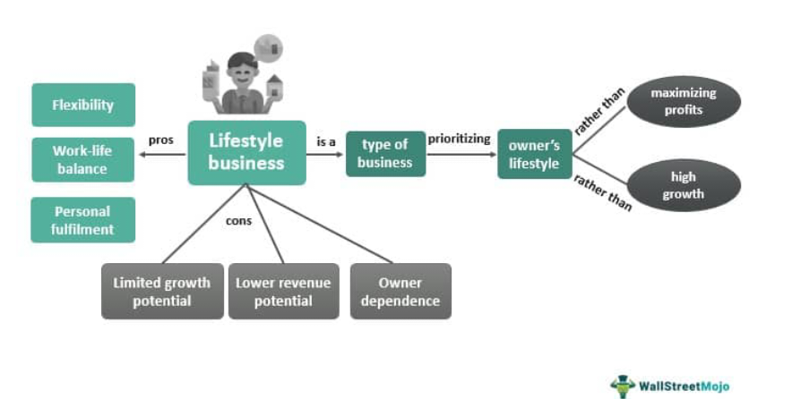

In today's fast-paced financial world, investment strategies have evolved to address the diverse needs of investors. Traditional approaches—such as buying and holding stocks—are no longer the only options available. Instead, a strategic approach is essential, often involving sophisticated techniques like lifestyle funds and algorithmic trading.

Lifestyle funds, also known as target-date funds, offer a tailored investment strategy. They adjust asset allocations in response to an investor's life stage and changing risk tolerance, thereby supporting long-term goals such as retirement. These funds cater to individuals by simplifying decision-making processes and accommodating varying risk appetites.



On the other hand, algorithmic trading represents a technological evolution in investment strategies. This approach employs complex algorithms for executing trades, maximizing speed and reducing human error. By utilizing advanced technology, investors can implement more efficient and precise investment strategies, enhancing the overall effectiveness of their trading activities.

This article examines these innovative investment strategies, illustrating how they integrate into financial planning and the lifestyle benefits they offer. We'll explore the significance of lifestyle funds in aligning with individual risk profiles and long-term objectives. Additionally, the role of algorithmic trading in refining investment strategies will be considered, demonstrating how these methods can collectively augment an investor's portfolio management.

## Table of Contents

## Understanding Lifestyle Funds

Lifestyle funds, often referred to as target-date or lifecycle funds, are investment vehicles specifically structured to address the evolving financial needs of investors as they progress through different life stages. Primarily targeting long-term goals like retirement, these funds dynamically adjust their asset allocation based on the investor's risk tolerance and time horizon. By doing so, they aim to provide a balanced approach to growth and stability over time.

At the core of lifestyle funds is the principle of asset allocation—a strategy that spreads investments across various asset classes such as equities, bonds, and cash equivalents to manage risk and achieve diversification. Unlike traditional mutual funds, which maintain a static asset mix, lifestyle funds automatically rebalance their portfolios in line with a set timeline or stage in the investor's life. This rebalancing occurs in three general models: conservative, moderate, and aggressive.

1. **Conservative Model**: As an investor approaches their target date, a lifestyle fund operating under a conservative model will shift its allocation predominantly towards fixed-income securities and cash equivalents. This model aims to preserve capital and minimize risk, acknowledging the investor's reduced capacity for risk-taking as they near retirement.

2. **Moderate Model**: This approach maintains a balanced mix of equities and fixed-income investments throughout the investor's timeline. It gradually lowers the equity exposure as the target date approaches but retains a significant portion in stocks to provide growth potential.

3. **Aggressive Model**: In the early stages, an aggressive lifestyle fund model invests heavily in equities to capitalize on growth opportunities. As the target date nears, the fund will incrementally move towards a more secure asset base, reducing exposure to high-risk investments.

One of the primary benefits of lifestyle funds is their ability to offer a hands-off, strategic investment solution. This feature is particularly appealing to individuals who prefer not to actively manage their portfolios. By automatically adjusting asset allocations, lifestyle funds ensure that investments are consistently aligned with the investor's current life stage and financial objectives. Moreover, they mitigate behavioral biases that might lead investors to make impulsive decisions based on market fluctuations.

When comparing lifestyle funds to traditional mutual funds, the key distinction lies in their adaptive nature. While traditional mutual funds require investors to manually adjust their holdings in response to changes in their financial situation or market conditions, lifestyle funds provide a self-regulating mechanism. This aspect not only simplifies portfolio management but also reduces the likelihood of misaligned asset allocation with personal risk profiles.

In summary, lifestyle funds represent an innovative approach to investing, offering tailored strategies that evolve with the investor's life stage. By focusing on a diversified and dynamic asset allocation, these funds provide a comprehensive solution aimed at meeting long-term investment goals while accommodating changing risk tolerances over time.

## Financial Planning with Lifestyle Funds

Lifestyle funds offer a straightforward solution for individuals who prefer a hands-off approach to their investment strategy. These funds automatically adjust their asset allocation over time, aligning with the investor's changing financial goals and risk tolerance. This automated feature eliminates the need for investors to constantly monitor and adjust their portfolios, providing peace of mind and saving time.

A key advantage of lifestyle funds is their ability to offer an automated rebalancing mechanism. As individuals move through different life stages, their financial objectives and risk profiles evolve. Lifestyle funds address these changes by systematically rebalancing the investment mix to maintain a level of risk exposure that aligns with the investor's current life stage. For example, younger investors might start with a more aggressive asset allocation that includes a higher percentage of equities. As they approach retirement, the fund automatically shifts to a more conservative allocation, increasing the proportion of bonds and other fixed-income investments.

In comparing lifestyle funds to the personal management of asset allocation, several benefits become apparent. Personal management requires investors to actively monitor financial markets and make timely adjustments to their portfolio, a process that demands a significant investment of time and knowledge. In contrast, lifestyle funds encapsulate this process into a single investment vehicle, reducing the complexity and time commitment for the investor.

Additionally, lifestyle funds offer diversification across different asset classes, which can be challenging to achieve through personal management. By investing in a mix of stocks, bonds, and other securities, these funds spread risk and potentially improve returns over the long term. This diversification is automatically managed within the fund, further alleviating the responsibility on the individual investor to achieve a balanced portfolio.

While lifestyle funds provide a convenient and efficient option, they are not without drawbacks. The predetermined path of asset allocation changes might not perfectly suit every individual's unique circumstances or sudden financial needs. However, for many, the simplicity and automation of lifestyle funds make them an attractive choice in financial planning, especially when considering the comparative simplicity and automation offered by lifestyle funds versus managing asset allocation personally.

## The Rise of Algorithmic Trading

Algorithmic trading has markedly transformed the financial markets by using advanced technology to execute trades rapidly and efficiently based on predetermined criteria. This form of trading is characterized by leveraging mathematical models and algorithms to make decisions, allowing for the execution of trades at speeds and frequencies impossible for human traders. The crucial advantage is its capacity to navigate complex investment strategies with minimal manual intervention.

The impact of [algorithmic trading](/wiki/algorithmic-trading) spans various stakeholders, from large financial institutions to individual investors, each benefiting from its enhanced precision and operational efficiency. For institutional investors, algorithmic trading allows the handling of vast volumes of trade orders, maintaining market [liquidity](/wiki/liquidity-risk-premium) and stability. Individual investors gain from reduced transaction costs and improved market accessibility, offering potential market opportunities previously unavailable to them.

Some of the primary benefits of algorithmic trading include the minimization of human error, a common issue in manual trading environments, and the optimization of trade execution timing. Automated systems can analyze and predict market trends swiftly, executing trades at ideal moments to capitalize on transient market conditions. This capability is critical in high-frequency trading, where milliseconds can influence market outcomes significantly.

However, algorithmic trading does include inherent risks. One significant concern is the potential for systemic risk due to the interconnectivity of algorithmic systems, which can sometimes lead to cascading failures reminiscent of the Flash Crash of 2010. Additionally, the reliance on algorithms requires diligent oversight to ensure systems are functioning as intended, reducing the potential for executing erroneous trades based on faulty data or model assumptions.

The landscape of algorithmic trading is complex, requiring careful validation and continuous monitoring to mitigate adverse impacts. Investors must weigh the benefits of speed and efficiency against the risks of market [volatility](/wiki/volatility-trading-strategies) and disruptions. As technology and financial markets evolve, algorithmic trading will continue to play a pivotal role in shaping the future of trading strategies.

## Integrating Algo Trading into Investment Strategies

Algorithmic trading plays a pivotal role in contemporary investment strategies by offering efficient and precise trade execution. Its integration into diversified investment portfolios can enhance performance and align with broader financial goals, such as those targeted by lifestyle funds.

Algorithmic strategies, by design, automate the trading process, allowing for systematic portfolio adjustments in response to market conditions. This precision aids in maintaining the desired asset allocation set forth by lifestyle funds, which are tailored according to an investor's risk profile and life stage. By combining these two approaches, investors can achieve a balanced and dynamic financial strategy that adjusts seamlessly over time.

**Integrating Algorithmic Trading with Lifestyle Funds**

The integration of algorithmic trading with lifestyle funds involves setting up a system where algorithms can manage the dynamic elements of trade execution while adhering to the strategic mandates of lifestyle portfolios. This process ensures that the portfolio remains aligned with the investor's long-term objectives, even as market conditions fluctuate. 

The systematic nature of algorithmic trading ensures that rebalancing can occur without manual intervention, maintaining the portfolio's risk profile. For instance, if a lifestyle fund's allocation strategy shifts from aggressive to moderate as an investor ages, an algorithm can automatically adjust the portfolio's asset mix accordingly. This can be implemented programmatically using Python, a popular language in algorithmic trading due to its robust libraries and support for numerical computation.

**Practical Steps for Implementing Algorithmic Trading Systems**

1. **Data Acquisition**: The foundation of algorithmic trading lies in reliable and accurate data. Historical and real-time market data must be acquired through feeds provided by exchanges or data vendors. Python libraries such as `pandas` for data manipulation and `numpy` for numerical calculations are crucial in this step.

2. **Algorithm Development**: Developing an algorithmic trading strategy requires coding logic that specifies the trading rules. This logic could include criteria for entering and exiting trades based on market signals. Here, machine learning models can be used to predict market movements or to identify trading opportunities.

3. **Backtesting**: Once developed, the strategies need to be tested against historical data to evaluate their effectiveness. This process, known as backtesting, is essential for assessing the potential performance and risk of the trading algorithm. Python's `backtrader` library can be leveraged for this purpose, enabling robust testing and validation.

   ```python
   import backtrader as bt

   class MyStrategy(bt.Strategy):
       def __init__(self):
           self.sma = bt.indicators.SimpleMovingAverage(self.data.close, period=15)

       def next(self):
           if self.data.close[0] > self.sma[0]:
               self.buy()
           elif self.data.close[0] < self.sma[0]:
               self.sell()

   cerebro = bt.Cerebro()
   # Add strategy, data feeds, and run backtest
   ```

4. **Performance Review**: Continuous monitoring of the trading system's performance is vital to ensure it remains aligned with market conditions and investment goals. Regular reviews can highlight the need for strategy modifications to adapt to evolving market dynamics.

Integrating algorithmic trading with lifestyle funds requires a well-structured approach that emphasizes both strategic alignment and technical execution. By following these steps, investors can harness the power of technology to create a resilient investment strategy that dynamically manages risk and optimizes performance over the long term. This method enhances the investor's ability to achieve their financial objectives with minimal manual intervention, offering a significant edge in today's complex financial markets.

## Challenges and Considerations

Both lifestyle funds and algorithmic trading present a range of advantages, yet they also [carry](/wiki/carry-trading) inherent challenges and risks that investors need to consider. Understanding these risks and implementing strategic mitigation measures is crucial for investors aiming to optimize their investment outcomes.

**Market Volatility and Risk Management**

Market volatility poses a significant challenge in both lifestyle funds and algorithmic trading. Lifestyle funds, which adjust their asset allocation according to an investor's life stage, may not always respond promptly to sudden market shifts, potentially affecting returns. Algorithmic trading, while designed to enhance efficiency and reaction times, can amplify losses if algorithms are not properly calibrated to handle extreme market conditions. It is essential for investors to employ robust risk management techniques, such as diversification and setting appropriate stop-loss measures, to minimize potential losses. 

**Misaligned Financial Strategies**

The risk of misalignment between an investor’s financial goals and the strategies employed by lifestyle funds or algorithmic trading systems can be detrimental. Lifestyle funds are often designed with a generic asset allocation model, which may not precisely match an individual’s specific risk tolerance or investment objectives. Algorithmic trading, on the other hand, depends heavily on the precision and adaptability of the algorithms. If these algorithms do not align with the investor’s goals, they can lead to unexpected outcomes. Regular reviews and adjustments of investment strategies, along with ensuring that the chosen investment tools align with personal financial objectives, are essential steps to mitigate this risk.

**Potential Conflicts of Interest in Fund Management**

Lifestyle funds pose another challenge related to potential conflicts of interest in fund management. Fund managers may make investment decisions that prioritize their interests or those of the fund company over individual investors. Transparency in fund management practices and clear communication between fund managers and investors can help mitigate these conflicts. Furthermore, investors should be vigilant in reviewing fund performance and management changes, ensuring that their interests remain a top priority.

**Mitigation Measures**

To address these challenges, investors can take several measures:
1. **Diversification:** Spreading investments across different asset classes and sectors can reduce risk exposure.
2. **Regular Monitoring and Review:** Keeping track of the investment performance and market conditions to make necessary adjustments.
3. **Engagement with Fund Managers and Algorithm Developers:** Maintaining open lines of communication to ensure alignment of investment goals and strategies.
4. **Utilization of Advanced Risk Management Tools:** Implementing tools and techniques, such as stress testing and scenario analysis, to assess and manage potential risks.

In conclusion, while lifestyle funds and algorithmic trading offer substantial opportunities for enhancing investment portfolios, investors should remain vigilant about the associated risks. By adopting strategic risk management practices, investors can better navigate these challenges and work towards achieving their financial goals.

## Conclusion

Incorporating lifestyle funds and algorithmic trading strategies into one's investment portfolio can significantly enhance the potential for achieving personal financial goals. These strategies offer investors the flexibility to tailor their investments according to individual risk profiles and life stages. Lifestyle funds provide a dynamic asset allocation approach that evolves with the investor's changing needs, aligning closely with long-term objectives such as retirement planning. This model allows for a more personalized investment journey, aimed at striking the right balance between growth and security over time.

On the other hand, algorithmic trading leverages advanced technologies to execute trades with high efficiency and minimal human error. This automated trading technique can optimize trade execution timing and ensure a disciplined investment strategy, making it especially valuable in today's fast-paced financial markets. The strategic edge provided by algorithmic trading not only enhances portfolio performance but also offers the diversification and risk management necessary for modern investment strategies.

Nevertheless, understanding and managing the complexities involved in these techniques is crucial. Investors need to be aware of the underlying algorithms and the potential market risks associated with algorithmic trading, as well as the possible conflicts of interest in fund management. Due diligence and continuous monitoring are essential to leverage these investment strategies effectively and to mitigate potential downsides.

As technology and market strategies continue to evolve, staying informed and adaptable will be paramount for financial success. The dynamic nature of today's investment environment underscores the need for ongoing education and adaptability. By integrating these sophisticated approaches into their financial planning, investors can better navigate complexities and seize opportunities in the ever-changing investment landscape.

## References & Further Reading

[1]: Bodie, Z., Kane, A., & Marcus, A. J. (2014). ["Investments"](https://books.google.com/books/about/EBOOK_Investments_Global_edition.html?id=BMsvEAAAQBAJ) (10th ed.). McGraw-Hill Education.

[2]: Malkiel, B. G. (2019). ["A Random Walk Down Wall Street: The Time-Tested Strategy for Successful Investing"](https://yourknowledgedigest.org/wp-content/uploads/2020/04/a-random-walk-down-wall-street.pdf). W. W. Norton & Company.

[3]: Lopez de Prado, M. (2018). ["Advances in Financial Machine Learning"](https://www.amazon.com/Advances-Financial-Machine-Learning-Marcos/dp/1119482089). Wiley.

[4]: Chan, E. P. (2009). ["Quantitative Trading: How to Build Your Own Algorithmic Trading Business"](https://github.com/ftvision/quant_trading_echan_book). Wiley.

[5]: Jansen, S. (2020). ["Machine Learning for Algorithmic Trading: Predictive models to extract signals from market and alternative data for systematic trading strategies with Python"](https://www.amazon.com/Machine-Learning-Algorithmic-Trading-alternative/dp/1839217715). Packt Publishing.

[6]: Poterba, J. M., & Shoven, J. B. (2002). ["Asset Allocation and Risk Allocation: Can Social Security Improve Its Future Solvency Problem by Investing In Private Securities?"](https://papers.ssrn.com/sol3/papers.cfm?abstract_id=160116) National Bureau of Economic Research, Inc.