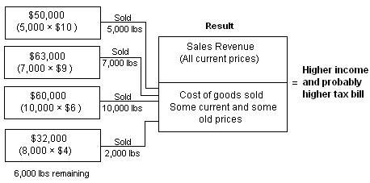

## Table of Contents

## What is LIFO liquidation?

LIFO liquidation happens when a company using the Last-In, First-Out (LIFO) method to manage its inventory sells off its older stock. In LIFO, the most recent items added to the inventory are sold first. But, if a company runs out of new stock and starts selling the older items, this is called LIFO liquidation. This can happen if the company doesn't buy new inventory or if they need to sell more than they usually do.

When LIFO liquidation happens, it can affect the company's profits and taxes. Older inventory was usually bought at a lower price. So, when this older, cheaper stock is sold, the cost of goods sold goes down. This makes the company's profit look higher because they are selling goods that cost less to buy. As a result, the company might have to pay more in taxes because of the higher reported profit.

## How does LIFO liquidation work?

LIFO liquidation happens when a company uses the Last-In, First-Out (LIFO) method for its inventory and starts selling the older stock. Normally, with LIFO, the newest items added to the inventory are sold first. But if the company runs out of new stock or needs to sell more than usual, they might have to sell the older items they've been keeping. This is called LIFO liquidation.

When LIFO liquidation happens, it can change the company's profits and taxes. The older inventory was usually bought for less money than the newer stuff. So, when the company sells these older, cheaper items, the cost of goods sold goes down. This makes the company's profit look bigger because they're selling things that cost less to buy. As a result, the company might have to pay more taxes because their reported profit is higher.

## What is the Last In, First Out (LIFO) inventory method?

The Last In, First Out (LIFO) inventory method is a way for companies to manage their stock. It means that the newest items added to the inventory are sold first. Imagine a stack of [books](/wiki/algo-trading-books) where you always take the top book first. That's like LIFO. Companies use LIFO because it can help them manage their costs better, especially when prices are going up.

When prices go up, the newest items cost more than the older ones. If a company sells the newest items first, the cost of goods sold will be higher. This makes the company's profit look smaller on paper, which can mean they pay less in taxes. But, using LIFO can be tricky. If a company sells more than they buy, they might have to sell older, cheaper items. This is called LIFO liquidation, and it can make their profit look bigger and increase their taxes.

## Why might a company use LIFO liquidation?

A company might use LIFO liquidation if they run out of new stock or if they need to sell more than they usually do. When they use the Last-In, First-Out (LIFO) method, they sell the newest items first. But if they don't have any new items left, they have to start selling the older ones. This can happen if they don't buy new inventory or if they need to sell a lot more than they planned.

Using LIFO liquidation can change a company's profits and taxes. The older items were usually bought for less money. So, when the company sells these older, cheaper items, the cost of goods sold goes down. This makes the company's profit look bigger because they are selling things that cost less to buy. As a result, the company might have to pay more in taxes because their reported profit is higher.

## What are the financial implications of LIFO liquidation?

LIFO liquidation can make a company's profit look bigger on paper. When a company uses the Last-In, First-Out (LIFO) method, they sell the newest items first. But if they run out of new stock, they have to sell the older items. These older items were usually bought for less money. So, when the company sells these cheaper items, the cost of goods sold goes down. This makes the profit look bigger because they are selling things that cost less to buy.

Because the profit looks bigger, the company might have to pay more in taxes. When the cost of goods sold goes down, the profit on paper goes up. This means the company has to report a higher profit to the tax authorities. As a result, they might have to pay more in taxes. LIFO liquidation can be a good thing for a company's cash flow in the short term, but it can lead to higher taxes and might not be good for the company in the long run.

## How does LIFO liquidation affect cost of goods sold (COGS)?

LIFO liquidation affects the cost of goods sold (COGS) by making it go down. When a company uses the Last-In, First-Out (LIFO) method, they sell the newest items first. But if they run out of new stock, they have to sell the older items. These older items were usually bought for less money than the newer ones. So, when the company sells these cheaper items, the cost of goods sold goes down.

When COGS goes down, the company's profit on paper goes up. This happens because they are selling things that cost less to buy. A lower COGS means the company has to report a higher profit. This can be good for the company's cash flow in the short term, but it can lead to higher taxes because the reported profit is bigger.

## What are the tax implications of LIFO liquidation?

LIFO liquidation can make a company's taxes go up. When a company uses the Last-In, First-Out (LIFO) method, they sell the newest items first. But if they run out of new stock, they have to sell the older items. These older items were usually bought for less money. So, when the company sells these cheaper items, the cost of goods sold goes down. This makes the company's profit look bigger on paper because they are selling things that cost less to buy.

Because the profit looks bigger, the company might have to pay more in taxes. When the cost of goods sold goes down, the profit on paper goes up. This means the company has to report a higher profit to the tax authorities. As a result, they might have to pay more in taxes. LIFO liquidation can be good for a company's cash flow in the short term, but it can lead to higher taxes, which might not be good for the company in the long run.

## Can you provide an example of LIFO liquidation?

Imagine a store that sells toys. They use the Last-In, First-Out (LIFO) method, which means they sell the newest toys first. Let's say they bought 100 toys last month for $10 each, and this month they bought another 100 toys for $12 each. Normally, they would sell the $12 toys first. But, if they sell all 100 of the $12 toys and need to sell more, they will have to start selling the $10 toys. This is called LIFO liquidation.

When the store sells the $10 toys, the cost of goods sold goes down. If they sold a $12 toy, the cost of goods sold would be $12. But if they sell a $10 toy, the cost of goods sold is only $10. This makes their profit look bigger because they are selling toys that cost less to buy. Because their profit looks bigger, they might have to pay more in taxes.

## What are the potential risks associated with LIFO liquidation?

LIFO liquidation can make a company's taxes go up. When a company uses the Last-In, First-Out (LIFO) method, they sell the newest items first. But if they run out of new stock, they have to sell the older items. These older items were usually bought for less money. So, when the company sells these cheaper items, the cost of goods sold goes down. This makes the company's profit look bigger on paper because they are selling things that cost less to buy. Because the profit looks bigger, the company might have to pay more in taxes. This can be a problem because it means the company has to give more money to the government.

Another risk is that LIFO liquidation can make the company's inventory look smaller. When they sell the older items, they are using up their old stock. If they don't buy new stock to replace what they sold, they might not have enough items to sell in the future. This can be bad for the company because they need to have enough stock to meet customer demand. If customers can't buy what they want, they might go to another store. So, LIFO liquidation can hurt the company's ability to keep selling products and keep customers happy.

## How does LIFO liquidation impact financial reporting?

LIFO liquidation can make a company's profits look bigger on paper. This happens because when a company uses the Last-In, First-Out (LIFO) method, they usually sell the newest items first. But if they run out of new stock, they have to sell the older items. These older items were bought for less money, so when the company sells them, the cost of goods sold goes down. A lower cost of goods sold means the company's profit looks bigger because they are selling things that cost less to buy.

Because the profit looks bigger, the company might have to pay more in taxes. When the cost of goods sold goes down, the profit on paper goes up. This means the company has to report a higher profit to the tax authorities. As a result, they might have to pay more in taxes. LIFO liquidation can be good for a company's cash flow in the short term, but it can lead to higher taxes and might not be good for the company in the long run.

## What are the differences between LIFO and FIFO in terms of liquidation?

LIFO stands for Last-In, First-Out, and FIFO stands for First-In, First-Out. They are two ways companies can manage their inventory. LIFO means the newest items are sold first, while FIFO means the oldest items are sold first. When a company uses LIFO and sells more than they buy, they might have to sell the older items. This is called LIFO liquidation. On the other hand, FIFO liquidation happens when a company using FIFO sells all their old stock and starts selling the newer items.

LIFO liquidation can make a company's profit look bigger on paper. This happens because the older items were usually bought for less money. When the company sells these cheaper items, the cost of goods sold goes down, making the profit look bigger. As a result, the company might have to pay more in taxes. FIFO liquidation, however, can make the profit look smaller because the newer items are usually more expensive. This means the cost of goods sold goes up, which can lead to lower profits and lower taxes.

## How can a company manage or avoid LIFO liquidation?

A company can manage or avoid LIFO liquidation by making sure they always have enough new stock to sell. They need to keep buying new items so they don't run out. If they keep their inventory levels high, they won't have to sell the older, cheaper items. This means they can keep using the Last-In, First-Out (LIFO) method without any problems. They should also plan how much they will sell and buy enough new stock to meet that demand.

Another way to manage LIFO liquidation is to be careful about how much they sell. If a company knows they might sell more than they usually do, they can buy extra stock ahead of time. This way, they can still sell the newest items first and avoid selling the older ones. By keeping a close eye on their sales and inventory, a company can make sure they don't run into the problem of LIFO liquidation and the higher taxes that come with it.

## References & Further Reading

[1]: Lander, G. H., & Reinstein, A. (1983). ["LIFO Liquidations: A Study of Their Magnitude and Effects."](https://link.springer.com/article/10.1007/s11294-005-2287-3) The Accounting Review, 58(1), 94-110. 

[2]: ["Financial Accounting: A Managerial Perspective"](https://books.google.com/books/about/FINANCIAL_ACCOUNTING.html?id=8JJsEAAAQBAJ) by R. Narayanaswamy

[3]: ["Inventory Accounting: A Guide for Managers, Investors, and Advisors"](https://corporatefinanceinstitute.com/resources/accounting/inventory-accounting/) by Steven M. Bragg

[4]: Foster, G. (1980). ["Pooling of Interests, LIFO Inventory Profits, and Financial Analysis."](https://accountinginsights.org/pooling-of-interests-principles-accounting-and-financial-impact/) Journal of Accounting Research, 18(2), 221-248.

[5]: ["Algorithmic Trading: Winning Strategies and Their Rationale"](https://www.amazon.com/Algorithmic-Trading-Winning-Strategies-Rationale-ebook/dp/B00CY5HC0U) by Ernie Chan