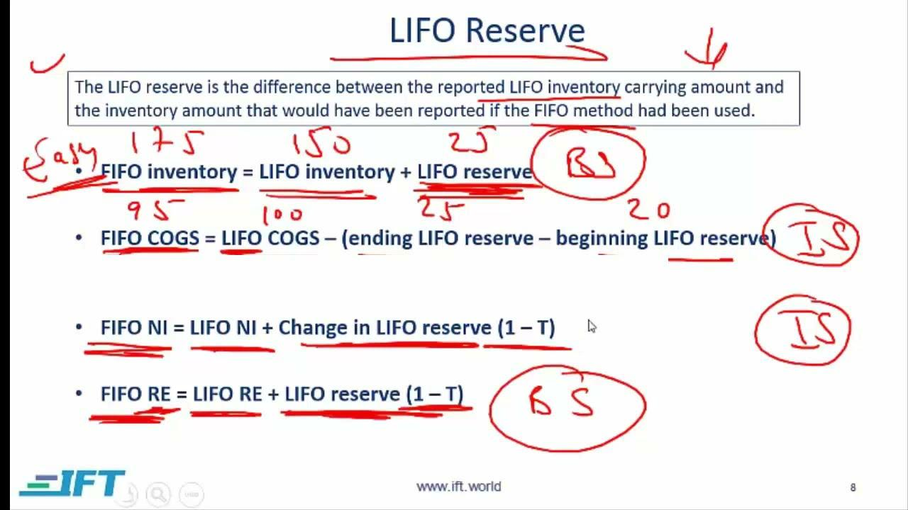

In today's intricate financial landscape, it's essential for businesses and investors to employ precise strategies for resource management. Financial calculations serve as a critical foundation in decision-making processes, especially within the areas of inventory accounting and trading. By grasping the intricacies of these aspects, organizations can enhance their financial strategies and improve their competitiveness in the market.

In inventory accounting, understanding methods like LIFO (Last-In, First-Out) and FIFO (First-In, First-Out) is crucial. These accounting techniques influence how inventory costs are recorded, impacting profit margins and tax liabilities. For example, LIFO can be advantageous during inflationary periods by increasing the Cost of Goods Sold (COGS) and thereby reducing taxable income. Conversely, FIFO reflects lower COGS in rising price environments, offering a potentially more favorable portrayal of financial health.



In trading, the advent of algorithmic trading has revolutionized how transactions are executed. Using automated systems governed by predefined criteria, algorithmic trading enables rapid analysis of vast amounts of data to optimize trade decisions and outcomes. Financial calculations underpin these algorithms, facilitating precise market interaction and strategic financial maneuvers.

Understanding these financial components—inventory accounting and algorithmic trading—not only enables more efficient resource management but also fosters enhanced clarity and comparability in financial representations. For businesses and investors aiming to thrive in modern finance, mastering these elements is key to leveraging strategic advantages. Through this article, businesses can gain insights into the effective management of financial strategies, thereby enhancing their overall competitive edge.

## Table of Contents

## Understanding LIFO Reserve

LIFO Reserve is an accounting term that denotes the discrepancy between the inventory costs determined using the Last-In, First-Out (LIFO) method and those determined using the First-In, First-Out (FIFO) method. This reserve is essential for making accurate financial comparisons and assessments across companies that employ different inventory costing methods.

In a LIFO inventory system, the focus is on selling the most recently acquired inventory first. This approach can significantly affect tax liabilities and financial reporting, especially during periods of inflation. When prices are rising, the cost of goods sold (COGS) under LIFO is higher, as it reflects the most recent and presumably more expensive purchases. Consequently, this results in lower taxable income, which can offer tax advantages for the business.

Conversely, the FIFO method values older inventory first. During inflationary times, this often leads to a lower COGS, as it accounts for older, less expensive inventory. As a result, businesses may report higher taxable income under FIFO, which could be less favorable in terms of tax liability but might present a more appealing financial performance to investors and stakeholders.

Understanding the LIFO Reserve is pivotal to grasping the implications of these methods. If we denote the inventory cost under FIFO as $\text{FIFO\_Inventory}$ and under LIFO as $\text{LIFO\_Inventory}$, then the LIFO Reserve can be expressed as:

$$
\text{LIFO\_Reserve} = \text{FIFO\_Inventory} - \text{LIFO\_Inventory}
$$

This computation allows businesses to adjust their financial statements for enhanced comparability with firms employing different inventory accounting methods.

## Inventory Accounting Methods: LIFO vs. FIFO

Inventory accounting methods, particularly LIFO (Last-In, First-Out) and FIFO (First-In, First-Out), are crucial in determining how inventory costs impact financial metrics such as profit margins, tax liabilities, and financial statements. 

LIFO prioritizes the most recently acquired inventory for cost calculation when goods are sold. During inflation, this method results in recognizing higher costs of goods sold (COGS) due to the sale of newer, more expensive inventory first. Consequently, the gross profit and thus taxable income decrease, offering potential tax benefits. For example, consider a scenario where the price of goods has increased over time. Under LIFO, last purchased items, which are costlier, are deducted first as COGS, lowering the taxable income.

Conversely, FIFO assumes that older inventory is sold first. This often results in lower COGS because less expensive, older inventory prices are recorded initially. As a result, gross profit—and potentially taxable income—appears higher, presenting a more favorable financial picture to investors and stakeholders. This scenario is particularly advantageous when prices are rising, as it can demonstrate strong profitability due to the lower recorded costs for older inventory.

Here's a basic illustration in Python to compute COGS using LIFO and FIFO methods:

```python
def calculate_cogs(inventory_prices, num_units_sold, method='FIFO'):
    if method.upper() == 'LIFO':
        cogs = sum(inventory_prices[-num_units_sold:])
    elif method.upper() == 'FIFO':
        cogs = sum(inventory_prices[:num_units_sold])
    else:
        raise ValueError("Method must be either 'LIFO' or 'FIFO'")
    return cogs

# Example usage:
inventory_prices = [100, 150, 200, 250]
num_units_sold = 2

cogs_lifo = calculate_cogs(inventory_prices, num_units_sold, method='LIFO')
cogs_fifo = calculate_cogs(inventory_prices, num_units_sold, method='FIFO')

print(f"COGS under LIFO: {cogs_lifo}")
print(f"COGS under FIFO: {cogs_fifo}")
```

This example highlights the varying financial impact of each method by demonstrating the differences in COGS for the same inventory and sale [volume](/wiki/volume-trading-strategy). Understanding these differences is critical for analysts, investors, and financial managers as they evaluate financial health and performance. Through recognizing which method is applied, stakeholders can better interpret a company's financial statements and make informed decisions regarding investment and management strategies.

## Algorithmic Trading and Financial Calculations

Algorithmic trading involves using automated systems to execute trades based on predefined criteria, leveraging financial calculations to enhance the precision and efficacy of trading strategies. By employing algorithms, traders can process vast amounts of market data quickly, allowing for fast and efficient trade execution—key attributes in modern, fast-paced markets.

These algorithms often incorporate complex financial calculations, like those related to the LIFO reserve in inventory accounting, to optimize trading decisions. Calculating the LIFO reserve—a measure of discrepancy between inventory valuation methods—can influence various financial metrics; this, in turn, can inform trading strategies that depend on specific financial health indicators and inventory valuations.

For example, consider the task of setting up an algorithm to trade stocks based on an inventory-heavy company’s financial health. The algorithm might incorporate LIFO reserves as part of the financial assessment process. By effectively understanding the company’s adjusted financials through LIFO reserve calculations, a trading algorithm can determine optimal trade actions.

Python is often used for developing these trading algorithms due to its flexibility and robust libraries. Here’s a basic Python example to illustrate how one might incorporate LIFO reserve calculations into a trading algorithm:

```python
# Example Python Code for Basic LIFO Reserve Calculation
def calculate_lifo_reserve(fifo_value, lifo_value):
    return fifo_value - lifo_value

fifo_inventory = 1000000  # Example FIFO inventory valuation
lifo_inventory = 800000   # Example LIFO inventory valuation

lifo_reserve = calculate_lifo_reserve(fifo_inventory, lifo_inventory)
print(f"LIFO Reserve: ${lifo_reserve}")

# Implementing in a trading decision
def trade_decision_based_on_reserve(lifo_reserve):
    if lifo_reserve > 200000:  # Arbitrary threshold for decision making
        return "Sell"
    else:
        return "Buy"

decision = trade_decision_based_on_reserve(lifo_reserve)
print(f"Trade Decision: {decision}")
```

The above code demonstrates a simple function to calculate the LIFO reserve, which is then used in another function to make a basic trade decision—demonstrating how financial calculations integrate into [algorithmic trading](/wiki/algorithmic-trading) systems. Advanced systems may include numerous financial metrics and multiple trading criteria, showcasing the inherent complexity and richness of modern algorithmic trading solutions.

Incorporating thorough financial analysis into algorithmic trading systems not only helps in refining strategies but also ensures that decisions are made based on the most accurate and up-to-date financial information. As financial markets evolve, the integration of detailed financial calculations like the LIFO reserve into algorithmic trading systems remains crucial for maintaining competitive trading strategies.

## Calculating the LIFO Reserve

The calculation of the LIFO reserve is an essential aspect of inventory accounting and an important tool for providing a clearer financial picture when comparing companies using different inventory valuation methods. The LIFO reserve represents the difference between inventory valued under the FIFO (First-In, First-Out) and LIFO (Last-In, First-Out) methods. This difference is crucial for adjustments in financial statements, making them more comparable and transparent.

To calculate the LIFO reserve, one must subtract the LIFO inventory value from the FIFO inventory value:

$$
\text{LIFO Reserve} = \text{FIFO Inventory Value} - \text{LIFO Inventory Value}
$$

For example, if a company's inventory is valued at $1,000,000 using the FIFO method and $800,000 using the LIFO method, the LIFO reserve would be:

$$
\text{LIFO Reserve} = \$1,000,000 - \$800,000 = \$200,000
$$

This $200,000 figure represents the additional cost that would be reflected in the company's financial statements if the FIFO method were used instead of the LIFO method. The LIFO reserve helps stakeholders understand the impact of using the LIFO method on the company’s reported financial performance, especially during periods of inflation. By disclosing the LIFO reserve, companies provide analysts and investors with insight into how inventory costs would differ under FIFO and how it may affect profitability ratios, cash flow estimates, and other key financial metrics.

While the LIFO reserve serves as an adjustment metric, it's also valuable for identifying potential tax implications, as the method chosen for inventory valuation can significantly impact taxable income. Understanding the LIFO reserve becomes important in tax planning and financial analysis, supporting companies in their strategic decision-making.

## Impact on Financial Statements and Tax Implications

The LIFO (Last-In, First-Out) reserve significantly influences the presentation and interpretation of a business's financial statements. This reserve is a contra account on the balance sheet, reducing the value of inventory compared to what it would be under the FIFO (First-In, First-Out) method. This reduction is crucial for accurate economic valuation, particularly in businesses subject to inventory intensive operations, as it provides better alignment with the actual costs of goods sold (COGS) during periods of rising prices.

Under LIFO, the COGS reflects the most recent inventory costs. Consequently, during inflationary periods, when costs are escalating, the COGS reported under LIFO becomes higher than under FIFO. This leads to a lower gross margin and net income, but it can also entail favorable tax implications. Specifically, the higher COGS under LIFO results in reduced taxable income, which can lower income tax liabilities. This reduction in taxable income translates into improved cash flow for businesses, allowing them to allocate resources more efficiently.

The formula to understand the impact on net income is straightforward. If we denote:

- COGS_LIFO as the cost of goods sold under LIFO,
- COGS_FIFO as the cost of goods sold under FIFO,
- T as the tax rate,

The tax savings can be calculated as:

$$
\text{Tax Savings} = (COGS_{LIFO} - COGS_{FIFO}) \times T
$$

This calculation illustrates the direct effect of the LIFO reserve on tax planning, highlighting its role in strategic financial management. Businesses employing LIFO need to ensure comprehensive and precise financial reporting to fully leverage the benefits while remaining compliant with accounting standards and regulatory frameworks.

In summary, while the adoption of LIFO and management of the LIFO reserve introduce complexities in financial reporting, they also offer strategic advantage during inflationary times by decreasing tax liabilities and optimizing cash flows.

## Challenges in Implementation

Implementing the Last-In, First-Out (LIFO) inventory accounting method presents several challenges that businesses must manage effectively to optimize their financial performance. One significant issue associated with LIFO is inventory liquidation. During periods when a company reduces its inventory levels, older, less expensive inventory layers might be liquidated. This can result in decreased profit margins because the cost of goods sold (COGS) reflects these older, cheaper inventory layers rather than more recent, and typically more expensive, inventory acquisitions.

Another challenge lies in the complexity of maintaining LIFO accounting. Compliance with accounting standards requires meticulous tracking and reporting, increasing the administrative workload for businesses. LIFO is not compliant with International Financial Reporting Standards (IFRS), which adds another layer of complexity for companies operating on a global scale. As a result, organizations must carefully balance the benefits of using LIFO for tax purposes against the increased burden of compliance and the potential for financial statement discrepancies when comparing with international competitors. 

The use of the LIFO reserve acts as a strategic tool in addressing these challenges. This reserve is essentially the difference between inventory costs measured under LIFO and FIFO methods. By accounting for the LIFO reserve, companies can adjust their financial statements, thereby enhancing the comparability of financial reports across different inventory accounting methods. The LIFO reserve functions as a buffer against economic fluctuations, allowing companies to present a more stable financial outlook even during periods of significant inflation or inventory shifts. This capability is critical for aligning the financial statements' portrayal with the economic reality faced by the business.

In summary, while the utilization of LIFO accounting offers tangible benefits, particularly concerning tax liabilities, it necessitates a comprehensive approach to mitigate its inherent complexities and economic impacts.

## Practical Applications and Examples

Many corporations, particularly those in the manufacturing and retail sectors like Walmart and Pfizer, leverage the Last-In, First-Out (LIFO) method to gain advantageous tax positions. The LIFO inventory accounting method can significantly reduce tax liabilities during inflationary periods due to its impact on Cost of Goods Sold (COGS). By selling the most recently acquired, and typically more expensive, inventory first, LIFO increases COGS, thereby reducing taxable income and tax obligations. This strategic financial approach is particularly beneficial for large entities with substantial inventory levels, allowing them to optimize their cash flow and reinvest in operations.

Adopting LIFO, however, introduces complexities in inventory management and financial reporting. To streamline these processes, many businesses employ sophisticated accounting software. Such software is designed to handle the intricate calculations required for LIFO, offering features like automated LIFO reserve calculations and real-time inventory adjustments. These solutions not only enhance the accuracy of financial statements but also ensure compliance with accounting standards.

For instance, consider the scenario where a corporation has to calculate the LIFO reserve to adjust its financial statements. The difference between the inventory valued at FIFO and LIFO prices can be substantial, necessitating precise calculation and reporting. Below is a simplified Python code snippet that demonstrates how a company might automate the LIFO reserve calculation:

```python
def calculate_lifo_reserve(fifo_value, lifo_value):
    return fifo_value - lifo_value

fifo_inventory_value = 1000000  # Example FIFO inventory valuation
lifo_inventory_value = 800000   # Example LIFO inventory valuation

lifo_reserve = calculate_lifo_reserve(fifo_inventory_value, lifo_inventory_value)
print(f"The LIFO Reserve is: ${lifo_reserve}")
```

This automated calculation can be integrated into larger accounting systems, ensuring that adjustments to financial statements are accurate and up-to-date. By utilizing such tools, companies mitigate the labor-intensive nature of manual calculations, allowing finance teams to focus on strategic decision-making. Large enterprises with complex inventory systems have found these technologies invaluable for maintaining competitive advantage and ensuring accurate financial disclosures.

In summary, while LIFO accounting offers significant tax advantages, it also requires diligent financial management and reporting. The use of modern accounting software is integral in managing these challenges, exemplifying the blend of traditional accounting methods with contemporary technological solutions in optimizing corporate financial strategies.

## Conclusion

Understanding and calculating the LIFO reserve is essential for maintaining financial health and achieving an accurate financial representation for businesses. By utilizing the LIFO reserve, companies can align their financial statements with current market conditions, especially during periods of inflation. This alignment helps in offering a more realistic view of a company's financial position by accounting for the higher costs associated with newer inventory.

The strategic implementation of the LIFO reserve plays a pivotal role in tax planning. Since the LIFO method generally results in higher Cost of Goods Sold (COGS) and lower taxable income during inflationary periods, businesses can potentially reduce their tax liabilities. This tax advantage can improve cash flow, offering companies more [liquidity](/wiki/liquidity-risk-premium) to reinvest in operations and optimize their financial strategies.

While adopting LIFO might introduce additional complexities, including detailed record-keeping and compliance requirements, the benefits can outweigh these challenges. The LIFO reserve enhances the comparability of financial statements among companies using different inventory accounting methods by adjusting the financial data to account for inflation-related discrepancies. This comparability is crucial for investors and financial analysts who rely on consistent and transparent financial reporting to make informed decisions.

In conclusion, despite the complexities associated with implementing LIFO, its ability to provide tax advantages and improve financial statement comparability makes it an advantageous strategy for companies seeking to strengthen their financial management practices.

## References & Further Reading

[1]: ["Inventory Accounting: LIFO vs. FIFO"](https://www.investopedia.com/articles/02/060502.asp) by Investopedia

[2]: ["FASB's New Guidance on LIFO"](https://www.journalofaccountancy.com/news/2020/aug/fasb-defers-effective-dates-for-revenue-recognition-and-leases.html) by Journal of Accountancy

[3]: ["Algorithmic Trading: Winning Strategies and Their Rationale"](https://www.amazon.com/Algorithmic-Trading-Winning-Strategies-Rationale-ebook/dp/B00CY5HC0U) by Ernest P. Chan

[4]: ["The Impact of Inventory Reserves on Tax and Financial Reporting"](https://www.pwc.com/us/en/services/tax/library/taxpayers-with-inventories-may-use-some-book-reserves-for-tax.html) by The European Accounting Review

[5]: ["Python for Finance: Mastering Data-Driven Finance"](https://www.amazon.com/Python-Finance-Mastering-Data-Driven/dp/1492024333) by Yves Hilpisch