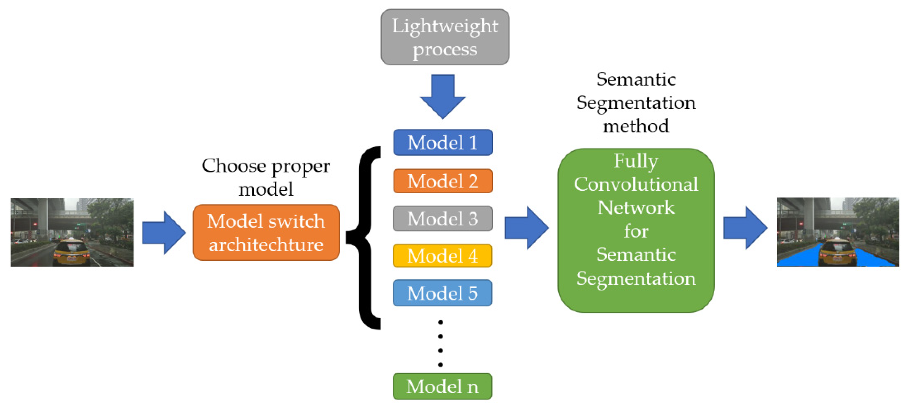

## Table of Contents

## What are light-weight neural networks and why are they important?

Light-weight neural networks are smaller and simpler versions of traditional neural networks. They use fewer parameters and less computational power, which makes them faster and easier to run on devices with limited resources, like smartphones or small computers. These networks are designed to do a good job at tasks like recognizing images or understanding speech, but they don't need as much power or memory as bigger networks.

These networks are important because they make it possible to use advanced AI technology on everyday devices. For example, a light-weight neural network can help your phone recognize your face quickly without draining the battery. They are also useful in situations where you can't use a lot of computing power, like in remote areas or on drones. By using light-weight neural networks, more people can benefit from AI technology without needing expensive or powerful equipment.

## How do light-weight neural networks differ from traditional neural networks?

Light-weight neural networks are smaller and simpler than traditional neural networks. They use fewer parameters, which means they need less memory and less computing power to work. For example, while a traditional neural network might have millions of parameters, a light-weight one might only have thousands. This makes light-weight networks much faster to train and use, especially on devices like smartphones or small computers that don't have a lot of power.

The main difference in how they work is that light-weight neural networks often use simpler structures and techniques to keep their size down. They might use smaller layers or special methods to reduce the number of calculations needed. For instance, they might use techniques like pruning, where unnecessary connections are removed, or quantization, where the precision of the numbers used is reduced. This helps them perform tasks like recognizing images or understanding speech without needing as much power as traditional networks.

In summary, light-weight neural networks are designed to be efficient and practical for use on smaller devices. They achieve this by using fewer parameters and simpler structures, making them a great choice for applications where resources are limited.

## What are some common applications of light-weight neural networks?

Light-weight neural networks are used in many everyday devices and applications. For example, they help smartphones recognize faces or voices without using too much battery power. They are also used in small devices like smart home gadgets, where they can understand voice commands or detect motion without needing a lot of computing power. These networks make it possible for everyday technology to be smart and useful without needing expensive or powerful equipment.

Another common use of light-weight neural networks is in drones and robots. These devices often have limited power and need to make quick decisions on the go. Light-weight networks help them recognize objects or navigate through spaces without draining their batteries quickly. This makes them more efficient and practical for real-world use, like delivering packages or exploring hard-to-reach areas.

In healthcare, light-weight neural networks can be used in portable devices to monitor patients' health. For instance, a small wearable device might use these networks to analyze heart rate patterns or detect irregular breathing. This helps doctors keep an eye on patients' health without needing large, power-hungry machines. By using light-weight neural networks, these applications become more accessible and easier to use in various settings.

## Can you explain the architecture of MobileNetV2?

MobileNetV2 is a light-weight [neural network](/wiki/neural-network) designed to work well on mobile devices. It uses a special building block called the inverted residual structure, which helps keep the network small and efficient. The main idea behind MobileNetV2 is to use fewer parameters and less computing power while still being able to recognize images well. It does this by using something called depthwise separable convolutions, which break down the traditional convolution into two steps: a depthwise convolution that applies a single filter to each input channel, and a pointwise convolution that combines the results. This way, MobileNetV2 can process images faster and with less power than bigger networks.

The architecture of MobileNetV2 starts with an initial convolution layer, followed by a series of these inverted residual blocks. Each block has three layers: an expansion layer, a depthwise convolution layer, and a linear bottleneck layer. The expansion layer increases the number of channels before the depthwise convolution, which helps capture more features. After the depthwise convolution, the linear bottleneck layer reduces the number of channels again. This process repeats multiple times, allowing the network to learn complex patterns without using too many resources. Finally, the network ends with a few more convolution layers and a fully connected layer to make the final prediction. By using this structure, MobileNetV2 can be used in smartphones and other small devices to recognize images quickly and efficiently.

## How does SqueezeNet achieve model compression?

SqueezeNet is a light-weight neural network that achieves model compression by using fewer parameters while still being good at recognizing images. It does this by using a special building block called the "fire module." In the fire module, SqueezeNet first uses a small layer called the squeeze layer, which has fewer filters. This helps reduce the number of parameters. Then, it uses an expand layer, which has more filters but is still smaller than traditional layers. By using these fire modules instead of regular layers, SqueezeNet can keep its size down while still doing a good job at its tasks.

Another way SqueezeNet achieves model compression is by using a technique called "1x1 convolutions." These are special layers that use filters that are just one pixel wide and one pixel tall. By using these 1x1 convolutions, SqueezeNet can reduce the number of parameters even more. For example, if a regular convolution layer might use a lot of parameters to process an image, a 1x1 convolution can do the same job with fewer parameters. This makes SqueezeNet smaller and faster, which is great for using on devices like smartphones that don't have a lot of power.

## What improvements does MobileNetV3 offer over MobileNetV2?

MobileNetV3 improves upon MobileNetV2 by being even more efficient and accurate. It does this by using a new type of building block called the "MBConv" (Mobile Inverted Bottleneck Convolution) block, which is an updated version of the inverted residual structure from MobileNetV2. The MBConv block includes a technique called "squeeze-and-excitation," which helps the network focus on the most important parts of an image. This makes MobileNetV3 better at recognizing objects and using less power to do it.

Another big improvement in MobileNetV3 is the use of something called "NetAdapt," which helps make the network smaller without losing much accuracy. NetAdapt looks at the network and figures out which parts can be made smaller or removed without hurting its performance too much. This makes MobileNetV3 even lighter and faster, which is great for using on phones and other small devices. By making these changes, MobileNetV3 can do a better job at tasks like recognizing faces or understanding what people are saying, all while using less power and memory than MobileNetV2.

## What is the significance of ShuffleNet in the context of light-weight networks?

ShuffleNet is an important light-weight neural network because it makes image recognition faster and uses less power. It does this by using a special technique called "channel shuffle." Channel shuffle mixes up the data in the network so that it can use the information more efficiently. This means ShuffleNet can do its job with fewer calculations, which is great for devices like smartphones that don't have a lot of power. By using channel shuffle, ShuffleNet can be smaller and faster than other networks while still being good at recognizing images.

Another reason ShuffleNet is significant is that it helps make AI technology more accessible. Because it uses less power and memory, ShuffleNet can run on many different devices, not just powerful computers. This means more people can use AI to do things like recognize faces or understand speech on their everyday devices. By making AI more efficient, ShuffleNet helps bring advanced technology to more people, making it easier to use and more practical in real life.

## How does GhostNet optimize computational efficiency?

GhostNet optimizes computational efficiency by using a special technique called "ghost modules." These modules help the network use fewer calculations to process images. Instead of using a lot of big layers, GhostNet uses smaller layers and then adds more information in a smart way. This means it can do its job quickly and with less power. By using ghost modules, GhostNet can be smaller and faster than other networks, which is great for devices like smartphones that don't have a lot of power.

Another way GhostNet optimizes efficiency is by using something called "cheap operations." These are simple calculations that don't use a lot of power but still help the network do a good job. For example, GhostNet might use a small layer to start and then use a few more simple layers to add more details. This way, it can recognize images well without needing a lot of big, complicated layers. By using these cheap operations, GhostNet makes it easier to use AI on everyday devices, making technology more accessible and practical for everyone.

## What are the key features of MobileViT and how does it integrate vision transformers?

MobileViT is a light-weight neural network that combines the power of vision transformers with the efficiency of mobile networks. It does this by using special blocks called MobileViT blocks, which are smaller and use fewer calculations than regular transformer blocks. These blocks help MobileViT recognize images quickly and with less power. MobileViT also uses something called "multi-scale feature fusion," which means it looks at the image in different ways to get more information. This helps it do a better job at tasks like recognizing objects or understanding scenes.

The way MobileViT integrates vision transformers is by using them in a smart way. Instead of using big transformer layers that need a lot of power, MobileViT uses smaller ones that are easier to run on devices like smartphones. These smaller transformer layers are mixed with regular convolutional layers, which helps the network use the best of both worlds. By doing this, MobileViT can be more accurate than other light-weight networks while still being fast and efficient. This makes it a great choice for using AI on everyday devices where power and memory are limited.

## How does MnasNet use neural architecture search to optimize for mobile devices?

MnasNet uses a technique called neural architecture search (NAS) to find the best way to build a neural network for mobile devices. NAS is like a smart search tool that tries out different ways to put together the pieces of a neural network. It looks at how well each design works and how much power it uses. MnasNet uses a special kind of NAS called "MnasNet search space," which is designed to find networks that work well on phones and other small devices. By using NAS, MnasNet can create a network that is both accurate and fast, which is important for mobile devices that don't have a lot of power.

The way MnasNet does this is by using a formula to decide which network designs are the best. The formula looks at two things: how accurate the network is and how fast it can run on a mobile device. It uses something called the "multi-objective optimization" to balance these two goals. This means MnasNet can find a network that does a good job at recognizing images but doesn't use too much power. By using this smart search, MnasNet can make AI technology more practical and useful for everyday devices like smartphones.

## What are the differences between FBNet and other light-weight networks like MobileNet?

FBNet is a light-weight neural network that uses a special method called "neural architecture search" to find the best way to build its structure. This means FBNet tries out different ways to put together the pieces of the network and picks the one that works best on mobile devices. It looks at how accurate the network is and how fast it can run, using a formula to balance these two goals. This makes FBNet good at recognizing images while using less power than other networks. On the other hand, MobileNet uses a different approach. It uses special building blocks like inverted residual structures and depthwise separable convolutions to make the network smaller and faster. MobileNet doesn't use neural architecture search but relies on these specific techniques to achieve efficiency.

The key difference between FBNet and MobileNet is how they achieve their light-weight design. FBNet uses a smart search to find the best network structure for mobile devices, while MobileNet uses pre-designed building blocks to keep the network efficient. FBNet can be more flexible because it tries out many different designs, but MobileNet is simpler to use because it follows a set pattern. Both networks aim to be fast and use less power, but they get there in different ways. This makes FBNet a good choice if you want to find the best possible design for your device, and MobileNet a good choice if you want a network that is easy to set up and works well on many different devices.

## How do advanced models like MobileViTv2 and MobileViTv3 enhance performance on edge devices?

MobileViTv2 and MobileViTv3 are advanced models that make AI work better on small devices like phones and tablets. They do this by mixing special parts called vision transformers with regular parts called convolutional layers. Vision transformers are good at understanding big pictures, while convolutional layers are fast and use less power. By putting these together in a smart way, MobileViTv2 and MobileViTv3 can recognize things in pictures quickly and accurately without using too much battery. They also use something called "multi-scale feature fusion," which means they look at the picture in different ways to get more information. This helps them do a better job at tasks like finding objects or understanding what's happening in a scene.

Another way MobileViTv2 and MobileViTv3 enhance performance on edge devices is by making their parts smaller and more efficient. They use special building blocks that are designed to use fewer calculations while still doing a good job. This means they can run on devices that don't have a lot of power. For example, MobileViTv2 and MobileViTv3 use smaller versions of the vision transformer blocks, which are easier to run on phones. They also use techniques like "cheap operations" to add more details without using a lot of power. By doing this, MobileViTv2 and MobileViTv3 make it easier to use AI on everyday devices, helping more people use advanced technology without needing big, expensive computers.