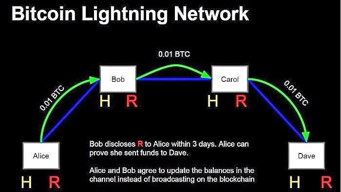

The world of cryptocurrency is continuously evolving, driven by innovations that address existing challenges and enhance its utility. Bitcoin, the first and most prominent cryptocurrency, has encountered multiple challenges over the years, with scalability being a significant concern. Initially designed to operate as a peer-to-peer digital cash system, Bitcoin's popularity exposed the limitations of its transaction processing capabilities. Specifically, Bitcoin's ability to process transactions is constrained by its block size limit and the ten-minute average block confirmation time. These constraints have resulted in increased transaction fees and prolonged confirmation times during periods of high demand, prompting extensive discussions on methods to enhance Bitcoin's scalability.

To address these scalability issues, several proposals have been suggested, one of the most notable being the Lightning Network. This innovation aims to improve Bitcoin's scalability by enabling transactions to occur off-chain, facilitating faster and cheaper transactions. Through this solution, Bitcoin can potentially handle a higher volume of transactions without compromising on cost-effectiveness and speed, effectively extending its utility.

This article provides an exploration of Bitcoin scalability, offering insight into the operational mechanisms of the Lightning Network and its potential to revolutionize the landscape of cryptocurrency algorithmic trading. By improving transaction speeds and reducing fees, scalable solutions like the Lightning Network hold promise for optimizing trading strategies within the cryptocurrency market.

## Table of Contents

## Understanding Bitcoin Scalability

Scalability in the context of cryptocurrency signifies the ability of a network to handle an increasing number of transactions and users without compromising performance. Bitcoin, as the pioneer in the cryptocurrency domain, has encountered significant scalability challenges primarily due to its inherent design constraints.

One of the core limitations affecting Bitcoin's scalability is its fixed block size of 1 megabyte. This restriction, coupled with the relatively long block confirmation time of approximately ten minutes, results in constrained transaction throughput. Essentially, the Bitcoin network can only process about 3 to 7 transactions per second (tps). By comparison, traditional financial systems such as Visa process thousands of transactions per second. Consequently, during periods of high demand, the Bitcoin network experiences congestion, leading to increased transaction fees and longer confirmation times. This situational bottleneck reflects a broader challenge of balancing efficiency, cost, and decentralization.

A variety of proposals have been introduced to address the scalability issue, igniting debates within the Bitcoin community over the best path forward. One such proposal is to increase the block size, allowing more transactions to be processed per block. However, larger block sizes also necessitate more storage space and bandwidth, potentially compromising the decentralized nature of the network by favoring participants with greater resources.

SegWit (Segregated Witness) represents another proposed solution that provides enhancements without altering the block size. Implemented in August 2017, SegWit separates transaction signatures (witness data) from transaction data. This innovative approach reduces the size of individual transactions, thereby increasing the effective capacity of each block. Additionally, SegWit solves transaction malleability issues, which serve as a foundation for further developments like the Lightning Network.

The Lightning Network, a prominent off-chain scaling solution, facilitates transactions outside the main blockchain while utilizing the underlying Bitcoin network for final settlement. By allowing users to transact in payment channels independent of the blockchain, the Lightning Network significantly reduces the load on the main chain. Such off-chain solutions highlight a trend towards creating hybrid systems that enhance scalability while maintaining Bitcoin's core attributes.

Understanding scalability is vital for recognizing the ongoing innovations that drive Bitcoin's evolution and its long-term viability. As debates continue and technologies evolve, the prospect of achieving a more scalable Bitcoin remains a powerful motivator for both developers and the wider [cryptocurrency](/wiki/cryptocurrency) community. Each proposal and solution carries its implications, necessitating careful consideration to address Bitcoin's scalability in a manner that aligns with the decentralized ethos that underpins its success.

## The Lightning Network: Bitcoin's Layer 2 Solution

The Lightning Network is a pioneering off-chain solution for Bitcoin, aimed at addressing the inherent scalability challenges of the blockchain. As a second-layer protocol, it is designed to function above the primary blockchain, facilitating a system of peer-to-peer payment channels. These channels allow participants to conduct numerous transactions off-chain, with the capability to settle the net result on the Bitcoin blockchain, thereby significantly reducing the burden on the network.

At the core of the Lightning Network's operation is the establishment of payment channels, which operate like ledgers between two parties. When a channel is created, the involved parties deposit an amount of Bitcoin into a multi-signature address. This address requires signatures from both parties to release the funds. Once the channel is established, participants can transact with each other indefinitely without broadcasting these transactions to the Bitcoin network. Only once they decide to close the channel is the final balance recorded on the blockchain.

The use of smart contracts is integral to the Lightning Network's functioning. Built upon those contracts, the network employs a mechanism known as Hash Time-Locked Contracts (HTLCs). HTLCs are smart contracts that use hashlocks and timelocks to secure transactions, ensuring that they are executed correctly or reverted if conditions are not met within a specified time frame. This provides a layer of security, making the transactions effectively trustless, even when conducted off-chain.

One of the most significant advantages of the Lightning Network is its ability to conduct microtransactions, which are often impractical directly on the main Bitcoin blockchain due to fees and processing times. By allowing these small-scale transactions to occur off-chain, the Lightning Network reduces transaction fees and confirms transactions in seconds, thereby enabling more frequent and cost-effective exchanges.

As the Lightning Network matures, its potential to transform Bitcoin transactions is increasingly apparent. By mitigating the scalability issues inherent to Bitcoin's design, it not only enhances the speed and cost-effectiveness of transactions but also broadens the scope of Bitcoin's application in sectors requiring rapid and frequent payment processing. This network component could become instrumental in expanding Bitcoin's utility beyond a store of value to a widely-used medium of exchange across various industries.

## Impact on Cryptocurrency Algorithmic Trading

Algorithmic trading is a cornerstone of modern finance, employing complex algorithms to facilitate swift and efficient decision-making in the financial markets. In cryptocurrencies, this approach is especially pertinent due to their inherent [volatility](/wiki/volatility-trading-strategies) and the continuous operation of crypto markets, which offer both advantages and hurdles.

The Lightning Network, a second-layer solution enhancing Bitcoin's scalability, can play a critical role in optimizing [algorithmic trading](/wiki/algorithmic-trading) in the cryptocurrency sector. By significantly reducing transaction costs and accelerating transaction speeds, the Lightning Network addresses two primary concerns faced by algorithmic traders: the cost-efficiency of transactions and the ability to execute trades quickly.

Speed is a pivotal [factor](/wiki/factor-investing) in algorithmic trading. With traditional Bitcoin transactions, confirmation times can extend to several minutes, hampering the ability of traders to react swiftly to market fluctuations. The Lightning Network mitigates this issue by enabling near-instantaneous transactions. This rapid transaction capability allows algorithms to execute trades with minimal latency, empowering traders to react promptly to dynamic market conditions and implement strategies without delay. This responsiveness is crucial in a market characterized by rapid price changes and can substantially decrease slippage—the difference between the expected price of a trade and the actual price at which the trade is executed.

Moreover, by reducing transaction fees, the Lightning Network alleviates another significant constraint in the deployment of algorithmic trading strategies. High fees can erode the profitability of frequent trading, but lower costs associated with the Lightning Network ensure that executing numerous small trades becomes economically viable. This efficiency enables traders to fine-tune their algorithms, optimize execution strategies, and enhance profitability margins.

The confluence of the Lightning Network's capabilities with algorithmic trading also ushers in new opportunities within the crypto finance domain. Python, a preferred language for developing trading algorithms, can be utilized to integrate the Lightning Network into trading frameworks, allowing for innovative trading strategies that leverage the speed and cost-effectiveness of off-chain transactions. For example, traders can implement Python scripts to automatically open and close channels on the Lightning Network based on predefined conditions, maximizing efficiency in trading operations.

In summary, the integration of the Lightning Network into algorithmic trading frameworks stands to revolutionize cryptocurrency markets. By offering enhanced speed and reduced costs, it provides traders with the tools necessary to navigate volatile markets with greater precision and confidence. As these technological integrations continue to evolve, they are set to redefine trading capabilities within the cryptocurrency sector.

## Challenges and Considerations

While the Lightning Network provides notable scalability enhancements for Bitcoin, it is accompanied by specific challenges and limitations that warrant careful examination.

One primary challenge is network [liquidity](/wiki/liquidity-risk-premium). The Lightning Network operates on a series of payment channels that require sufficient liquidity to facilitate transactions. Users must lock a certain amount of Bitcoin in a channel, and the total available liquidity directly impacts the network's capability to support larger or more frequent transactions. Insufficient liquidity can result in transaction failures, affecting the reliability and attractiveness of the Lightning Network for users.

Channel management is another complex aspect that affects the efficiency of the Lightning Network. Managing multiple payment channels involves determining optimal routes for transactions across the network. This requires advanced routing protocols and can lead to potential congestion if not handled effectively. Developers are continuously working on algorithms and strategies to improve the routing efficiency, but it remains a significant technical hurdle.

User adoption is crucial for the Lightning Network to achieve its full potential. Despite its advantages, adoption rates can be hindered by the technical complexity of setting up and managing payment channels. Simplified user interfaces and enhanced educational resources are necessary to encourage broader adoption among users, including merchants and consumers.

Security concerns arise due to the nature of off-chain transactions. While the Lightning Network utilizes smart contracts to secure transactions, the complexity of these contracts can introduce vulnerabilities. Ensuring the integrity and security of transactions is paramount, requiring ongoing scrutiny and improvements to the underlying technology.

Regulatory perspectives present additional challenges. The expansion of Bitcoin's capabilities through off-chain solutions like the Lightning Network prompts questions about compliance with existing financial regulations. Regulatory bodies across various jurisdictions may have differing views on off-chain transactions, creating a patchwork of compliance requirements that network participants must navigate.

The challenges associated with the Lightning Network underscore the need for ongoing development and innovation. Addressing these issues is critical for realizing the potential of Bitcoin's scalability solutions and their broader adoption in the cryptocurrency ecosystem. Continued efforts in technology development, educational outreach, and regulatory dialogue are essential for overcoming these obstacles and enhancing the Lightning Network's effectiveness.

## Conclusion

Bitcoin's scalability remains an ongoing challenge, but innovations like the Lightning Network provide promising pathways forward. By significantly improving transaction speeds and reducing costs, the Lightning Network has become crucial in enhancing Bitcoin's utility and efficiency. It allows for transactions to occur off-chain, alleviating the burden on Bitcoin's core blockchain. This scalability enhancement is vital for Bitcoin's continued competitiveness in the digital currency domain.

The impact of the Lightning Network on cryptocurrency markets, particularly through enabling more effective algorithmic trading, cannot be understated. Algorithmic trading benefits from reduced transaction latency and fees, crucial elements in executing strategies with higher precision and reliability. Faster transaction processing allows traders to react to market changes swiftly, thereby minimizing slippage and optimizing execution.

However, overcoming the existing challenges posed by the Lightning Network requires continuous development efforts, community support, and possibly regulatory clarity. Issues such as liquidity management, security vulnerabilities, and user adoption stand as barriers to the Lightning Network's full potential. Addressing these challenges will be essential for broader acceptance and integration.

Ultimately, the evolution of Bitcoin scalability solutions like the Lightning Network is set to shape the future landscape of the cryptocurrency ecosystem. As these solutions mature, they offer the possibility of a more scalable, efficient, and inclusive financial system, driving further innovation and adoption of digital currencies globally.

## References & Further Reading

[1]: Poon, J., & Dryja, T. (2016). ["The Bitcoin Lightning Network: Scalable Off-Chain Instant Payments."](https://lightning.network/lightning-network-paper.pdf)

[2]: Antonopoulos, A. M. (2017). ["Mastering Bitcoin: Unlocking Digital Cryptocurrencies."](https://books.google.com/books/about/Mastering_Bitcoin.html?id=IXmrBQAAQBAJ) O'Reilly Media.

[3]: Narayanan, A., Bonneau, J., Felten, E., Miller, A., & Goldfeder, S. (2016). ["Bitcoin and Cryptocurrency Technologies: A Comprehensive Introduction."](https://press.princeton.edu/books/hardcover/9780691171692/bitcoin-and-cryptocurrency-technologies) Princeton University Press.

[4]: Rizun, P. R. (2015). ["Subchains: A Technique to Scale Bitcoin and Improve the User Experience."](http://ledger.pitt.edu/ojs/ledger/article/view/40) Bitfury Group.

[5]: Conner, B., & Cairo, P. B. (2016). ["Bitcoin as a Trade Facilitator in the Global Economy."](https://www.mhebooklibrary.com/doi/book/10.1036/9780335263790)

[6]: Zohar, A. (2015). ["Bitcoin: under the hood."](https://dl.acm.org/doi/10.1145/2701411) Communications of the ACM, 58(9), 104-113.

[7]: Khalilov, M. C., & Levi, A. (2018). ["A Survey on Anonymity and Privacy in Bitcoin-like Digital Cash Systems."](https://ieeexplore.ieee.org/document/8325269) Elsevier Computer Networks.