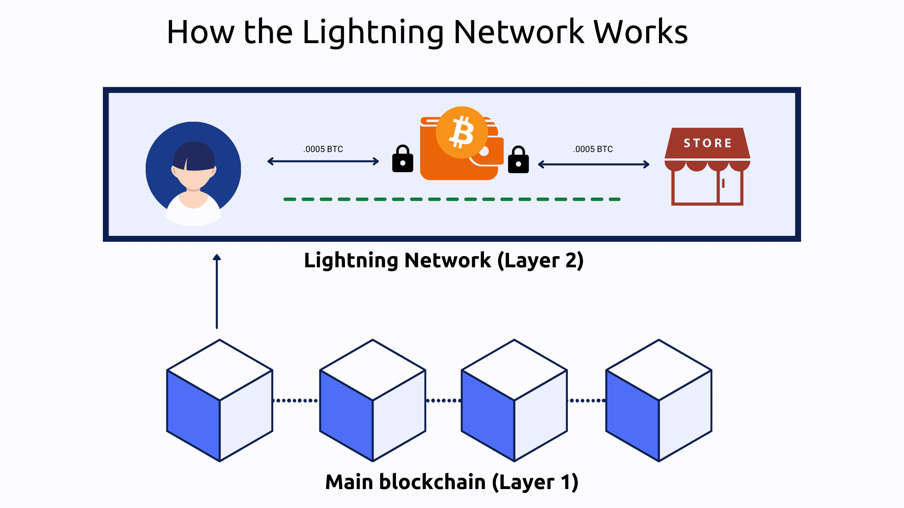

## Table of Contents

## What is the Lightning Network?

The Lightning Network is a special technology that helps make Bitcoin transactions faster and cheaper. It works by creating a network of payment channels between users. Instead of every transaction being recorded on the main Bitcoin blockchain, which can be slow and expensive, transactions happen off the main blockchain through these channels. This means you can send and receive Bitcoin almost instantly and for very little cost.

Imagine you and your friend want to send small amounts of Bitcoin back and forth many times. Without the Lightning Network, each transaction would need to be added to the Bitcoin blockchain, which could take time and money. But with the Lightning Network, you can open a payment channel, do all your transactions privately and quickly, and then settle the final amount on the blockchain when you're done. This makes it perfect for things like buying coffee or paying for small online services.

## How does the Lightning Network aim to solve Bitcoin's scalability issues?

The Lightning Network helps solve Bitcoin's scalability problems by allowing transactions to happen off the main Bitcoin blockchain. When Bitcoin's blockchain gets crowded, it can slow down and make transactions more expensive. The Lightning Network fixes this by letting people open special channels where they can send Bitcoin back and forth without needing to record every single transaction on the blockchain. This means more transactions can happen at the same time without overloading the main system.

By moving many transactions off the main blockchain, the Lightning Network reduces the load on it. This makes the whole Bitcoin network faster and cheaper to use. Instead of waiting for your transaction to be confirmed on the blockchain, which can take time, you can use the Lightning Network to send and receive Bitcoin almost instantly. This is great for everyday uses like buying things online or paying for small services, making Bitcoin more practical for regular people.

## What are the basic components of the Lightning Network?

The Lightning Network has a few key parts that make it work. The first part is payment channels. These are like special paths between two people where they can send Bitcoin back and forth without touching the main Bitcoin blockchain. To start using a payment channel, both people need to lock some Bitcoin in a shared account on the blockchain. Once the channel is open, they can do as many transactions as they want without needing to wait for the blockchain to confirm each one.

Another important part is nodes. Nodes are like the helpers of the Lightning Network. They keep the payment channels connected and help route payments from one person to another. If you want to send Bitcoin to someone who isn't directly connected to you, nodes can help find a path through the network to get the payment where it needs to go. This makes the network bigger and more useful because it connects more people together.

The last part is smart contracts. These are special rules written into the Bitcoin blockchain that make sure everyone plays fair in the payment channels. If someone tries to cheat or close a channel in a dishonest way, the smart contracts can stop them and make sure the right amount of Bitcoin goes to the right person. This keeps the whole system safe and trustworthy.

## How do payment channels work within the Lightning Network?

Payment channels in the Lightning Network are like private paths between two people where they can send Bitcoin back and forth without needing to use the main Bitcoin blockchain for every transaction. To start a payment channel, both people agree to lock some Bitcoin in a shared account on the blockchain. This is like putting money into a joint piggy bank. Once the channel is open, they can do as many transactions as they want between themselves without waiting for the blockchain to confirm each one. This makes sending Bitcoin fast and cheap because they're not using the crowded main blockchain for every little transaction.

When they're done using the payment channel, they can close it and settle the final amount on the blockchain. For example, if Alice and Bob opened a channel and Alice sent Bob 0.01 Bitcoin, but then Bob sent Alice 0.02 Bitcoin, when they close the channel, the blockchain will only need to record that Bob owes Alice 0.01 Bitcoin in total. This final transaction is the only one that needs to be added to the blockchain, keeping the network uncluttered. Payment channels make it easier for people to use Bitcoin for small, everyday transactions because it's faster and costs less than doing everything on the main blockchain.

## What is a Lightning invoice and how is it used?

A Lightning invoice is a special kind of bill you get when you want to pay someone using the Lightning Network. It's like a digital receipt that tells you exactly how much Bitcoin you need to send, and it includes a unique code so the payment goes to the right person. When you want to buy something, like a cup of coffee, the seller will give you a Lightning invoice with the price in Bitcoin. You can then use your Lightning Network wallet to scan or enter the invoice details and send the payment quickly.

Once you send the payment, it travels through the Lightning Network's payment channels to reach the seller almost instantly. The invoice makes sure the payment is safe and goes to the right place. After the seller gets the payment, they can confirm it and give you your coffee. This whole process is faster and cheaper than using the main Bitcoin blockchain because it happens off-chain, making it perfect for small, everyday purchases.

## How does routing work in the Lightning Network?

In the Lightning Network, routing is how payments find their way from the person sending the money to the person receiving it. When you want to send Bitcoin to someone, but you don't have a direct payment channel with them, the Lightning Network uses other people's payment channels to make a path. These other people are called nodes, and they help pass your payment along until it reaches the right person. Each node along the way takes a tiny fee for helping, which keeps the network running smoothly.

The process starts when your wallet looks for the best path to send your payment. It checks the network to find a series of payment channels that can connect you to the person you're paying. Once it finds a good path, it sends the payment through these channels, one hop at a time. If one path doesn't work, your wallet can try another route to make sure your payment gets through. This way, even if you're not directly connected to everyone on the Lightning Network, you can still send and receive payments quickly and cheaply.

## What are the advantages of using the Lightning Network over traditional blockchain transactions?

The Lightning Network makes sending Bitcoin faster and cheaper than using the regular blockchain. When you use the Lightning Network, you can send payments almost instantly because they don't need to be recorded on the main blockchain right away. This is great for things like buying a coffee or paying small bills online, where you don't want to wait for the blockchain to confirm your payment. Plus, because the Lightning Network uses payment channels, you don't have to pay high fees for each transaction, making it much cheaper for everyday use.

Another big advantage is that the Lightning Network helps the Bitcoin network handle more transactions at once. The regular blockchain can get slow and expensive when too many people are using it at the same time. But with the Lightning Network, lots of transactions can happen off the main blockchain, which means the whole system can work more smoothly. This makes Bitcoin more practical for regular people to use every day, not just for big transactions or long-term storage.

## What are some of the security concerns associated with the Lightning Network?

One security concern with the Lightning Network is the risk of channel theft. If someone opens a payment channel and then tries to close it dishonestly to take more Bitcoin than they should, it could lead to problems. Smart contracts help prevent this by making sure the final balance is fair when the channel is closed. But if someone manages to trick the system, it could still cause issues. It's important for users to keep their software updated and follow best practices to stay safe.

Another concern is the risk of losing funds if a payment channel is not closed properly. If someone loses their private keys or their computer crashes, they might not be able to close the channel and get their Bitcoin back. This is why it's crucial to back up your data and use secure methods to store your keys. The Lightning Network is still relatively new, so as it grows, more security features and better practices are being developed to protect users and their funds.

## How does the Lightning Network handle privacy and anonymity?

The Lightning Network tries to keep your transactions private by not putting every little payment on the main Bitcoin blockchain. When you use payment channels, only the person you're sending money to knows about it. This means fewer people can see what you're doing with your Bitcoin. But, if you need to send money to someone you're not directly connected to, the payment might go through other people's channels. Those people, called nodes, can see that a payment is happening, but they don't know who's sending or receiving the money.

Even though the Lightning Network helps keep things private, it's not perfect. If someone is really good at tracking payments, they might be able to figure out some details by watching the network closely. Also, when you open or close a payment channel, that information does go on the main blockchain, which is public. So, while the Lightning Network makes it harder for others to see your everyday transactions, you still need to be careful and use good privacy practices to stay as anonymous as possible.

## What are the current limitations and challenges facing the Lightning Network?

One big challenge with the Lightning Network is that it can be tricky to use. You need to open and manage payment channels, which means you have to lock up some Bitcoin to use them. If you don't have enough channels open, you might not be able to send payments to everyone you want to. Also, if you lose your private keys or your computer crashes, you could lose the Bitcoin in your channels. This makes it important to back up your data and use secure methods to store your keys.

Another limitation is that the Lightning Network still has some security concerns. While smart contracts help keep things fair, there's still a risk of channel theft if someone tries to close a channel dishonestly. And because the Lightning Network is still new, it's always being improved, which means there could be bugs or issues that haven't been found yet. As more people use it, these problems might get fixed, but right now, it's something to be aware of.

## How can one set up and use a Lightning Network node?

Setting up a Lightning Network node involves a few steps. First, you need to install the right software on your computer. Popular choices include LND (Lightning Network Daemon), c-lightning, or Eclair. Once you have the software, you'll need to set it up to connect to the Bitcoin blockchain. This usually means running a Bitcoin node on your computer, too, which can take up a lot of space and require a good internet connection. After everything is set up, you'll need to fund your node with some Bitcoin to open payment channels.

Using your Lightning Network node is all about opening and managing payment channels. To send or receive payments, you open a channel with someone else on the network. You'll need to lock some Bitcoin in the channel to use it. Once the channel is open, you can send payments back and forth without using the main Bitcoin blockchain. When you're done, you can close the channel, and the final balance will be settled on the blockchain. It's important to keep your node running smoothly and securely to make sure your payments go through and your Bitcoin stays safe.

## What future developments are expected for the Lightning Network and how might they impact its functionality?

In the future, people working on the Lightning Network want to make it easier to use. They are trying to make the software simpler so more people can set up and run their own nodes without needing to be experts. They also want to make it easier to open and close payment channels, so you don't have to lock up so much Bitcoin to use the network. Another big goal is to make the network more reliable, so your payments always go through quickly and safely. These changes could help more people start using the Lightning Network for everyday things like buying coffee or paying bills.

There are also plans to make the Lightning Network more private. Right now, if you need to send money through other people's channels, they can see that a payment is happening. Future updates might make it harder for others to track your payments, keeping your transactions more private. As the Lightning Network grows, it could become a big part of how people use Bitcoin, making it faster and cheaper to send money anywhere in the world. These developments could make the Lightning Network a powerful tool for everyday use, helping Bitcoin become more practical for everyone.

## References & Further Reading

[1]: Poon, J., & Dryja, T. (2016). ["The Bitcoin Lightning Network: Scalable Off-Chain Instant Payments."](https://lightning.network/lightning-network-paper.pdf)

[2]: Antonopoulos, A. M. (2017). ["Mastering Bitcoin: Unlocking Digital Cryptocurrencies."](https://books.google.com/books/about/Mastering_Bitcoin.html?id=IXmrBQAAQBAJ) O'Reilly Media.

[3]: Narayanan, A., Bonneau, J., Felten, E., Miller, A., & Goldfeder, S. (2016). ["Bitcoin and Cryptocurrency Technologies: A Comprehensive Introduction."](https://press.princeton.edu/books/hardcover/9780691171692/bitcoin-and-cryptocurrency-technologies) Princeton University Press.

[4]: Rizun, P. R. (2015). ["Subchains: A Technique to Scale Bitcoin and Improve the User Experience."](http://ledger.pitt.edu/ojs/ledger/article/view/40) Bitfury Group.

[5]: Conner, B., & Cairo, P. B. (2016). ["Bitcoin as a Trade Facilitator in the Global Economy."](https://www.mhebooklibrary.com/doi/book/10.1036/9780335263790)

[6]: Zohar, A. (2015). ["Bitcoin: under the hood."](https://dl.acm.org/doi/10.1145/2701411) Communications of the ACM, 58(9), 104-113.

[7]: Khalilov, M. C., & Levi, A. (2018). ["A Survey on Anonymity and Privacy in Bitcoin-like Digital Cash Systems."](https://ieeexplore.ieee.org/document/8325269) Elsevier Computer Networks.