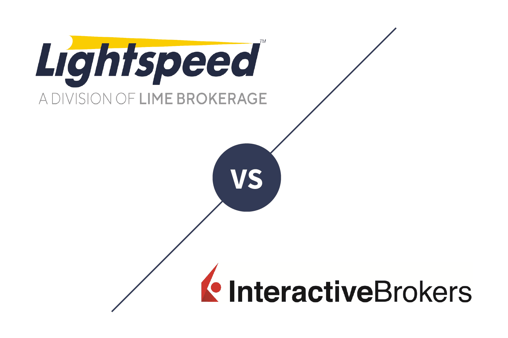

The landscape of algorithmic trading is evolving at a remarkable pace, driven extensively by advancements in technology. Platforms like Lightspeed Trading have emerged as pivotal tools for active traders, helping them capitalize on these technological developments. Lightspeed Trading, in particular, has established itself as a notable player by catering to traders with stringent demands for speed and precision. This article will examine Lightspeed's offerings as of 2024, assessing its features, cost structure, and overall trading experience. The aim is to equip traders with the necessary insights to determine whether Lightspeed aligns with their needs in the constantly moving environment of algorithmic trading.

## Table of Contents



## Company Overview

Lightspeed Trading, a notable presence in the financial markets, operates out of its headquarters in Morristown, New Jersey. Established with a strong connection to the proprietary day trading community, Lightspeed Trading is specially tailored to meet the demands of active traders who engage in high-volume trading activities. This focus stems from its origins, serving traders who require timely and efficient execution capabilities to capitalize on market opportunities.

The company's evolution has seen it broaden its services, now encompassing a wide range of trading products. This expansion notably includes the domain of cryptocurrency trading. Lightspeed achieved this through the acquisition of Coinigy, a decision indicative of the growing integration of digital assets into mainstream trading platforms. The acquisition allows Lightspeed to offer comprehensive cryptocurrency trading services, supplementing their already extensive suite of trading options including equities, options, and futures.

By integrating Coinigy's capabilities, Lightspeed not only enhanced its offering but also fortified its position as a versatile broker catering to traders who require both traditional and modern financial instruments. This strategic move underscores Lightspeed Trading's commitment to innovation and adaptability in the fast-paced environment of financial trading.

## Pros & Cons of Lightspeed

Lightspeed Trading is known for its highly customizable platforms that cater to the distinct needs of active, high-[volume](/wiki/volume-trading-strategy) traders. This customization extends across multiple dimensions of trading, including user interface adjustments, [algorithmic trading](/wiki/algorithmic-trading) capabilities, and order routing options. The platform is particularly appealing to traders who demand precision and advanced functionality in their trading instruments, allowing for optimized trading performance.

One notable advantage for high-volume traders is the competitive pricing structure Lightspeed offers. The tiered commission model becomes increasingly favorable as trading volumes rise, thereby reducing the cost per trade for users who engage in frequent market activity. This makes Lightspeed an attractive option for seasoned traders who can capitalize on these competitive rates.

Lightspeed also supports an impressive breadth of trading assets, encompassing equities, options, futures, and cryptocurrencies. This diversity allows traders to engage in multiple asset classes through a single platform, providing flexibility and the ability to diversify trading strategies. Such broad offerings cater to a wide array of trading preferences and strategic objectives, enhancing the platform's overall utility for active traders.

However, Lightspeed may not be well-suited for all types of investors. Its design and features are specifically tailored to active trading environments, which might not be ideal for buy-and-hold investors. Those who prefer a more passive investment strategy may find the platform's advanced tools and customizations unnecessary, and its fee structure less advantageous for infrequent trading.

Moreover, the platform presents a steep learning curve for beginners. The robust set of tools and features that appeal to experienced traders can be overwhelming for new users unfamiliar with the intricacies of active trading platforms. Beginners may require considerable time and effort to become proficient with the available functionalities, which can be discouraging for those seeking a more intuitive trading experience.

In conclusion, Lightspeed Trading excels in providing a richly customizable and economically beneficial platform for high-volume traders while presenting challenges for buy-and-hold investors and novices.

## Usability and Platform Experience

Lightspeed Trading is engineered to cater to the needs of seasoned traders through a comprehensive array of tools and sophisticated features. These features are primarily embedded in their high-performance downloadable platform, Lightspeed Trader, which is tailored to manage complex trading strategies and high-frequency trading activities. This platform offers substantial flexibility, enabling traders to customize their interface profoundly, including but not limited to hotkeys, complex order types, and advanced charting capabilities.

For new traders, the initial interface might appear daunting, given the extensive customization options and the advanced functionalities it presents. However, with practice and familiarity, users can exploit the platform to its full potential. Mastery over the interface translates into an enhanced trading experience, characterized by precise trade execution and efficient decision-making capabilities.

In addition to the primary platform, Lightspeed extends its usability through web-based and mobile versions that are designed to be more user-friendly. These versions bridge the gap for traders who prefer on-the-go trading and provide a more intuitive interface compared to their sophisticated desktop counterpart. While they may lack some of the advanced features of the downloadable app, the web and mobile versions maintain essential functionalities, ensuring users can execute trades swiftly and manage their portfolios with ease.

The differentiation between these versions ensures that traders can select a platform version that aligns with their trading style and experience level. For those committed to exploiting the full potential of high-speed trading and in-depth market analysis, the downloadable platform offers unmatched capabilities. Conversely, traders looking for ease and mobility find the web-based and mobile solutions adequately address their needs without sacrificing core functionalities.

## Range of Offerings

Lightspeed Trading provides a diversified array of trading instruments, catering to the needs of high-volume traders interested in various asset classes. The platform supports trading in stocks, exchange-traded funds (ETFs), futures, options, and cryptocurrencies. This range allows traders to deploy multiple strategies across different markets, thereby potentially enhancing their trading portfolios. 

Despite the broad spectrum of assets available, Lightspeed does not currently support fractional share trading. This limitation might be a consideration for traders who wish to invest in high-priced stocks without committing to purchasing full shares. The absence of fractional shares can deter smaller investors or those looking to engage in precision investing tactics.

Moreover, Lightspeed has augmented its offerings by incorporating a professional Application Programming Interface (API) aimed at trading automation. This API empowers traders to execute algorithmic trading strategies, allowing them to automate trades based on pre-set conditions. Algorithmic trading is increasingly vital for active traders looking to optimize their trading operations through speed and efficiency. The API provides access to real-time market data, enabling algorithm developers to deploy highly responsive trading strategies.

Below is a basic example of how a Python script could be structured to execute trades using Lightspeed’s API. This script hypothetically checks for certain conditions and places a buy order if the conditions are met:

```python
import lightspeed_api

# Connect to Lightspeed API
api = lightspeed_api.connect(api_key='YOUR_API_KEY')

# Define trading parameters
symbol = 'AAPL'
quantity = 10
price_threshold = 150.00

# Fetch real-time market data
market_data = api.get_market_data(symbol)

# Trading logic: Buy if price drops below threshold
if market_data['current_price'] < price_threshold:
    api.place_order(symbol=symbol, quantity=quantity, order_type='buy')

# Disconnect from API
api.disconnect()
```

This code demonstrates the potential for high-speed execution of trading strategies on the Lightspeed platform. In conclusion, while fractional share trading is not available, the robust offerings and advanced technological integration of Lightspeed Trading make it a compelling choice for traders focused on automated and algorithmic strategies.

## Trading Experience and Technology

Lightspeed Trader is renowned for providing direct market access (DMA), a feature that significantly enhances the speed and efficiency of trade execution. Direct market access enables traders to transact directly with financial market venues such as exchanges, bypassing intermediary brokers. This access is crucial for active traders who require rapid order execution to capitalize on fleeting market opportunities.

The platform allows for the configuration of multiple order entries, offering substantial flexibility and control over trading strategies. With the capacity to set various order types, traders can tailor their trading experience to suit specific needs. This customization ensures that traders can implement complex strategies efficiently, reducing the risk of errors and enhancing overall trading effectiveness.

Routing algorithms are another pivotal feature of Lightspeed Trader, designed to optimize trade executions. These algorithms can dynamically select the best possible route for an order to maximize execution quality, such as achieving the best price or speed. By leveraging routing algorithms, traders can optimize their transactions, ensuring that order entries and exits are handled with precision and efficiency.

A recent significant enhancement to Lightspeed's trading technology is the introduction of trade automation via their API. This development aligns with the growing trend towards algorithmic trading, where trading strategies are automated to make decisions and execute trades at speeds and efficiencies that are not possible for human traders. The API allows for the integration of custom algorithms, providing users the flexibility to implement and backtest their strategies within the Lightspeed ecosystem. Here is a basic example of using Python to access Lightspeed’s API for automated trading:

```python
import requests

# Replace with your API credentials and endpoint
api_key = 'your_api_key'
api_secret = 'your_api_secret'
api_endpoint = 'https://api.lightspeed.com/v1/orders'

def place_order(symbol, quantity, order_type):
    headers = {
        'Authorization': f'Bearer {api_key}',
        'Content-Type': 'application/json'
    }
    payload = {
        'symbol': symbol,
        'quantity': quantity,
        'order_type': order_type
    }

    response = requests.post(api_endpoint, headers=headers, json=payload)

    if response.status_code == 200:
        return response.json()
    else:
        raise Exception(f"API error: {response.status_code}, {response.text}")

# Example usage
order_response = place_order('AAPL', 100, 'market')
print(order_response)
```

Overall, Lightspeed Trader’s robust platform and advanced trading technologies make it an attractive option for algorithmic traders and those engaged in high-frequency trading. The platform's continuous updates and advanced tools contribute to its ability to meet the demands of modern trading environments effectively.

## Costs and Fees

Lightspeed Trading employs a tiered commission structure, which provides competitive rates for traders engaged in high-volume activities. At its core, the tiered system is designed to offer financial incentives for traders who execute large numbers of trades or trade substantial volumes of assets, thereby reducing the per-trade cost relative to lower-volume traders.

The commission structure primarily applies to equities and options, with reduced rates as trading volume increases. For instance, equities trades might be charged at a base rate per share that decreases once a defined volume threshold is surpassed. Similarly, options trading fees follow a tiered approach, potentially offering reductions based on the number of contracts traded monthly.

In addition to standard trading commissions, Lightspeed introduces a layer of complexity with additional fees associated with platform access. Traders may encounter fees related to the choice of order routing paths, which can influence the speed and cost of trade execution. These routing options are particularly appealing to traders looking for specific trade execution outcomes, such as optimal speed or minimal cost.

Furthermore, new traders considering Lightspeed should be mindful of certain financial preconditions and potential hidden fees. A minimum account balance requirement is typically enforced, serving as a barrier to entry for some traders. This requirement ensures that traders maintain a stake sizeable enough to align with the platform’s focus on high-volume trading.

Potential hidden fees can arise from various platform functionalities or optional services. These might include charges for accessing advanced trading tools, market data subscriptions, or even inactivity fees. Therefore, it is crucial for traders to thoroughly review the fee schedule and account terms provided by Lightspeed to anticipate the full scope of charges they might incur.

## Customer Service and Support

Lightspeed Trading provides customer support via phone and email during market hours, catering primarily to active traders who may need immediate assistance as they manage high-volume trades. Despite the lack of live chat support, which is often considered a standard feature on many trading platforms today, Lightspeed focuses on efficient communication through its existing channels. Customers can expect to receive prompt responses from knowledgeable representatives during trading hours, which is critical in maintaining smooth trading operations for their clientele.

In terms of educational resources, Lightspeed's offerings are somewhat limited, yet they do provide valuable tools for traders looking to refine their skills. The platform offers video tutorials that cover various trading strategies and platform functionalities, assisting users in navigating and utilizing the platform's robust features effectively. Additionally, they host webinars that allow traders to engage with industry experts and gain insights into market trends and complex trading concepts.

Lightspeed has also established partnerships with third-party educational providers, potentially broadening the scope of learning materials available to its users. These collaborations can help traders enhance their knowledge and trading acumen, particularly those who are adept at leveraging such resources for in-depth learning. However, new users or those less experienced in the financial markets may find these resources inadequate without supplementary learning tools or guidance.

While Lightspeed's support and educational offerings may fall short for traders seeking comprehensive training or around-the-clock assistance, the available resources are designed to meet the practical needs of their primary audience—active and experienced traders pursuing high-speed and high-volume trades.

## Conclusion

Lightspeed continues to solidify its position as a leading choice for active day traders, particularly those engaged in high-volume trading activities. This platform distinguishes itself through its superior speed and level of customization, which are paramount for traders aiming to maximize efficiency and profitability. The advanced technology embedded in Lightspeed allows for rapid order execution and offers extensive tools tailored to meet the demands of professional traders.

However, these strengths may simultaneously present hurdles for less experienced or casual traders. The platform’s complexity and a steep learning curve may require significant time and effort to master, potentially discouraging those who do not frequently trade or who prefer a more straightforward trading environment. Moreover, while Lightspeed provides scalable solutions with competitive pricing structures for high-frequency traders, its cost may prove less economical for those engaging in lower volume trades. The platform’s multitude of features and fee structures is more advantageous to experienced traders who can fully utilize its offerings and absorb the associated costs within their trading operations.

The broker's unwavering commitment to serving active trading niches is evident, drawing in dedicated users who prioritize speed and bespoke solutions over simplified, low-cost alternatives. Even with higher expenses for those not trading at high volumes, Lightspeed continues to be a dominant force, catering to traders whose strategies align with its specialized tools and services. As a result, Lightspeed's platform remains a crucial resource for traders committed to pursuing algorithmic trading strategies within a competitive market.

## Final Thoughts

Choosing the right trading platform is paramount to achieving your financial objectives, particularly in the intricate and fast-paced domain of algorithmic trading. The decision hinges on several factors, including your trading style, specific needs, and level of experience. For traders who prioritize speed and require the capability to handle high trading volumes, Lightspeed Trading presents several advantageous features. Its platform is tailored to facilitate rapid execution and provide a high degree of customization, which can significantly enhance trading performance.

However, before committing to Lightspeed, traders should conduct a careful evaluation to determine whether its offerings align with their trading goals. Considerations should include the platform's costs, user interface complexity, and the specific trading instruments you plan to engage with. With the ever-evolving landscape of financial markets and technology, it's crucial that your selected platform can nimbly adapt to new challenges and opportunities, maintaining a competitive edge in algorithmic trading. Understanding these nuances will inform whether Lightspeed can meet your strategic objectives within this competitive trading environment.

## References & Further Reading

[1]: Bergstra, J., Bardenet, R., Bengio, Y., & Kégl, B. (2011). ["Algorithms for Hyper-Parameter Optimization."](https://proceedings.neurips.cc/paper/2011/file/86e8f7ab32cfd12577bc2619bc635690-Paper.pdf) Advances in Neural Information Processing Systems 24.

[2]: ["Advances in Financial Machine Learning"](https://www.amazon.com/Advances-Financial-Machine-Learning-Marcos/dp/1119482089) by Marcos Lopez de Prado

[3]: ["Evidence-Based Technical Analysis: Applying the Scientific Method and Statistical Inference to Trading Signals"](https://www.amazon.com/Evidence-Based-Technical-Analysis-Scientific-Statistical/dp/0470008741) by David Aronson

[4]: ["Machine Learning for Algorithmic Trading"](https://github.com/PacktPublishing/Machine-Learning-for-Algorithmic-Trading-Second-Edition) by Stefan Jansen

[5]: ["Quantitative Trading: How to Build Your Own Algorithmic Trading Business"](https://www.amazon.com/Quantitative-Trading-Build-Algorithmic-Business/dp/1119800064) by Ernest P. Chan