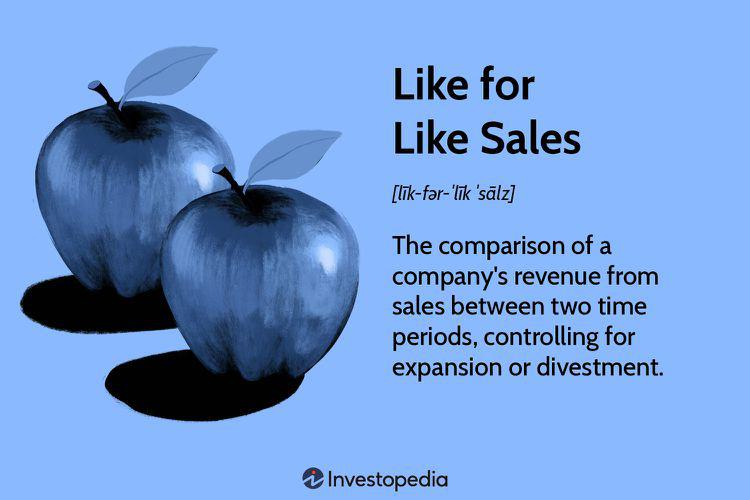

The retail industry has long been characterized by its dynamic nature, continually adapting to shifts in consumer preferences, technological advancements, and economic conditions. A key metric utilized in understanding this evolving landscape is like-for-like sales, also referred to as comparable or same-store sales. This metric is essential for gauging a retailer's organic growth by focusing exclusively on the performance of established outlets, thereby excluding the influence of new store openings or acquisitions.

Like-for-like sales provide crucial insights into a company's true performance by isolating sales data from existing stores over a consistent period, enabling a clearer understanding of genuine growth trends and shifts in consumer behavior. This method allows retailers to precisely assess the health of their existing operations without the distortion caused by new business developments.



Traditional methods of evaluating retail performance often centered on basic sales figures, which, while informative, could sometimes misrepresent a company's organic growth trajectory. In contrast, like-for-like sales offer a more nuanced picture, stripping away external variables to deliver a purer analysis of performance. By doing so, this metric equips retailers with the insights needed to refine and adjust their strategies effectively.

In recent years, the integration of modern algorithms and technological innovations has further enriched retail sales performance analysis. Algorithmic trading, traditionally associated with financial markets, has started to influence retail strategies, using data-driven insights to optimize stock levels, pricing strategies, and marketing efforts. These advancements highlight the shift towards a more analytical and precise approach to understanding consumer dynamics and enhancing operational efficiency.

In this article, we explore the significance of like-for-like sales as a foundational metric for assessing retail performance, alongside the impact of algorithmic trading on contemporary retail strategies. Through this exploration, readers will gain a comprehensive understanding of key retail metrics and the strategic implications they hold in a rapidly changing retail environment. As the industry progresses, the ability to harness these insights will be critical in ensuring sustained growth and competitive advantage.

## Table of Contents

## Understanding Like-for-Like Sales

Like-for-like sales, often referred to as comparable or same-store sales, are a critical metric in the retail industry, offering a clear view of a company's intrinsic growth. Unlike total sales figures, which may be inflated by the addition of new stores or acquisitions, like-for-like sales focus exclusively on sales generated by existing outlets. This ensures that the growth observed is organic and not artificially boosted by expansion or external acquisitions.

The calculation of like-for-like sales is straightforward. For any given period, it involves comparing sales from existing stores that have been open for at least one year. This time frame allows for the exclusion of the initial novelty period that frequently accompanies new store openings. By doing so, businesses can assess the true performance of their established locations without extraneous influences.

```python
def calculate_like_for_like_sales(existing_store_sales_previous, existing_store_sales_current):
    # Ensure the data provided is accurate and positive
    assert all(sale >= 0 for sale in [existing_store_sales_previous, existing_store_sales_current]), "Sales figures must be non-negative."

    # Calculate the like-for-like sales growth
    growth_rate = ((existing_store_sales_current - existing_store_sales_previous) / existing_store_sales_previous) * 100
    return growth_rate

# Example usage:
previous_sales = 50000  # Sales figures from the previous period
current_sales = 55000   # Sales figures from the current period
growth = calculate_like_for_like_sales(previous_sales, current_sales)
print(f"Like-for-Like Sales Growth: {growth:.2f}%")
```

Retailers derive several insights from like-for-like sales analysis. Firstly, it allows them to scrutinize the efficacy of current retail strategies, salesforce effectiveness, and product appeal. For instance, if a particular store's performance declines, this could indicate local competitive pressures or ineffective in-store promotions. Secondly, these metrics are vital for identifying sales trends and changes in consumer behavior. Consistent performance in like-for-like sales can signal a loyal customer base, while fluctuations might suggest evolving customer preferences or market conditions.

The significance of like-for-like sales extends beyond immediate business assessment. They serve as a benchmark for operational performance and are a critical input for strategic planning. Analysts often prefer this metric as it eliminates noise caused by rapid expansion, allowing for a more honest appraisal of company health. This is particularly important for investors and stakeholders focused on long-term sustainability rather than short-term gains.

In conclusion, like-for-like sales are indispensable for understanding true retail performance. By providing a focused view of sales derived from longstanding stores, businesses can make informed strategic decisions, ensuring that growth is both sustainable and indicative of genuine market demand.

## Strategies to Improve Like-for-Like Sales

Improving like-for-like sales is imperative for maintaining a sustainable growth trajectory and gaining a competitive edge in the retail sector. At the core of this strategy is the effective use of customer data analytics, which allows retailers to tailor shopping experiences precisely to meet diverse consumer needs. By analyzing purchasing patterns, demographics, and consumer preferences, retailers can personalize recommendations, optimize product assortments, and improve user interfaces, thereby enhancing the overall shopping experience and fostering customer loyalty.

Loyalty programs are another crucial element in boosting like-for-like sales. These programs are designed to reward repeat customers and incentivize further purchases by offering benefits such as discounts, exclusive access to products, or special promotions. By strategically analyzing consumer data, retailers can tailor these programs to better match customer interests and motivations, increasing engagement and purchase frequency.

Promotions and targeted marketing campaigns are effective tools for stimulating demand and boosting sales in established outlets. Retailers often utilize data-driven insights to craft promotions that appeal specifically to their customer base. For instance, analyzing historical sales data helps identify the most effective timing and types of promotions. Furthermore, targeted marketing efforts, whether through digital channels or traditional media, ensure that promotions reach the right audience, thus maximizing impact.

Technological advancements, particularly in [artificial intelligence](/wiki/ai-artificial-intelligence) and [machine learning](/wiki/machine-learning), have revolutionized the way retailers can implement these strategies. AI-driven analytics can process large datasets to uncover hidden patterns and provide actionable insights. For example, predictive analytics can foresee changes in consumer behavior, allowing retailers to adjust stock levels and manage pricing strategies proactively. Additionally, AI-enhanced chatbots and virtual assistants can provide customers with real-time support and recommendations, further personalizing the shopping experience.

The convergence of traditional methods with modern technological innovations enhances retail performance. While loyalty programs and promotions remain central to retail strategies, their efficacy is significantly amplified when supported by sophisticated data analytics and AI tools. This blend of methodologies ensures retailers remain agile and responsive to market fluctuations and consumer demands, thereby improving like-for-like sales and fostering sustained business success.

## Algorithmic Trading in Retail

Algorithmic trading has traditionally been associated with financial markets, but its application in retail is becoming increasingly significant. Retailers are leveraging algorithms to process and interpret extensive volumes of consumer data, thereby identifying trends and optimizing operations such as stock management, pricing strategies, and marketing initiatives. 

By analyzing consumer behaviors and purchasing patterns, algorithms make it possible to adjust inventory levels proactively. For instance, predictive algorithms can forecast demand surges for certain products, enabling retailers to stock appropriately and reduce both surplus and stockouts. Such methods ensure that inventory levels are aligned with anticipated consumer demand, thereby enhancing the efficiency of supply chain operations.

Furthermore, algorithms facilitate dynamic pricing strategies by evaluating factors such as competitor pricing, consumer demand, and purchasing trends. This real-time price optimization allows retailers to adjust their pricing to remain competitive while maximizing profitability. As an example, a Python-based algorithm could be employed to dynamically adjust product prices:

```python
import numpy as np

def adjust_price(current_price, competitor_price, demand):
    price_elasticity = 0.5  # Assumed price elasticity of demand
    optimal_price = current_price * (1 + price_elasticity * (demand - competitor_price) / competitor_price)
    return max(optimal_price, 0)  # Ensure price doesn't go below zero

current_price = 100
competitor_price = 95
estimated_demand_increase = 0.1

new_price = adjust_price(current_price, competitor_price, estimated_demand_increase)
print(f"Adjusted Price: ${new_price:.2f}")
```

In terms of marketing, [algorithmic trading](/wiki/algorithmic-trading) tools can tailor promotional efforts by segmenting consumers based on purchasing preferences and behaviors. This segmentation allows for targeted marketing campaigns that are more likely to resonate with each consumer segment, increasing the probability of conversion and enhancing like-for-like sales performance.

The integration of algorithmic trading into retail operations signifies a shift towards data-driven decision-making. By using algorithms to interpret large data sets, retailers can pinpoint lucrative opportunities and minimize operational risks. Importantly, algorithmic analysis provides insights that can directly impact like-for-like sales, a crucial metric for assessing organic growth within established retail outlets.

In summary, the retail sector is increasingly utilizing algorithmic insights to drive efficiency and improve customer satisfaction. As technological capabilities grow, algorithmic trading is set to play a pivotal role in shaping the future of retail, with data-driven insights informing strategic decisions. Retailers that adeptly harness these tools will likely achieve enhanced performance and a competitive advantage in a rapidly evolving marketplace.

## Challenges and Special Considerations

Despite the numerous advantages of the like-for-like sales metric, its application is accompanied by several challenges and special considerations. One of the primary issues is the potential for misinterpretation. This often occurs when substantial changes within comparable units are not accounted for, leading to skewed results. For instance, significant renovations, changes in product offerings, or store relocations can drastically alter sales figures, making it difficult to ascertain true performance. Retailers must ensure that such variations are meticulously documented and adjusted for in their analyses to maintain the integrity of like-for-like comparisons.

External factors such as economic fluctuations and seasonality also pose significant challenges to the accuracy of like-for-like sales analyses. An economic downturn, for example, can lead to decreased consumer spending across the board, influencing sales figures in a way that may not accurately reflect a store's operational efficiency or customer satisfaction. Similarly, seasonal variations can cause spikes or drops in sales that are unrelated to the underlying performance of the business. To address these issues, retailers need to contextualize their analyses with external data, perhaps integrating economic indicators or seasonal adjustments to discern genuine trends from temporary influences.

Retailers must remain vigilant in their use of like-for-like data through comprehensive data interpretation. Advanced statistical techniques can be beneficial here, where data can be adjusted using multivariate regression models to account for external variables. Python, a powerful and accessible tool for data analysis, can be employed to construct these models. For example, a simple linear regression model to adjust like-for-like sales data might look like this:

```python
import pandas as pd
from sklearn.linear_model import LinearRegression

# Sample data
data = {'sales': [200, 220, 205, 210], 'economic_index': [1.02, 1.01, 0.98, 1.03], 'seasonality_factor': [1.0, 1.1, 0.9, 1.0]}
df = pd.DataFrame(data)

# Features and target
X = df[['economic_index', 'seasonality_factor']]
y = df['sales']

# Linear Regression model
model = LinearRegression().fit(X, y)

# Predicting adjusted sales
predictions = model.predict(X)
```

Retailers can use such models to extract more accurate insights from their data, adjusting for known external influences.

Lastly, strategic use of like-for-like sales data necessitates ongoing evaluation and adjustment of analytical methodologies. As both internal and external business environments evolve, so too must the approaches to measuring and interpreting sales data. Retailers should adopt a dynamic approach, continuously refining their strategies and analytical frameworks to harness the full potential of like-for-like metrics. This commitment to robust data analysis will empower retailers to craft and implement strategies that are both responsive and proactive, ensuring sustained success in an ever-changing retail landscape.

## Conclusion: Optimizing Retail Performance

A strategic focus on like-for-like sales, combined with the integration of algorithmic tools, is essential for optimizing retail performance. By concentrating on these metrics, retailers gain a transparent view of their organic growth and operational efficacy. This understanding empowers retail businesses to tailor customer experiences, fostering loyalty and maximizing profitability. 

Advanced tools in algorithmic trading enable retailers to gather, process, and analyze extensive consumer data. This data-driven decision-making assists in identifying emerging trends, optimizing inventory, and refining pricing models, thus laying a strong foundation for sustainable success. The strategic application of these insights transforms retail operations, driving efficiency and innovation.

As the retail industry continuously changes, those who adapt swiftly to technological developments are poised to lead. Retailers equipped with the foresight to adopt cutting-edge tools maintain a competitive edge, enhancing their ability to respond to market demands and consumer expectations. In the digital age, embracing innovation and applying strategic foresight will differentiate industry leaders from their peers. Retailers must remain proactive in leveraging technology to stay ahead, ensuring their operations align with the evolving demands of customers and the market.

## References & Further Reading

[1]: ["Retail Management: A Strategic Approach"](https://www.amazon.com/Retail-Management-Strategic-Approach-13th/dp/0133796841) by Barry Berman and Joel R. Evans

[2]: ["Advances in Financial Machine Learning"](https://www.amazon.com/Advances-Financial-Machine-Learning-Marcos/dp/1119482089) by Marcos Lopez de Prado

[3]: ["Retail Analytics: The Secret Weapon"](https://www.amazon.com/Retail-Analytics-Secret-Emmett-Cox/dp/1118099842) by Emmett Cox

[4]: ["Machine Learning for Algorithmic Trading"](https://github.com/stefan-jansen/machine-learning-for-trading) by Stefan Jansen

[5]: ["Quantitative Trading: How to Build Your Own Algorithmic Trading Business"](https://www.amazon.com/Quantitative-Trading-Build-Algorithmic-Business/dp/1119800064) by Ernest P. Chan