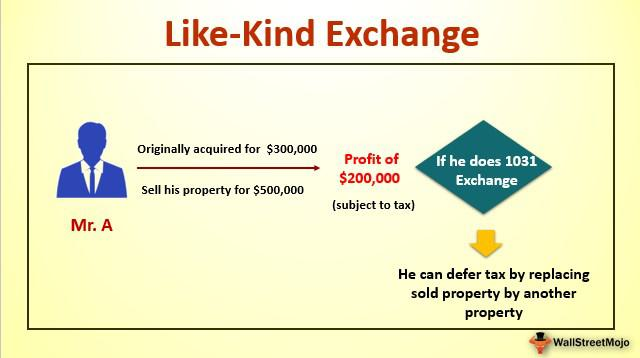

The modern real estate landscape presents a multitude of strategies for investors aiming to optimize their tax liabilities and enhance their investment returns. Central among these strategies is the like-kind exchange, also known as a 1031 exchange, which serves as a beneficial tax deferral tool primarily utilized by real estate investors. A 1031 exchange allows investors to defer capital gains taxes by exchanging qualifying properties, therefore preserving capital for reinvestment in potentially higher-yield properties.

In parallel, algorithmic trading, or algo trading, introduces another innovative dimension within financial markets, which can significantly enhance real estate investment portfolios. By employing complex algorithms to execute trades at optimal times, algo trading seeks to maximize returns and manage risk through data-driven decisions and high-speed execution. Integrating algo trading into real estate investment strategies offers a unique opportunity to optimize timing and execution of related financial transactions, thereby enhancing overall portfolio management.



This article explores the intersection of these two domains — 1031 exchanges in real estate and algo trading in financial markets — as effective tax and investment strategies. By examining their integration, our goal is to illuminate how these strategies can coexist and inform real estate investment decisions, providing investors with a dual advantage in both tax optimization and enhanced financial outcomes. Understanding the synergies between 1031 exchanges and algorithmic trading could enable investors to strategically navigate the complexities of modern real estate investments while harnessing the growth potential offered by advanced trading technologies.

## Table of Contents

## Understanding Like-Kind Exchange (1031 Exchange)

A like-kind exchange, commonly referred to as a 1031 exchange, is a pivotal tax-deferral mechanism that real estate investors can utilize to defer capital gains taxes. This transaction is governed by Section 1031 of the Internal Revenue Code, allowing investors to exchange real estate properties held for business or investment purposes, deferring tax liabilities on the gains from the sale. The primary condition for the exchange is that the properties involved must be of a "like-kind," meaning they should be of similar nature or class, though not necessarily of the same quality or grade.

The 1031 exchange facilitates a process whereby an investor sells an existing property and uses the proceeds to acquire a replacement property of like-kind, ensuring the continuity of investment without immediate taxation on the capital gains. For the process to be valid under IRS rules, strict timelines and procedural requirements must be followed. The investor must identify potential replacement properties within 45 days of selling the initial property and complete the purchase of the new property within 180 days. These timelines are designed to ensure timely reinvestment into the market and prevent prolonged tax deferral without continuity of investment.

Investors frequently resort to 1031 exchanges as a strategic tool to defer immediate capital gains taxes. By reinvesting the sale proceeds into new, potentially higher-value properties, investors can leverage their existing equity to enhance portfolio growth and increase future [earning](/wiki/earning-announcement) potential while delaying tax payments on the gains. This strategy not only preserves capital for reinvestment but also enhances overall investment capacity over successive exchanges.

Key considerations to successfully implementing a 1031 exchange include ensuring property type compliance, adhering to the strict timelines imposed by the IRS, and engaging third-party intermediaries. These intermediaries, often referred to as qualified intermediaries, play a crucial role in facilitating the exchange. They hold the sale proceeds and manage the transfer to ensure compliance with IRS regulations, thus safeguarding the deferral of taxes.

In summary, the 1031 exchange presents a substantial opportunity for real estate investors aiming to optimize their investment strategies by deferring taxes and reinvesting in a structured and tax-efficient manner. Proper adherence to IRS guidelines and strategic planning are essential to maximize the benefits offered by this exchange mechanism.

## Benefits and Limitations of 1031 Exchanges

The primary benefit of a 1031 exchange lies in its ability to defer capital gains taxes, offering investors the opportunity to reinvest in new properties. This reinvestment paves the way for potential enhancement of portfolio growth, as it allows investors to upgrade to higher-value properties without an immediate tax burden interrupting their investment strategy. The reinvestment potential facilitated by a 1031 exchange means that investors can preserve capital that may otherwise be expended in tax payments. By routinely engaging in like-kind exchanges, investors can expand their property portfolios and compound investment benefits over time, reinforcing the notion of capital preservation as a pivotal point of this strategy.

However, it is essential to recognize that the tax deferral achieved through a 1031 exchange does not equate to tax elimination. The deferred tax liability is expected to be realized upon the eventual sale of the property without engaging in another exchange. This means that while taxes are postponed, they are not permanently avoided and will require settlement in the event of a taxable disposition.

The complexity of executing a 1031 exchange is another significant consideration. The process is governed by strict IRS rules, which necessitate compliance with specific timelines and property qualifications. These rules include identifying a replacement property within 45 days and completing the exchange within 180 days. Such stringent requirements mean that failure to adhere to regulatory guidelines can lead to unintended taxable events, negating the benefits sought through the exchange.

Moreover, a notable limitation of the 1031 exchange is its applicability solely to business or investment properties. Personal residences do not qualify for like-kind exchanges under current regulations, restricting the strategy's utilization exclusively to properties held for investment purposes or used for business activities. Thus, investors must strategically align their holdings to capitalize on the advantages of a 1031 exchange while being mindful of these constraints.

## Automated Trading: Enhancing Real Estate Investment Strategies

Algorithmic trading, also known as algo trading, leverages sophisticated algorithms to facilitate rapid and efficient trade executions within financial markets. These algorithms analyze vast data sets to make informed trading decisions at speeds and frequencies much greater than those possible for human traders. The integration of [algorithmic trading](/wiki/algorithmic-trading) with real estate investments offers notable enhancements to portfolio management by optimizing the timing and execution of related trades. This strategic alignment enhances the overall efficiency and potential profitability of real estate investment portfolios.

One of the primary advantages of integrating algo trading into real estate investments is the system's ability to manage risk more effectively. By continuously monitoring and analyzing market conditions, automated trading systems can respond with agility to market [volatility](/wiki/volatility-trading-strategies), enabling real estate investors to adjust their portfolios in real-time. This proficiency in risk management is crucial during periods of market turbulence when traditional investment strategies may falter.

As algorithmic techniques evolve, they open up avenues for the creation of diversified investment portfolios that extend beyond the constraints of conventional real estate markets. For example, these algorithms can identify correlations and patterns across disparate asset classes, enabling investors to diversify their holdings and hedge against market-specific risks. The integration of autonomous trading strategies with real estate investments allows for a flexible and adaptable approach to portfolio diversification.

Moreover, combining algo trading with real estate can enhance [liquidity](/wiki/liquidity-risk-premium), a crucial aspect for any investment portfolio. Improved liquidity management ensures that assets can be bought or sold with minimal impact on their market price. Algorithmic systems can strategically assess market conditions to optimize buy and sell decisions, thereby maintaining liquidity while maximizing returns.

Algo trading systems also provide investors with sophisticated analytical tools that aid in making informed investment decisions. By employing predictive analytics, investors gain insights into market trends, property values, and potential investment opportunities. These data-driven insights facilitate strategic alignment with market movements, ensuring that investment strategies remain aligned with the current and future market landscape.

In conclusion, the integration of algorithmic trading into real estate investment strategies offers significant enhancements in managing portfolios by optimizing trade executions, managing risks, diversifying investments, and improving liquidity. As technology progresses, these synergies between algorithmic trading and traditional real estate investments will likely become more pronounced, providing investors with innovative methods to achieve capital efficiency and enhanced returns.

## Aligning 1031 Exchanges with Algo Trading Strategies

Aligning a 1031 exchange strategy with algorithmic trading requires a nuanced understanding of both real estate and financial markets. Here, algorithmic insights play a crucial role in identifying promising real estate sectors or regions. This ensures informed decisions when selecting replacement properties in a 1031 exchange. By employing sophisticated data analytics and [machine learning](/wiki/machine-learning) models, investors can predict trends in property values and market movements. Such predictive analytics provide a more strategic basis for executing like-kind exchanges, enhancing decision-making accuracy.

For instance, Python libraries like Pandas and Scikit-learn can be instrumental in building predictive models. A simple linear regression model might look like this:

```python
import pandas as pd
from sklearn.model_selection import train_test_split
from sklearn.linear_model import LinearRegression
from sklearn.metrics import mean_squared_error

# Sample data
data = pd.read_csv('real_estate_data.csv')

# Define features and target
features = data[['location_score', 'market_growth_rate', 'economic_indicator']]
target = data['property_value']

# Split the data
X_train, X_test, y_train, y_test = train_test_split(features, target, test_size=0.2, random_state=42)

# Model training
model = LinearRegression()
model.fit(X_train, y_train)

# Prediction
predictions = model.predict(X_test)

# Evaluate the model
mse = mean_squared_error(y_test, predictions)
print(f'Mean Squared Error: {mse}')
```

Integrating algorithmic trading into 1031 exchanges ensures that transitions between asset classes are smoother, maintaining liquidity and optimizing risk. These are critical factors when redeploying funds in fluctuating markets. Through algorithmic trading, investors can quickly adjust holdings in response to changing market conditions, safeguarding capital efficiency.

Furthermore, companies specializing in 1031 exchanges are starting to use algorithmic approaches to enhance their services. By integrating algorithms capable of real-time data processing, these companies can provide clients with decisive market insights and optimized exchange strategies. This melding of 1031 exchange strategies with algorithmic trading not only refines real estate investment tactics but also presents enhanced offerings to clients, securing a competitive edge in the market.

## Case Studies and Real-Life Applications

Illustrative case studies provide insights into the effective application of 1031 exchanges and algorithmic trading, showcasing strategies for tax deferral and portfolio optimization. One notable example involves a real estate investor who employed a 1031 exchange to defer capital gains taxes on a commercial property. By reinvesting the sale proceeds into a higher-value multi-family property, the investor not only postponed the tax burden but also enhanced rental income potential, demonstrating a successful capital reinvestment strategy.

In another instance, a real estate investment firm integrated algorithmic trading to optimize exchange timing and diversify its portfolio. By utilizing predictive analytics, the firm identified a promising sector shift and executed property exchanges at optimal times, minimizing holding periods and maximizing returns. This strategic approach enabled the firm to navigate shifting market conditions effectively, adapting its portfolio to meet evolving demand patterns.

A closer examination of these examples reveals how investors have successfully managed regulatory challenges in both the 1031 exchange process and algorithmic trading. For instance, meticulous adherence to IRS deadlines and requirements, such as the identification and acquisition of replacement properties within the stipulated time frame, was crucial in maintaining the tax deferral benefits. Concurrently, leveraging algorithmic trading necessitated compliance with financial market regulations, ensuring that automated strategies remained within acceptable legal and ethical boundaries.

Through strategic planning and execution, investors have harnessed the combined power of 1031 exchanges and algorithmic trading to enhance their overall investment returns. These real-life applications highlight the importance of integrating innovative tools and maintaining regulatory compliance to optimize financial outcomes.

New and seasoned investors alike can learn valuable lessons from these scenarios. They underscore the significance of employing a multi-faceted approach, combining traditional investment techniques with advanced technological solutions. As the financial and real estate landscapes continue to evolve, such case studies serve as a blueprint for achieving superior capital efficiency and sustained growth in future endeavors.

## The Future of Real Estate Investment Strategies

The future of real estate investment strategies is being significantly transformed by the seamless integration of technology and finance, with 1031 exchanges and algorithmic trading standing out as prime examples. These advancements offer a blend of tax efficiency, risk management, and innovative portfolio optimization, paving the way for more streamlined and profitable investment ventures in the real estate sector.

Emerging technologies such as blockchain, [artificial intelligence](/wiki/ai-artificial-intelligence), and big data analytics are redefining the connectivity and efficiency of real estate transactions. Blockchain, for instance, can facilitate secure and transparent property transactions, reducing the need for intermediaries and accelerating the closing process (Zhu & Zhou, 2016). AI and machine learning algorithms can analyze vast amounts of market data to predict property value trends and identify lucrative opportunities, enabling investors to make more informed decisions.

Investors who harness these technological synergies can achieve superior capital efficiency and enhanced returns. For instance, by using algorithmic trading models, investors can dynamically adjust their real estate portfolios in response to market fluctuations, thereby optimizing returns while managing risk. An algorithm that incorporates predictive analytics can simulate various market scenarios, enabling real estate investors to strategically time their 1031 exchanges for maximum tax deferral benefits.

Staying informed about regulatory updates and market trends is essential for effectively aligning investment strategies with these evolving tools. The regulatory landscape for real estate and financial markets is continuously evolving, and investors must remain vigilant to ensure compliance while capitalizing on emerging opportunities (Edwards, 2020). Subscribing to industry publications, participating in webinars, and consulting with financial advisors are methods that can keep investors up-to-date with the latest developments.

The synergy between like-kind exchanges and algorithmic trading heralds a new era for strategic real estate investment and diversification. By integrating these modern strategies, investors can mitigate risk and capitalize on both market volatility and long-term appreciation. This holistic approach not only enhances portfolio diversification but also enables the pursuit of more sophisticated investment tactics that were previously unattainable with traditional methods.

In conclusion, the blending of 1031 exchanges with cutting-edge algorithmic trading tools offers a promising horizon for real estate investors. This integration is poised to revolutionize traditional investment paradigms, compelling future-focused investors to adapt and thrive in a rapidly changing market landscape.

## Conclusion

1031 exchanges and algorithmic trading present synergistic strategies for real estate investors seeking to optimize tax efficiency and enhance portfolio performance. By employing the tax deferral mechanisms inherent in 1031 exchanges, investors can reinvest capital gains into potentially lucrative properties without an immediate tax burden. Simultaneously, algorithmic trading offers a data-driven approach to market participation, enabling strategic entry and exit points and optimizing investment decisions through automated processes. 

The successful application of these strategies necessitates a comprehensive understanding of their mechanics and adherence to regulatory guidelines. Investors must ensure compliance with Section 1031 of the Internal Revenue Code, focusing on qualifying properties and adhering to prescribed timelines. Similar diligence is required for algorithmic trading, which demands a robust grasp of financial markets, programming skills, and regulatory compliance.

These strategies, while promising, necessitate meticulous planning and professional consultation. Engaging with real estate attorneys and tax advisors is crucial to avoid pitfalls related to transaction structuring and compliance complexities. In the sphere of algorithmic trading, collaboration with financial analysts and technology experts can substantially enhance trading system design and implementation.

Future-oriented investors are urged to explore these innovations to achieve enriched financial outcomes. The continuous evolution of technology and finance requires that investors stay informed about advancements and explore emerging tools. Ongoing education and collaboration with industry professionals will empower investors to navigate complex real estate and financial markets effectively, transforming challenges into opportunities for growth and optimization.

## References & Further Reading

[1]: ["Real Estate Taxation and Investment Strategies: 1031 Exchanges"](https://www.forbes.com/advisor/mortgages/real-estate/1031-exchange/), National Association of Real Estate Investment Trusts (NAREIT).

[2]: McGibney, S. & McGaughy, R. (2015). ["The Complete Guide to 1031 Exchange"](https://www.nexpoint.com/dsts-1031-exchange/a-complete-guide-to-dsts-and-1031-exchanges/). Real Estate Publishing.

[3]: ["IRS Section 1031 – Like-Kind Exchanges"](https://www.irs.gov/businesses/small-businesses-self-employed/like-kind-exchanges-real-estate-tax-tips), Internal Revenue Service.

[4]: "Evidence-Based Technical Analysis: Applying the Scientific Method and Statistical Inference to Trading Signals" by David Aronson.

[5]: Jansen, S. (2020). ["Machine Learning for Algorithmic Trading: Second Edition"](https://www.amazon.com/Machine-Learning-Algorithmic-Trading-alternative/dp/1839217715), Packt Publishing.

[6]: Huang, R., & Zhu, H. (2018). ["Blockchain in Real Estate: A SWOT Analysis on its Applications and Impact"](https://www.sciencedirect.com/science/article/pii/S0264837722003611), Property Management.

[7]: ["Tax-Free Real Estate Strategies: Step by Step Process to Deferring Taxes to Create Income"](https://witsrealty.com/7-ways-to-legally-avoid-paying-capital-gains-tax/) by K. H. Pratt

[8]: Loh, W. & Murahwi, H. (2020). ["Algorithmic and High-Frequency Trading"](https://assets.cambridge.org/97811070/91146/frontmatter/9781107091146_frontmatter.pdf) in Financial Markets: Regulations & Risks, Wiley.