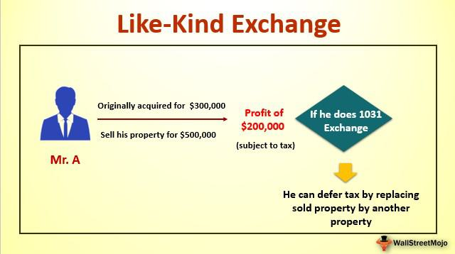

Understanding the nuances of financial regulations and investment strategies can be crucial for leveraging the IRS's policies to your advantage. Among these strategies, the 1031 exchange presents a significant opportunity for real estate investors to defer taxes, offering a powerful tool to optimize their investment portfolios. This IRS-sanctioned mechanism allows investors to exchange like-kind properties while postponing the payment of capital gains taxes, thereby preserving capital for further investment. 

Concurrently, algorithmic trading is transforming the stock market landscape by offering unprecedented efficiency and precision. This sophisticated trading method employs complex algorithms and mathematical models to automate trading decisions, thus enhancing speed and reducing human error. The integration of algorithmic strategies into traditional investment approaches offers competitive advantages that can significantly influence an investor's bottom line.

This article will guide you through understanding IRS rules governing 1031 exchanges, including what qualifies as like-kind property. Additionally, it will shed light on how algorithmic trading functions and its potential benefits and risks. By exploring these two crucial investment concepts, you will be equipped with the knowledge to maximize your investment returns efficiently. Whether you're a seasoned investor or just beginning to navigate these strategies, this comprehensive overview will empower you to make informed decisions aimed at financial growth and sustainability.

## Table of Contents

## Understanding Like-Kind Property in a 1031 Exchange

Like-kind property is a crucial concept in real estate investment, especially when considering tax optimization strategies. Under Section 1031 of the Internal Revenue Code, real estate investors can exchange like-kind properties without immediately incurring capital gains taxes. This provision enables investors to defer tax liabilities, thus preserving capital and enhancing investment capabilities.

To qualify for a 1031 exchange, both the relinquished property and the replacement property must be held for productive use in a trade, business, or for investment purposes. Personal residences or properties held mainly for resale are generally excluded from this provision. The term "like-kind" refers more to the nature or character of the property rather than its quality or grade. For example, an investor can exchange an apartment building for a commercial property or vacant land, as they are deemed like-kind under IRS regulations.

It is important to note the vital characteristics that define like-kind properties. The properties involved in the exchange do not need to be identical; instead, they must be of the same nature or class. Real estate for real estate, with broad interpretations, suffices under the like-kind requirement. Notably, exchanges of property within the United States are only valid for domestic transactions—international properties do not qualify under this rule.

Particular types of properties, such as primary residences or inventory property, do not meet the requirements for like-kind exchanges. Additionally, careful attention must be paid to timelines and procedural specifics. The identification of potential replacement properties must occur within 45 days of the sale of the relinquished property, and the acquisition must be completed within 180 days.

Understanding these parameters is crucial for investors aiming to defer capital gains taxes through strategic exchanges. Proper execution and adherence to the IRS guidelines on 1031 exchanges can significantly influence the effectiveness of an investment strategy, allowing for continued growth and development of real estate portfolios without the immediate burden of substantial tax liabilities. External resources, such as the IRS website or tax consultancy services, can provide further clarification and assistance to investors navigating these exchanges.

## Key IRS Rules Governing 1031 Exchanges

The IRS establishes precise guidelines for executing a 1031 exchange, a tool that enables investors to defer capital gains taxes by exchanging like-kind properties. Central to these regulations is the mandate that both the relinquished property and the replacement property must be within the United States and must be held for business or investment purposes. This requirement excludes personal residences from such exchanges, thus ensuring the transaction's purpose aligns with the core business or investment objective.

A crucial aspect of the 1031 exchange process is adhering to strict timelines set by the IRS. Investors have a 45-day period from the sale of the relinquished property to identify potential replacement properties. This identification must be in writing and submitted to a qualified intermediary. Following this, the acquisition of the replacement property must occur within 180 days from the sale of the original property or by the due date of the tax return for the taxable year in which the original property was sold, whichever comes first. These time constraints necessitate diligent planning and precise execution by investors to avoid disqualification of the exchange.

Potential pitfalls in navigating 1031 exchanges can occur if these timelines are not precisely adhered to, or if the properties involved do not meet the like-kind requirements. The introduction of the Tax Cuts and Jobs Act in 2017 further narrowed the scope of eligible properties. Notably, the Act restricted 1031 exchanges to real property alone, eliminating personal and intangible property from eligibility. This legislative change necessitates that investors remain informed and possibly adjust their strategies to comply with current regulations.

Understanding these rules is crucial for investors seeking to leverage the benefits of a 1031 exchange. Proper planning and knowledge of these guidelines enable investors to defer tax liabilities effectively, thus maximizing their investment potential. Consulting with tax professionals and legal advisors is often recommended to navigate these complex processes accurately.

## Algorithmic Trading: Revolutionizing the Market

Algorithmic trading utilizes computer algorithms to [carry](/wiki/carry-trading) out trades in financial markets autonomously. This advanced trading method is increasingly vital for enhancing the efficiency and precision of trading activities. It operates on intricate mathematical models and predefined criteria, programming computers to execute purchase and sale orders when specific market conditions are met. This automation contrasts sharply with traditional manual trading strategies, where decisions are made by human traders based on market analysis.

The integration of [algorithmic trading](/wiki/algorithmic-trading) with traditional strategies provides a significant competitive edge. Traditional trading often involves subjective decision-making and slower execution, which can lead to inefficiencies and greater exposure to market risks. In contrast, algorithmic trading, through various strategies such as statistical [arbitrage](/wiki/arbitrage), [trend following](/wiki/trend-following), or [market making](/wiki/market-making), can systematically and swiftly execute trades, minimizing the emotional biases and latency inherently present in manual trading.

One of the primary benefits of algorithmic trading is its speed. Computers can process vast amounts of data and execute transactions in fractions of a second, capitalizing on brief market opportunities. This capability greatly surpasses human reaction times, allowing traders to exploit small price differentials that might arise in milliseconds. Additionally, algorithmic trading enhances accuracy by executing trades based on specific criterion, thereby minimizing errors associated with manual entry.

Despite these advantages, algorithmic trading is not without risks. The reliance on technological infrastructure and data integrity means that system failures or erroneous algorithms can lead to substantial financial losses. Flash crashes, for example, have illustrated how rapid, automated transactions can lead to extreme [volatility](/wiki/volatility-trading-strategies) in a very short time. Furthermore, the complexity of algorithms requires robust testing and validation to ensure they perform as anticipated under various market scenarios.

For investors considering the adoption of algorithmic strategies, recognizing the potential benefits against the risks is crucial. Algorithmic trading offers a level of precision and rapid execution that can improve portfolio returns when implemented effectively. However, it necessitates a strong understanding of financial markets, programming skills, and a comprehensive risk management framework to safeguard against unforeseen market dynamics.

## Integrating 1031 Exchange Strategies with Modern Trading

Combining the strategic tax benefits of 1031 exchanges with the precision of algorithmic trading offers a potent investment approach. Real estate investors can leverage the tax deferrals achieved through 1031 exchanges to amplify their resources available for reinvestment. By deferring capital gains taxes, investors can redirect these savings into algorithm-driven stock portfolios, potentially increasing returns through diversified asset allocation.

Case studies illustrate how this integration can enhance portfolio robustness and diversification. Consider an investor who successfully executed a 1031 exchange, deferring substantial capital gains taxes. By reallocating these savings into a diversified algorithmic trading portfolio, the investor can capitalize on the high-frequency, data-driven opportunities present in the financial markets. This strategy not only diversifies the risk profile but also ensures that capital is continually optimised across both real estate and stock market investments.

Understanding synergies between distinct financial instruments and strategies is key to achieving modern investment success. The tax efficiency of 1031 exchanges can serve as a catalyst for growth, especially when reinvested into markets through sophisticated algorithmic trading models. These models, driven by quantitative analyses, can exploit market efficiencies and effectively manage risk.

To create a holistic investment plan, consider the following actionable insights:

1. **Strategic Timing**: Sync the timing of asset sales and purchases in a 1031 exchange with market conditions favourable to algorithmic trading. For instance, implementing this during periods of high market volatility can provide additional arbitrage opportunities.

2. **Reinvestment Allocation**: Use a portion of tax-deferred funds to seed algorithm-driven investments, ensuring that these portfolios are diversified across various asset classes to mitigate potential risks.

3. **Leverage Technology**: Incorporate advanced trading platforms that allow seamless integration of trading algorithms with real-time data inputs. These platforms can optimize execution strategies and improve portfolio performance.

4. **Continuous Monitoring**: Regularly assess the performance of the combined investment strategies to ensure alignment with financial goals. Use machine learning models to predict shifts in market conditions and adjust the asset allocation accordingly.

5. **Consultation and Review**: Engage with financial advisors and tax professionals to continuously review and adjust strategies, ensuring compliance with evolving regulations and optimizing tax efficiencies.

In conclusion, merging the time-tested strategy of 1031 exchanges with cutting-edge algorithmic trading can lead to significant financial advantages. By understanding and exploiting the synergies between these strategies, investors can create a comprehensive investment framework designed to navigate and excel in the complexities of modern financial markets.

## Conclusion

Navigating the intricacies of 1031 exchanges and mastering algorithmic trading are essential components of contemporary investment strategies. Each approach offers distinct advantages: the tax efficiency gained through 1031 exchanges allows real estate investors to defer capital gains taxes, thereby enhancing their capital allocation over time. On the other hand, algorithmic trading provides unmatched market precision, leveraging computational algorithms to execute trades with speed and accuracy superior to human capabilities.

This article has aimed to equip investors with a foundational overview of these strategies, enabling them to make informed decisions about their investment portfolios. By combining the traditional tax-deferral benefits of the 1031 exchange with the cutting-edge technology of algorithmic trading, investors can harness their potential synergistically. This strategy creates robust investment portfolios that benefit from both tax efficiencies and the rapid response capabilities of modern trading technologies.

Investors can reinvest tax deferrals from property exchanges into algorithm-driven stock portfolios, creating a diversified strategy that navigates different asset classes effectively. Through understanding these investment avenues, one can develop a comprehensive investment plan that leverages both realms' strengths to maximize returns.

However, as with all investment strategies, it is crucial to consult with financial experts and conduct thorough research. Investment success often hinges on understanding the finer details and adapting strategies to one's financial goals and risk tolerance. Realizing these synergies requires not only a comprehensive grasp of each strategy but also vigilance in staying informed about changes in tax laws and financial technology advancements.

## References & Further Reading

[1]: ["Publication 544: Sales and Other Dispositions of Assets"](https://www.irs.gov/publications/p544) by the Internal Revenue Service (IRS), which provides details on like-kind exchanges and capital gains.

[2]: ["The Real Estate Investor's Guide to 1031 Exchanges"](https://www.forbes.com/advisor/mortgages/real-estate/1031-exchange/) by Gary W. Eldred, offers insights into utilizing tax-deferred exchanges in real estate investments.

[3]: ["Algorithmic Trading: Winning Strategies and Their Rationale"](https://www.amazon.com/Algorithmic-Trading-Winning-Strategies-Rationale-ebook/dp/B00CY5HC0U) by Ernie Chan, discusses strategies and insights into algorithmic trading.

[4]: ["Algorithmic and High-Frequency Trading"](https://www.amazon.com/Algorithmic-High-Frequency-Trading-Mathematics-Finance/dp/1107091144) by Álvaro Cartea, Sebastian Jaimungal, and José Penalva, provides an analysis of algorithmic trading tools and techniques.

[5]: ["Defer Your Taxes And Grow Your Wealth With 1031 Real Estate Exchanges"](https://fastercapital.com/content/1031-exchange--How-to-Defer-Taxes-and-Grow-Your-Wealth-with-Real-Estate.html) by Twila Slesnick and John Suttle, an in-depth guide on 1031 exchanges and tax strategies.

[6]: De Prado, M. L. (2018). ["Advances in Financial Machine Learning,"](https://www.amazon.com/Advances-Financial-Machine-Learning-Marcos/dp/1119482089) which focuses on applying machine learning techniques in finance, relevant for algorithmic trading.