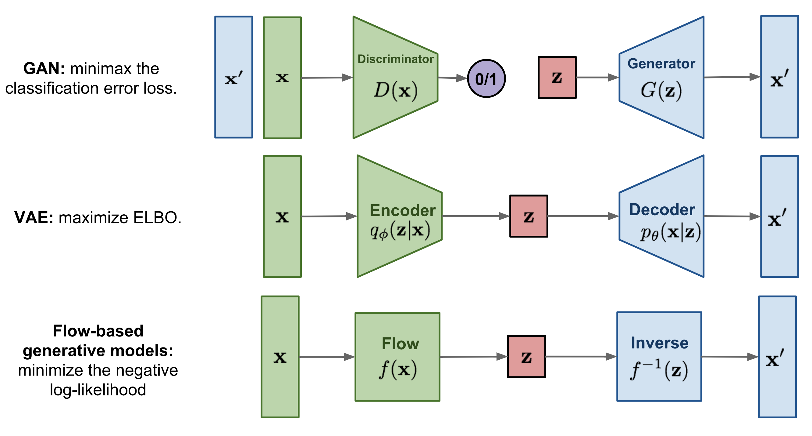

## Table of Contents

## What are Likelihood-Based Generative Models and how do they differ from other generative models?

Likelihood-Based Generative Models are a type of generative model that focus on estimating the probability distribution of the data. They work by trying to maximize the likelihood of the data given the model. This means they try to make the model as good as possible at predicting how likely it is to see the data we have. For example, if we have a bunch of pictures of dogs, a likelihood-based model would try to figure out the best way to describe all those pictures so that it can say, "Yes, this looks like a dog picture!" with high confidence. These models often use techniques like maximum likelihood estimation to adjust their parameters and improve their predictions.

These models differ from other generative models, like GANs (Generative Adversarial Networks) and VAEs (Variational Autoencoders), in how they approach the task of generating new data. While likelihood-based models focus on directly modeling the probability distribution of the data, GANs use a different strategy where two models compete against each other: one tries to generate realistic data, and the other tries to tell if the data is real or fake. VAEs, on the other hand, work by learning a compressed representation of the data and then generating new data from this representation. Each type of model has its strengths and weaknesses, but likelihood-based models are particularly good at handling complex data distributions and providing a clear measure of how well the model fits the data.

## Can you explain the basic concept of a Variational Autoencoder (VAE)?

A Variational Autoencoder (VAE) is a type of neural network that helps to generate new data that looks like the data it was trained on. Imagine you have a bunch of pictures of cats. A VAE would learn to take these pictures and create a simpler, smaller version of them, kind of like a secret code that captures what makes a cat a cat. Then, it can use this secret code to make new cat pictures that look different but still very much like cats. The cool thing about VAEs is that they don't just copy the pictures; they learn the underlying patterns and can create new, unique images.

The way a VAE works is by using two main parts: an encoder and a decoder. The encoder takes the original data, like a cat picture, and turns it into a set of numbers that represent the picture in a simpler way. This set of numbers is called the latent space. The decoder then takes numbers from this latent space and turns them back into a picture. But here's the twist: the VAE doesn't just want to make a good copy; it wants to make sure the numbers in the latent space follow a specific pattern, usually a normal distribution. This is done by adding a bit of randomness and making sure the model tries to keep the numbers close to this pattern. This helps the VAE to generate new, varied images that still look like cats. The math behind this involves something called the Kullback-Leibler divergence, which measures how much the distribution of the latent space differs from the desired normal distribution, and the model tries to minimize this difference.

## How does a Vector Quantized Variational Autoencoder (VQ-VAE) improve upon the standard VAE?

A Vector Quantized Variational Autoencoder (VQ-VAE) improves upon the standard VAE by using a different way to handle the latent space. In a regular VAE, the encoder turns the input data into a set of numbers that follow a normal distribution. This can sometimes make it hard for the model to capture very specific details of the data. The VQ-VAE solves this by using a technique called vector quantization. Instead of using a continuous distribution, the VQ-VAE uses a set of discrete codes, or "vectors," that the encoder can choose from. This helps the model to better represent and remember the important features of the data, making it easier to generate high-quality images or other types of data.

The main advantage of the VQ-VAE is that it can produce sharper and more detailed outputs compared to a standard VAE. This is because the discrete codes in the VQ-VAE allow the model to focus on specific, important parts of the data rather than trying to fit everything into a smooth, continuous distribution. By using these discrete codes, the VQ-VAE can learn to represent complex patterns more effectively, which leads to better results when generating new data. This makes VQ-VAEs particularly useful in applications where detail and quality are important, like in image generation or speech synthesis.

## What is the GLOW model and how does it use normalizing flows for generative modeling?

The GLOW model is a type of generative model that uses something called normalizing flows to create new data, like images. Imagine you have a simple shape, and you want to turn it into a more complex shape. Normalizing flows are like a series of steps that can stretch, twist, and reshape this simple shape into the complex one you want. In the GLOW model, these steps are carefully designed so that the model can both generate new data and understand how likely it is to see that data. This is important because it helps the model create realistic images that look like the ones it was trained on.

GLOW uses a special kind of neural network called an invertible neural network. This means that the network can work both ways: it can take a simple shape and turn it into a complex image, and it can also take a complex image and turn it back into a simple shape. By using this invertible network, GLOW can make sure that the steps it takes to change the shape are reversible, which is a key part of normalizing flows. This reversibility helps the model to keep track of how it's changing the data, making it easier to generate new, realistic images.

## How does PixelCNN generate images and what makes it different from other models?

PixelCNN is a type of generative model that creates images one pixel at a time. It starts from the top-left corner of the image and moves across and down, predicting the color of each pixel based on all the pixels it has seen so far. Think of it like painting a picture, where you decide the color of each dot based on the dots you've already painted. This method allows PixelCNN to capture the details and patterns in images very well because it can see the context of what has already been drawn.

What makes PixelCNN different from other models is how it builds the image step by step. Unlike models like VAEs or GANs, which might look at the whole image at once or use a compressed version of the data, PixelCNN focuses on the local relationships between pixels. This can make it really good at generating very detailed and realistic images, but it can also be slower because it has to go through every single pixel. Also, PixelCNN is a type of autoregressive model, which means it uses the past to predict the future, in this case, using previously generated pixels to decide on the next one.

## What is Beta-VAE and how does it enhance the disentanglement of latent representations?

Beta-VAE is a special kind of Variational Autoencoder (VAE) that helps make the hidden features it learns easier to understand and separate from each other. In a regular VAE, the model learns a bunch of numbers that represent the data, like a secret code. But these numbers can be mixed up and hard to figure out what each one means. Beta-VAE adds a little twist to the regular VAE by changing how much it cares about keeping these numbers in a neat, organized way. This change is controlled by a number called beta, which is like a dial you can turn to make the model focus more on organizing the secret code.

By adjusting the beta value, Beta-VAE can make the hidden features, or latent representations, more "disentangled." This means each number in the secret code can represent a single, clear aspect of the data, like the color of a cat's fur or the shape of its ears. For example, if you change one number, it might only change the cat's fur color, leaving everything else the same. This makes it easier to understand and control what the model is doing, which is really helpful in things like image editing or learning how different parts of data relate to each other.

## Can you describe the NICE model and its use of coupling layers?

The NICE model, which stands for Non-linear Independent Components Estimation, is a type of generative model that uses something called normalizing flows to create new data. Think of normalizing flows like a recipe that changes a simple shape into a more complex one, and you can also reverse the recipe to go back to the simple shape. In the NICE model, this recipe is made up of steps called coupling layers. These layers are like special tools that help the model change the data in a way that's easy to undo. By using these coupling layers, NICE can generate new data, like images, and also figure out how likely it is to see that data.

Coupling layers in NICE work by splitting the data into two parts. One part stays the same, while the other part gets changed based on the first part. This change is done using a simple function that can be easily reversed. Imagine you have a box of different colored balls. You take half of them and leave them as they are, but you change the colors of the other half based on the colors of the first half. This way, you can always change them back by remembering what you did. By using these coupling layers, NICE can make sure that the steps it takes to change the data are reversible, which is really important for normalizing flows. This helps NICE generate realistic images and understand the data better.

## What are the key features of RealNVP and how does it contribute to image synthesis?

RealNVP, or Real-valued Non-Volume Preserving, is a type of generative model that uses normalizing flows to create new images. It works by changing a simple shape, like a blob, into a more complex shape, like a picture of a cat. RealNVP does this using special steps called affine coupling layers. These layers split the image into two parts, change one part based on the other, and can easily be undone. This makes RealNVP really good at making images that look real because it can keep track of how it's changing the data.

One of the cool things about RealNVP is that it's really fast and efficient. It can create high-quality images quickly because it uses these affine coupling layers. Also, RealNVP can tell how likely it is to see the images it makes, which helps it make better pictures. This makes RealNVP useful for things like image editing and creating new images from scratch. By using normalizing flows, RealNVP helps us understand and make new images in a way that's both powerful and easy to control.

## How does VQ-VAE-2 extend the capabilities of the original VQ-VAE?

VQ-VAE-2 extends the capabilities of the original VQ-VAE by adding a second level of quantization. In the original VQ-VAE, the model turns the data into a set of numbers using a single set of codes. VQ-VAE-2 adds another set of codes that work on top of the first set, making the model better at capturing the details of the data. This second level of quantization helps the model learn more complex patterns and create even better images. By using two levels of codes, VQ-VAE-2 can generate images that are sharper and more detailed than what the original VQ-VAE could do.

Another way VQ-VAE-2 improves on the original is by using a technique called multi-scale hierarchical organization. This means the model looks at the data in different sizes or scales, from big to small. By doing this, VQ-VAE-2 can capture both the overall structure and the fine details of the images. This helps the model generate images that not only look more realistic but also have better quality. With these improvements, VQ-VAE-2 is a powerful tool for tasks like image generation and data compression, making it easier to create and understand complex data.

## What advancements does NVAE bring to the field of variational autoencoders?

NVAE, or Neural Variational Autoencoder, brings new improvements to the world of variational autoencoders by making them better at creating high-quality images. One big change is that NVAE uses a lot more layers in its neural network than regular VAEs. This helps the model learn more details and make images that look more real. NVAE also uses a special way to train the model called importance weighting, which makes the model focus more on the important parts of the data. This helps NVAE generate images that are sharper and more detailed than what other VAEs can do.

Another cool thing about NVAE is that it uses a technique called hierarchical latent variables. This means the model looks at the data in different levels, from big to small, kind of like zooming in on a picture. By doing this, NVAE can capture both the overall shape and the tiny details of the images. This makes the generated images look more realistic and helps the model understand the data better. With these advancements, NVAE is a powerful tool for tasks like image generation and data analysis, making it easier to create and study complex data.

## How does PixelRNN differ from PixelCNN in terms of image generation?

PixelRNN and PixelCNN are both types of generative models that create images one pixel at a time, but they do it in slightly different ways. PixelRNN uses something called a recurrent neural network (RNN), which is like a memory machine. It looks at the pixels it has already generated and uses that information to decide what color the next pixel should be. This means PixelRNN can remember what it did before and use that memory to make better guesses about the next pixel. It's like painting a picture and remembering what you've painted so far to decide what to paint next.

On the other hand, PixelCNN uses a convolutional neural network (CNN), which is good at looking at patterns in images. It doesn't have the same kind of memory that PixelRNN does, but it can still generate good images by looking at the pixels around the one it's trying to predict. PixelCNN is faster than PixelRNN because it doesn't need to remember as much, but PixelRNN can sometimes make more detailed and accurate images because of its memory. So, while both models can create cool pictures, they do it in their own special ways.

## What are the current challenges and future directions for Likelihood-Based Generative Models?

Likelihood-Based Generative Models, like VAEs and PixelCNNs, face several challenges today. One big problem is that they can be slow to train and generate images. This is because they need to look at every single pixel one by one, which takes a lot of time. Also, these models sometimes struggle to make images that look very sharp and clear. They can create pictures, but they might look a bit fuzzy or blurry. Another challenge is that these models can be hard to control. If you want to change something specific in the image, like making a cat's eyes blue, it's not always easy to do that with these models.

The future of Likelihood-Based Generative Models looks bright, though. Researchers are working on making these models faster and better at creating detailed images. One idea is to use more advanced techniques, like normalizing flows, to help the models generate images more quickly and with better quality. Another direction is to make these models easier to control. Scientists are trying to find ways to let users change specific parts of the images more easily, so you could, for example, easily change a cat's fur color to black. As these models keep improving, they could be used for more cool things, like helping artists create new designs or making video games look even more realistic.