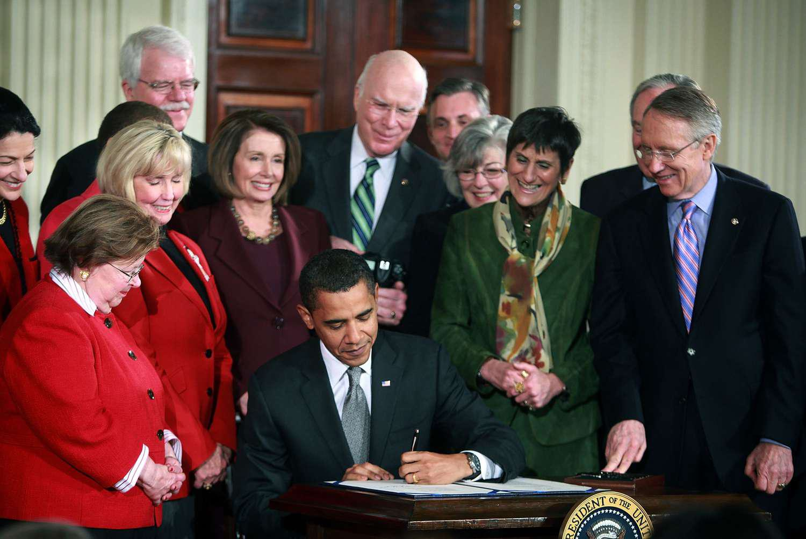

The Lilly Ledbetter Fair Pay Act of 2009 marks a significant legislative step in the ongoing struggle against wage discrimination. It was enacted to rectify the injustices experienced by workers facing pay disparities, particularly women and minorities, by ensuring that they have a fair opportunity to challenge unequal pay. Despite many advances in workplace equality, achieving equal pay remains an elusive goal. Thus, understanding legal measures like the Lilly Ledbetter Fair Pay Act becomes essential for fostering wage parity.

This article examines the impact of the Lilly Ledbetter Fair Pay Act on the broader conversation about equal pay. It is particularly relevant in rapidly evolving sectors such as algorithmic trading, where compensation practices can be opaque, and gender disparities may be pronounced. Algorithmic trading, characterized by complex technologies and predominantly male workforce, highlights the need for continued vigilance and advocacy to promote fair pay practices.



Since its enactment, the Lilly Ledbetter Fair Pay Act has been instrumental in reshaping how pay equity is perceived and addressed. By allowing the statute of limitations for filing equal-pay lawsuits to restart with each discriminatory paycheck, the Act provides a more robust protection framework for employees. This legal adjustment offers a critical mechanism for individuals encountering wage discrimination to challenge unfair pay practices effectively.

In summary, the Lilly Ledbetter Fair Pay Act of 2009 remains a cornerstone in efforts to combat wage discrimination. It emphasizes the necessity of transparent and equitable pay practices across all industries, setting the stage for future advancements in achieving true gender pay parity.

## Table of Contents

## History and Significance of the Lilly Ledbetter Fair Pay Act

The Lilly Ledbetter Fair Pay Act of 2009 is a landmark piece of legislation aimed at combatting wage discrimination in the workplace. This act holds particular significance as it was the first bill signed into law by President Barack Obama on January 29, 2009. Named after Lilly Ledbetter, a former supervisor at Goodyear Tire & Rubber Company, the legislation emerged from her fight against pay discrimination—a struggle that brought significant attention to the systemic issue of wage inequality.

Lilly Ledbetter discovered she was being paid significantly less than her male counterparts only as she neared retirement. She subsequently filed a lawsuit against her employer, Goodyear, under Title VII of the Civil Rights Act of 1964. However, her case faced a significant setback due to the Supreme Court's 2007 decision in Ledbetter v. Goodyear Tire & Rubber Co. The Court ruled against Ledbetter, stating that her complaint was time-barred; according to the Court, the 180-day statute of limitations for filing a pay discrimination lawsuit started from the first discriminatory paycheck, not the most recent one.

This ruling brought to light the limitations of the extant legal framework, as it ignored the common reality that employees often remain unaware of pay disparities for extended periods. In response, the Lilly Ledbetter Fair Pay Act was introduced and swiftly enacted to rectify this procedural hurdle. The Act amended the Civil Rights Act, effectively allowing the 180-day statute of limitations to reset with each new discriminatory paycheck. This legislative change acknowledges that each paycheck tainted by past discrimination is itself an illegal act, ensuring that employees have a fair opportunity to contest wage discrimination regardless of when the disparity is initially discovered.

The Lilly Ledbetter Fair Pay Act is pivotal in advancing workplace rights, particularly influencing the fight for pay equity for women and minority groups. It sets a precedent by emphasizing the importance of continuous accountability in employer compensation practices and providing a more just mechanism for employees to pursue discriminatory pay claims. By reinforcing the legal avenues available for such claims, the Act underscores the ongoing commitment to address and rectify gender-based and other forms of pay inequality.

## Impact of the Act on Equal Pay

The Lilly Ledbetter Fair Pay Act of 2009 significantly impacts the pursuit of equal pay by expanding the timeframe for filing discrimination complaints. Prior to this legislation, individuals were required to file an equal-pay lawsuit within 180 days of the initial discriminatory paycheck. This restrictive window often made it difficult for employees to recognize and act upon pay discrepancies in a timely manner. The enactment of the Lilly Ledbetter Fair Pay Act modified this statute of limitations, allowing it to reset with each discriminatory paycheck. This change empowers employees by providing them with more flexibility to address unfair pay practices as they occur over time, enhancing workplace protections and enabling increased scrutiny of pay disparities.

While the Act strengthens the mechanisms available to challenge wage discrimination, it is crucial to recognize that additional measures are necessary to fully eradicate the persistent gender pay gaps. This is particularly true for women of color, who face compounded disparities due to intersecting factors of gender and race. Statistics indicate that while progress has been made, significant inequities remain. For example, Black and Hispanic women earn less compared to their white counterparts, a gap exacerbated by discriminatory practices throughout their careers.

Efforts to address these gaps require a comprehensive approach that encompasses both legal frameworks and proactive organizational policies. This includes implementing policies that promote transparency in pay practices and actively engaging in diversity and inclusion initiatives. Despite the improvements brought about by the Lilly Ledbetter Fair Pay Act, achieving true wage equity calls for ongoing vigilance and commitment to broader structural changes.

## Equal Pay and Algorithmic Trading

Algorithmic trading is a sophisticated domain heavily reliant on technology and mathematical models to execute financial transactions at speeds and volumes far beyond human capability. Dominated largely by male professionals, this sector exemplifies systemic pay disparities often seen across technology-focused industries. Such disparities manifest not only in base salary differences but also in the allocation of bonuses and equity stakes, which are critical components of total compensation in trading environments.

The principles embedded within the Lilly Ledbetter Fair Pay Act, which emphasize resetting the statute of limitations for equal-pay lawsuits with each discriminatory paycheck, have particular relevance to [algorithmic trading](/wiki/algorithmic-trading). In this industry, transparency in compensation structures is paramount. Yet, secrecy and lack of disclosure regarding salary bands, bonus criteria, and equity distribution often pervade organizational cultures, obscuring signs of potential discrimination.

Pay equity discussions in algorithmic trading are increasingly centered on several key areas. First, hiring practices are scrutinized to ensure that recruitment processes are free from bias, with an emphasis on equitable representation of genders at all levels of staffing. There is a growing advocacy for standardized compensation packages, which minimize the discretion an employer might exercise based on gender-biased perceptions of an employee's worth.

Second, the structure of remuneration packages requires careful examination. Given algorithmic trading’s reliance on performance-based incentives, ensuring these structures are equitable and transparent is crucial. Companies are encouraged to publish clear criteria for performance-based rewards, ensuring that all employees, regardless of gender, have access to the same financial opportunities.

Finally, transparency in compensation is a critical component that upholds the values of the Lilly Ledbetter Fair Pay Act within algorithmic trading. Companies are now encouraged to conduct regular pay audits, publish their gender pay gap [statistics](/wiki/bayesian-statistics), and actively work to correct identified imbalances. Initiatives like salary history bans, where prospective employees’ previous salary details are not disclosed during hiring, are also gaining traction. This approach aims to break the cycle of pay discrepancies that women and underrepresented groups face throughout their careers.

Overall, aligning the ethos of the Lilly Ledbetter Fair Pay Act with the operational frameworks within algorithmic trading provides a robust pathway towards dismantling pay inequities, fostering an environment where compensation is genuinely reflective of merit and free from gendered bias.

## Challenges and Opportunities

While the Lilly Ledbetter Fair Pay Act provides a legal avenue to address wage discrimination claims, achieving meaningful progress in pay equity demands more than legislative solutions. It requires a cultural and organizational renaissance within industries prone to pay inequality.

One effective approach to complement existing legal frameworks is the implementation of salary history bans. These bans prevent employers from inquiring about a candidate’s past earnings during the hiring process, which can perpetuate existing pay disparities, especially among women and minorities. Avoiding salary negotiations based on historical compensation helps in establishing pay scales grounded on skill, responsibility, and value to the company rather than past inequities. Research has shown that salary history bans contribute to reducing the gender pay gap. A study by the National Bureau of Economic Research found that such bans lead to an increase in pay for women by approximately 8% and a 10% increase for African Americans, thereby addressing systemic inequities [1].

Promoting transparency is another vital step in fostering an environment of fairness and equity. This can involve making compensation structures open and understandable to employees, thereby fostering trust and enabling them to identify and question disparities. Transparency can be enhanced through regular reporting of wage data and analyses such as pay audits that compare compensation across gender, ethnicity, and other demographic factors. By making informed adjustments based on these audits, organizations demonstrate a commitment to equitable pay practices.

Industries like finance and tech, including algorithmic trading, have a significant opportunity to lead by example in dismantling pay discrimination. These sectors often exhibit disparities due to their traditionally male-dominated landscapes. By adopting robust policies that emphasize diversity, equity, and inclusion, they can spearhead a balanced and fair work environment. Initiatives could include mentorship programs that encourage underrepresented groups to enter and progress within these fields, alongside commitments to diversity in hiring and promotion processes.

The financial and trading sectors, with their significant influence and resources, are uniquely positioned to champion these changes. By embedding cultural reforms alongside legal compliance, they can transform into models of wage equity, showcasing the synergistic impact of innovative policy implementations coupled with proactive organizational strategies.

Reference:
[1] National Bureau of Economic Research: https://www.nber.org/papers/w33452

## Future Directions

Policies similar to the Lilly Ledbetter Fair Pay Act have begun to show tangible effects on addressing wage disparities, alongside innovations such as salary history bans. These bans are designed to mitigate bias in the hiring process by preventing employers from basing salaries on previous earnings, which can perpetuate historical inequities. Research indicates that such measures contribute to narrowing the gender pay gap, especially for women who have historically been undervalued in the workforce [1].

Gender and income inequality continue to pose significant societal challenges. Addressing these requires sustained advocacy and innovation in policy development. Policymakers and advocates must work together to craft legislation that not only enforces equal pay but also addresses underlying biases in hiring and compensation systems. This includes advocating for transparency in pay scales and promoting policies that encourage diversity in leadership positions within organizations.

Companies play a crucial role in ensuring fair compensation practices. By fostering inclusive workplace policies, corporations can make significant strides in achieving pay equity. This requires a multi-faceted approach, including regular pay audits, transparent salary bands, and robust diversity training programs. Organizations should engage in self-assessment to identify and rectify biased pay structures and practices, thereby aligning themselves with both legal requirements and ethical standards of fairness and inclusion.

Furthermore, technology and data analytics offer new tools to enhance transparency and accountability. Advanced algorithms and metrics can be used to analyze compensation data, making it easier to spot and correct inequities. As an illustrative example, consider a simplified Python script that analyzes pay discrepancies using a dataset that contains salary information:

```python
import pandas as pd

# Load dataset
data = pd.read_csv('employee_salaries.csv')

# Calculate average salaries by gender
average_salaries = data.groupby('gender')['salary'].mean()

# Display average salaries
print(average_salaries)

# Identify potential pay gaps
pay_gap = average_salaries['male'] - average_salaries['female']
print(f"The gender pay gap is: ${pay_gap:.2f}")
```

This kind of approach enables companies to take proactive steps to ensure equitable pay. Businesses that emphasize diversity, equity, and inclusion not only comply with legal standards but often experience enhanced employee satisfaction and productivity, leading to better overall organizational performance.

By focusing on educational initiatives, revising policies regularly, and incorporating inclusive practices throughout organizational structures, there is significant potential to build workplaces where compensation fairness is not only a goal but a reality. As we look to the future, the continued evolution of policies inspired by the Lilly Ledbetter Fair Pay Act will be vital in promoting equal pay and reducing systemic inequalities worldwide.

---

[1] National Bureau of Economic Research (NBER): "The Effects of Salary History Bans."

## Conclusion

The Lilly Ledbetter Fair Pay Act remains a cornerstone in the fight against wage discrimination. This legislation has significantly contributed to the legal framework supporting equal pay, allowing employees to challenge unfair compensation practices more effectively. Although substantial progress has been made since its enactment, ensuring equitable pay continues to be both a challenge and an opportunity, especially in specialized sectors like algorithmic trading. 

Algorithmic trading, characterized by its reliance on quantitative data analysis and computer algorithms, often reflects broader societal trends regarding pay disparities. This field, traditionally dominated by men, highlights ongoing issues related to gender pay gaps. Efforts to provide transparency and equitable compensation in such industries are critical for advancing gender parity. 

Ongoing endeavors at policy enforcement, complemented by organizational transparency, are essential to genuinely achieve gender pay equality. The introduction of policies that promote salary transparency and active measures to prevent pay discrimination are vital steps toward closing the wage gap. As industries evolve, continuous advocacy and adaptation of inclusive practices are required. By building on the foundation set by the Lilly Ledbetter Fair Pay Act, organizations can strive toward a future where equal pay is not just an aspiration but a reality.

## References & Further Reading

[1] National Bureau of Economic Research (NBER). ["The Effects of Salary History Bans."](https://www.nber.org/digest/202201/how-knowledge-salary-history-affects-wage-offers-and-hiring)

[2] The U.S. Equal Employment Opportunity Commission. ["Lilly Ledbetter Fair Pay Act of 2009."](https://www.eeoc.gov/history/lilly-ledbetter-fair-pay-act-2009)

[3] Ledbetter, L. (2012). ["Grace and Grit: My Fight for Equal Pay and Fairness at Goodyear and Beyond."](https://archive.org/details/gracegritmyfight0000ledb) Crown Publishing Group.

[4] U.S. Supreme Court. ["Ledbetter v. Goodyear Tire & Rubber Co."](https://supreme.justia.com/cases/federal/us/550/618/)

[5] U.S. Department of Labor. ["Women's Bureau: Equal Pay."](https://www.dol.gov/agencies/wb/equal-pay-protections)