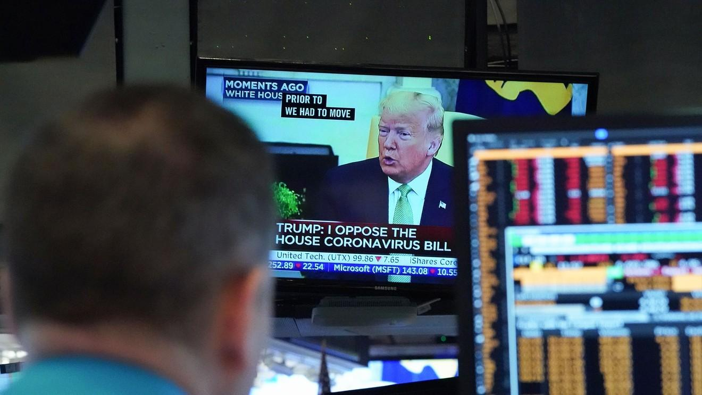

In the world of trading, managing risk and volatility is crucial for both novice and experienced investors. The mechanisms that govern trading activities are designed to maintain market stability, with 'limit down' regulations playing a significant role in the futures and stock markets. These measures prevent drastic price declines by implementing trading restrictions, ensuring that market participants have time to digest information and make informed decisions rather than succumbing to panic.

Algorithmic trading, or algo trading, has become a fundamental part of modern markets, employing high-speed and data-driven strategies to execute trades. However, the introduction of limit down mechanisms poses both challenges and opportunities for these automated systems. Algorithms must be adaptable, capable of responding to fluctuations and restrictions within the market environment. Traders seeking to maximize the efficacy of their algorithmic strategies must understand how these regulatory measures influence execution and market dynamics.



This article examines the interplay between limit down, futures stocks, and algorithmic trading. Understanding these dynamics is essential for effectively navigating today's fast-paced financial markets. As markets evolve and new technologies emerge, the need for sophisticated approaches to manage volatility and maintain market stability becomes increasingly important.

## Table of Contents

## What is Limit Down?

Limit down is a regulatory measure implemented to curb substantial price declines in financial markets. This mechanism serves as a critical tool in mitigating extreme volatility by enforcing trading restrictions when securities experience significant price movements. Primarily applied in futures contracts and stock markets during periods of high volatility, the limit down mechanism maintains market order by temporarily halting trading or limiting further price declines when triggered.

The concept of limit down is particularly prevalent in futures markets where traders engage in contracts to buy or sell an asset at a predetermined future date and price. Given the inherent volatility of these markets, limit down thresholds are established based on specific price movements, either as a percentage decline or a fixed dollar amount. When these thresholds are breached, trading on the affected contract is restricted, allowing participants to pause and reassess the market conditions before continuing.

This mechanism is vital for providing investors with time to gauge the broader market environment and make informed decisions without the pressure of a rapidly declining market. By enforcing a temporary halt or limitation on trading, limit down allows for a measured response to price fluctuations, thereby reducing the likelihood of panic-driven decisions that could exacerbate market instability.

The significance of limit down in maintaining market stability cannot be understated. It acts as a safeguard against abrupt and potentially destabilizing price drops, aiding in the preservation of orderly trading conditions. This is particularly essential during times of economic uncertainty or significant market events, where [volatility](/wiki/volatility-trading-strategies) is heightened, and the potential for irrational trading behavior increases. 

Overall, the limit down mechanism plays a crucial role in the regulatory framework of financial markets, emphasizing its importance in ensuring that market participants have the opportunity to respond rationally to evolving market conditions.

## How Limit Down Works in Futures Markets

Futures markets are characterized by their inherent volatility, necessitating mechanisms like "limit down" to control price fluctuations and maintain order. A limit down refers to a situation where trading of a particular futures contract is halted or restricted once its price decreases to a predetermined level set by the exchange. This mechanism is essential for curbing excessive volatility, allowing traders to reassess market conditions and stabilize trading activities.

Exchanges impose these limits based on either percentage declines or absolute dollar changes in the futures contracts. For example, if a futures contract's limit down is set at a 5% decline from the previous day's closing price, trading will be paused once this threshold is hit. Such percentage-based restrictions are effective in preventing drastic price decreases in a short time frame.

A notable example of where limit down rules are prominently applied is the CME Group, one of the largest derivatives marketplaces. The CME Group implements specific rules for various commodities, adjusting these limits dynamically based on market conditions and historical volatility. For instance, the initial limit for agricultural commodity futures might be set at 60 cents, but this can be expanded if the market experiences significant volatility, offering traders more flexibility while still maintaining control over the trading environment.

Energy futures, including [crude oil](/wiki/crude-oil) and natural gas contracts, often experience pronounced volatility. To manage such fluctuations, exchanges may implement short trading pauses or impose limit down measures when prices hit specified thresholds. These measures help mitigate extreme price movements, enabling market participants to evaluate new information or economic indicators that might impact future prices.

In practice, the application of limit down rules in futures markets acts as a safeguard, promoting orderly trading and preventing panic-driven sell-offs. For instance, during periods of heightened uncertainty or macroeconomic announcements, these mechanisms provide a crucial buffer that helps in absorbing shocks and maintaining investor confidence.

Overall, limit down mechanisms play a vital role in the functionality of futures markets, ensuring that price discovery occurs in a more controlled environment. By facilitating temporary halts during sharp declines, these measures allow market participants to navigate volatility and adjust their strategies accordingly, fostering a more resilient trading framework.

## Impact of Limit Down on Stock Markets

Stock markets utilize circuit breakers akin to the limit down mechanism to provide stability during periods of extreme volatility. These circuit breakers serve as safeguards against uncontrolled price collapses by temporarily halting trading when there is a significant decline in a major market index, such as the S&P 500 in the United States. Specifically, trading halts can be initiated if the S&P 500 index experiences a drop of 7% (Level 1), 13% (Level 2), or 20% (Level 3) from the previous day's close. Each threshold triggers progressively more prolonged trading pauses, designed to prevent panic selling and allow traders to reevaluate market conditions [1].

Furthermore, since 2012, the Limit Up-Limit Down (LULD) rule has been implemented for individual stocks experiencing unusual volatility. This rule buffers significant price swings by halting trading when prices move outside predefined percentage bands. While the thresholds for the bands differ depending on the stock's price and trading [volume](/wiki/volume-trading-strategy), the goal remains consistent: to ensure orderly trading and accurate pricing [2].

The 2020 COVID-19 pandemic offers a compelling case study of circuit breakers in action. During March 2020, the U.S. stock markets experienced unprecedented turbulence, triggering multiple circuit breakers as investors reacted to the unfolding global crisis. For instance, on March 9, 12, and 16, the S&P 500 hit Level 1 and Level 2 thresholds, leading to temporary market pauses [3]. These halts provided vital cooling-off periods, allowing participants to digest new information and mitigate irrational market movements.

The effectiveness of circuit breakers varies, subject to several factors. In some instances, trading halts have successfully curbed panic selling and restored market order. However, they also face criticism for potentially exacerbating investor anxiety by signaling severe instability. Furthermore, when trading resumes, markets can experience sharp movements if pent-up buying or selling pressure is released suddenly. Consequently, while circuit breakers are a critical tool in maintaining market stability, their implementation requires careful calibration and constant evaluation to adapt to evolving market conditions [4].

References:
1. New York Stock Exchange. (n.d.). Circuit Breakers. Retrieved from [NYSE](https://www.nyse.com/markets/nyse/market-info/circuit-breakers)
2. U.S. Securities and Exchange Commission. (2012). SEC Approves Exchange Proposals to Modify Existing Circuit Breaker Rules and Procedures. Retrieved from [SEC](https://www.sec.gov/news/press-release/2012-2012-107htm)
3. Alden, W. (2020, March 16). U.S. Stocks Plunge as Market Volatility Surges. The Wall Street Journal. 
4. Subrahmanyam, A. (2013). Circuit Breakers and Market Volatility. Journal of Applied Corporate Finance, 25(3), 47-55.

## Algorithmic Trading and Limit Down

Algorithmic trading, defined by its use of automated and rapid execution strategies, must proactively account for limit down scenarios that impose trading restrictions during periods of significant market downturns. These scenarios necessitate a recalibration of algorithms to ensure trading systems remain both compliant and effective under such conditions.

In response to limit down mechanisms, trading algorithms typically incorporate a range of safeguards. These may include threshold alerts that trigger once a market approaches a limit down level, prompting a pause or an alteration in trading strategy. For instance, an algorithm might reduce the number of simultaneous trades it executes or adjust its pricing models to reflect the constrained market environment. This adaptability is critical to maintaining operational efficiency and minimizing the risk of executing trades at unfavorable prices.

Understanding the specifics of limit down rules is essential for optimizing algorithmic execution. These rules dictate the conditions under which trading can be paused or prices restricted, and being conversant with them enables traders to adjust their algorithms preemptively. For example, an algorithm may be programmed to [exit](/wiki/exit-strategy) or modify orders immediately upon detection of a limit down initiation, thus minimizing potential losses or capitalizing on opportunities once trading resumes.

Furthermore, the interaction between limit down mechanisms and [algorithmic trading](/wiki/algorithmic-trading) strategies plays a crucial role in retaining a competitive edge. Traders often develop dynamic models that incorporate predictive analytics to anticipate market movements related to potential limit down events. Such strategies might utilize [machine learning](/wiki/machine-learning) techniques to assess historical data for patterns preceding limit down scenarios, allowing the algorithm to strategize accordingly.

C++ and Python are commonly employed languages for modeling these complex strategies due to their computational efficiency and vast libraries. A simple Python example may involve setting a stop-loss level that anticipates a limit down event:

```python
def adjust_strategy(market_data, current_position):
    limit_down_threshold = calculate_limit_down_threshold(market_data)
    if market_data['price'] <= limit_down_threshold:
        # Reduce position size or close position
        new_position = current_position * 0.5
        update_portfolio(new_position)
    else:
        # Maintain position
        pass

def calculate_limit_down_threshold(market_data):
    volatility = calculate_volatility(market_data)
    return market_data['price'] * (1 - volatility)

# Example usage
market_data = {'price': 100, 'historical_prices': [105, 102, 98, 101]}
current_position = 200
adjust_strategy(market_data, current_position)
```

In this example, the algorithm assesses market data to recalculate trading thresholds, allowing it to position itself advantageously even under the constraints of a limit down scenario.

Overall, the ability of algorithmic traders to seamlessly adjust their methods in response to market-imposed limits is imperative. Mastering these scenarios not only mitigates potential losses but also enhances the opportunity to exploit market inefficiencies that arise when others are constrained by these regulatory measures.

## Risk Management and Market Behavior

Limit down mechanisms are crucial tools in risk management, serving as a structural framework for portfolio management and trading strategies. These mechanisms contribute significantly to behavioral finance by helping to control irrational trading patterns, such as panic-driven decisions. When drastic market movements are restricted through limit down, investors are provided with a crucial pause that compels them to reassess the market conditions, diminishing impulsive actions that could otherwise exacerbate market instability.

In terms of strategies, limit down scenarios can be leveraged to enhance risk management and help prevent financial losses. One approach is by setting pre-defined rules for portfolio rebalancing during trading halts, allowing for a disciplined reevaluation of asset allocation. Additionally, trading algorithms are often programmed to monitor market limits closely and adjust their operations when limits are approaching or have been hit. By incorporating these adaptive measures, investors can mitigate potential losses and optimize their market position even during periods of extreme volatility.

Historical analysis of market crashes highlights the role of limit down mechanisms in mitigating risks. For instance, during the 1987 Black Monday crash and the 2020 COVID-19-induced market downturns, limit down measures provided crucial time-outs for market participants to absorb information and recalibrate their strategies. These pauses helped reduce market chaos and allowed for more orderly trading resumption once the halts were lifted.

Overall, understanding and utilizing limit down mechanisms can provide substantial risk management benefits. By reducing knee-jerk reactions and promoting a more thoughtful approach to sudden market movements, these tools support not only individual investors but also broader market stability.

## Criticisms and Limitations of Limit Down

Limit down mechanisms, while designed to stabilize volatile markets, have faced several criticisms for their limitations in addressing broader market challenges. Critics argue that these mechanisms provide only a temporary solution rather than addressing the underlying issues that cause market instability.

One primary concern is the reduction in [liquidity](/wiki/liquidity-risk-premium) that often accompanies trading halts triggered by limit down rules. When trading is paused, participants may hesitate to enter the market, exacerbating the decline in liquidity and hindering price discovery. This lack of liquidity can distort market signals, making it difficult for investors to accurately assess asset values and therefore potentially impacting decision-making.

Additionally, some market participants argue that artificial price limits can lead to the mispricing of assets. By artificially capping price declines, limit down rules may prevent markets from efficiently reaching new equilibrium prices dictated by the supply-demand dynamics. Such mispricing has the potential to influence long-term investment decisions, as investors base their strategies on inaccurate price information.

Evaluating these criticisms suggests that while limit down mechanisms can temporarily quell extreme market volatility, they may inadvertently introduce new challenges. Reduced liquidity during halts and potential mispricing are significant concerns for both regulators and market participants. Understanding these limitations is crucial as markets continue to evolve, and regulatory bodies must consider these factors when designing or modifying market rules. By acknowledging these potential drawbacks, regulators and traders alike can better navigate future developments in financial markets.

## Conclusion: Navigating the Trading Landscape

Limit down mechanisms play a pivotal role in managing volatility, which is crucial for ensuring stability and rational decision-making in financial markets. These regulatory measures are designed to curb excessive market swings by imposing temporary restrictions on trading, allowing participants to evaluate the market environment and make informed decisions. As financial markets become increasingly complex and interconnected, these systems need continual refinement to adapt to technological advancements and emerging trading practices.

Algorithmic traders, who rely on high-speed and automated trading strategies, face unique challenges in this environment. They must be agile and responsive to the nuances of limit down rules, integrating these constraints into their algorithms to minimize losses and capitalize on opportunities. Effective algorithmic trading requires not just technical proficiency but also a keen understanding of how regulatory changes can impact market dynamics. By building adaptive systems that can respond swiftly to trading halts or price limits, algorithmic traders can maintain a competitive edge.

For traders and investors aiming to thrive amidst market volatility, comprehension of limit down mechanisms and their infrastructural underpinnings is essential. Engaging with these market controls involves not only recognizing their immediate effects but also anticipating potential long-term market implications. With increasingly sophisticated trading environments, being well-versed in the technicalities and strategic adjustments associated with limit down scenarios offers a significant advantage.

As trading landscapes transform, the necessity for innovative solutions to preserve market stability and bolster investor confidence becomes ever more apparent. This may involve introducing new algorithms, revising current market practices, or developing novel financial instruments. By advancing our understanding of these mechanisms and their impact on market behavior, traders and regulators can foster a more resilient and efficient financial system, ultimately contributing to the stability and growth of the global economy.

## References & Further Reading

[1]: Alden, W. (2020, March 16). "U.S. Stocks Plunge as Market Volatility Surges." The Wall Street Journal.

[2]: Subrahmanyam, A. (2013). "Circuit Breakers and Market Volatility." Journal of Applied Corporate Finance, 25(3), 47-55.

[3]: New York Stock Exchange. (n.d.). "Circuit Breakers." Retrieved from [NYSE](https://www.nyse.com/publicdocs/nyse/NYSE_MWCB_FAQ.pdf).

[4]: U.S. Securities and Exchange Commission. (2012). "SEC Approves Exchange Proposals to Modify Existing Circuit Breaker Rules and Procedures." Retrieved from [SEC](https://en.wikipedia.org/wiki/U.S._Securities_and_Exchange_Commission).

[5]: CME Group. (n.d.). "Price Limits and Circuit Breakers." Retrieved from [CME Group](https://www.cmegroup.com/education/articles-and-reports/understanding-price-limits-and-circuit-breakers.html).

[6]: Lopez de Prado, M. (2018). ["Advances in Financial Machine Learning."](https://www.amazon.com/Advances-Financial-Machine-Learning-Marcos/dp/1119482089) Wiley.

[7]: Jansen, S. (2020). ["Machine Learning for Algorithmic Trading: Predictive models to extract signals from market and alternative data for systematic trading strategies with Python."](https://github.com/stefan-jansen/machine-learning-for-trading) Packt Publishing.

[8]: Aronson, D. (2006). ["Evidence-Based Technical Analysis: Applying the Scientific Method and Statistical Inference to Trading Signals."](https://www.amazon.com/Evidence-Based-Technical-Analysis-Scientific-Statistical/dp/0470008741) Wiley.