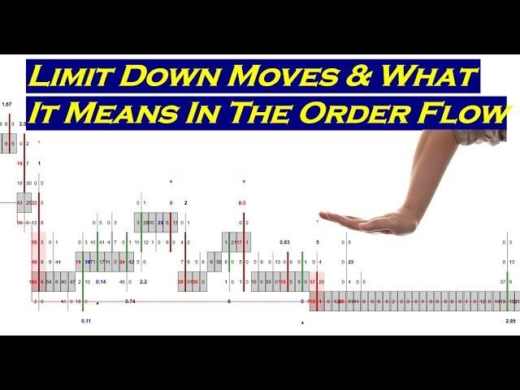

Financial markets are inherently dynamic, often experiencing significant fluctuations in asset prices, a phenomenon known as market volatility. This volatility, while presenting numerous challenges, also offers valuable opportunities for traders aiming to capitalize on rapid price movements. Market participants must develop effective strategies to navigate this volatility, balancing the potential for gains against the risk of losses.

Algorithmic trading, or algo trading, leverages computer-based systems to execute trades at high speeds and volumes, offering a sophisticated mechanism to manage market volatility. Algorithm-driven strategies can respond to market changes rapidly, optimizing trade execution to capitalize on fleeting opportunities that arise during volatile periods. By using complex algorithms, traders can automate their decision-making processes, mitigating the emotional influences that often lead to suboptimal trading choices.



This article explores the intersection of limit moves and algorithmic trading as tools to manage market volatility effectively. Limit moves serve as an essential market mechanism, capping price changes within a trading day to maintain stability and prevent extreme price fluctuations. We will analyze how these mechanisms can be employed alongside algorithmic trading strategies to create robust trading systems.

Through this discussion, we aim to illustrate how traders can systematically control and capitalize on market movements, employing technology and innovative strategies to mitigate risks and enhance trading performance. As the financial markets continue to evolve, the integration of limit moves and advanced algorithmic trading frameworks remains essential in ensuring stability and success.

## Table of Contents

## Understanding Market Volatility

Market volatility refers to the degree of variation in the price of financial assets over a specific period. This fluctuation is generally measured by the standard deviation or variance between returns of the asset. More explicitly, volatility can be quantified using the formula:

$$
\sigma = \sqrt{\frac{\sum_{i=1}^{N} (R_i - \overline{R})^2}{N}}
$$

where $\sigma$ is the standard deviation, $R_i$ are the individual returns, $\overline{R}$ is the average return, and $N$ is the number of observations. 

This variability is shaped by several key factors, including economic indicators such as interest rates, inflation, and employment figures. For example, unexpected shifts in interest rates by central banks can lead to increased market activity as traders reassess asset values. Geopolitical events, such as elections, wars, or international treaties, also play a significant role in influencing [volatility](/wiki/volatility-trading-strategies) by altering investor confidence and expectations.

Investor sentiment, driven by cognitive and emotional factors, can cause markets to behave irrationally, leading to heightened volatility. A sudden surge of optimism or pessimism can cause sharp swings in asset prices as investors either rush in or [exit](/wiki/exit-strategy) the markets.

High volatility presents a duality of risk and opportunity. On one hand, it heightens the potential for sudden losses, as rapid price declines can erode asset value swiftly. On the other hand, it creates opportunities for traders to gain from price differentials during these rapid movements, particularly for those employing strategies that capitalize on short-term fluctuations.

Given its profound impact on trading outcomes, understanding market volatility is vital for formulating effective trading strategies. It enables traders to manage risk more efficiently, allowing for more informed decision-making processes amidst market uncertainty.

## What is a Limit Move?

A limit move refers to a regulatory mechanism implemented in financial markets to regulate the extent of price changes for specific assets within a single trading day. By setting a ceiling on how much an asset's price can rise or fall, a limit move acts as a circuit breaker, curbing excessive volatility and safeguarding the market from extreme fluctuations. This mechanism is crucial in maintaining stability in trading environments, as it temporarily halts further price movements once predetermined limits are reached.

The concept of limit moves is particularly vital during periods of heightened market activity or instability, where sharp price movements can occur due to sudden shifts in investor sentiment or unexpected economic events. For example, if a stock's price reaches its limit up or limit down threshold, trading may be temporarily suspended or continue within confined limits, thereby allowing investors time to assess information and make informed decisions without the pressure of unchecked volatility.

Limit moves not only aim to preserve fair and orderly markets but also protect traders from potentially significant losses that can arise during volatile trading sessions. By establishing a controlled environment, these measures contribute to maintaining investor confidence and market integrity. Traders and investors often need to be aware of limit move rules, as they can impact trading strategies and influence market behavior.

## Types of Limit Moves

Limit moves in financial markets are regulatory measures designed to curtail excessive price volatility during trading sessions. These mechanisms set predefined thresholds for price movements to ensure orderly market behavior and protect traders from drastic price fluctuations. There are three primary types of limit moves: limit up, limit down, and lock limits.

**Limit Up and Limit Down**

"Limit up" refers to the maximum permissible increase in the price of a financial instrument within a single trading day. Conversely, "limit down" defines the steepest allowable decline in the same timeframe. These limits are typically set by exchanges and are based on the previous day's closing prices. For example, if a stock closes at $100, a 10% limit up would prevent it from trading above $110 the following day, while a 10% limit down would stop trading below $90. These thresholds act as circuit breakers, stabilizing the market amidst rapid price shifts by temporarily halting trading or significantly slowing down the pace at which transactions can occur once these limits are approached.

**Lock Limits**

Lock limits occur when price movements hit the ceiling or floor set by limit up or limit down restrictions, causing trading to stop for the day. Essentially, the market "locks" until the limits are reassessed for the subsequent trading session. This measure provides traders with an opportunity to reassess market conditions, reduces panic selling or buying, and maintains the integrity of the financial system by mitigating systemic risks associated with extreme volatility.

The application of these limit moves varies across different asset classes and exchanges. For instance, the commodities market frequently utilizes such mechanisms to manage fluctuations influenced by rapidly changing supply and demand dynamics. In equity markets, limit moves serve to guard against emotional trading and technical glitches that may cause erratic price actions. The effectiveness of limit moves lies in their ability to maintain market [liquidity](/wiki/liquidity-risk-premium) and order, thereby fostering a more stable trading environment.

## Algorithmic Trading: An Overview

Algorithmic trading utilizes computer systems programmed with complex algorithms to automatically execute trades in financial markets. These systems are designed to operate at speeds and efficiencies unattainable by human traders, enabling them to process and execute a large [volume](/wiki/volume-trading-strategy) of trades with minimal latency. The automation inherent in [algorithmic trading](/wiki/algorithmic-trading) provides consistent and systematic trading practices, which can be particularly advantageous in capitalizing on small price discrepancies and executing orders at the most favorable prices.

Algorithmic trading strategies are diverse and tailored to various market conditions and objectives. One common strategy is [arbitrage](/wiki/arbitrage), which involves exploiting price differences of the same asset in different markets or forms. For instance, if a stock is priced differently on two exchanges, an algorithm can buy the stock on the lower-priced exchange and sell on the higher-priced one, thus securing a risk-free profit.

Another popular strategy is trend-following, which aims to capitalize on the [momentum](/wiki/momentum) of market movements. Algorithms identify and follow established market trends, buying assets predicted to rise in value and selling those likely to decrease. This strategy operates on the principle that markets tend to move in prolonged trends due to herd behavior and other factors, allowing traders to benefit from sustained price movements.

Mean reversion is another widely-used strategy, based on the theory that asset prices will eventually revert to their historical mean or average level. Algorithms implementing this strategy analyze statistical indicators to identify overbought or oversold conditions and place trades accordingly. When prices deviate significantly from their historical average, the algorithm buys or sells the asset with the expectation that it will revert to its mean.

Sophisticated algorithms often incorporate multiple strategies, adjusting dynamically based on market conditions and new data inputs. The power of algorithmic trading lies not just in execution speed but also in the ability to analyze vast quantities of data and implement complex decision-making processes without human intervention, thus enhancing the ability to generate consistent returns across varied market environments.

## Optimizing Algo Trading Strategies for Volatile Markets

Algorithmic trading has become an indispensable tool in managing volatile markets, where adaptability and robust strategies play a pivotal role in mitigating risks and capitalizing on market movements. Successful algo trading strategies in such environments are marked by their ability to constantly adjust in response to dynamic market conditions and employ effective risk management measures.

**Adaptability and Constant Adjustments**

Algo trading strategies require a high degree of flexibility to remain effective during periods of market turbulence. This involves continuously monitoring market conditions, detecting shifts in volatility, and adjusting trading algorithms accordingly. One common approach is to incorporate dynamic parameter tuning, where algorithms automatically recalibrate their parameters based on real-time data. This can be achieved by deploying [machine learning](/wiki/machine-learning) techniques that analyze historical and current market data to predict future volatility patterns and adjust strategies in real-time.

**Risk Management Strategies**

In volatile markets, risk management becomes paramount to prevent significant losses and preserve capital. Implementing stop-loss orders and diversifying portfolios are key tactics employed by algorithmic traders. Stop-loss orders automatically execute a trade to exit positions once they reach a predefined loss threshold, thereby limiting potential losses. Diversification, on the other hand, involves spreading investments across a wide range of assets or sectors, reducing the risk associated with any single market movement.

Additionally, position sizing strategies can further enhance risk management. By determining the optimal size of each trade based on current market volatility, traders can minimize risk exposure. The Kelly Criterion, a mathematical formula used to calculate the optimal bet size, can be applied to determine the appropriate allocation of capital for each trade while considering volatility levels.

**Utilizing Volatility-Based Indicators**

Volatility-based indicators are crucial tools in constructing effective algorithmic trading strategies. The Average True Range (ATR) is a widely used metric that measures market volatility by calculating the average range of price movements over a specified time period. Traders use ATR to set stop-loss orders and determine position sizes, adapting to changing market conditions by increasing caution during periods of high volatility.

Bollinger Bands are another popular volatility indicator, consisting of a moving average and two standard deviations plotted above and below it. These bands expand and contract based on market volatility, providing insights into potential price breakouts or reversals. Algorithms can incorporate Bollinger Bands to dynamically adjust entry and exit points, taking advantage of periods of low and high volatility.

In the context of coding, implementing these strategies can be efficiently done using Python, a popular language for algorithmic trading. Libraries such as NumPy and pandas facilitate data analysis and calculations for indicators like ATR and Bollinger Bands. Here's a simple example of calculating ATR in Python:

```python
import pandas as pd
import numpy as np

def calculate_atr(data, period=14):
    data['High-Low'] = data['High'] - data['Low']
    data['High-PrevClose'] = np.abs(data['High'] - data['Close'].shift())
    data['Low-PrevClose'] = np.abs(data['Low'] - data['Close'].shift())

    true_range = data[['High-Low', 'High-PrevClose', 'Low-PrevClose']].max(axis=1)
    atr = true_range.rolling(window=period).mean()

    return atr

# Sample DataFrame `df` with columns: 'High', 'Low', 'Close'
df = pd.DataFrame({
    'High': [120, 125, 130],
    'Low': [115, 120, 125],
    'Close': [118, 122, 128]
})

atr_values = calculate_atr(df)
print(atr_values)
```

By integrating adaptive strategies, robust risk management, and volatility indicators, algorithmic trading systems can effectively navigate the challenges and opportunities presented by volatile markets.

## Leveraging Machine Learning in Algo Trading

Machine learning significantly enhances algorithmic trading by leveraging its ability to process and analyze vast amounts of market data efficiently. This capability allows for accurate predictions of future market movements, which is crucial for navigating financial markets, especially during periods of high volatility. 

One of the core strengths of machine learning in algorithmic trading is its adaptability. Traditional trading methods rely on static strategies that may not perform well under changing market conditions. Machine learning algorithms can adjust strategies in real-time by updating their parameters based on the most recent data inputs, which gives traders a significant advantage. This adaptability is particularly beneficial in volatile markets where conditions can change rapidly and unpredictably.

The success of machine learning algorithms in trading heavily depends on the quality of the data they are trained on. High-quality, relevant, and timely data are paramount to building models that can accurately detect patterns and make predictions. Poor data quality can lead to model inaccuracies, resulting in suboptimal trading decisions. Consequently, data preprocessing, including cleaning, normalization, and feature selection, is a critical step in the algorithm development process.

Moreover, the continuous refinement of models is essential to maintain their effectiveness over time. Financial markets are dynamic, and the strategies that work today might not be effective tomorrow. Hence, algorithms must be iteratively improved and validated against new data. It's common practice to implement techniques such as cross-validation and [backtesting](/wiki/backtesting) to ensure models perform well across different market scenarios.

For a practical perspective, Python, a popular language in data science and finance, provides several libraries that facilitate machine learning in algorithmic trading:

```python
import numpy as np
from sklearn.ensemble import RandomForestRegressor
from sklearn.model_selection import train_test_split

# Sample code for fitting a machine learning model
# Generate synthetic market data
X = np.random.rand(1000, 5)  # features
y = np.random.rand(1000)     # target prices

# Split the data into training and testing sets
X_train, X_test, y_train, y_test = train_test_split(X, y, test_size=0.2, random_state=42)

# Initialize and train a RandomForest model
model = RandomForestRegressor(n_estimators=100, random_state=42)
model.fit(X_train, y_train)

# Predict future prices
predictions = model.predict(X_test)

# Evaluate model performance
performance = model.score(X_test, y_test)
```

This Python snippet uses synthetic data to demonstrate the training of a RandomForestRegressor, a typical machine learning model suitable for predicting continuous values in trading.

In conclusion, machine learning's ability to analyze data and adapt strategies dynamically offers substantial advantages in algorithmic trading. However, success hinges on high-quality data and continuous model refinement, as financial markets are inherently unpredictable and volatile.

## Best Practices for Algo Traders

Maintaining diversified portfolios is a fundamental practice for algorithmic traders aiming to spread risk across different asset classes. By diversifying, traders can mitigate the impact of adverse movements in any single market or sector, thereby enhancing overall portfolio stability. This approach involves investing in a mix of equities, bonds, commodities, and other financial instruments, reducing the dependence on the performance of a particular asset type. Additionally, diversification enables traders to capitalize on various market opportunities and reduce exposure to sector-specific risks.

Regularly monitoring and adjusting trading algorithms is essential for adapting to dynamic market conditions. Algorithmic strategies require fine-tuning to maintain effectiveness and capitalize on emerging trends. Traders should ensure their algorithms are responsive to real-time data and incorporate performance metrics to identify areas for improvement. For instance, employing backtesting and forward-testing processes can help validate the robustness of an algorithm and minimize the risk of significant financial losses.

Staying updated with market news and economic indicators is crucial for making informed trading decisions. Economic events, such as changes in interest rates, employment reports, or geopolitical developments, can significantly influence market volatility. By actively monitoring these factors, traders can anticipate and prepare for potential market shifts. Automated news feeds and economic calendars are valuable tools that can aid traders in staying informed and adjusting their strategies accordingly. Moreover, integrating sentiment analysis into trading algorithms can provide insights into market sentiment and predict possible asset price movements.

Together, these best practices enhance the resilience and performance of algorithmic trading strategies, especially in volatile market environments. By diversifying portfolios, maintaining adaptive algorithms, and staying informed, algo traders can effectively manage risk and seize opportunities for profit.

## Emerging Trends in Algo Trading for Volatile Markets

The landscape of algorithmic trading is evolving rapidly, with significant trends emerging to tackle market volatility more effectively. Among these, the integration of Artificial Intelligence (AI) and Machine Learning (ML) is increasingly prevalent. These technologies enable trading platforms to analyze large datasets, identify patterns, and make predictions about future price movements. AI-driven models can adaptively optimize trading strategies in real-time, crucial for gaining an edge in volatile markets. For instance, ML algorithms can process historical and real-time data to dynamically adjust parameters, enhancing decision-making under uncertain conditions.

The rise of decentralized finance (DeFi) represents another transformative trend impacting automated trading. DeFi leverages blockchain technology to create decentralized, peer-to-peer financial services, providing increased accessibility and transparency. This shift enables traders to deploy algorithmic strategies in decentralized exchanges without the need for traditional intermediaries, potentially reducing costs and enhancing trading speed. Moreover, DeFi platforms offer a new range of assets and opportunities for diversification, presenting algo traders with novel strategies to exploit.

Blockchain technology itself plays a critical role by ensuring secure and transparent transactions within financial markets. Its distributed ledger system minimizes the risks of fraud and enhances trust among participants. This added layer of security is especially valuable for high-frequency trading, where rapid and accurate order execution is essential. Furthermore, smart contracts on blockchains can automate trade executions when predetermined conditions are met, facilitating complex, multi-exchange transactions with minimal human intervention. Overall, these emerging trends collectively empower traders to navigate volatile markets with greater agility and confidence.

## Conclusion

Effective management of market volatility requires a judicious blend of limit moves and well-optimized algorithmic trading strategies. Limit moves impose constraints on price fluctuations, acting as a stabilizing mechanism that mitigates the risks associated with extreme market swings. This protective measure is essential in maintaining orderly markets and safeguarding traders against unpredictable price spikes, thereby offering a level of certainty in executing trading strategies.

Algorithmic trading plays an equally critical role by harnessing technology to execute trades with precision and speed. Through the adaptability inherent in algorithmic systems, traders can swiftly adjust strategies to align with fluctuating market conditions. The use of risk management techniques, such as stop-loss orders and diversified portfolios, further enables traders to manage potential downsides effectively.

Furthermore, cutting-edge technology, particularly advancements in [artificial intelligence](/wiki/ai-artificial-intelligence) and machine learning, provides traders with enhanced analytical capabilities. These technologies allow for the real-time processing and analysis of large datasets, offering predictive insights that help traders anticipate market trends. However, it is crucial that the algorithms remain dynamic, integrating continuous learning mechanisms that allow them to evolve as market conditions change.

Ultimately, the key to success in navigating volatile financial markets lies not only in employing technology but also in maintaining a learning mindset. Traders must remain vigilant, continuously refining their strategies to adapt to new data and emerging market conditions. This iterative process of learning and adjustment enhances the stability and success of trading strategies, fostering a disciplined approach that can withstand the challenges of market volatility.

## References & Further Reading

[1]: Bergstra, J., Bardenet, R., Bengio, Y., & Kégl, B. (2011). ["Algorithms for Hyper-Parameter Optimization."](https://dl.acm.org/doi/10.5555/2986459.2986743) Advances in Neural Information Processing Systems 24.

[2]: ["Advances in Financial Machine Learning"](https://www.amazon.com/Advances-Financial-Machine-Learning-Marcos/dp/1119482089) by Marcos Lopez de Prado

[3]: ["Evidence-Based Technical Analysis: Applying the Scientific Method and Statistical Inference to Trading Signals"](https://www.amazon.com/Evidence-Based-Technical-Analysis-Scientific-Statistical/dp/0470008741) by David Aronson

[4]: ["Machine Learning for Algorithmic Trading"](https://github.com/stefan-jansen/machine-learning-for-trading) by Stefan Jansen

[5]: ["Quantitative Trading: How to Build Your Own Algorithmic Trading Business"](https://www.amazon.com/Quantitative-Trading-Build-Algorithmic-Business/dp/1119800064) by Ernest P. Chan