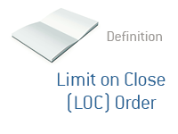

## Table of Contents

## What is a Limit-On-Close (LOC) order?

A Limit-On-Close (LOC) order is a type of order you can use when you want to buy or sell a stock at the closing price of the trading day, but only if that price is at or better than a specific price you set. For example, if you want to buy a stock and you think the closing price will be good, you can set an LOC order with your maximum price. If the closing price is at or below your set price, your order will be filled at the closing price.

LOC orders are useful because they let you take advantage of the closing price, which can be important for some trading strategies. However, there's a catch: if the closing price is not at or better than your limit price, your order won't be filled at all. This means you need to be careful and think about what price you set, so you don't miss out on buying or selling the stock.

## How does a Limit-On-Close order differ from a Market-On-Close order?

A Limit-On-Close (LOC) order and a Market-On-Close (MOC) order are both used to buy or sell stocks at the end of the trading day, but they work a bit differently. With an LOC order, you set a specific price that you're willing to buy or sell at. If the closing price of the stock is at or better than your set price, your order will be filled at the closing price. If the closing price is worse than your set price, your order won't be filled at all. This means you have control over the price you're willing to accept.

On the other hand, a Market-On-Close (MOC) order doesn't let you set a specific price. Instead, it guarantees that your order will be filled at the closing price, no matter what that price is. This can be good if you just want to make sure your order goes through at the end of the day, but it can also be risky because you might end up buying or selling at a price that's not what you expected. So, the main difference is that an LOC order gives you more control over the price, while an MOC order gives you more certainty that your order will be filled.

## What are the benefits of using a Limit-On-Close order?

Using a Limit-On-Close order can help you buy or sell a stock at the end of the trading day at a price you're happy with. When you set an LOC order, you decide the highest price you're willing to pay or the lowest price you're willing to accept. If the stock's closing price is better than or equal to your limit, your order will go through. This gives you control over the price, so you don't have to worry about the stock closing at a price that's too high or too low for you.

Another benefit is that it can be useful for certain trading strategies. For example, if you think the stock might have a good closing price because of news or events that day, an LOC order lets you take advantage of that without risking buying or selling at a bad price. It's a way to be part of the market's closing action while still having a safety net in place.

## Can you explain the risks associated with Limit-On-Close orders?

One risk of using a Limit-On-Close order is that your order might not get filled at all. This happens if the stock's closing price is worse than the limit price you set. For example, if you want to buy a stock and you set your limit at $50, but the stock closes at $51, your order won't go through. This can be frustrating if you really wanted to buy or sell the stock, but the price at the end of the day didn't meet your expectations.

Another risk is that the closing price might be very different from what you expected. The stock market can be unpredictable, and things like last-minute news or big trades can change the closing price a lot. If you're not ready for this, you might miss out on a good opportunity or end up not trading at all. So, it's important to think carefully about the limit price you set and be ready for the stock to close at a price you didn't expect.

## In what types of markets are Limit-On-Close orders most effective?

Limit-On-Close orders are most effective in markets where there's a lot of trading activity at the end of the day. This is because there's a better chance that the closing price will be close to your limit price if many people are buying and selling. For example, in busy markets like big stock exchanges, there's usually a lot of action right before the market closes. This can help make sure your order gets filled at a good price.

Another situation where LOC orders work well is when there's a big event or news that might affect the stock price at the end of the day. If you think the news will make the stock close at a good price for you, an LOC order can help you take advantage of that. But you need to be careful because if the news changes the price a lot, your order might not get filled if the closing price is worse than your limit.

## How do you place a Limit-On-Close order?

To place a Limit-On-Close order, you need to use a trading platform or a broker that supports this type of order. First, you'll need to log into your trading account. Then, find the stock you want to buy or sell. Look for an option to place an order and choose "Limit-On-Close" or "LOC" from the list of order types. You'll then need to enter the number of shares you want to trade and set your limit price. This is the price at which you're willing to buy or sell the stock at the end of the trading day.

Once you've entered all the details, review your order to make sure everything is correct. Make sure the stock symbol, the number of shares, and your limit price are all right. If everything looks good, submit your order. Keep in mind that your order will only be filled if the stock's closing price is at or better than your limit price. If the closing price is worse than your limit, your order won't go through.

## What happens if the closing price is not within the limit price of an LOC order?

If the closing price of a stock is not within the limit price you set for a Limit-On-Close order, your order will not be filled. This means you won't buy or sell the stock that day. For example, if you want to buy a stock and you set your limit at $50, but the stock closes at $51, your order won't go through because the closing price is higher than your limit.

This can be frustrating if you really wanted to trade the stock, but it's important to remember that the LOC order is there to protect you from buying or selling at a price you're not happy with. If the stock's closing price doesn't meet your expectations, it's better to wait and try again another day, rather than risking a bad trade.

## Are there any specific times or conditions when a Limit-On-Close order cannot be used?

There are certain times and conditions when you can't use a Limit-On-Close order. For example, some trading platforms might not let you place an LOC order after a certain time in the trading day. This is because the order needs to be in place before the market closes, so there's usually a cut-off time, like 30 minutes before the end of the trading day. Also, if there's a trading halt or a big event that stops normal trading, you might not be able to use an LOC order.

Another situation where you can't use an LOC order is during special trading sessions. For example, if the market is open for a special session after normal trading hours, LOC orders might not be allowed. It's also important to know that not all stocks or markets support LOC orders. Some smaller or less common stocks might not have this option available. So, it's always a good idea to check with your broker or trading platform to see if you can use an LOC order for the stock you're interested in.

## How do Limit-On-Close orders affect stock prices at market close?

Limit-On-Close orders can affect stock prices at market close because they add to the demand or supply of the stock right before the market closes. If a lot of people place LOC orders to buy a stock at a certain price, it can push the closing price up. This happens because there's more demand for the stock at the end of the day. On the other hand, if many people want to sell a stock using LOC orders, it can push the closing price down because there's more supply.

However, the impact of LOC orders on stock prices depends on how many orders there are and how they compare to other orders in the market. If there are a lot of LOC orders compared to other types of orders, they can have a bigger effect on the closing price. But if there are only a few LOC orders, they might not make much difference. It's also important to remember that other factors, like news or big trades, can change the closing price a lot, so LOC orders are just one part of what can affect the stock price at the end of the day.

## What are some common strategies that involve Limit-On-Close orders?

One common strategy that uses Limit-On-Close orders is trying to buy a stock at a good price at the end of the trading day. If you think the stock might go up because of news or events that day, you can set an LOC order with a limit price that's lower than what you think the stock will close at. If the stock closes at or below your limit price, you'll buy it at a good price. This can be a smart way to get into a stock without paying too much.

Another strategy is to use LOC orders to sell a stock at a high price at the end of the day. If you own a stock and you think it might go up because of good news, you can set an LOC order with a limit price that's higher than the current price. If the stock closes at or above your limit price, you'll sell it at a good price. This can help you make more money from your stock without waiting too long.

Some traders also use LOC orders to manage risk. If you're worried about a stock going down at the end of the day, you can set an LOC order to sell it at a certain price. If the stock closes at or above your limit price, you'll keep it. But if it closes below your limit price, you'll sell it and avoid losing too much money. This can be a good way to protect your investment from big drops at the end of the trading day.

## How do exchanges handle Limit-On-Close orders during high volatility?

During times of high [volatility](/wiki/volatility-trading-strategies), exchanges have special rules to handle Limit-On-Close orders. When the market is moving a lot, there might be a lot of LOC orders coming in at the same time. To make sure everything is fair and orderly, exchanges might use a special process called an "imbalance auction" at the end of the day. This helps match up all the buy and sell orders to find a fair closing price. If there are more LOC orders to buy than to sell, the closing price might go up. If there are more orders to sell, the price might go down.

Exchanges also have rules to make sure that LOC orders don't cause too much chaos. For example, if the market is really volatile, exchanges might put a limit on how many LOC orders can be placed. This helps keep the market stable and makes sure that everyone gets a fair chance to trade. So, even during high volatility, exchanges work hard to make sure that LOC orders are handled in a way that's fair for everyone.

## Can you discuss any regulatory considerations or changes that impact the use of Limit-On-Close orders?

Regulatory bodies like the Securities and Exchange Commission (SEC) in the United States keep an eye on how Limit-On-Close orders are used. They want to make sure that these orders help keep the market fair and orderly. Sometimes, they make new rules or change old ones to make sure that LOC orders work well, especially during times when the market is moving a lot. For example, they might set rules about how many LOC orders can be placed at one time or how they are handled at the end of the trading day.

One big change that affected LOC orders was the introduction of the "Regulation NMS" (National Market System) in the U.S. This regulation made sure that all orders, including LOC orders, are handled in a way that's fair and transparent. It also set rules about how exchanges should handle orders during high volatility to keep the market stable. These rules help make sure that LOC orders are used in a way that benefits everyone in the market, not just a few people.

## References & Further Reading

[1]: Almgren, R., & Chriss, N. (2000). ["Optimal execution of portfolio transactions."](https://smallake.kr/wp-content/uploads/2016/03/optliq.pdf) Journal of Risk, 3(2), 5-39.

[2]: Harris, L. (2002). ["Trading and Exchanges: Market Microstructure for Practitioners."](https://www.acsu.buffalo.edu/~keechung/MGF743/Readings/Trading-Exchanges-Market-Microstructure-Practitioners%20Draft%20Copy.pdf) Oxford University Press.

[3]: Hasbrouck, J. (2007). ["Empirical Market Microstructure: The Institutions, Economics, and Econometrics of Securities Trading."](https://archive.org/details/empiricalmarketm0000hasb) Oxford University Press.

[4]: Kissell, R., & Glantz, M. (2003). ["Optimal Trading Strategies: Quantitative Approaches for Managing Market Impact and Trading Risk."](https://archive.org/details/optimaltradingst0000kiss) AMACOM.

[5]: ["Technical Analysis of the Financial Markets: A Comprehensive Guide to Trading Methods and Applications"](https://www.amazon.com/Technical-Analysis-Financial-Markets-Comprehensive/dp/0735200661) by John J. Murphy

[6]: Bruder, B., & Gaussel, N. (2011). ["Risk Management: Foggy Financial Architecture."](https://www.researchgate.net/publication/320339680_Understanding_the_Momentum_Risk_Premium_An_In-Depth_Journey_Through_Trend-Following_Strategies) Risk and Decision Analysis, 3(3-4), 149-164.