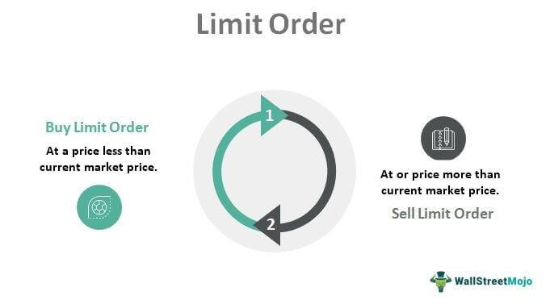

The world of stock trading is vast, populated with various order types and strategies that cater to different trading goals and risk appetites. In this article, we explore key order types such as LOC (Limit-on-Close) and market orders, especially within the context of algorithmic trading. Stock trading involves a range of orders, each offering distinct mechanisms for the execution of trades, influencing factors such as price certainty, execution speed, and risk management.

Understanding these concepts is crucial for both novice and experienced traders looking to streamline their trading strategies. For instance, a Limit-on-Close (LOC) order allows traders to set a price limit for buying or selling that is intended to be executed at the market close. This can be strategic in scenarios where traders anticipate price movements or wish to manage the closing price of their trades. On the other hand, market orders focus on the immediate execution of trades at the current market price, thus prioritizing speed over price precision. 



Grasping these order types becomes increasingly significant within algorithmic trading, where automated systems are deployed to execute trades at optimal conditions. Algorithmic trading systems often require careful consideration of order types to ensure the strategies employed align with the desired financial goals. This knowledge empowers traders to make informed decisions, enhancing the efficiency and effectiveness of their trading operations.

## Table of Contents

## Understanding Stock Trading Orders

Trading orders are fundamental instructions provided by traders to brokerage firms, directing them to buy or sell securities on the traders' behalf. These orders play a pivotal role in stock trading, offering mechanisms to execute trades under different conditions, aligned with the traders' strategies and goals. Among the myriad types of trading orders, market orders and limit orders stand out as two of the most commonly used, each featuring distinct characteristics and serving specific purposes within trading strategies.

A market order is an instruction to buy or sell a security immediately at the best available price in the market. The primary advantage of market orders is their speed of execution, making them ideal for traders who prioritize immediacy and are less concerned about precise pricing. However, this speed comes with the risk of slippage, where the price at which the order is executed differs from the price at which the order was placed, especially in rapidly changing markets. Slippage occurs because, in volatile markets or with large orders, the available market price may shift between the time the order is placed and when it is filled.

In contrast, a limit order allows traders to specify the maximum price they are willing to pay for a security (buy limit order) or the minimum price they are willing to accept (sell limit order). This feature gives traders control over the price at which their orders are executed, providing protection from unfavorable price movements. However, while limit orders minimize the risk of slippage, there is no guarantee that they will be executed if the market does not reach the specified price. This potential lack of execution is the trade-off for gaining price certainty.

The choice between using market and limit orders depends on a trader's specific objectives. For instance, a market order might be suitable for entering or exiting positions swiftly in a highly liquid market where slight price variations are acceptable. Conversely, a limit order is advantageous for traders who are focused on achieving a specific entry or [exit](/wiki/exit-strategy) price and are willing to accept the risk that the order might not be fulfilled. Understanding these order types and their unique characteristics allows traders to tailor their strategies to better manage risks and achieve their desired financial outcomes.

## What is a Limit-on-Close (LOC) Order?

A Limit-on-Close (LOC) order is a specialized type of limit order designed to execute specifically at the closing price of the market, provided the security's price meets the set criteria. This type of order grants traders the ability to specify the maximum or minimum price at which they are willing to buy or sell a security, affording them greater control over the execution price. However, unlike a market order, an LOC order is not guaranteed to be executed. This is because if the security does not reach the specified price level at the market close, the order will not be fulfilled.

LOC orders are particularly beneficial for traders who are focused on specific price points, especially during the session close, which can often experience significant price movements due to adjustments made by institutional investors, fund managers, or the settlement of index funds. By setting a price limit that aligns with a trader's strategy, LOC orders can offer a strategic advantage by potentially avoiding unfavorable price points that might occur with market [volatility](/wiki/volatility-trading-strategies).

Despite these advantages, there are notable risks associated with LOC orders. The most prominent is the possibility of non-execution; if the closing price of the security does not reach the limit set by the trader, the order will remain unexecuted, potentially resulting in a missed opportunity. Additionally, while promising precision, an LOC order can sometimes lead to challenges in highly volatile markets where the closing price can be unpredictable.

To illustrate, consider a trader who places a LOC order to purchase shares of a company at or below $50. If at market close the share price is at or below this price point, the order is executed. However, should the shares close above $50, the LOC order will not be executed, safeguarding the trader from overpaying based on their predefined strategy.

Incorporating LOC orders into trading strategies requires careful consideration of market trends and price forecasts, making them a suitable tool for traders prioritizing price execution control, particularly as market sessions culminate.

## Market Orders Explained

Market orders are integral components of stock trading that prioritize transaction speed over precision in pricing. When a market order is placed, it is executed immediately at the best available current market price. This ensures that the trader's transaction is completed quickly, which is particularly advantageous in rapidly moving markets where delays could otherwise lead to missed opportunities.

The primary characteristic that distinguishes market orders from limit-on-close (LOC) orders is their focus on speed rather than price precision. By seeking immediate execution, market orders allow traders to enter or exit positions with swift efficiency. This attribute makes them particularly useful in scenarios where the trader's priority is simply to ensure a transaction occurs rather than holding out for an optimal price. For example, in fast-paced markets or during high-volatility periods, the ability to execute a trade instantaneously can be crucial.

However, the speed of market orders does not come without potential drawbacks. One key risk associated with market orders is slippage. Slippage occurs when there is a difference between the expected execution price and the actual price at which the trade is executed. This discrepancy can arise due to rapid market movements, leading to trades being filled at inferior prices than anticipated. For instance, if a stock's price is rising quickly, a trader might find that the purchase price is higher than expected by the time the order is executed. 

To quantify the potential impact of slippage, consider the following illustrative example using Python:

```python
# Example Python code to simulate slippage in a market order
import random

# Simulate a stock price and expected execution price
expected_price = 100.0  # Expected price for execution
current_price = expected_price  # Starting actual market price

# Simulate a random change in price to reflect slippage
slippage = random.uniform(-0.5, 0.5)  # Random price shift between -0.5 and 0.5
actual_price = current_price + slippage

print(f"Expected Price: {expected_price}")
print(f"Actual Execution Price with Slippage: {actual_price}")
```

In this example, the expected execution price is set to $100, but due to slippage, the actual price varies slightly, reflecting how real-world market conditions might affect a trade. This simple simulation underscores the reality that, while market orders provide immediacy, the precise price at which an order is filled can be slightly unpredictably altered by market dynamics.

Ultimately, the choice to utilize market orders should be informed by the trader's specific goals and risk tolerance. For those prioritizing the assurance of trade execution over exact pricing, market orders can serve as a vital tool within their trading toolkit.

## Algorithmic Trading and Order Types

Algorithmic trading represents a transformative approach in financial markets, leveraging technology to enhance trading efficiency by automating decisions and executions. At its core, [algorithmic trading](/wiki/algorithmic-trading) employs pre-defined mathematical models and statistical analysis to determine optimum trading opportunities, prioritize execution speed, and precisely control trade execution prices. These models can rapidly process vast datasets, identify patterns, and execute trades faster than human traders.

A crucial component of algorithmic trading is understanding and utilizing different order types to achieve specific trading objectives. Order types such as market orders, limit orders, and more specialized forms like Limit-on-Close (LOC) orders, directly influence the success of an algorithmic strategy. These orders define how and when a trade should be executed, ensuring that the algorithm operates within set parameters.

Market orders, intended to execute immediately at current prices, prioritize speed, making them suitable for high-frequency trading where rapid execution is critical. However, this speed can lead to slippage, where trades are executed at prices different from those initially expected due to rapid market movements.

Limit orders, including the LOC variety, offer an alternative by setting specific price points for execution. LOC orders specify a price limit at the market's close, providing price control but at the expense of guaranteed execution. These orders are particularly useful in trading strategies where price precision outweighs execution speed.

In developing algorithmic trading systems, it's vital to program these order types into the algorithm precisely. Consider a simplified example of implementing an algorithm that decides between executing a market order or a LOC order based on current market conditions:

```python
def execute_trade(current_price, target_close_price, order_type='market'):
    if order_type == 'market':
        # immediate execution
        return current_price
    elif order_type == 'LOC':
        # execution at target price if feasible
        return target_close_price if current_price <= target_close_price else None

# Example usage:
trade_execution_price = execute_trade(current_price=100, target_close_price=102, order_type='LOC')
print(f"Trade executed at: {trade_execution_price}")
```

The code above outlines a basic structure where a trade decision between a market order and a LOC order depends on predetermined conditions. For algorithmic traders, such logic forms the backbone of more complex strategies that account for market volatility, [liquidity](/wiki/liquidity-risk-premium), and individual risk thresholds.

In conclusion, understanding and correctly implementing order types in algorithmic trading systems is not merely a technicality but a necessity. It ensures these systems not only function as intended but also achieve the strategic goals of speed, cost efficiency, and price precision in the competitive landscape of modern trading markets.

## LOC vs. Market Orders in Algo Trading

In algorithmic trading, the choice between Limit-on-Close (LOC) orders and market orders plays a significant role in determining the effectiveness of trading strategies. This decision hinges on the trade-off between execution speed and price control, each offering distinct advantages depending on the trading context.

**LOC Orders in Algorithmic Trading**

LOC orders provide traders with the ability to maintain control over the execution price while aiming to execute trades at the market close. This order type is particularly beneficial in scenarios where aligning executions with the closing price is strategic. For example, portfolio managers reviewing performance metrics based on day-end prices often utilize LOC orders. This ensures that their trades align more closely with internal and external performance benchmarks based on closing prices.

Algorithmic strategies that aim to minimize price impact and take advantage of daily pricing patterns also find utility in LOC orders. For instance, consider a strategy that capitalizes on end-of-day liquidity surges—LOC orders allow the algorithm to place trades that are more likely to execute at or near desired prices under these conditions.

**Market Orders in Algorithmic Trading**

Market orders, on the other hand, are designed for immediacy, sacrificing price precision for speed. This order type is optimal in fast-moving markets where capturing a trading opportunity promptly is critical. Algorithms designed to respond to real-time data signals, such as those based on breaking news or high-frequency trading strategies, leverage market orders to ensure execution before the market moves against the intended position.

In situations where liquidity is ample, the risk of significant slippage is reduced, making market orders viable with minimal adverse price effects. For instance, during high [volume](/wiki/volume-trading-strategy) periods or in highly liquid securities, the cost of slippage may be outweighed by the need for speed.

**Choosing Between LOC and Market Orders**

When selecting between LOC and market orders, the algorithm must evaluate its priorities: price precision versus speed. An algorithm prioritizing controlled execution near the close would favor LOC orders, especially when its strategy depends on accurate closing price data. Conversely, if the algorithm seeks to capitalize quickly on intra-day price movements or is in a competitive trading environment where latency is detrimental, market orders become more suitable.

Imagine a scenario in which a trader seeks to capture a narrow window of [arbitrage](/wiki/arbitrage) opportunities. Here, even a minor delay might negate potential profits, making market orders the preferred choice. Conversely, if preserving capital by avoiding unfavorable execution prices is critical, adopting LOC orders might better align with strategic objectives.

Ultimately, algorithmic strategies must be tailored to the dynamics of the market and the specific objectives they aim to achieve, requiring a keen understanding of how different order types can be optimally deployed within those strategies.

## Examples and Use Cases

Traders often employ Limit-on-Close (LOC) and market orders in various scenarios to achieve specific trading objectives. Understanding these order types and their application can be crucial for optimizing trading strategies.

### Limit-on-Close (LOC) Orders in Practice

A common example of using LOC orders is in trading strategies that focus on capturing price movements at the end of the trading session. Consider a trader who believes that a specific stock will experience a price increase towards the market close. By placing a LOC order with a specified limit price, the trader aims to purchase the stock only if it reaches the desired price level by the session's end. This approach ensures the trader doesn't overpay while attempting to capitalize on expected price movements driven by end-of-day liquidity or significant news announcements.

LOC orders are also beneficial when trying to align transactions with closing prices for benchmark comparisons or portfolio valuation. For instance, fund managers may place LOC orders to match the stock's closing price, ensuring their trades reflect the daily closing values for accurate performance measurement relative to indices.

### Market Orders in Action

Market orders are frequently used in situations requiring immediate execution. A trader aiming to enter or exit a position quickly, irrespective of minor price differences, might opt for a market order. This is especially advantageous in highly liquid stocks where the bid-ask spread is narrow, minimizing the potential adverse effects of price slippage.

For example, a day trader seeking to capitalize on short-term news or technical patterns may utilize market orders for rapid position adjustments. The immediate execution characteristic of market orders allows the trader to react promptly to volatile market conditions, ensuring participation without delay.

### Case Studies

**Case Study 1: LOC Order in Volatile Markets**

Consider a scenario where a company is set to announce its quarterly earnings at the market close. The stock is expected to react sharply, depending on the results. A trader anticipating a positive surprise places a LOC order to buy shares, contingent on the stock reaching a targeted price. If the announcement exceeds market expectations, the LOC order may execute at the close, allowing the trader to capture the initial upward [momentum](/wiki/momentum). Conversely, if the results disappoint and the stock doesn't reach the specified limit, the order won't execute, protecting the trader from potential losses.

**Case Study 2: Market Order during Breakout**

Imagine a situation where a stock breaks a significant resistance level, indicating a potential bullish [breakout](/wiki/breakout-trading). A trader who had been waiting for this technical signal might issue a market order to buy the stock, prioritizing speed over price to ensure entry during the breakout phase. Although the trader might experience slippage, the immediate execution is perceived as crucial to leverage the anticipated price movement.

These examples underline the strategic application of LOC and market orders based on market conditions and trading goals. Traders must assess their priorities between price control and execution speed to optimize their use of these order types effectively.

## Conclusion

Successful trading requires traders to have a thorough understanding of various order types and their unique characteristics. Each order type, whether a Limit-on-Close (LOC) or a market order, shapes trading outcomes in distinct ways, influencing both the execution price and speed. This understanding is even more critical in algorithmic trading, where the precision and efficiency of order execution are paramount.

For algorithmic traders, selecting the appropriate order type is pivotal in fine-tuning strategy performance and managing risks. LOC orders provide price control at the potential cost of execution certainty, making them suitable in scenarios where price precision outweighs the need for immediate market entry. Conversely, market orders are ideal when speed and certainty of execution are prioritized, despite the risk of price slippage.

The dynamic and fast-paced nature of financial markets necessitates continuous education and adaptation. As markets evolve, so too must trading strategies and methodologies. Staying informed about the latest developments in trading technology, market structure, and order execution can provide traders with the edge needed to maintain competitiveness and optimize their trading outcomes.

In conclusion, a strategic blend of knowledge, adaptability, and technological acumen forms the cornerstone of successful trading. By continuously enhancing their understanding of order types and market conditions, traders can craft strategies that not only meet their performance goals but also mitigate risks effectively.

## References & Further Reading

[1]: Almgren, R., & Chriss, N. (2000). ["Optimal execution of portfolio transactions."](https://smallake.kr/wp-content/uploads/2016/03/optliq.pdf) Journal of Risk, 3(2), 5-39.

[2]: Harris, L. (2002). ["Trading and Exchanges: Market Microstructure for Practitioners."](https://www.acsu.buffalo.edu/~keechung/MGF743/Readings/Trading-Exchanges-Market-Microstructure-Practitioners%20Draft%20Copy.pdf) Oxford University Press.

[3]: Hasbrouck, J. (2007). ["Empirical Market Microstructure: The Institutions, Economics, and Econometrics of Securities Trading."](https://archive.org/details/empiricalmarketm0000hasb) Oxford University Press.

[4]: Kissell, R., & Glantz, M. (2003). ["Optimal Trading Strategies: Quantitative Approaches for Managing Market Impact and Trading Risk."](https://archive.org/details/optimaltradingst0000kiss) AMACOM.

[5]: ["Technical Analysis of the Financial Markets: A Comprehensive Guide to Trading Methods and Applications"](https://www.amazon.com/Technical-Analysis-Financial-Markets-Comprehensive/dp/0735200661) by John J. Murphy

[6]: Bruder, B., & Gaussel, N. (2011). ["Risk Management: Foggy Financial Architecture."](https://www.researchgate.net/publication/320339680_Understanding_the_Momentum_Risk_Premium_An_In-Depth_Journey_Through_Trend-Following_Strategies) Risk and Decision Analysis, 3(3-4), 149-164.