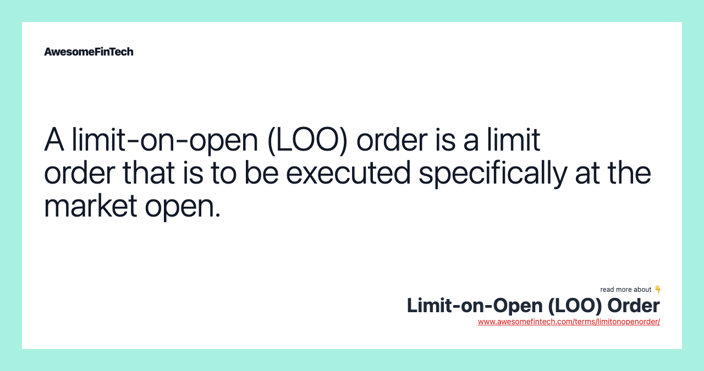

In the ever-evolving world of stock market trading, the ability to understand and utilize different types of market orders is essential for both novice and experienced traders. Among these, the Limit-on-Open (LOO) order stands out as a strategic tool designed to execute trades at the market's opening price under specified conditions. This conditional order type provides traders the advantage of setting price limits on their trades that only activate when the market opens, offering greater control over their trading activities during this crucial time.

This article serves as a comprehensive guide to LOO orders, detailing their mechanics, execution strategies, and significance in the context of algorithmic trading. By exploring the operational nuances of LOO orders and comparing them with similar order types, such as Limit-on-Close (LOC) orders, traders can better align their investment strategies with market behaviors. For both beginners and seasoned traders, a solid understanding of these order types can significantly enhance the effectiveness and precision of trading strategies.



## Table of Contents

## What Is a Limit-on-Open (LOO) Order?

A Limit-on-Open (LOO) order is a specialized type of limit order designed to execute at the market opening. This order is conditional upon the market price meeting the limit set by the trader. Unlike standard limit orders, which can be active throughout the entire trading session, LOO orders are specifically programmed to activate only during the market's opening minutes. This temporal restriction offers traders the opportunity to strategically engage with the opening price dynamics, often marked by heightened liquidity and volatility.

Traders frequently employ LOO orders to capitalize on the distinct characteristics of the market open. At this time, a significant influx of buy and sell orders can lead to rapid changes in price levels, creating opportunities for executing trades at favorable prices. The ability of a LOO order to capture these price movements, while adhering to predefined price limits, enhances its utility as a crucial component of a trader's toolkit.

The design of a LOO order includes explicit price constraints, allowing traders to manage risk effectively. By setting a maximum purchase price for buys or a minimum sale price for sells, traders ensure that their trades only execute if the market conditions align with their expectations. This mechanism offers a layer of precision that can be particularly valuable in volatile market conditions where price swings are common.

Overall, Limit-on-Open orders provide traders with a sophisticated means to engage with the market opening, leveraging both the liquidity available at this time and the specific price conditions they are willing to accept. Through their unique activation timing and defined price parameters, LOO orders contribute significantly to informed and controlled trading strategies.

## Understanding a Limit-on-Open (LOO) Order

A Limit-on-Open (LOO) order is a type of conditional order that allows traders to set precise conditions for trade execution at the market open based on their market expectations. These orders share similarities with Limit-on-Close (LOC) orders, which are designed for market close execution. The primary distinction is the timing of execution; LOO orders are exclusively intended for the market's opening, providing traders an opportunity to capitalize on the initial price action and [liquidity](/wiki/liquidity-risk-premium) available at this time.

Unlike Market-on-Open (MOO) orders, which execute at the opening price without any price constraint, LOO orders include a specified price limit. This means that when placing an LOO order, traders define the maximum price they are willing to pay when buying, or the minimum price they want to receive when selling. This characteristic of LOO orders is vital for risk mitigation as it affords traders a level of protection against unfavorable price movements that can occur at market open.

By setting a price limit, traders ensure they do not exceed their predetermined price expectations, thereby avoiding scenarios where they might unknowingly buy at a higher price or sell at a lower price than intended. This feature of LOO orders shares the benefit of limit orders generally, emphasizing control over trade conditions rather than the unconditional execution of market orders, which might lead to suboptimal results due to sudden market fluctuations.

This precise control is particularly beneficial in volatile markets, where the opening session often sets the tone for subsequent trading. Through LOO orders, traders can strategically position their trades to align with anticipated market movements, offering both flexibility and a safeguard within their trading strategy.

## Execution of Limit-on-Open Orders

Limit-on-Open (LOO) orders play a crucial role in trading strategies by allowing traders to specify conditions for trade execution at the market's opening. These orders need to be submitted before the market opens, typically by 09:28 a.m. Eastern Time, ensuring they are ready for the market's opening at 09:30 a.m. This timing is essential because the orders must be in place to interact with the initial price action and liquidity when the market starts.

The core functionality of a LOO order is contingent upon the opening price meeting or exceeding the specified limit price for buy orders, or being lower than the limit price for sell orders. If this condition is satisfied, the order will execute, leading to a successful trade. However, if the opening price does not meet the predetermined criteria, the order is automatically canceled, ensuring that the trader does not execute at an undesirable price.

The execution mechanism of LOO orders capitalizes on the increased liquidity typical of market openings. This period often features a substantial [volume](/wiki/volume-trading-strategy) of trades as market participants react to overnight news and events, resulting in potentially better execution scenarios for LOO orders due to the heightened liquidity and [volatility](/wiki/volatility-trading-strategies).

Furthermore, the possibility of partial fills exists with LOO orders. A partial fill occurs when only a portion of the order can be executed at the desired price at the market open. The feasibility of partial fills largely depends on the specific rules and systems of the brokerage or exchange involved in processing the trade. Some brokerages might allow partial fills, executing as many shares as possible at the limit price, while others might cancel the entire order if it cannot be fully filled.

In practice, traders using LOO orders must carefully consider the liquidity of the securities they are trading, the potential for partial fills, and the importance of submitting these orders on time to ensure they align with their trading strategies.

## Example of a Limit-on-Open Order

Consider a trader who aims to sell 1,000 shares of ABC stock with the condition of receiving no less than $50 per share at the market open. In this scenario, the trader places a Limit-on-Open (LOO) order with a specified limit of $50 for execution precisely at the market's opening.

1. **Order Placement**: The trader submits the LOO order before the market officially opens. Unlike typical market orders, the LOO specifies a minimum acceptable price, ensuring that the sale of shares only occurs at or above this threshold.

2. **Order Execution**: As the market opens, the opening price of ABC stock is determined. If the market opens with ABC stock priced at $50 or more, the order is executed, fulfilling the trader's requirement. The trade is completed at the opening price, provided it meets or exceeds the $50 limit set in the order. Conversely, if the opening price is below $50, the LOO order remains unfilled and is subsequently canceled.

3. **Outcome Illustration**: This example highlights the precise control over trade execution that LOO orders grant traders. By defining the minimum price threshold, the trader mitigates the risk of executing the trade at a lower, less favorable price. It also prevents the order from being executed in market conditions outside the trader's expectations.

In essence, LOO orders are a strategic tool for traders who wish to capitalize on the opening price movements while maintaining price control over their trades. By setting clear parameters based on anticipated market conditions, traders effectively manage execution risks, ensuring that trades are only completed when their specific requirements are met.

## Limit-on-Open (LOO) Order vs. Limit-on-Close (LOC) Order

Both Limit-on-Open (LOO) and Limit-on-Close (LOC) orders are designed to offer traders precise control over the timing of their trades by specifying execution at distinct points of the trading day—either at the open or close of the market, respectively. These orders have garnered popularity among traders seeking to leverage specific price actions that occur during these pivotal times.

LOO orders are focused on capitalizing on the volatility and liquidity that characterizes the market opening. The opening of the market is frequently accompanied by significant price movements as a result of news releases and other factors influencing traders and investors worldwide. This provides a unique opportunity for traders to secure more advantageous prices due to heightened activity and liquidity levels. By placing LOO orders, traders position themselves to take advantage of this opening price action.

Conversely, LOC orders are particularly useful for traders interested in end-of-day price movements. The closing period of the market can be marked by high liquidity, driven by institutional investors who typically settle positions towards the end of the trading day. This increased activity can cause significant price fluctuations, presenting opportunities for traders focusing on closing price conditions.

Both LOO and LOC orders provide traders with enhanced control over the execution of their trades, enabling them to harness specific market behaviors dictated by the timing of the trades. By executing orders at these strategic moments, traders can improve potential trade outcomes by aligning their strategies with predictable liquidity and volatility patterns. This enables traders to build a more robust and nuanced trading approach, capable of navigating the inherent complexities and opportunities presented at the market's open and close.

## Algorithmic Trading and the Role of LOO Orders

Algorithmic trading has become a cornerstone of modern financial markets, where speed and precision are paramount. Limit-on-Open (LOO) orders have emerged as valuable tools within algorithmic strategies due to their precision in controlling the conditions of trade execution at the market's open. LOO orders are programmed to be executed only if the market opens at or beyond a trader's specified limit price. This specificity allows traders to mitigate potential risks associated with unexpected price movements.

By integrating LOO orders into [algorithmic trading](/wiki/algorithmic-trading) systems, traders effectively leverage opening price movements, liquidity, and volatility. Algorithms can systematically identify optimal entry points based on historical patterns and real-time data. For instance, the algorithms can be programmed to analyze pre-market activity and predict opening prices, using this information to decide whether submitting a LOO order is beneficial.

One of the primary benefits of using LOO orders in algorithmic trading is the enhancement of execution quality. By setting precise conditions for execution, algorithms can ensure trades occur only when favorable conditions are present, such as sufficient market liquidity to fulfill the order without significant price impact. Moreover, because LOO orders are executed at the market's open, they benefit from the surge in liquidity typically observed at this time, thereby potentially reducing slippage.

Risk management is another area where LOO orders prove advantageous. Algorithms utilizing LOO orders can be programmed to minimize exposure to adverse price movements by canceling orders that do not meet the specified conditions. This capability is particularly useful in volatile markets, where prices can vary significantly from the previous day's close to the next day's open.

For example, consider a simple Python implementation that determines whether a LOO order should be placed based on projected opening price data:

```python
def should_place_loo_order(projected_open_price, limit_price, risk_tolerance):
    if projected_open_price >= limit_price:
        return True
    else:
        return False

# Example usage:
projected_open_price = 51.25
limit_price = 50.00
risk_tolerance = 0.02  # 2%

place_loo_order = should_place_loo_order(projected_open_price, limit_price, risk_tolerance)
```

In this simple algorithm, an LOO order would be placed if the projected opening price meets or exceeds the specified limit price. This method showcases how algorithms can strategically deploy LOO orders to dynamically adapt to market conditions, optimizing both entry precision and risk management.

## Conclusion

Limit-on-Open (LOO) orders are integral to sophisticated trading strategies, particularly for traders seeking to refine their entry points and execute trades efficiently at the market open. These orders not only grant traders the ability to define exact price boundaries for their transactions but also to capitalize on the heightened liquidity and volatility that typically characterize the opening minutes of the market. By setting specific price limits, LOO orders help traders manage risks and enhance the precision of their trades.

A clear comprehension of the advantages and constraints associated with LOO orders can profoundly influence trading outcomes. For instance, these orders ensure that trades are executed only under favorable conditions, thereby reducing the likelihood of unwanted price movements and slippage. Consequently, traders can achieve better price fills, which is crucial for those with tight trading margins or those executing large volume trades.

Furthermore, LOO orders are versatile tools that can be employed in both manual trading environments and algorithmic trading systems. In automated systems, the strategic incorporation of LOO orders can improve execution quality by aligning trade executions with specific algorithmic criteria. This precise execution capability allows algorithms to capture optimal price points and adjust to rapid market shifts in real-time.

Overall, LOO orders offer a structured approach to engaging with the market open, providing traders with a controlled and targeted method to initiate trades. Whether being part of a broader trading strategy or utilized within algorithmic frameworks, LOO orders equip traders with the necessary tools to navigate market opens effectively and with heightened accuracy.

## References & Further Reading

[1]: Aldridge, I. (2013). ["High-Frequency Trading: A Practical Guide to Algorithmic Strategies and Trading Systems."](https://www.amazon.com/High-Frequency-Trading-Practical-Algorithmic-Strategies/dp/1118343506) Wiley.

[2]: Narang, R. K. (2013). ["Inside the Black Box: A Simple Guide to Quantitative and High-Frequency Trading."](https://onlinelibrary.wiley.com/doi/book/10.1002/9781118662717) Wiley.

[3]: Kissell, R. (2013). ["The Science of Algorithmic Trading and Portfolio Management."](https://www.sciencedirect.com/book/9780124016897/the-science-of-algorithmic-trading-and-portfolio-management) Academic Press.

[4]: De Prado, M. L. (2018). ["Advances in Financial Machine Learning."](https://www.amazon.com/Advances-Financial-Machine-Learning-Marcos/dp/1119482089) Wiley.

[5]: Chan, E. (2009). ["Quantitative Trading: How to Build Your Own Algorithmic Trading Business."](https://github.com/ftvision/quant_trading_echan_book) Wiley.