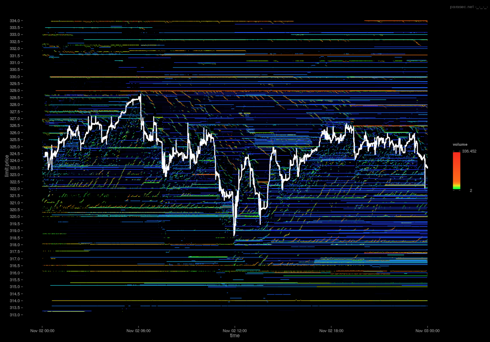

## Table of Contents

## What is a limit order book?

A limit order book is like a list that keeps track of buy and sell orders for a specific stock or asset in a trading system. It shows all the orders that traders have placed but haven't been filled yet. When someone wants to buy or sell at a specific price, they put in a "limit order," and this order goes into the book. The book is split into two parts: one part for buy orders, called bids, and the other for sell orders, called asks. The highest bid and the lowest ask are the most important because they show the current best prices to buy or sell.

When a new order comes in, the system checks the limit order book to see if it can be matched with existing orders. If someone places a buy order at a price that matches or is higher than the lowest sell order, the trade happens right away. If not, the new order just gets added to the book, waiting for a match. This way, the limit order book helps keep the market organized and shows everyone what prices are available for trading at any time.

## How does a limit order book function in trading?

A limit order book is a tool used in trading to keep track of all the buy and sell orders for a specific asset that haven't been filled yet. When someone wants to buy or sell at a specific price, they place a "limit order." This order goes into the book, which is divided into two parts: one for buy orders, called bids, and one for sell orders, called asks. The highest bid and the lowest ask are the most important because they show the current best prices to buy or sell the asset.

When a new order comes in, the trading system checks the limit [order book](/wiki/order-book-trading-strategies) to see if it can match the new order with any existing orders. If someone places a buy order at a price that matches or is higher than the lowest sell order, the trade happens immediately. If the new order can't be matched right away, it gets added to the book and waits for a match. This way, the limit order book helps keep the market organized and shows everyone what prices are available for trading at any time.

## What are the key components of a limit order book?

A limit order book has two main parts: the bid side and the ask side. The bid side lists all the orders from people who want to buy the asset. These orders show the prices that buyers are willing to pay and how many shares they want to buy. The highest price on the bid side is called the best bid, and it's the best price someone is willing to pay to buy the asset right now. The ask side lists all the orders from people who want to sell the asset. These orders show the prices that sellers are willing to accept and how many shares they want to sell. The lowest price on the ask side is called the best ask, and it's the best price someone is willing to sell the asset for right now.

When someone places a new order, it goes into the limit order book based on its type and price. If it's a buy order and the price is higher than or equal to the best ask, it will match with a sell order and the trade will happen right away. If it's a sell order and the price is lower than or equal to the best bid, it will match with a buy order and the trade will happen right away. If the new order can't be matched, it gets added to the book and waits for a matching order to come in. This way, the limit order book helps keep track of all the orders and makes sure that trades happen at the right prices.

## How can one interpret the data from a limit order book?

Interpreting data from a limit order book can help you understand what's happening in the market right now. The book is divided into two parts: the bid side, where people want to buy, and the ask side, where people want to sell. The highest price on the bid side is called the best bid, and it shows the highest price someone is willing to pay to buy the asset. The lowest price on the ask side is called the best ask, and it shows the lowest price someone is willing to sell the asset for. The difference between the best bid and the best ask is called the bid-ask spread, and it shows how much the price might change if you want to buy or sell right away.

By looking at the limit order book, you can also see how many people want to buy or sell at different prices. If there are a lot of buy orders at a certain price, it might mean that people think the price will go up soon. If there are a lot of sell orders at a certain price, it might mean that people think the price will go down. You can also see if the market is calm or if it's moving a lot by how quickly the orders change. This information can help you decide if you want to buy or sell, and at what price.

## What are the common metrics used in limit order book analytics?

Limit order book analytics use several common metrics to help traders understand market conditions. One important metric is the order book depth, which shows how many buy and sell orders are at different price levels. A deep order book means there are many orders, which can make the market more stable because it's harder for big trades to move the price a lot. Another key metric is the bid-ask spread, which is the difference between the highest price someone is willing to pay (the best bid) and the lowest price someone is willing to sell (the best ask). A smaller bid-ask spread usually means the market is more liquid, making it easier to buy or sell without affecting the price much.

Another useful metric is the order book imbalance, which looks at the difference between the total [volume](/wiki/volume-trading-strategy) of buy orders and sell orders. If there are a lot more buy orders than sell orders, it might mean that people expect the price to go up. On the other hand, if there are more sell orders, it might mean people expect the price to go down. Traders also look at the order flow, which tracks how orders are coming in and being filled over time. This can help them see if there are patterns in how the market is moving, like if there's a sudden rush of buy or sell orders.

## How do market makers use limit order book data?

Market makers use limit order book data to help them decide how to buy and sell assets in a way that makes money and keeps the market working smoothly. They look at the order book to see how many people want to buy or sell at different prices. If there are a lot more buy orders than sell orders, market makers might think the price will go up soon. So, they might buy the asset now and sell it later for a profit. If there are more sell orders, they might think the price will go down, so they could sell the asset now and buy it back later at a lower price.

Another way market makers use the order book is to keep the market liquid. They do this by always having orders in the book that people can trade against. They check the bid-ask spread to make sure it's not too big, which could make it hard for other people to trade. By putting in buy and sell orders at prices close to each other, market makers help keep the spread small. This makes it easier for everyone to buy and sell quickly without the price moving too much.

## What are the differences between a limit order book and a market order book?

A limit order book and a market order book are two different ways to keep track of orders in a trading system. A limit order book lists all the buy and sell orders that people have placed at specific prices but haven't been filled yet. It shows the prices that buyers are willing to pay and the prices that sellers are willing to accept. When someone places a new order, it goes into the book and waits for a match with an existing order. If a match is found, the trade happens right away. If not, the order stays in the book until it can be matched or until it's canceled.

On the other hand, a market order book is much simpler. It just lists the orders that people want to buy or sell right away at the current market price. When someone places a market order, it gets filled immediately at the best available price in the market. This means that the order doesn't wait in a book like a limit order does. Instead, it goes straight to the front of the line and gets executed as soon as possible. This makes market orders faster but also means you might not get the exact price you want, especially in a fast-moving market.

## How can limit order book analytics improve trading strategies?

Limit order book analytics can help traders make better decisions by showing them what's happening in the market. By looking at the order book, traders can see how many people want to buy or sell at different prices. This information can help them figure out if the price might go up or down soon. For example, if there are a lot more buy orders than sell orders, it might mean that people think the price will go up, so a trader might decide to buy now and sell later for a profit. Also, by checking the bid-ask spread, traders can see how easy it is to buy or sell without moving the price too much. A smaller spread means the market is more liquid, which can make trading easier and less risky.

Traders can also use limit order book analytics to find patterns in how the market is moving. By looking at the order flow, which shows how orders are coming in and being filled over time, traders can spot trends. For example, if there's a sudden rush of buy orders, it might signal that something big is happening in the market. Traders can use this information to adjust their strategies, like setting their buy or sell orders at better prices. By understanding the order book depth and imbalance, traders can also decide when to enter or [exit](/wiki/exit-strategy) the market. A deep order book might mean the market is stable, while an imbalance could signal a good time to trade. Overall, using limit order book analytics can help traders make smarter and more profitable decisions.

## What advanced techniques are used to analyze limit order book data?

Advanced techniques for analyzing limit order book data include using [machine learning](/wiki/machine-learning) and [artificial intelligence](/wiki/ai-artificial-intelligence). These methods can look at a lot of data very quickly and find patterns that people might miss. For example, machine learning algorithms can predict how the price might move based on the order book data. They do this by learning from past data and using that knowledge to guess what will happen next. This can help traders make better decisions about when to buy or sell.

Another advanced technique is called high-frequency trading. This involves using computers to trade very quickly, often in fractions of a second. High-frequency traders use limit order book data to spot tiny changes in the market and make trades before other people can react. They might use special algorithms to look at the order book and figure out the best times to buy or sell. This can give them an edge in the market, but it also means they need to be very careful because the market can change very quickly.

## How does the depth of a limit order book affect market liquidity?

The depth of a limit order book shows how many buy and sell orders are waiting at different prices. If the order book is deep, it means there are a lot of orders, which makes the market more liquid. When the market is liquid, it's easier for people to buy and sell without moving the price too much. This is good because it means traders can get in and out of the market quickly and at prices that are close to what they want.

A deep order book can also make the market more stable. If there are a lot of orders at different prices, big trades won't move the price as much. This is because there are enough orders to match with the big trade, so the price stays more steady. On the other hand, if the order book is thin, with fewer orders, the market can be less liquid and more likely to move a lot when big trades happen. So, a deep order book helps keep the market calm and easy to trade in.

## What are the challenges in real-time limit order book analytics?

Real-time limit order book analytics can be tricky because the data changes so fast. The market moves quickly, and new orders come in all the time. This means that the analytics system needs to be very fast to keep up. If it's too slow, the information it gives might be out of date before traders can use it. Also, there's a lot of data to look at, so the system needs to be able to handle a lot of information at once without getting overwhelmed.

Another challenge is making sure the data is correct. Sometimes, there can be mistakes or missing information in the order book. If the analytics system uses wrong data, it could give traders bad advice. This can lead to bad decisions and losing money. So, it's important to check the data carefully and make sure it's right before using it for trading. This adds another layer of difficulty to real-time analytics.

## How can machine learning enhance limit order book analytics?

Machine learning can make limit order book analytics better by finding patterns in the data that people might not see. It can look at a lot of data very quickly and learn from it. For example, machine learning algorithms can predict how the price might move based on what they see in the order book. They do this by learning from past data and using that knowledge to guess what will happen next. This can help traders make better decisions about when to buy or sell, because they can use the predictions to plan their trades.

Another way machine learning helps is by making the analytics faster and more accurate. The market moves fast, and new orders come in all the time. Machine learning can keep up with these changes and give traders up-to-date information. It can also check the data to make sure it's correct, which is important because wrong data can lead to bad trading decisions. By using machine learning, traders can get better and more reliable information from the limit order book, which can help them make smarter trades.

## References & Further Reading

1. **Harris, L. (2003).** *Trading and Exchanges: Market Microstructure for Practitioners*. Oxford University Press. This comprehensive guide elaborates on the functioning of trading markets, offering insights into the mechanisms, pricing, and structure that form the backbone of financial exchanges, providing a foundational understanding of limit order books.

2. **O'Hara, M. (1998).** *Market Microstructure Theory*. Blackwell Publishers. This publication provides a detailed theoretical framework for market microstructure, covering aspects crucial to understanding how trading information is processed and how it impacts price formation and market behavior.

3. **Hasbrouck, J. (2007).** *Empirical Market Microstructure: The Institutions, Economics, and Econometrics of Securities Trading*. Oxford University Press. An essential resource for grasping the institution-level details and econometric approaches relevant to securities trading and limit order books.

4. **Menkveld, A. J. (2013).** "High Frequency Trading and the New-Market Makers," *Journal of Financial Markets*, 16(4), 712-740. This paper discusses the role of high-frequency trading and market-making strategies and their influence on liquidity, using limit order book data.

5. **Aldridge, I. (2013).** *High-Frequency Trading: A Practical Guide to Algorithmic Strategies and Trading Systems*. Wiley. A practical guide addressing the utilization of algorithmic strategies in high-frequency trading, with a focus on the importance and operations of limit order books.

6. **Chordia, T., Roll, R., & Subrahmanyam, A. (2008).** "Liquidity and Market Efficiency," *Journal of Financial Economics*, 87(2), 249-268. This study explores the relationship between liquidity and market efficiency, emphasizing the use of limit order book data to measure liquidity.

7. **Bouchaud, J. P., Gefen, Y., Potters, M., & Wyart, M. (2004).** "Fluctuations and Response in Financial Markets: The Subtle Nature of 'Random' Price Changes," *Quantitative Finance*, 4(2), 176-190. This paper analyzes the complexities of financial market responses, where limit order books play a crucial role in understanding price changes.

8. **Avellaneda, M., & Stoikov, S. (2008).** "High-frequency Trading in a Limit Order Book," *Quantitative Finance*, 8(3), 217-224. This article devises strategies for optimal execution in high-frequency trading using insights from limit order books.

9. **Biais, B., Glosten, L., & Spatt, C. (2005).** "Market Microstructure: A Survey of Microfoundations, Empirical Results, and Policy Implications," *Journal of Financial Markets*, 8, 217-264. A detailed survey that discusses microstructural theories and empirical results, emphasizing the role of limit order books in market policies and decisions.

10. **Chan, E. (2013).** *Algorithmic Trading: Winning Strategies and Their Rationale*. Wiley. This book provides strategy fundamentals for algorithmic trading, focusing on the critical role of real-time data and limit order books in developing and executing trading strategies effectively. 

These references serve as a robust starting point for further exploration into the theoretical and practical applications of limit order [books](/wiki/algo-trading-books) within the context of [algorithmic trading](/wiki/algorithmic-trading), offering insights into market dynamics, trading strategies, and technological influences shaping modern financial markets.

