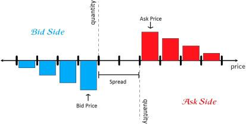

## Table of Contents

## What is a limit order book?

A limit order book is like a list that keeps track of buy and sell orders for a specific stock or asset in a trading system. It shows all the orders that traders have placed but haven't been filled yet. On one side, there are the buy orders, which are called bids, and on the other side, there are the sell orders, known as asks. The highest bid and the lowest ask are the most important because they show the current best price someone is willing to pay to buy and the lowest price someone is willing to accept to sell.

When someone wants to buy or sell a stock, they can place a limit order, which means they set a specific price they are willing to trade at. If the market price reaches that limit, the order might get filled. The limit order book helps match these orders. For example, if someone places a buy order at $50 and there's a sell order at $50, they can trade at that price. The book is always changing as new orders come in and old ones get filled or canceled, giving a real-time snapshot of supply and demand for the asset.

## How does a limit order book differ from a market order?

A limit order book and a market order are two different ways to trade in the stock market. A limit order book is a list that shows all the buy and sell orders for a stock at different prices. It's like a big chart that keeps track of what people are willing to pay to buy a stock and what price they're willing to sell it for. Traders use the limit order book to see the current best prices for buying and selling, and it helps them decide when and at what price they want to trade.

On the other hand, a market order is a simple instruction to buy or sell a stock right away at the best available price in the market. When you place a market order, you're telling the trading system, "I want to buy or sell this stock now, and I'll take whatever price is currently available." Unlike a limit order, which waits for the price to reach a specific level, a market order gets filled immediately, but you might not know the exact price until the order is complete. This makes market orders faster but less predictable in terms of the final price you'll get.

## What are the basic components of a limit order book?

A limit [order book](/wiki/order-book-trading-strategies) has two main parts: the bid side and the ask side. The bid side shows all the orders from people who want to buy a stock. Each order has a price they're willing to pay and the number of shares they want. The highest price someone is willing to pay is called the best bid. On the other side, the ask side shows all the orders from people who want to sell a stock. Each order has a price they're willing to accept and the number of shares they want to sell. The lowest price someone is willing to sell at is called the best ask.

The difference between the best bid and the best ask is called the bid-ask spread. This spread is important because it shows how much the price might change when a trade happens. The limit order book is always changing as people add new orders, change existing ones, or cancel them. It gives a real-time picture of what's happening in the market for that stock. By looking at the limit order book, traders can see the supply and demand for the stock and make better decisions about when and at what price to trade.

## How do limit orders and market orders interact within the book?

When traders use limit orders, they are telling the market they want to buy or sell a stock at a specific price. These orders go into the limit order book, where they wait until the market price reaches their set price. For example, if someone places a limit order to buy a stock at $50, their order will sit in the book until someone is willing to sell the stock at $50 or less. The limit order book shows all these waiting orders, with the highest buy price and the lowest sell price at the top. This helps traders see what prices are available and helps them decide when to trade.

Market orders work differently because they want to buy or sell a stock right away, no matter the price. When someone places a market order, it looks at the limit order book to find the best available price. If someone wants to buy with a market order, it will match with the lowest sell price in the book. If someone wants to sell with a market order, it will match with the highest buy price. This means market orders can use up the orders in the book, making the best bid and ask prices change. So, limit orders set the prices in the book, and market orders use those prices to trade quickly.

## What is the role of a limit order book in financial markets?

A limit order book is really important in financial markets because it helps traders see what other people want to do with a stock. It's like a big list that shows all the orders from people who want to buy and sell a stock, with the prices they are willing to pay or accept. This list is always changing as people add new orders, change their minds, or their orders get filled. By looking at the limit order book, traders can see the current best prices for buying and selling, which helps them decide when and at what price they want to trade.

The limit order book also helps match buyers and sellers. When someone wants to buy or sell a stock quickly, they can use a market order, which looks at the limit order book to find the best price right away. If someone wants to buy, their market order will match with the lowest sell price in the book. If they want to sell, it will match with the highest buy price. This way, the limit order book keeps the market running smoothly by showing supply and demand and helping trades happen at fair prices.

## How does the order book dynamics affect market liquidity?

The dynamics of the order book play a big role in how liquid a market is. Liquidity means how easy it is to buy or sell something without the price changing a lot. When there are a lot of buy and sell orders in the order book, it means the market is more liquid. This is because there are more people ready to trade, so if you want to buy or sell, you can do it quickly and at a good price. On the other hand, if the order book has fewer orders, the market is less liquid. It might be harder to find someone to trade with, and the price might move more when you do trade.

The way orders come in and get filled also affects [liquidity](/wiki/liquidity-risk-premium). If lots of people are adding new orders to the book all the time, it keeps the market lively and liquid. But if people are canceling their orders a lot, or if big trades use up all the orders in the book, it can make the market less liquid. This is because there are fewer orders left for others to trade with. So, the order book is like a snapshot of how easy or hard it is to trade in the market at any moment, and it's always changing based on what people are doing.

## What are the common strategies traders use with limit order books?

Traders use different strategies with limit order [books](/wiki/algo-trading-books) to make the most of their trades. One common strategy is called "order book imbalance." Traders look at the limit order book to see if there are more buy orders or sell orders. If there are a lot more buy orders, it might mean the price will go up soon, so they might decide to buy the stock too. If there are a lot more sell orders, it might mean the price will go down, so they might decide to sell or wait for a better price.

Another strategy is called "sniping." This is when traders watch the limit order book closely to find the best prices to trade at. They might place a limit order just a little better than the current best price to make sure their order gets filled first. For example, if the best buy price is $50, they might place a buy order at $50.01 to "snipe" the best sell order. This can help them get a better price than if they used a market order.

Some traders also use a strategy called "layering." This is a bit more tricky. They might place a lot of orders at different prices to make it look like there is more demand or supply than there really is. This can trick other traders into thinking the price will move in a certain way, and they might make trades based on that. It's a way to influence the market and get better prices for their own trades, but it can be seen as unfair and is sometimes against the rules.

## How can one analyze the depth and spread of a limit order book?

Analyzing the depth of a limit order book means looking at how many orders there are at different prices. It's like checking how thick the book is at each price level. If there are a lot of orders at a certain price, the book is deep at that level. This shows that many people are willing to trade at that price, which can make the market more stable. On the other hand, if there are only a few orders at a price, the book is shallow, and the market might be less stable because it's easier for big trades to change the price a lot. Traders look at the depth to understand how the market might react to their trades and to find the best times to buy or sell.

The spread of a limit order book is the difference between the highest price someone is willing to pay (the best bid) and the lowest price someone is willing to accept (the best ask). A small spread means the market is more liquid because it's easy to buy and sell at prices that are close to each other. A big spread means the market is less liquid, and it might be harder to trade without moving the price a lot. Traders watch the spread to see how easy it is to trade and to decide if they want to use a limit order to get a better price or a market order to trade quickly. By looking at both the depth and the spread, traders can make smarter decisions about when and how to trade.

## What are the impacts of high-frequency trading on limit order book dynamics?

High-frequency trading ([HFT](/wiki/high-frequency-trading-strategies)) can really change how the limit order book works. HFT uses fast computers to place a lot of orders very quickly. These traders might put in and take out orders in just a few seconds. This can make the limit order book change a lot, with prices moving up and down faster than normal. Sometimes, HFT can make the market more liquid because there are always orders in the book, ready to trade. But it can also make the market feel more unpredictable because the orders are coming and going so fast.

On the other hand, HFT can also affect the spread in the limit order book. When HFT traders are active, they might place orders that make the spread smaller, which can be good for other traders because it's easier to buy and sell at good prices. But if they pull their orders away quickly, it can make the spread bigger again. This can be tricky for other traders who might see a good price but then find it's gone before they can trade. So, while HFT can make the market more active and liquid, it can also make it harder for regular traders to keep up with all the changes.

## How do different market conditions influence the behavior of a limit order book?

Different market conditions can change how the limit order book behaves. When the market is calm and steady, the limit order book usually stays pretty stable. There are lots of buy and sell orders at different prices, and the spread between the best bid and the best ask stays small. This makes it easier for traders to buy and sell without moving the price much. But if something big happens, like a company announcing good or bad news, the market can get excited or worried. This can make the limit order book change a lot. People might rush to buy or sell, causing the spread to get bigger and the prices to move up or down quickly.

During times of high market stress, like a financial crisis or a big economic event, the limit order book can become very thin. This means there are fewer orders in the book, and it's harder to buy or sell without changing the price a lot. Traders might pull their orders out of the book because they're not sure what will happen next, making the market less liquid. On the other hand, when the market is doing well and people feel confident, the limit order book might get deeper. More traders are willing to buy and sell at different prices, which can keep the market stable and make it easier to trade. So, the way the limit order book looks and behaves can tell you a lot about what's going on in the market.

## What advanced metrics can be used to study limit order book dynamics?

To study how the limit order book changes, traders can use advanced metrics like order flow imbalance. This metric looks at the difference between buy and sell orders in the book. If there are a lot more buy orders than sell orders, it might mean the price will go up soon. On the other hand, if there are more sell orders, the price might go down. Traders watch this imbalance to predict where the price might be heading and decide when to make their trades.

Another useful metric is the [volume](/wiki/volume-trading-strategy) at the best bid and ask. This shows how many shares people are willing to buy or sell at the current best prices. If there's a lot of volume at these prices, it means the market is more stable because it's harder for big trades to move the price a lot. But if there's not much volume, even a small trade can change the price quickly. By looking at this metric, traders can see how easy or hard it might be to trade at the current prices and plan their moves accordingly.

## How can predictive models be developed to forecast limit order book movements?

Predictive models for forecasting limit order book movements use a lot of data and math to try and guess what will happen next. They look at things like how many buy and sell orders there are, how quickly orders come in and go out, and how the prices are changing. These models can use [machine learning](/wiki/machine-learning), which means they learn from past data to find patterns. For example, if they see that every time there are a lot more buy orders than sell orders, the price goes up, they might use that pattern to predict future price movements. Traders can use these models to decide when to buy or sell, hoping to make better trades.

But making these models work well is not easy. The market changes all the time, and what worked in the past might not work in the future. So, the models need to keep learning and updating with new data. Also, the models have to deal with things like high-frequency trading, which can make the limit order book change very quickly. Traders need to be careful and use these models along with their own knowledge and experience to make the best decisions. By combining the models with what they know about the market, they can try to predict where the prices might go and make smarter trades.

## References & Further Reading

1. **Academic Papers:**
   - *Harris, L. (2003). "Trading and Exchanges: Market Microstructure for Practitioners."* This book offers a comprehensive insight into the workings of trading markets, including discussions on the structure and function of limit order books.
   - *Biais, B., Hillion, P., and Spatt, C. (1995). "An Empirical Analysis of the Limit Order Book and the Order Flow in the Paris Bourse." The Journal of Finance.* This paper presents a detailed empirical study on the order flow and limit order book dynamics within the Paris Bourse, offering valuable insights into market microstructure.
   - *Gould, M. D., Porter, M. A., Williams, S., McDonald, M., Fenn, D. J., & Howison, S. D. (2013). "Limit Order Books." Quantitative Finance.* This survey paper provides a comprehensive review of the literature on limit order books, highlighting mechanisms, empirical research, and modeling techniques.

2. **Books:**
   - *Hasbrouck, J. (2007). "Empirical Market Microstructure."* This book discusses empirical methods in market microstructure, including detailed coverage of limit order books and their importance in modern trading environments.
   - *Bouchaud, J-P., Farmer, J. D., & Lillo, F. (2009). "How Markets Slowly Digest Changes in Supply and Demand." In H. Takayasu (Ed.), "Practical Fruits of Econophysics: Proceedings of the Third Nikkei Econophysics Symposium."* This text examines the impact of supply and demand changes on market efficiency, with a focus on limit order book dynamics.

3. **Software and Tools:**
   - For hands-on exploration, consider examining open-source projects such as *Zipline* or *Backtrader* in Python. These platforms offer backtesting tools that can incorporate limit order book data.
   - Use platforms like *QuantConnect* or *AlgoTrader* to simulate algorithmic trading strategies using real-time and historical limit order book data.

4. **Online Courses and Tutorials:**
   - Look for online courses on platforms like Coursera or edX that cover financial markets, algorithmic trading, and market microstructure. These courses often include modules dedicated to limit order books.

5. **Research Databases and Journals:**
   - Journals such as *The Journal of Finance*, *Quantitative Finance*, and *The Review of Financial Studies* consistently publish thought-provoking articles on the latest research in trading mechanisms and limit order book analysis.
   - Institutions like the *National Bureau of Economic Research (NBER)* offer working papers and publications relevant to financial markets and trading infrastructure.

By leveraging these resources, readers can further understand limit order book dynamics, explore their role in [algorithmic trading](/wiki/algorithmic-trading), and enhance their strategic approaches in financial markets.

