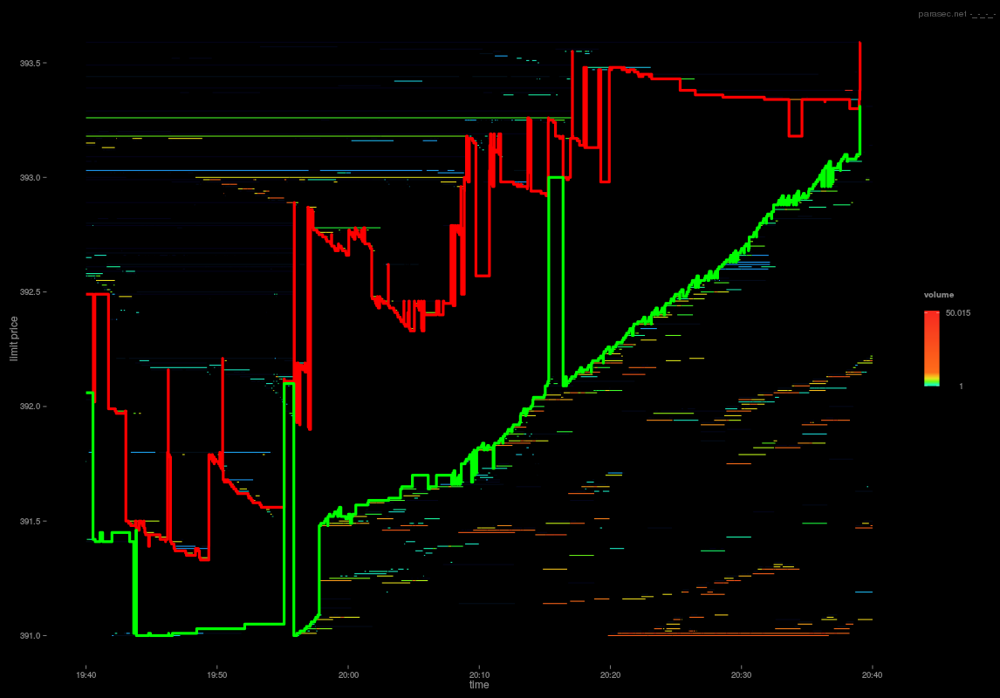

Algorithmic trading has significantly transformed financial markets over recent decades, enabling trades to be executed more swiftly and efficiently compared to traditional methods. This transformation largely hinges on the utilization of technology to automate trading decisions and execute them without direct human intervention. Central to algorithmic trading is the concept of the Limit Order Book (LOB), a mechanism that serves as an intermediary between buyers and sellers, facilitating their interactions in the trading environment.

A Limit Order Book is essentially an electronic record that keeps track of outstanding buy and sell limits for a financial instrument, categorized by different price levels. This allows market participants to gain transparency regarding prevailing market conditions, seeing a list of available orders and their respective quantities. Because it is used across global exchanges for a variety of asset classes—be it equities, bonds, or cryptocurrencies—understanding how the LOB operates is key to implementing successful trading strategies.



Simulating the LOB is a crucial step for anyone looking to develop effective algorithmic trading strategies. By reproducing the actions and state of the order book in a simulated environment, traders have the ability to test and refine their algorithms. This not only aids in optimizing trading decisions but also ensures preparedness for real market conditions, where variables are constantly in flux. Limit Order Book Simulations provide insights into how trade executions could affect market conditions and asset prices, enabling a strategic advantage in fine-tuning trading practices.

This article focuses on Limit Order Book Simulation, exploring its importance within algorithmic trading and how it contributes to the optimization of trading strategies. Through a comprehensive understanding of LOB simulations, traders and researchers can enhance their approaches to align more closely with the dynamic nature of financial markets, thereby improving overall trading performance.

## Table of Contents

## What is a Limit Order Book?

The Limit Order Book (LOB) serves as a digital platform that records all open buy and sell orders for a given financial instrument, meticulously sorted by price levels. This mechanism is fundamental in modern financial markets, ensuring efficient allocation of resources and price discovery. The widespread implementation of LOBs across global exchanges supports trading in a wide array of assets, including stocks, bonds, and an increasingly diverse range of cryptocurrencies.

Functioning as an integral component of market infrastructure, the LOB is pivotal in maintaining transparency and fairness in trade execution. It offers market participants a clear view of the available prices, the quantities that can be traded at each price, and insights into the intentions of market participants. This transparency is crucial for both retail and institutional traders, enabling them to make informed decisions based on the visible supply and demand dynamics.

A Limit Order Book is composed of bid and ask orders, which represent the maximum price a buyer is willing to pay and the minimum price a seller is willing to accept, respectively. These orders are arranged in descending order for bids and ascending order for asks, creating a snapshot of current market intentions. The difference between the highest bid and the lowest ask is known as the bid-ask spread, an important indicator of market [liquidity](/wiki/liquidity-risk-premium) and transaction costs.

Additionally, LOBs include a historical account of past orders and trades, which can be used to analyze market behavior and trends over time. This historical data can prove invaluable for traders seeking to understand and anticipate market movements.

To further exemplify, consider a Python script that can be used to access and display an example of a simple LOB structure:

```python
class Order:
    def __init__(self, price, quantity, type):
        self.price = price
        self.quantity = quantity
        self.type = type  # 'bid' or 'ask'

class LimitOrderBook:
    def __init__(self):
        self.bids = []
        self.asks = []

    def add_order(self, order):
        if order.type == 'bid':
            self.bids.append(order)
            self.bids.sort(key=lambda x: x.price, reverse=True)
        elif order.type == 'ask':
            self.asks.append(order)
            self.asks.sort(key=lambda x: x.price)

    def get_book(self):
        book = {
            'bids': [{'price': order.price, 'quantity': order.quantity} for order in self.bids],
            'asks': [{'price': order.price, 'quantity': order.quantity} for order in self.asks]
        }
        return book
```

This simple code snippet provides a foundational framework that illustrates how a basic limit [order book](/wiki/order-book-trading-strategies) can be constructed programmatically, providing a basis for further exploration and complexity reflective of real-world financial markets. Such frameworks are crucial for traders and technologists working to build sophisticated trading systems and models.

## The Role of LOB Simulation in Algo Trading

Limit Order Book (LOB) simulations are instrumental for testing and refining [algorithmic trading](/wiki/algorithmic-trading) strategies. By providing a virtual environment to model the performance of trading algorithms, these simulations can mimic real market conditions, enabling traders to anticipate how their strategies might behave without financial risk. 

Understanding market dynamics is a primary benefit of LOB simulations. These systems model the interactions of buy and sell orders, allowing traders to observe their potential impact on asset prices. For instance, when a large buy order is simulated, traders can examine how it affects the price levels, order spreads, and [volatility](/wiki/volatility-trading-strategies), thereby understanding the price impact of substantial trades.

Simulations also enable the identification of optimal trading times. By leveraging historical order book data, traders can analyze patterns and trends, determining windows of low volatility and high liquidity, which are ideal for executing trades. This analysis is crucial in high-frequency trading, where even marginal timing differences can lead to significant profit variances.

The sophistication of LOB simulations has increased exponentially with advances in [artificial intelligence](/wiki/ai-artificial-intelligence) and computational power. Modern simulations can handle vast datasets and real-time analytics, providing traders with deeper insights into market behaviors. Complex algorithms can process historical data to predict future trends, facilitating the development of more efficient trading strategies. These models can incorporate various parameters, such as transaction costs, to simulate more realistic trading scenarios.

As AI continues to evolve, its integration with LOB simulations is producing more nuanced models that capture the complexities of financial markets. Traders gain a competitive edge by using these advancements to enhance predictive accuracy and optimize their strategic approaches. By simulating numerous scenarios, traders can not only improve their existing strategies but also innovate new ones, tailored to exploit specific market conditions.

## Types of LOB Simulation Models

Various models exist for simulating Limit Order Book (LOB) dynamics, and each model is designed to address specific aspects of market behavior. Some models prioritize computational efficiency and speed, allowing for real-time analysis, while others focus on accuracy and depth to provide detailed simulations of market conditions.

Agent-based models are popular for their ability to simulate the interactions of market participants with diverse strategies and objectives. By modeling each trader as an independent agent, these models can capture emergent behaviors within the market. They are particularly useful for exploring the influence of trading strategies and market microstructure on price formation and liquidity dynamics. Agent-based models often employ a bottom-up approach to recreate complex market phenomena from the interactions of individual entities.

Queuing models provide another method of simulating LOB dynamics by focusing on the order flow and matching process. These models represent the order book as a queue where orders are processed based on their arrival sequence and matching rules. Queuing models are beneficial for analyzing the impact of order arrival rates and execution delays on the market's liquidity and price discovery process.

Machine learning models have gained prominence in recent years due to their ability to identify patterns and relationships within large datasets. By leveraging historical order book data, [machine learning](/wiki/machine-learning) models can predict future order flows and price movements with high accuracy. Techniques such as supervised learning and [reinforcement learning](/wiki/reinforcement-learning) allow these models to adapt and refine their predictions over time, making them highly effective for developing adaptive trading strategies.

LOB simulation models can also be differentiated based on their underlying approach: deterministic vs. stochastic and static vs. dynamic simulations. Deterministic models operate under the assumption of known variables and predictable outcomes, making them suitable for scenarios where uncertainty is minimal. In contrast, stochastic models incorporate randomness and probabilistic elements to better reflect the inherent uncertainty in financial markets.

Static simulations assume a fixed environment and do not account for changes over time, providing a snapshot of market conditions at a specific point. Conversely, dynamic simulations consider temporal changes and feedback loops, enabling the study of market evolution and the impact of trading activities on long-term dynamics.

Choosing the appropriate model depends on the specific requirements of the trading strategy and the market conditions being studied. Each model offers distinct advantages and limitations, necessitating a careful assessment to ensure alignment with the desired trading objectives.

## Stylized Facts in LOB Simulations

Stylized facts are recurring patterns observed in financial markets that challenge traditional economic theories. These facts can include characteristics such as price impacts, the distribution of order sizes, and the time intervals between trades, and they are crucial for the development of accurate Limit Order Book (LOB) simulations.

The first stylized fact concerns the power-law distribution of order sizes. This principle suggests that while small orders are frequent, large orders occur less frequently but can significantly impact the market. In a mathematical sense, the probability $P(x)$ of observing an order size $x$ follows a power-law distribution typically expressed as $P(x) \sim x^{-\alpha}$, where $\alpha$ is a parameter describing the distribution's steepness. Accurate LOB simulations must replicate this distribution to ensure realistic order flow generation and trading scenarios.

A second important aspect is the heavy-tail distribution of return intervals. The time between trades or price changes, known as return intervals, can affect volatility and liquidity. Empirical data often shows that these intervals follow a heavy-tailed distribution, implying that long periods of inactivity are punctuated by bursts of high activity. Successfully simulating these intervals allows traders to understand volatility patterns and better predict market reactions to trading decisions.

Volatility clustering also represents a key stylized fact. This phenomenon, where periods of high volatility tend to be followed by more high volatility (and vice versa), defies the assumption of constant market volatility over time. It can be captured by models like the GARCH (Generalized Autoregressive Conditional Heteroskedasticity) model, which adjusts to the changes in market volatility over time. This behavior should be mirrored in LOB simulations to realistically model price evolution and capture potential risks in trading strategies.

Overall, LOB simulations that accurately reproduce these stylized facts are more effective in reflecting real market conditions. This alignment with empirical data is crucial for validating the efficacy of the models used in these simulations. Accurate replication of such phenomena ensures that traders can trust these simulations when they evaluate and optimize trading strategies. This process is supported by advanced algorithms and increased computational capabilities, which help bridge the gap between simulated and actual market environments.

## Price Impact in LOB Models

Price impact is a fundamental concept in financial markets, representing the change in an asset's market price resulting from a particular trade. In the context of Limit Order Book (LOB) simulations, accurately modeling price impact is vital for evaluating order execution costs and the efficiency of trading strategies. Traders rely on these models to anticipate and mitigate the financial implications of executing large orders, thereby preventing adverse effects on both their strategies and the broader market.

The significance of modeling price impact in LOB simulations lies in its direct influence on trading strategy development and order execution. A robust model enables traders to quantify the implicit costs associated with executing large orders, facilitating informed decision-making. For instance, a trader interested in purchasing a substantial quantity of shares may use an LOB simulation to estimate how their order could shift market prices, based on historical data and current book conditions. By simulating various scenarios, traders can optimize their strategies to minimize costs related to market impact.

Recent advancements in research have spurred the integration of sophisticated methods to enhance the predictiveness and accuracy of price impact models within LOB simulations. Techniques include employing machine learning algorithms and statistical models to capture complex market dynamics. These approaches can handle a multitude of variables, such as market depth, volatility, and historical trading activity, improving the model's ability to forecast price shifts triggered by trades.

A popular method to represent and predict price impact involves the use of mathematical models that segregate impact into temporary and permanent components. The temporary component reflects immediate shifts in the order book prices due to a trade, which typically reverts back over time. Conversely, the permanent component signifies long-term changes in the price levels. This dichotomy is often expressed as:

$$
P_{\text{impact}} = P_{\text{temp}} + P_{\text{perm}}
$$

where $P_{\text{impact}}$ is the total price impact, $P_{\text{temp}}$ is the temporary impact component, and $P_{\text{perm}}$ represents the permanent impact. Distinguishing between these components allows traders to better understand the transitory versus lasting effects of their trades.

Moreover, contemporary research efforts are focused on leveraging machine learning to refine these predictions further. With an increasing [volume](/wiki/volume-trading-strategy) of historical data available, machine learning techniques such as reinforcement learning and [deep learning](/wiki/deep-learning) offer promise in capturing non-linear relationships and subtle market cues, providing a competitive edge in algorithmic trading.

These innovations underscore the importance of continual advancement in LOB simulations, which can lead to reduced transaction costs and improved strategy efficacy. By accurately predicting and accounting for price impact, traders gain a crucial understanding that aids in the development of more robust and sophisticated trading strategies.

## Comparative Analysis of LOB Models

In the comparative analysis of Limit Order Book (LOB) simulation models, it is essential to evaluate the strengths and weaknesses of different models. The evaluation focuses on key factors such as accuracy, computational efficiency, scalability, and ease of maintenance.

Accuracy is a critical aspect of LOB simulations. Models with high accuracy are better at predicting market behavior and replicating real-world market conditions. This involves capturing stylized facts and precisely modeling price impacts. To assess accuracy, models are often tested against real-market data, measuring how closely their outputs align with observed data. Metrics such as mean squared error (MSE) or R-squared may be used to quantify this alignment.

Computational efficiency is equally important, especially for real-time trading applications. LOB models must process large volumes of data and perform complex calculations swiftly. Efficiency is often measured by the computational resources required, such as time and memory, to execute a simulation. Python, with libraries like NumPy and Pandas, is frequently used to optimize computations through vectorization, whereas languages like C++ might be employed for performance-critical sections.

Scalability pertains to a model's ability to handle increasing data sizes and more complex simulations without a significant drop in performance. This is crucial for accommodating growing market data and more sophisticated trading strategies. Models that leverage parallel processing or distributed computing architectures, such as Dask or Apache Spark in Python, often exhibit enhanced scalability.

Ease of maintenance involves the model’s architecture and the programming practices employed. Well-documented code, modular design, and the use of version control systems contribute to easier updates and adaptability to new market conditions or regulatory changes.

Choosing the appropriate LOB simulation model depends on the specific requirements of a trading strategy and prevailing market conditions. For instance, high-frequency trading strategies might prioritize computational efficiency and scalability over extreme accuracy, whereas long-term investment strategies might favor models that provide precise market predictions. Ultimately, the selection of a model hinges on balancing these factors to meet the strategic goals effectively.

## Conclusion

Limit Order Book (LOB) simulations are indispensable in the practice of algorithmic trading, providing crucial insights into market behavior and assisting in the optimization of trading strategies. Through these simulations, traders can model the complexities of market dynamics and enhance their decision-making processes. The continuous evolution of LOB simulations has been significantly accelerated by advancements in artificial intelligence and computational technology, leading to more robust and effective trading models that better capture the intricacies of real-world financial markets.

As algorithmic trading continues to grow in sophistication, traders must incorporate realistic LOB models that accurately reflect market conditions and predict price impacts. Effective LOB simulations can replicate key market phenomena, such as price impacts and order book fluctuations, enabling traders to fine-tune their strategies for both efficiency and profitability. These simulations are essential in measuring the execution cost and the strategic planning of large trades, particularly in volatile markets where accurate price predictions are critical.

The dynamic nature of financial markets requires continual adaptation of the tools and techniques utilized for trading. As such, LOB simulation models must evolve to accommodate new market structures and trading mechanisms. This evolution entails integrating more advanced algorithms and computational methods to enhance predictive accuracy and model fidelity. By doing so, traders can gain a competitive edge, leveraging these sophisticated tools to navigate complex market environments more effectively.

In conclusion, effective utilization of LOB simulations not only empowers traders to better understand and anticipate market behavior but also positions them advantageously as market conditions evolve. Embracing these advanced simulation techniques is essential for success in the rapidly advancing field of algorithmic trading.

## References & Further Reading

[1]: Cartea, Á., Jaimungal, S., & Penalva, J. (2015). ["Algorithmic and High-Frequency Trading."](https://assets.cambridge.org/97811070/91146/frontmatter/9781107091146_frontmatter.pdf) Cambridge University Press.

[2]: Gould, M. D., Porter, M. A., Williams, S., McDonald, M., Fenn, D. J., & Howison, S. D. (2013). ["Limit order books."](https://arxiv.org/abs/1012.0349) Quantitative Finance, 13(11), 1709-1742.

[3]: Abergel, F., Bouchaud, J.-P., Foucault, T., Lehalle, C.-A., & Rosenbaum, M. (2016). ["Market Microstructure: Confronting Many Viewpoints."](https://www.wiley.com/en-us/Market+Microstructure%3A+Confronting+Many+Viewpoints-p-9781119952787) Springer.

[4]: Bouchaud, J.-P., Farmer, J. D., & Lillo, F. (2009). ["How markets slowly digest changes in supply and demand."](https://arxiv.org/abs/0809.0822) Quantitative Finance.

[5]: Chordia, T., Roll, R., & Subrahmanyam, A. (2001). ["Market liquidity and trading activity."](https://onlinelibrary.wiley.com/doi/abs/10.1111/0022-1082.00335) Journal of Financial Economics, 59(1), 3-32.

[6]: Avellaneda, M., & Stoikov, S. (2008). ["High-frequency trading in a limit order book."](https://people.orie.cornell.edu/sfs33/LimitOrderBook.pdf) Available at SSRN.

[7]: Lopez de Prado, M. (2018). ["Advances in Financial Machine Learning."](https://www.amazon.com/Advances-Financial-Machine-Learning-Marcos/dp/1119482089) John Wiley & Sons.

[8]: Chan, E. P. (2009). ["Quantitative Trading: How to Build Your Own Algorithmic Trading Business."](https://github.com/egorpe/EPChan-QuantitativeTrading/blob/master/example7_6.m) John Wiley & Sons.