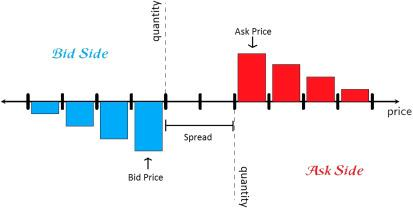

## Table of Contents

## What is a limit order book?

A limit order book is a tool used in stock exchanges to show all the buy and sell orders for a particular stock. It lists the prices that people are willing to pay to buy the stock and the prices that people are willing to accept to sell the stock. The book is organized by price, with the highest buy orders at the top and the lowest sell orders at the top. This helps traders see where the demand and supply for the stock are at any given time.

When someone wants to buy or sell a stock, they can place a limit order, which is an instruction to buy or sell at a specific price or better. If the price they want isn't available right away, their order goes into the limit order book and waits until the price matches. This way, traders can set their desired price and wait for the market to come to them, rather than buying or selling at the current market price.

## Why is simulating a limit order book important?

Simulating a limit order book is important because it helps people understand how stock markets work. By creating a pretend version of the limit order book, researchers and traders can see what might happen if they buy or sell at different prices. This can help them make better choices about when to trade and at what price. It's like practicing a game before playing for real, so you know what to expect and can plan your moves better.

Another reason simulating a limit [order book](/wiki/order-book-trading-strategies) is useful is for testing new trading strategies. Traders can try out different ways of buying and selling without risking real money. This can show them if their ideas will work in the real market. It also helps people who make the rules for the stock market to see how changes might affect trading. By running these simulations, everyone can learn more about the market and make smarter decisions.

## What are the basic components of a limit order book?

A limit order book has two main parts: the bid side and the ask side. The bid side shows all the orders from people who want to buy the stock. It lists the prices they are willing to pay, starting with the highest price at the top. The ask side shows all the orders from people who want to sell the stock. It lists the prices they are willing to accept, starting with the lowest price at the top. Together, these two sides show the current demand and supply for the stock.

Each order in the limit order book includes important details like the price and the number of shares someone wants to buy or sell. For example, if someone wants to buy 100 shares at $50 each, that order will go on the bid side at $50. If someone wants to sell 200 shares at $51 each, that order will go on the ask side at $51. The difference between the highest bid price and the lowest ask price is called the spread. This spread can tell you a lot about how easy or hard it is to trade the stock at that moment.

## How does a limit order book work in a real trading environment?

In a real trading environment, a limit order book helps traders buy and sell stocks at specific prices. When a trader wants to buy or sell a stock, they can place a limit order, which means they tell the market the exact price they want to trade at. If someone wants to buy a stock for $50, their order goes into the bid side of the limit order book at $50. If someone wants to sell a stock for $51, their order goes into the ask side at $51. The book shows all these orders, organized by price, so everyone can see what prices people are willing to buy and sell at.

When a new order comes in, it gets matched with existing orders in the book. If someone places a buy order at $51, and there's a sell order at $51 in the book, those orders match and the trade happens. If there's no match, the new order waits in the book until the price matches. This way, traders can set their desired price and wait for the market to come to them, rather than buying or selling at the current market price. The limit order book keeps updating as new orders come in and trades happen, giving traders a real-time view of the market's demand and supply.

## What are the different types of orders in a limit order book?

In a limit order book, there are mainly two types of orders: limit orders and market orders. A limit order is when someone says, "I want to buy or sell this stock, but only at this specific price or better." If the price isn't right, the order waits in the book until the price matches. A market order is simpler; it's when someone says, "I want to buy or sell this stock right now, at whatever the current price is." Market orders get filled right away, but the price might be a bit different from what you expected.

There are also other types of orders that traders can use. One is a stop order, which is like a safety net. It tells the market to buy or sell a stock if it reaches a certain price, to limit losses or protect gains. Another type is a fill-or-kill order, which says, "Buy or sell this stock at this price, but only if you can do it all at once. If you can't, cancel the order." These different types of orders give traders more control over their trades and help them manage their risks better.

## How can one simulate a limit order book?

To simulate a limit order book, you can use a computer program to create a pretend version of the stock market. You start by setting up two lists: one for buy orders and one for sell orders. Each order in these lists has a price and a number of shares. When someone wants to buy or sell, you add their order to the right list, making sure to put it in the correct spot based on the price. If a new buy order comes in and its price is higher than some existing orders, it goes above them. If a new sell order comes in and its price is lower than some existing orders, it goes above them too. This way, the highest buy orders and the lowest sell orders are always at the top of their lists.

When you want to see what happens when trades happen, you can match buy and sell orders that have the same price. If a buy order at $50 comes in and there's a sell order at $50, they match and the trade happens. You take those orders out of the lists and update the book. If there's no match, the new order waits in the book until the price matches. By doing this over and over, you can see how the book changes and how different orders affect the market. This helps you learn about trading without using real money.

## What are the key metrics to monitor in a limit order book simulation?

In a limit order book simulation, one of the key metrics to monitor is the spread. The spread is the difference between the highest price someone is willing to pay to buy a stock (the best bid) and the lowest price someone is willing to accept to sell it (the best ask). A smaller spread means the stock is easier to trade because the buy and sell prices are close together. A larger spread can mean it's harder to trade because there's a bigger gap between what buyers and sellers want.

Another important metric is the order book depth. This shows how many shares are available at different price levels. If there are a lot of shares at prices close to the current price, the market is deep, and big trades can happen without moving the price much. If there are only a few shares at each price level, the market is shallow, and big trades can cause big price changes. Watching the depth helps you understand how the market might react to new orders.

Lastly, you should keep an eye on the order flow. This is about how new orders come into the book and how they affect the existing orders. If a lot of buy orders come in, it might push the price up. If a lot of sell orders come in, it might push the price down. By watching the order flow, you can see how the market is changing and make better guesses about what might happen next.

## What programming languages and tools are commonly used for limit order book simulations?

For limit order book simulations, people often use programming languages like Python, C++, and Java. Python is popular because it's easy to learn and has lots of libraries that can help with simulations. Libraries like Pandas for data handling and NumPy for number crunching make it easier to manage and analyze the data in the order book. C++ is used when speed is important because it can run very fast. Java is good for bigger projects because it works well on different computers and has strong tools for managing data.

Besides programming languages, there are also special tools and platforms that can help with limit order book simulations. One example is the trading simulation platform called Quantopian, which lets you test trading ideas without using real money. Another tool is the open-source library called Zipline, which is made for [backtesting](/wiki/backtesting) trading strategies. These tools can save a lot of time because they already have the basic parts of a limit order book built in, so you can focus on trying out different ideas and seeing what works best.

## How do you validate the accuracy of a limit order book simulation?

To check if a limit order book simulation is working right, you need to compare what it shows with real market data. You can do this by using past market data to see if the simulation acts the same way as the real market did. For example, if you put in the same orders that happened in the real market, does the simulation show the same prices and trades? If it does, that's a good sign that the simulation is accurate.

Another way to make sure the simulation is correct is to use different tests. You can run the simulation many times with different sets of orders and see if it always gives results that make sense. Also, you can compare the simulation's results with other simulations or models that other people have made. If everyone's simulations show similar things, it's more likely that your simulation is working right. By doing these checks, you can feel more confident that your limit order book simulation is showing a good picture of how the real market works.

## What advanced techniques can be used to optimize a limit order book simulation?

To make a limit order book simulation work better and faster, you can use something called parallel processing. This means using more than one part of the computer at the same time to do different jobs. For example, one part can handle new orders coming in, while another part matches orders and makes trades happen. By splitting up the work like this, the simulation can run much faster. Another way to make it better is by using special data structures like heaps or trees. These can help keep the orders organized by price, so it's quicker to find and match orders when new ones come in.

Another advanced technique is to use [machine learning](/wiki/machine-learning) to predict what might happen next in the market. By looking at past data, the simulation can learn patterns and guess how new orders might affect the price. This can make the simulation more realistic and help traders see what could happen in different situations. Also, you can use something called event-driven programming. This means the simulation only does things when something important happens, like a new order coming in or a trade happening. This can make the simulation use less computer power and run more smoothly.

## How can machine learning be integrated into limit order book simulations?

Machine learning can be added to limit order book simulations to make them better at predicting what might happen in the market. By looking at a lot of past data, a machine learning model can learn patterns about how prices change when new orders come in. For example, it might see that when a lot of buy orders happen quickly, the price usually goes up. The simulation can then use this knowledge to guess what will happen next when new orders come in. This makes the simulation more realistic and helpful for traders who want to see how different situations might play out.

Using machine learning also helps the simulation get better over time. As it sees more data, the model can keep learning and make its predictions more accurate. This is useful for testing new trading strategies because the simulation can show how well they might work in the real market. By adding machine learning, the limit order book simulation becomes a powerful tool for understanding the stock market and making smarter trading decisions.

## What are the current challenges and future directions in limit order book simulation research?

One big challenge in limit order book simulation research is making the simulations fast enough to handle a lot of orders in real time. The stock market can get very busy, with lots of orders coming in every second. If the simulation can't keep up, it won't be able to show what's really happening in the market. Another challenge is getting good data to train the simulations. The market is always changing, so the data needs to be up-to-date and accurate. Without good data, the simulation won't be able to predict what might happen next.

In the future, researchers are looking to use more advanced machine learning techniques to make limit order book simulations even better. They want to use things like deep learning to find more complex patterns in the market data. This could help the simulations be more accurate and useful for traders. Another direction is to make the simulations work on bigger scales, so they can handle more stocks and more orders at the same time. By doing this, the simulations can give a better picture of the whole market and help traders make smarter decisions.

## What is the Price Impact in LOB Models?

Price impact is a fundamental concept in financial markets, representing the change in an asset's market price resulting from a particular trade. In the context of Limit Order Book (LOB) simulations, accurately modeling price impact is vital for evaluating order execution costs and the efficiency of trading strategies. Traders rely on these models to anticipate and mitigate the financial implications of executing large orders, thereby preventing adverse effects on both their strategies and the broader market.

The significance of modeling price impact in LOB simulations lies in its direct influence on trading strategy development and order execution. A robust model enables traders to quantify the implicit costs associated with executing large orders, facilitating informed decision-making. For instance, a trader interested in purchasing a substantial quantity of shares may use an LOB simulation to estimate how their order could shift market prices, based on historical data and current book conditions. By simulating various scenarios, traders can optimize their strategies to minimize costs related to market impact.

Recent advancements in research have spurred the integration of sophisticated methods to enhance the predictiveness and accuracy of price impact models within LOB simulations. Techniques include employing machine learning algorithms and statistical models to capture complex market dynamics. These approaches can handle a multitude of variables, such as market depth, [volatility](/wiki/volatility-trading-strategies), and historical trading activity, improving the model's ability to forecast price shifts triggered by trades.

A popular method to represent and predict price impact involves the use of mathematical models that segregate impact into temporary and permanent components. The temporary component reflects immediate shifts in the order book prices due to a trade, which typically reverts back over time. Conversely, the permanent component signifies long-term changes in the price levels. This dichotomy is often expressed as:

$$
P_{\text{impact}} = P_{\text{temp}} + P_{\text{perm}}
$$

where $P_{\text{impact}}$ is the total price impact, $P_{\text{temp}}$ is the temporary impact component, and $P_{\text{perm}}$ represents the permanent impact. Distinguishing between these components allows traders to better understand the transitory versus lasting effects of their trades.

Moreover, contemporary research efforts are focused on leveraging machine learning to refine these predictions further. With an increasing [volume](/wiki/volume-trading-strategy) of historical data available, machine learning techniques such as [reinforcement learning](/wiki/reinforcement-learning) and [deep learning](/wiki/deep-learning) offer promise in capturing non-linear relationships and subtle market cues, providing a competitive edge in [algorithmic trading](/wiki/algorithmic-trading).

These innovations underscore the importance of continual advancement in LOB simulations, which can lead to reduced transaction costs and improved strategy efficacy. By accurately predicting and accounting for price impact, traders gain a crucial understanding that aids in the development of more robust and sophisticated trading strategies.

## References & Further Reading

[1]: Cartea, Á., Jaimungal, S., & Penalva, J. (2015). ["Algorithmic and High-Frequency Trading."](https://assets.cambridge.org/97811070/91146/frontmatter/9781107091146_frontmatter.pdf) Cambridge University Press.

[2]: Gould, M. D., Porter, M. A., Williams, S., McDonald, M., Fenn, D. J., & Howison, S. D. (2013). ["Limit order books."](https://arxiv.org/abs/1012.0349) Quantitative Finance, 13(11), 1709-1742.

[3]: Abergel, F., Bouchaud, J.-P., Foucault, T., Lehalle, C.-A., & Rosenbaum, M. (2016). ["Market Microstructure: Confronting Many Viewpoints."](https://www.wiley.com/en-us/Market+Microstructure%3A+Confronting+Many+Viewpoints-p-9781119952787) Springer.

[4]: Bouchaud, J.-P., Farmer, J. D., & Lillo, F. (2009). ["How markets slowly digest changes in supply and demand."](https://arxiv.org/abs/0809.0822) Quantitative Finance.

[5]: Chordia, T., Roll, R., & Subrahmanyam, A. (2001). ["Market liquidity and trading activity."](https://onlinelibrary.wiley.com/doi/abs/10.1111/0022-1082.00335) Journal of Financial Economics, 59(1), 3-32.

[6]: Avellaneda, M., & Stoikov, S. (2008). ["High-frequency trading in a limit order book."](https://people.orie.cornell.edu/sfs33/LimitOrderBook.pdf) Available at SSRN.

[7]: Lopez de Prado, M. (2018). ["Advances in Financial Machine Learning."](https://www.amazon.com/Advances-Financial-Machine-Learning-Marcos/dp/1119482089) John Wiley & Sons.

[8]: Chan, E. P. (2009). ["Quantitative Trading: How to Build Your Own Algorithmic Trading Business."](https://github.com/egorpe/EPChan-QuantitativeTrading/blob/master/example7_6.m) John Wiley & Sons.