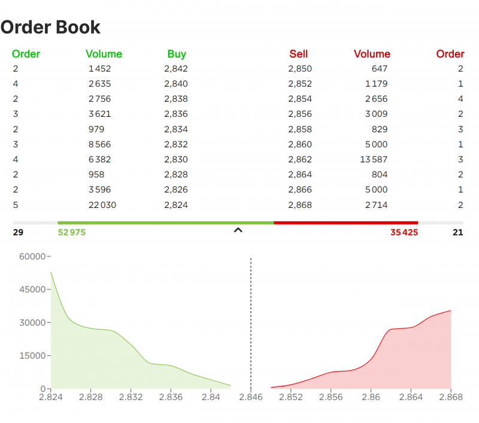

In today's fast-paced financial markets, algorithmic trading has emerged as a pivotal tool for traders aiming to leverage the power of technology and data in making informed decisions. At the heart of many algorithmic trading strategies lies the order book, a critical component that provides a comprehensive ledger of all buy and sell orders for a particular financial instrument. By offering insights into market supply and demand dynamics, the order book serves as a foundation for traders to develop strategies that capitalize on market movements.

This article explores various trading strategies that utilize the order book, examining their benefits, challenges, and implementations. To fully grasp the potential of these strategies, it is essential to comprehend the role of the order book within the trading ecosystem. An in-depth understanding of the order book is particularly crucial for traders involved in high-frequency trading or scalping, as these methods often rely on rapid interpretation and action upon order book data to achieve profitability.



Order books are integral to a wide array of algorithmic trading approaches. They not only enable the identification of market trends but also facilitate the execution of trades with precision. By analyzing the structure and shifts within the order book, traders can identify patterns, predict short-term price movements, and maintain competitive advantages in trading operations. As such, a thorough knowledge of order book dynamics is essential for those seeking to optimize their algorithmic trading strategies and enhance their decision-making processes.

## Table of Contents

## Understanding the Order Book

The order book, or limit order book, functions as a comprehensive digital ledger used by exchanges to document all buy and sell orders for a specified asset. This tool plays an essential role in the trading ecosystem by offering a real-time snapshot of market intentions and liquidity.

Each entry in the order book is characterized by specific details like the price at which the trader wishes to transact and the quantity of the asset to be traded. This granular information aids traders in making informed decisions based on observed market conditions.

The order book is distinctly structured into two primary columns: "bids" and "asks." The bids column comprises buy orders, indicating the prices buyers are willing to pay for the asset. Conversely, the asks column holds sell orders, showing the prices at which sellers are ready to part with their holdings. The interplay between these two columns forms the essence of price discovery in the market. 

A crucial element in this process is the understanding of the highest bid and the lowest ask. The highest bid represents the maximum price a buyer is willing to pay, whereas the lowest ask signifies the minimum price a seller is willing to accept. Together, these figures are instrumental in determining the current market price of the asset, often referred to as the "mid-market price." 

In mathematical terms, the mid-market price $P$ can be expressed as:

$$
P = \frac{\text{Highest Bid} + \text{Lowest Ask}}{2}
$$

Traders can interpret the [order book](/wiki/order-book-trading-strategies)'s structure and dynamics to anticipate potential market movements. For instance, a large [volume](/wiki/volume-trading-strategy) of bids compared to asks may suggest upward pressure on asset prices, signaling a potential rise. Conversely, a predominance of asks over bids could indicate downward pressure.

Understanding the quantitative and qualitative components of the order book enables traders to strategically analyze market depth and identify [liquidity](/wiki/liquidity-risk-premium) levels. Such insights are essential for crafting strategies, especially those predicated on short-term or high-frequency trading principles, where rapid decision-making based on order book analysis is crucial.

## Order Book Trading Strategies

Order book trading strategies aim to analyze and interpret the real-time data from the order book to make informed decisions about short-term price movements. Scalping is a widely used technique within this context, where traders capitalize on small market fluctuations. This approach requires rapid trade execution and focuses on minimal price changes over very short periods.

In practice, scalpers closely monitor the order book for large incoming orders or substantial discrepancies between the bid and ask sides—signals that might indicate an impending price shift. A significant imbalance, for instance, could suggest that the market is about to move in the direction favored by a larger volume of orders.

Algorithmic trading enhances the application of order book strategies by automating the analysis process. Algorithms can process vast amounts of order book data at speeds far beyond human capability, which is crucial for identifying opportunities that may only exist for fractions of a second. By identifying patterns in supply and demand changes within the order book, these algorithms facilitate quick responses and optimized trade execution.

Here is a simple Python example that demonstrates a basic strategy using order book data to identify imbalances and automate trade execution:

```python
import pandas as pd
import numpy as np

# Mock data for the order book
order_book_data = {'bid_price': [101, 100, 99],
                   'bid_volume': [10, 20, 15],
                   'ask_price': [102, 103, 104],
                   'ask_volume': [5, 10, 10]}

# Create a DataFrame to represent the order book
order_book = pd.DataFrame(order_book_data)

# Function to identify imbalances in the order book
def detect_imbalance(order_book):
    bid_power = order_book['bid_price'] * order_book['bid_volume']
    ask_power = order_book['ask_price'] * order_book['ask_volume']

    # Calculate total bid and ask power
    total_bid_power = np.sum(bid_power)
    total_ask_power = np.sum(ask_power)

    # Determine imbalance
    imbalance = total_bid_power - total_ask_power
    return imbalance

# Automate trade execution based on imbalance
imbalance = detect_imbalance(order_book)

# Example condition: execute trade if imbalance exceeds threshold
threshold = 150  # Set threshold for imbalance
if imbalance > threshold:
    # Execute buy trade
    print("Execute buy trade; Imbalance:", imbalance)
elif imbalance < -threshold:
    # Execute sell trade
    print("Execute sell trade; Imbalance:", imbalance)
else:
    print("No trade executed; Imbalance within threshold:", imbalance)
```

This script showcases a basic approach to using order book data. By calculating the power of bids and asks, we can detect imbalances and execute trades based on pre-set thresholds. Sophisticated algorithms used by professional traders might incorporate [machine learning](/wiki/machine-learning) models or other advanced techniques to optimize the detection and exploitation of market inefficiencies.

Overall, leveraging the detailed data within order [books](/wiki/algo-trading-books) through algorithmic analysis enables traders to exploit short-term price movements effectively, although such strategies require continuous adaptation and vigilance due to the inherently dynamic nature of financial markets.

## High-Frequency Trading and Algorithms

High-frequency trading ([HFT](/wiki/high-frequency-trading-strategies)) represents a sophisticated approach to [algorithmic trading](/wiki/algorithmic-trading), where the primary goal is to exploit even the smallest price inefficiencies through rapid processing of order book data. This trading approach depends heavily on the deployment of complex computer algorithms capable of executing a high volume of trades at speeds that far exceed human capability, often in fractions of a second. An essential feature of HFT is its ability to influence liquidity and [volatility](/wiki/volatility-trading-strategies) in the markets due to its speed and frequency of trades.

HFT algorithms are built to analyze vast data streams from multiple exchanges and trading platforms in real-time. This includes assessing market depth, which refers to the market's capacity to absorb large order volumes without significantly impacting the asset's price. By analyzing the order book's layers, HFT strategies can detect hidden liquidity, i.e., unfilled large orders that might not be visible in the top lines of the order book but could affect market movement once executed.

To efficiently navigate the complexities of market data, these algorithms often incorporate advanced analytics, such as machine learning and [artificial intelligence](/wiki/ai-artificial-intelligence), to process information and adapt to changing market conditions. One of the primary mechanisms in HFT involves [arbitrage](/wiki/arbitrage), where algorithms capitalize on minute price discrepancies of an asset across different trading venues. For instance, an HFT algorithm detects that a particular stock is priced slightly lower on one exchange compared to another. It will simultaneously buy the stock on the cheaper exchange and sell it on the more expensive one, pocketing the difference.

Consider the following Python pseudocode to demonstrate a simplified form of algorithmic trading looking for arbitrage opportunities:

```python
import numpy as np

# Simulated data fetching function
def fetch_prices(exchange_a, exchange_b):
    price_a = np.random.uniform(100, 105)  # Simulated price on exchange A
    price_b = np.random.uniform(100, 105)  # Simulated price on exchange B
    return price_a, price_b

def execute_trade(action, price, exchange):
    print(f"{action} at {price} on {exchange}")

# Simplified arbitrage strategy
def arbitrage_strategy():
    exchange_a = "Exchange A"
    exchange_b = "Exchange B"

    price_a, price_b = fetch_prices(exchange_a, exchange_b)

    if price_a < price_b - 0.1:  # Assuming a minimum profit threshold
        execute_trade("Buy", price_a, exchange_a)
        execute_trade("Sell", price_b, exchange_b)
    elif price_b < price_a - 0.1:
        execute_trade("Buy", price_b, exchange_b)
        execute_trade("Sell", price_a, exchange_a)

# Run the arbitrage check
arbitrage_strategy()
```

While the above example is a simplistic representation, real-world HFT systems are far more complex, operating within highly optimized technological infrastructures, often located in proximity to the exchanges' servers to minimize latency—a concept known as colocation. These infrastructures enable HFT firms to maintain competitive advantage through milliseconds or even microseconds gained in order execution times.

Despite the advantages, HFT is subject to regulatory scrutiny due to concerns about market stability and fairness. The vast volume of transactions executed in HFT can lead to market fluctuations and raises questions about liquidity impacts. Therefore, traders utilizing HFT must navigate a landscape of continuous regulatory updates and ethical considerations to sustain their strategies without adversely affecting market integrity.

## Advantages and Risks of Order Book Trading

Order book trading offers several advantages, primarily centered around the ability to leverage real-time market data for making informed trading decisions. The structure of the order book provides transparency regarding the current supply and demand dynamics of a given asset, allowing traders to gauge market sentiment and potential future price movements. By closely monitoring changes in the bid and ask columns, traders can anticipate short-term price swings and set strategies accordingly.

A crucial advantage of order book trading is the capacity to minimize risk through the use of limit orders. Limit orders allow traders to specify the price at which they are willing to enter or [exit](/wiki/exit-strategy) a market, offering a degree of control over trade execution. By setting precise entry and exit points based on observable order book activities, traders can better manage their risk exposure. For instance, by placing a buy limit order at a specific support level, a trader can ensure they purchase the asset only if it reaches a favorable price, thereby avoiding excessive market volatility.

Despite these advantages, order book trading is not without its risks. The high volatility inherent in financial markets can lead to price slippage, where executed trades occur at less favorable prices than anticipated. This slippage can erode potential profits, particularly in fast-moving markets where prices can change rapidly. Moreover, the transparent nature of the order book can occasionally invite market manipulation tactics, such as spoofing—where large orders are placed with the intent to cancel before execution to create a false impression of demand or supply.

Successful traders engage in continuous [backtesting](/wiki/backtesting) to mitigate these risks. Backtesting involves running a trading strategy against historical data to evaluate its effectiveness and potential profitability. It allows traders to understand how their strategies would have performed under different market conditions, helping them refine their approaches. By adapting strategies in response to evolving market trends and technological advancements, traders can maintain a competitive edge and better manage the risks associated with order book trading.

In conclusion, while order book trading provides the opportunity to harness detailed market data for strategic advantage, it requires careful risk management and an ability to adapt to the fast-paced nature of financial markets. Traders must continuously refine their strategies to navigate the inherent risks successfully.

## Challenges in Order Book Strategy Development

The development of order book trading strategies presents a myriad of challenges, largely due to the intricate nature of predicting market movements accurately. One critical aspect of devising these strategies is backtesting, which necessitates access to high-quality historical tick data. Tick data, being the most granular level of trading data, captures every change in price and volume, providing a comprehensive view of the market dynamics. However, acquiring such data can be difficult, particularly for retail traders who may face financial constraints or limited access to premium data providers.

A significant barrier for retail traders is the disparity in infrastructure and speed when compared to institutional traders engaged in high-frequency trading (HFT). Institutional traders possess advanced technology stacks that include co-location services, low-latency networks, and cutting-edge hardware, allowing them to execute trades in microseconds. This technological edge enables them to harness fleeting market opportunities, far beyond the reach of typical retail platforms.

Despite these challenges, recent technological advancements are democratizing access to sophisticated trading tools and platforms. Open-source trading libraries and cloud computing services have lowered entry barriers, enabling individual traders to harness considerable computational power for strategy development and testing. For example, Python libraries such as Zipline and Backtrader provide frameworks for strategy backtesting, while cloud services offer the necessary computational resources at a fraction of traditional costs. Furthermore, modern platforms are increasingly incorporating machine learning algorithms that can analyze vast datasets to identify patterns and optimize trading strategies.

These innovations are propelling a shift towards more inclusive access to advanced trading methodologies, albeit the need for continuous learning and adaptability remains crucial. Traders must stay abreast of technological developments and industry practices to effectively develop and implement order book trading strategies.

## Conclusion

Order book trading strategies provide a detailed view of market dynamics, offering traders the means to engage with algorithmic trading in sophisticated ways. These strategies are richly layered, presenting possibilities for profit that are accompanied by substantial requirements for deep understanding and robust risk management. The overview of the order book—capturing bids, asks, and the intricate balance between them—presents a foundation for traders to craft strategies that can exploit short-term market inefficiencies. However, the allure of these strategies is tempered by the necessity for continuous evaluation and adaptation to the ever-evolving market conditions.

Traders venturing into order book strategies must judiciously assess the advantages against the backdrop of challenges and risks. Among the primary benefits are the detailed insights into market sentiment and the ability to craft precise order placement. Yet, these can be easily overshadowed by risks such as market volatility, slippage, and manipulation tactics. The success of order book strategies lies not only in their strategic design but also in the trader's capacity to implement stringent risk controls and conduct thorough backtesting. This requires a commitment to continuous learning and adaptation, as the market conditions are never static.

Moreover, the landscape of algorithmic trading is one of constant innovation. Technologies and analytical tools are continuously evolving, offering traders new avenues for strategy refinement and execution efficiency. This ongoing development necessitates that traders remain not only reactive to current market conditions but also proactive in embracing future technological advancements. This proactive approach will be crucial as newer and more efficient trading strategies emerge, fostering the potential for even greater returns in the future.

In conclusion, while order book trading strategies stand at the forefront of algorithmic trading sophistication, they demand both a meticulous approach and an openness to innovation from traders seeking to leverage their full potential. The balance between opportunity and risk, understanding and innovation, defines the frontier of successful order book trading in the algorithmic landscape.

## References & Further Reading

[1]: Bouchaud, J. P., Farmer, J. D., & Lillo, F. (2009). ["How Markets Slowly Digest Changes in Supply and Demand."](https://arxiv.org/abs/0809.0822) In *Handbook of Financial Markets: Dynamics and Evolution* (pp. 57-160).

[2]: Gould, M. D., Porter, M. A., Williams, S., McDonald, M., Fenn, D. J., & Howison, S. D. (2013). ["Limit Order Books."](https://arxiv.org/abs/1012.0349) *Quantitative Finance*, 13(11), 1709-1742.

[3]: Lopez de Prado, M. (2018). ["Advances in Financial Machine Learning."](https://www.amazon.com/Advances-Financial-Machine-Learning-Marcos/dp/1119482089) Wiley.

[4]: Cartea, Á., Jaimungal, S., & Penalva, J. (2015). ["Algorithmic and High-Frequency Trading."](https://assets.cambridge.org/97811070/91146/frontmatter/9781107091146_frontmatter.pdf) Cambridge University Press.

[5]: Kissell, R. (2013). ["The Science of Algorithmic Trading and Portfolio Management."](https://www.sciencedirect.com/book/9780124016897/the-science-of-algorithmic-trading-and-portfolio-management) Academic Press.