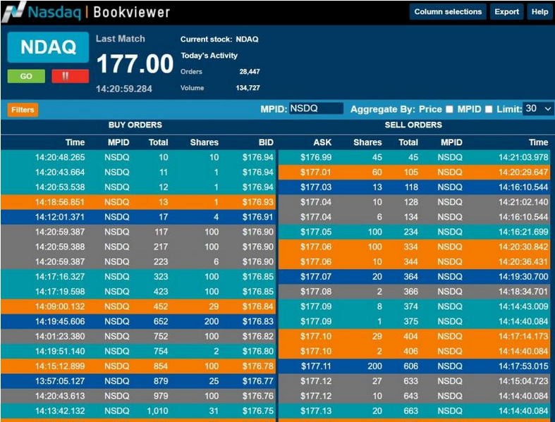

In the evolving world of trading, understanding key components such as order books, limit orders, and algorithmic trading is crucial. These elements form the backbone of modern financial markets, enhancing the precision and efficiency of trading operations. Order books are essential tools that provide a comprehensive picture of buy and sell orders for a specific security, enabling traders to assess market sentiment and liquidity. Limit orders, meanwhile, allow traders to specify the maximum or minimum price at which they are willing to buy or sell a security, offering control over trading outcomes and protection against unfavorable market conditions.

Algorithmic trading, often referred to as algo trading, harnesses the power of advanced computational systems to execute trades at speeds far beyond human capability. By analyzing data from limit order books, these systems can execute complex trading strategies with precision and minimal delay. The interplay between these elements facilitates a trading environment that is not only more efficient but also capable of handling large volumes of transactions with reduced risk and cost.



This article aims to provide a comprehensive guide for traders and investors looking to leverage these mechanisms in their trading strategies. We will explore the structure and functionality of limit order books, the role they play in algo trading, and their impact on trading efficiency. Through this analysis, traders will gain insight into how to utilize these components to enhance their trading strategies in an increasingly automated financial landscape.

## Table of Contents

## What is a Limit Order Book?

A limit order book is an essential tool in financial markets, acting as a ledger that captures all outstanding limit orders for a specific security on an exchange. These limit orders clearly state the price at which a trader is prepared to buy or sell the security, thereby facilitating a controlled trading environment where participants can manage their price exposure effectively.

The order book is systematically organized into two primary categories: buy orders (known as bids) and sell orders (referred to as asks). Each order is documented with its specified price and the quantity of the security involved. This structured arrangement allows traders to easily identify current market sentiment and liquidity levels.

For instance, consider the following simplified representation of a limit order book for a security:

```
Buy Orders (Bids)         | Sell Orders (Asks)
--------------------------|--------------------------
Price      | Quantity     | Price       | Quantity
5.10       | 200          | 5.15        | 150
5.09       | 300          | 5.16        | 200
5.08       | 250          | 5.17        | 100
```

In this setup, the highest bid (buy order) is $5.10 for 200 units, while the lowest ask (sell order) is $5.15 for 150 units. Traders looking to execute a buy order immediately might agree to the lowest ask price, while sellers might target the highest bid price to fulfill their orders instantly.

Understanding the construction and organization of a limit [order book](/wiki/order-book-trading-strategies) is crucial for executing effective trading strategies. This knowledge allows traders to interpret market depth, gauge supply and demand dynamics, and anticipate potential price movements. By analyzing the distribution and [volume](/wiki/volume-trading-strategy) of buy and sell orders at various price levels, traders can identify trends such as support and resistance, aiding in decision-making processes.

Moreover, the insights derived from a limit order book can aid in crafting strategies that leverage market [liquidity](/wiki/liquidity-risk-premium), such as determining optimal entry and [exit](/wiki/exit-strategy) points. Traders often utilize sophisticated algorithms to parse the data contained in order [books](/wiki/algo-trading-books), thereby enhancing their ability to react swiftly to market changes and improve execution quality. In this way, mastery of the limit order book's mechanics can significantly enhance a trader's capacity to navigate complex and fast-paced market environments.

## The Mechanics of Limit Orders

Limit orders are fundamental instructions in trading, allowing investors to buy or sell a security at a specified price or better, ensuring precise control over their trades. These orders provide a strategic advantage by offering price protection. A buy limit order will only execute at the limit price or lower, while a sell limit order will execute at the limit price or higher, thereby giving traders control over the price at which they transacted.

### Advantages of Limit Orders

1. **Price Certainty**: The primary advantage of using limit orders is that they afford traders control over the price at which their order is executed. This is particularly vital in volatile markets where prices can fluctuate rapidly.

2. **Risk Management**: By setting a predefined price, limit orders help traders manage risk effectively. This type of order is advantageous in markets characterized by high volatility, where it is crucial to execute trades at desired price points to avoid potential losses.

3. **Strategic Trading**: Limit orders allow traders to strategically place orders to capitalize on anticipated market moves. Traders can position orders to enter or exit trades based on technical indicators or fundamental analysis.

### Limitations of Limit Orders

1. **Non-Guaranteed Execution**: The main limitation of limit orders is that there is no guarantee they will be filled if the market price does not reach the specified limit. This can lead to missed trading opportunities, especially in rapidly moving markets.

2. **Partial Fills**: Sometimes, limit orders are only partially filled if the total quantity of shares available at the specified price is less than the order amount. This might necessitate multiple orders to complete a desired transaction.

3. **Opportunity Cost**: While waiting for the market to reach the limit price, traders may miss other lucrative opportunities. If the security moves in a favorable direction without hitting the limit, the trader may forgo potential gains.

### Limit Order Example

Consider a trader who wants to purchase shares of a company currently trading at $50, but believes the market price might dip slightly. The trader can place a buy limit order at $48. If the price falls to $48, the order will execute, allowing the trader to purchase the shares at a favorable price. However, if the price never drops to $48, the order remains unfilled.

In the realm of trading algorithms, limit orders are often employed within automated trading systems to optimize execution strategies. By implementing these orders within algorithms, traders can ensure systematic and disciplined execution of trades without the need for manual intervention.

Limit orders thus play a critical role in enabling traders to manage their trades with precision and confidence. Nonetheless, whilst offering significant benefits in terms of price control and strategic positioning, the inherent limitations and risks of missed opportunities must be carefully considered in their application.

## Algorithmic Trading and Order Books

Algorithmic trading relies heavily on computerized systems developed to execute trading strategies with remarkable speed and frequency, which surpass the capabilities of human traders. These systems utilize the data available from limit order books to assess current market conditions and make prompt trading decisions. The primary goal of [algorithmic trading](/wiki/algorithmic-trading) is to optimize trade execution by minimizing costs and maximizing efficiency.

One of the key elements of algorithmic trading is the interaction with limit order books. Limit order books provide a real-time snapshot of buy and sell orders for a particular security, which algorithms analyze to detect trading opportunities and execute trades accordingly. The order book data includes crucial information such as the price, size, and timestamp of outstanding limit orders, making it an essential resource for automated trading systems.

Algorithms are designed to process this information rapidly and execute trades based on predefined parameters, allowing traders to react swiftly to market movements. These parameters may include price levels, volume thresholds, and risk management conditions which guide the trading strategy. By continuously monitoring the order book, algorithms can identify liquidity imbalances, price trends, and potential [arbitrage](/wiki/arbitrage) opportunities.

For example, a simplified Python function illustrating how an algorithm might place a buy order could look like this:

```python
def place_buy_order(order_book, target_price, quantity):
    """
    Places a buy order based on the current order book data.

    Args:
    order_book (list of tuples): Each tuple contains (price, size) for buy orders.
    target_price (float): The maximum price willing to pay for the security.
    quantity (int): The quantity of securities to buy.

    Returns:
    str: Confirmation of the order placement.
    """
    for price, size in order_book:
        if price <= target_price and size >= quantity:
            return f"Buy order placed for {quantity} units at {price}"
    return "Order not placed"

# Example order book data
order_book_data = [(100.5, 10), (101.0, 15), (102.0, 20)]
print(place_buy_order(order_book_data, 101.0, 10))
```

The power of algorithmic trading lies not only in its speed but also in its ability to process vast quantities of data. Machine learning and [artificial intelligence](/wiki/ai-artificial-intelligence) technologies are often integrated into algorithmic trading to enhance the predictive capabilities of the models used. These technologies allow systems to learn from historical data, adapt to new information, and refine their trading strategies over time.

Furthermore, algorithmic trading systems are engineered to mitigate risks through advanced risk management techniques. They can include stop-loss limits, portfolio diversification, and dynamic adjustment of trading strategies based on real-time market feedback.

In summary, the use of algorithms in trading represents a significant advancement in trading technology, with the ability to quickly analyze and respond to market data as represented in limit order books. This technological edge enables traders to execute trades more efficiently and effectively in an increasingly competitive electronic trading environment.

## Strategies Involving Limit Order Books

Market making, arbitrage, and high-frequency trading are integral strategies within financial markets that rely heavily on the data and structure provided by limit order books. These strategies utilize the precise information contained in order books to make informed trading decisions that capitalize on market inefficiencies and provide liquidity.

Market making involves the placement of both buy and sell limit orders to capture the bid-ask spread, which is the difference between the highest price a buyer is willing to pay (bid) and the lowest price a seller is willing to accept (ask). Market makers facilitate market liquidity by continuously providing quotes at which they are willing to buy or sell a security. They profit from the bid-ask spread while helping to reduce the cost of trading for other market participants by narrowing spreads and increasing the depth of the market. A key aspect of [market making](/wiki/market-making) is the ability to update quotes in real time based on market conditions, which demands a thoughtful analysis of the limit order book to anticipate price movements and ensure competitive pricing.

Arbitrageurs, on the other hand, exploit inefficiencies in price across different markets or related securities. By analyzing limit order books from various trading platforms, arbitrageurs can identify discrepancies in prices and execute trades that lock in risk-free profits. For example, if a security is priced differently on two exchanges, an arbitrageur might buy the security on the lower-priced exchange and sell it on the higher-priced one, thereby making a profit without exposure to market risk. Successful arbitrage strategies rely on rapid access to limit order book data and swift execution of trades to capitalize on short-lived arbitrage opportunities.

High-frequency trading ([HFT](/wiki/high-frequency-trading-strategies)) leverages sophisticated algorithms and high-speed connectivity to execute a large number of small and rapid transactions. HFT firms analyze limit order books to detect patterns and signals that may indicate imminent price movements. By executing trades at high speeds, they can capture small price differentials resulting from temporary order book imbalances. This strategy requires advanced technological infrastructure to minimize latency — the delay between a trading signal and the execution of a trade — as well as complex predictive models to provide a competitive edge in execution timing.

Traders employing these strategies must understand not only the technical and analytical facets of limit order books but also the subtleties of market microstructure. Successful implementation demands not only access to high-quality real-time data but also the ability to process and act on this data swiftly and accurately. Additionally, traders must be vigilant of regulatory considerations and ethical implications, given that certain aggressive trading practices can lead to market distortions.

Through market making, arbitrage, and high-frequency trading, traders can optimize their use of limit order books to enhance profitability and contribute to the overall efficiency of financial markets. As trading technologies advance, the interplay between these strategies and order books will likely continue to evolve, presenting new challenges and opportunities.

## Challenges in Order Book Trading

The rapid advancements in electronic markets have brought about significant challenges in trading, particularly when dealing with limit order books. One of the foremost concerns is latency, which refers to the delay between the initiation and execution of a trade order. In high-frequency trading (HFT), even milliseconds can make the difference between profit and loss. To minimize latency, traders rely on cutting-edge technology and co-location services, which involve placing their servers in proximity to exchange data centers to reduce communication time. Developing algorithms that optimize execution speed is also crucial.

Another pressing challenge is market manipulation. Practices such as spoofing, where traders place large orders with the intent to cancel before execution to manipulate prices, can distort the order book. These deceptive strategies can lead to a false perception of market depth and liquidity, potentially misleading other traders. Establishing robust regulatory frameworks and employing [machine learning](/wiki/machine-learning) algorithms to detect and flag suspicious activities are essential steps in mitigating such risks.

Informational overload is a third challenge that traders face. The sheer volume of data generated every second can overwhelm traders, making it difficult to derive actionable insights. Efficient data processing and analysis tools are necessary to manage this information and extract relevant market signals. Employing machine learning models that can handle large datasets and identify patterns might offer a solution, allowing traders to make informed decisions rapidly.

Despite these challenges, the strategic use of limit order books remains a cornerstone of modern trading strategies. By implementing advanced technology and regulatory measures, traders can mitigate these issues, positioning themselves to capitalize on the opportunities that these dynamic markets present.

## Conclusion

Limit Order Books, Limit Orders, and Algorithmic Trading represent fundamental components of modern electronic trading. A comprehensive understanding of these elements is crucial for traders aiming to design and implement efficient and effective trading strategies. Limit Order Books provide a transparent mechanism for traders to gauge market interest, enabling them to make informed decisions based on the supply (asks) and demand (bids) for securities. Limit Orders offer traders price certainty, allowing them to specify the maximum price they are willing to pay (for buys) or the minimum they are willing to accept (for sells), thus protecting against unfavorable price movements.

Algorithmic Trading, on the other hand, enhances the speed and precision of trade execution by leveraging advanced computational power. By processing data from Limit Order Books in real-time, algorithmic systems can execute large volumes of trades at a speed and frequency that human traders cannot match. This not only optimizes trade execution but also helps capture fleeting market opportunities that arise in the ultra-fast, dynamic environment of electronic trading.

As technological advancements continue to revolutionize the landscape, traders and investors can expect the dynamics between these elements to further evolve. Innovations in artificial intelligence, machine learning, and data analytics present both challenges and opportunities. The increasing complexity and pace of market interactions necessitate sophisticated trading systems capable of processing and reacting to vast amounts of data with minimal latency. However, these advancements also open new avenues for refining trading strategies and improving market efficiency.

Therefore, staying abreast of technological developments and understanding the intricate interactions of Limit Order Books, Limit Orders, and Algo Trading remain imperative. Traders equipped with this knowledge are better positioned to navigate the complexities of modern markets and leverage emerging technologies to gain a competitive edge.

## References & Further Reading

[1]: Hasbrouck, J. (2007). ["Empirical Market Microstructure: The Institutions, Economics, and Econometrics of Securities Trading."](https://academic.oup.com/book/52241) Oxford University Press.

[2]: Bouchaud, J.-P., Farmer, J. D., & Lillo, F. (2008). ["How Markets Slowly Digest Changes in Supply and Demand,"](https://arxiv.org/abs/0809.0822) in Handbook of Financial Markets: Dynamics and Evolution.

[3]: Gould, M. D., Porter, M. A., Williams, S., McDonald, M., Fenn, D. J., & Howison, S. D. (2013). ["Limit order books."](https://arxiv.org/abs/1012.0349) SIAM Review, 56(2), 349-419.

[4]: Cartea, Á., Jaimungal, S., & Penalva, J. (2015). ["Algorithmic and High-Frequency Trading."](https://assets.cambridge.org/97811070/91146/frontmatter/9781107091146_frontmatter.pdf) Cambridge University Press.

[5]: Kissell, R. (2013). ["The Science of Algorithmic Trading and Portfolio Management."](https://www.sciencedirect.com/book/9780124016897/the-science-of-algorithmic-trading-and-portfolio-management) Academic Press.