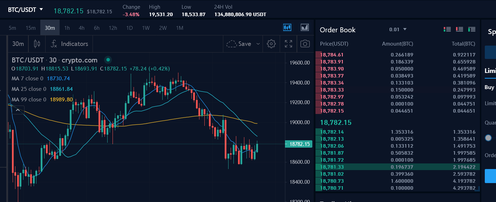

The stock market has undergone a remarkable transformation with the advent of algorithmic trading, a method where pre-programmed computer algorithms are used to execute trades at speeds and frequencies that human traders cannot match. Central to this evolution are limit orders, which provide traders the ability to buy or sell a security at a specified or better price, granting a higher degree of control over trade executions.

Limit orders are pivotal in executing trades at preferred prices, as they allow traders to set maximum buy prices or minimum sell prices. This degree of control is particularly advantageous in mitigating risks associated with price fluctuations, as trades will only execute if the market reaches desirable price levels. For example, if a trader is willing to buy a stock at no more than $50, a limit order can ensure that the purchase will not occur above this price, thus preventing the trader from overpaying.



Integrating limit orders with algorithmic trading strategies can significantly enhance the efficiency and effectiveness of trading. When algorithms incorporate limit orders, they can automatically adjust execution strategies based on real-time market conditions, thereby optimizing trade outcomes. This synthesis not only aids in achieving better price points but also helps in managing large orders by breaking them into smaller, strategically timed transactions to minimize market impact.

This article will explore the role of limit orders within the broader context of algorithmic trading. It will cover the basics of limit orders, their operational mechanics, and the benefits gained from their integration with algorithmic techniques. The exploration aims to provide a comprehensive understanding of how traders can leverage these tools for improved performance in the fast-paced world of stock trading.

## Table of Contents

## Understanding Limit Orders

A limit order is a specific type of order to buy or sell a stock at a designated price or better. This trading mechanism affords investors and traders precise control over the price at which they execute transactions. For a buy limit order, execution occurs at the limit price or lower, while a sell limit order is executed at the limit price or higher. This ensures that the transaction matches the trader's pricing expectations and strategic objectives.

The key advantage of limit orders is the ability to set a maximum purchase price or a minimum sale price, minimizing the risk of unexpected price changes during the execution process. This is particularly beneficial in volatile markets where prices can fluctuate rapidly. By setting clear price points, traders can manage their exposure and protect against unfavorable market conditions.

However, it is important to note that limit orders are not guaranteed to be filled. In scenarios where a stock’s price doesn’t reach the preset limit, the order remains unexecuted. This contrasts with market orders, which prioritize execution speed over price and are typically filled immediately at the current market rate. Consequently, while limit orders provide better price control, they may result in missed trading opportunities if the specified price is not met, particularly in fast-moving markets.

## How Limit Orders Work

Limit orders are essential tools for traders aiming to manage execution prices amidst volatile market conditions. They are employed to specify the price at which a trader is willing to buy or sell a stock, allowing for greater control over the transaction.

For buy limit orders, the execution is set to occur when the stock price is at or below a predetermined limit price. This mechanism ensures that the trader does not pay more than their desired price. Conversely, sell limit orders execute when the stock reaches or exceeds the specified limit price, safeguarding the trader from selling at an undesirably low price. This approach is particularly advantageous when traders seek automated execution at specific price points, effectively mitigating the risk associated with rapid market fluctuations.

Limit orders hold two primary attributes: price control and execution certainty. While these orders guarantee the defined price, they do not assure that the order will be executed. This is a critical consideration, especially in swiftly moving markets where prices may not reach the set limits, leaving orders unfulfilled.

To illustrate the functionality of limit orders, consider the following Python example, which checks whether a trade should be executed based on the current market price relative to a set limit:

```python
def execute_limit_order(order_type, limit_price, market_price):
    """Evaluate and execute a limit order based on current market conditions."""
    if order_type == 'buy':
        return market_price <= limit_price  # For buy orders, execute if current price is below or equal to limit
    elif order_type == 'sell':
        return market_price >= limit_price  # For sell orders, execute if current price is above or equal to limit
    else:
        raise ValueError("Invalid order type: must be 'buy' or 'sell'.")

# Example usage
order_type = 'buy'
limit_price = 100.0
market_price = 99.5

if execute_limit_order(order_type, limit_price, market_price):
    print("Order executed.")
else:
    print("Order not executed.")
```

In this example, the function `execute_limit_order` determines if a buy or sell order should be executed based on the relation of the market price to the specified limit price. For buy orders, execution occurs if the market price is less than or equal to the limit price, ensuring the trader does not overpay. Sell orders execute when the market price meets or surpasses the limit price, preventing the stock from selling too cheaply.

This structured approach makes limit orders ideal for those who prioritize control and strategic execution, especially during periods of high price [volatility](/wiki/volatility-trading-strategies). They enable traders to harness market conditions to their benefit, supporting precise trade operations without continuous monitoring.

## Limit Orders vs. Market Orders

Market orders and limit orders are two primary types of trade orders used by investors in financial markets, each serving different purposes based on the trader's needs and market conditions.

Market orders are designed for immediate execution. When a trader places a market order, the trade is executed at the best available price in the market at that moment. This type of order prioritizes speed over price certainty, making it ideal for situations where quick execution is critical. Traders often use market orders when they need to enter or [exit](/wiki/exit-strategy) a position immediately, or when holding the asset carries significant risk or opportunity cost. However, since market prices can fluctuate rapidly, especially in volatile markets, there is no guarantee of the execution price being close to the last quoted price. This lack of price control presents a risk of "slippage," where the execution price may end up significantly higher or lower than anticipated. 

Limit orders, contrastingly, focus on price specificity rather than execution speed. A limit order is placed to buy or sell a security at a specific price or better. For a buy limit order, the trade will only execute at the limit price or lower; for a sell limit order, at the limit price or higher. This offers traders more control over the price at which their orders are executed, making limit orders beneficial for trading strategies that emphasize price accuracy over immediate transaction. However, unlike market orders, limit orders might not be filled if the market never reaches the specified price. In fast-moving or less liquid markets, this means there's a risk of the order remaining unfilled, potentially resulting in a missed trading opportunity.

Deciding between market and limit orders involves assessing current market conditions and aligning them with the trader's strategy. For instance, in highly volatile markets, limit orders can protect the trader from significant price deviations, providing certainty of execution at acceptable levels. In contrast, market orders might be favored in stable markets or when immediacy outweighs price concerns. Traders must weigh the need for speed against the desire for exact pricing to choose the most appropriate order type.

## Algorithmic Trading: An Overview

Algorithmic trading involves the use of computer algorithms to execute trading orders with precision and speed unattainable by human traders. These pre-programmed strategies make decisions based on defined criteria and mathematical models, allowing for rapid, data-driven transactions. By automating the trading process, [algorithmic trading](/wiki/algorithmic-trading) minimizes human error and emotional bias, contributing to more consistent and accurate trade executions.

One of the primary advantages of algorithmic trading is the enhanced speed of execution. Algorithms can process market data and execute orders within milliseconds, generating trading opportunities that might be missed with manual trading. This speed is particularly beneficial in capturing short-lived market inefficiencies and exploiting [arbitrage](/wiki/arbitrage) opportunities.

Algorithmic trading also improves precision by adhering strictly to the pre-defined trading parameters. This precision ensures that trades are executed at the exact times and prices specified by the algorithm, reducing the risks associated with discretionary human interventions.

Additionally, algorithmic trading supports complex trade strategies that would be difficult to manage manually. Algorithms can calculate intricate trading scenarios, such as pairs trading, [statistical arbitrage](/wiki/statistical-arbitrage), and mean reversion strategies, to identify profitable entry and exit points.

Another fundamental aspect of algorithmic trading is its ability to manage large orders by breaking them down into smaller transactions, a process known as order slicing. This minimizes the market impact, preventing significant price movements that could occur if a large order were executed in a single transaction. The use of [volume](/wiki/volume-trading-strategy)-weighted average price (VWAP) or time-weighted average price (TWAP) algorithms are common techniques to achieve this objective. Here is a simple Python example to illustrate a basic VWAP calculation:

```python
def calculate_vwap(prices, volumes):
    """
    Calculate the Volume Weighted Average Price (VWAP).

    :param prices: List of trade prices.
    :param volumes: List of trade volumes corresponding to the prices.
    :return: VWAP value.
    """
    total_volume = sum(volumes)
    total_vwap = sum(price * volume for price, volume in zip(prices, volumes))
    return total_vwap / total_volume if total_volume else 0

# Example data
prices = [10.5, 10.6, 10.7]
volumes = [150, 200, 250]
vwap = calculate_vwap(prices, volumes)
print(f"VWAP: {vwap}")
```

By employing algorithmic trading, traders can comprehensively navigate the complexities of financial markets, efficiently executing large volumes of trades while optimizing costs and reducing market impacts. This strategic automation ultimately leads to improved trading outcomes and reduced operational risks.

## Combining Limit Orders with Algorithmic Trading

Integrating limit orders with algorithmic trading strategies enables traders to execute trades more efficiently and with greater precision. Algorithms, being pre-programmed sets of instructions, can handle the complexities of managing limit orders in an automated manner, providing traders with the opportunity to implement advanced trading strategies that consider multiple market variables simultaneously.

One of the significant advantages of using algorithmic trading to execute limit orders is the dynamic adjustment of limit prices based on current market conditions and data inputs. For instance, an algorithm might be programmed to adjust the limit price of a buy order downward if the market shows a strong downtrend, or conversely, to increase the limit price if there is an uptick in demand for a particular stock. This adaptability helps traders achieve better control over the execution price, which can be crucial in volatile market environments.

Moreover, the integration of limit orders with algorithmic systems optimizes the trading process by ensuring better fills and minimizing transaction costs. Algorithms can analyze real-time data to determine the optimal price at which to place a limit order. This capability is complemented by the algorithms' ability to execute trades in fractions of a second, which is significantly faster than any manual trading operation. The speed and efficiency provided by algorithms allow traders to take advantage of short-lived market opportunities that might be missed with manual trading methods.

An example of such integration can be demonstrated using Python, where traders can write scripts using libraries such as `pandas` for data manipulation and `numpy` for numerical calculations:

```python
import pandas as pd
import numpy as np

# Example of a function to determine a dynamic limit price based on market conditions
def calculate_limit_price(current_price, market_trend):
    if market_trend == 'bullish':
        return current_price * 1.01  # Increase limit price by 1% in a bullish market
    elif market_trend == 'bearish':
        return current_price * 0.99  # Decrease limit price by 1% in a bearish market
    else:
        return current_price

# Simulated market data
market_data = pd.DataFrame({
    'current_price': np.random.rand(10) * 100,
    'market_trend': np.random.choice(['bullish', 'bearish', 'neutral'], size=10)
})

# Calculate dynamic limit prices
market_data['limit_price'] = market_data.apply(lambda row: calculate_limit_price(row['current_price'], row['market_trend']), axis=1)

print(market_data)
```

This integration not only streamlines the trading process but also pairs the strategic advantages of limit orders with the efficiency of algorithmic execution. By minimizing slippage and optimizing transaction costs, traders can achieve more consistent trading outcomes. The use of algorithms allows for sophisticated order management, ensuring that traders have the tools needed to navigate complex market conditions and maximize potential returns.

## Benefits and Risks of Limit Orders in Algo Trading

Incorporating limit orders within algorithmic trading strategies offers a range of benefits and risks that traders must carefully consider. These orders provide improved price control, ensuring trades match specified levels, an advantage that can lead to better trading efficiency. By setting predefined prices, traders can focus more on developing their strategies, thus reducing the emotional stress often associated with manual trading. This controlled environment can be particularly advantageous during periods of high volatility, allowing trades to be executed at desired prices rather than fluctuating market valuations.

Algorithmically managed limit orders streamline trade execution by capitalizing on pre-set conditions and adjusting dynamically to market changes. This integration enables traders to bypass emotional biases, sticking to their predefined strategies without the need for constant market monitoring. Moreover, algorithms can execute complex strategies autonomously, breaking orders into smaller, strategically timed transactions to minimize exposure and market impact.

Despite the benefits, there are inherent risks that require vigilance. A primary concern is the potential for missed opportunities due to unfilled orders, particularly during rapid market movements where prices might not reach the set limit. This risk is compounded if the algorithm lacks the capability to adapt swiftly to changing conditions, resulting in potential financial losses or diminished profits.

To mitigate these risks, assessing real-time market conditions and regularly evaluating the algorithm's reliability is crucial. Strategies should include continuous performance evaluations and adaptation to evolving market trends. Traders must ensure their algorithms possess robust back-testing credentials across various scenarios to anticipate possible market behaviors accurately.

Balancing these aspects involves a keen understanding of both the technical capabilities of the chosen algorithm and the dynamic nature of the trading environment. This approach not only heightens the effectiveness of limit order strategies but also cushions against unforeseen market shifts—an indispensable practice for maintaining a competitive edge.

## Practical Tips for Effective Algo-Based Limit Order Trading

Selecting the right trading platform is crucial for executing algo-based limit orders effectively. Platforms that offer robust algorithmic trading capabilities allow traders to implement and modify their strategies seamlessly. An ideal platform should provide access to various markets, offer comprehensive data feeds, and support diverse order types. It should also have powerful analytical tools and APIs for developing custom trading algorithms. **Examples of popular trading platforms** that support algorithmic trading include MetaTrader, [Interactive Brokers](/wiki/interactive-brokers-api), and TradeStation.

**Thorough back-testing of trading strategies** is essential to ensure their robustness in various market conditions. Back-testing helps identify the strategy's strengths and weaknesses by simulating its performance using historical data. Proper back-testing involves adjusting parameters to reflect realistic trading environments and takes into account transaction costs and slippage. This process helps in refining strategies to enhance their profitability and resilience. In Python, libraries like `backtrader` or `zipline` can be used for this purpose:

```python
import backtrader as bt

# Define a simple moving average crossover strategy
class SmaCross(bt.SignalStrategy):
    def __init__(self):
        sma1 = bt.ind.SMA(period=10)  # Short-term moving average
        sma2 = bt.ind.SMA(period=30)  # Long-term moving average
        self.signal_add(bt.SIGNAL_LONG, sma1 > sma2)
        self.signal_add(bt.SIGNAL_SHORT, sma1 < sma2)

# Initialize and run backtest
cerebro = bt.Cerebro()
cerebro.addstrategy(SmaCross)
data = bt.feeds.YahooFinanceData(dataname='AAPL', fromdate=datetime(2020, 1, 1),
                                 todate=datetime(2021, 1, 1))
cerebro.adddata(data)
cerebro.run()
cerebro.plot()
```

Maintaining awareness of market trends is vital for optimizing algorithm performance. This requires staying informed about economic indicators, geopolitical events, and market sentiment. Algorithms need to be adjusted in response to changing conditions; for instance, volatility-based adjustments might be necessary during economic announcements. Continuous monitoring of algorithmic outcomes and making real-time adjustments ensures optimal trade execution, as market dynamics often shift unexpectedly.

Furthermore, traders should incorporate risk management and position sizing into their strategies. This involves setting appropriate stop-loss levels and maximum drawdown limits. Emphasizing diversification by allocating assets across different securities or asset classes can also mitigate risk. In summary, successful algo-based limit order trading hinges on a judicious choice of trading platforms, rigorous strategy back-testing, and continuous adaptation to market trends.

## Conclusion

Limit orders, when integrated with algorithmic trading, present substantial advantages for market participants aiming to improve their trading strategies. By allowing traders to specify the price at which they are willing to buy or sell, limit orders introduce a level of precision that is often lacking in traditional market orders. This precision helps mitigate the risk of unexpected price changes and ensures that trades are executed only at optimal price points. 

The strategic coupling of limit orders with algorithmic trading enhances the ability of traders to operate efficiently in the fast-paced financial environment. Algorithms can be programmed to monitor market conditions continuously and adjust limit prices dynamically, based on real-time data. This capability not only improves the chances of order execution but also minimizes potential slippage—a scenario where the final execution price differs from the expected price. 

Moreover, the use of algorithmic strategies in executing limit orders can significantly contribute to minimizing trading costs. By breaking down large orders into smaller transactions, algorithms reduce market impact, helping to prevent large price fluctuations that could arise from substantial buy or sell orders. This strategic segmentation often results in more favorable average trade prices.

However, harnessing the full potential of limit orders in algorithmic trading requires continuous learning and adaptation. Market conditions are ever-changing, influenced by geopolitical factors, economic reports, and investor sentiment. Therefore, staying informed about these dynamics and regularly updating algorithmic models is critical to maintaining a competitive edge in the market. 

In conclusion, when traders effectively combine limit orders with algorithmic trading, they can benefit from improved control over trade execution. This collaboration has the potential to enhance trading performance significantly, making it an indispensable strategy for modern traders. The commitment to ongoing education and tactical refinement remains vital, ensuring these tools are leveraged to their fullest potential.

## FAQs

### What is a limit order and how does it differ from a market order?

A limit order is a trading instruction to buy or sell an asset at a specific price or better. In contrast to market orders, which execute immediately at the best available current price, limit orders provide traders with more control over the execution price. For a buy limit order, the asset will be purchased only at the limit price or lower, whereas a sell limit order will execute only at the limit price or higher. This tailored approach results in better price precision but does not guarantee execution, as the order will not be filled if the market price doesn't reach the specified limit.

A market order, on the other hand, prioritizes execution speed without dictating the exact price at which the trade is executed. It is advantageous in fast-moving markets where immediate execution is prioritized over obtaining a specific price. The difference between these two orders largely depends on the specific financial goals and strategy of the trader.

### How does algorithmic trading enhance limit order execution?

Algorithmic trading enhances limit order execution by using computer programs to automate and optimize trading strategies. Algorithms can handle large volumes of data, assess market conditions, and adjust trading parameters in real-time, ensuring more efficient execution of limit orders. Through pre-defined strategies, such algorithms can effectively determine when to place, modify, or cancel limit orders based on market movements and other data inputs.

A significant advantage of algorithmic trading is its ability to manage large orders by splitting them into smaller ones, executing them at optimal times to minimize market impact and capture better prices. Advanced algorithms can dynamically adjust limit prices and decide on the best execution strategy, leading to potentially improved fill rates and reduced trading costs.

### What are common pitfalls to avoid in algorithmic limit order trading?

While algorithmic limit order trading offers numerous advantages, several pitfalls should be avoided to ensure optimal performance:

1. **Overfitting**: Designing an algorithm based on historical data that is too specific can lead to overfitting, where the algorithm performs well on past data but poorly in live market conditions. It is crucial to balance complexity and generality by using robust back-testing methodologies.

2. **Latency**: In fast-moving markets, delays in executing algorithms can lead to significant slippage, where the executed price diverges from the desired price. Employing low-latency trading infrastructure can help mitigate this issue.

3. **Market Conditions**: Ignoring different market conditions can lead to ineffective algorithms. Algorithms should be adaptable to varying market dynamics, such as volatility spikes or liquidity shortages.

4. **Algorithm Reliability**: Ensuring the algorithm's reliability is paramount. This includes regular updates and maintenance to address any bugs or inefficiencies that could lead to missed opportunities or execution errors.

Traders need to remain vigilant to these pitfalls, constantly monitor their algorithms, and be prepared to make necessary adjustments in response to changing market environments.

## References & Further Reading

[1]: Bertsimas, D., & Lo, A. W. (1998). ["Optimal control of execution costs."](http://web.mit.edu/dbertsim/www/papers/Finance/Optimal%20control%20of%20execution%20costs.pdf) Operations Research, 46(2), 176-181.

[2]: Harris, L. (1990). ["Statistical properties of the roll serial covariance bid/ask spread estimator."](https://onlinelibrary.wiley.com/doi/10.1111/j.1540-6261.1990.tb03704.x) Journal of Finance, 45(2), 579-590.

[3]: Hasbrouck, J. (2007). ["Empirical Market Microstructure: The Institutions, Economics, and Econometrics of Securities Trading."](https://archive.org/details/empiricalmarketm0000hasb) Oxford University Press.

[4]: Almgren, R., & Chriss, N. (2001). ["Optimal execution of portfolio transactions."](https://smallake.kr/wp-content/uploads/2016/03/optliq.pdf) Journal of Risk, 3(2), 5-39.

[5]: Kissell, R., & Glantz, M. (2013). ["Optimal Trading Strategies: Quantitative Approaches for Managing Market Impact and Trading Risk."](https://www.amazon.com/Optimal-Trading-Strategies-Quantitative-Approaches/dp/0814407242) Routledge.

[6]: Narang, M. (2013). ["Inside the Black Box: A Simple Guide to Quantitative and High Frequency Trading."](https://onlinelibrary.wiley.com/doi/book/10.1002/9781118662717) Wiley Finance.

[7]: Treleaven, P., Galas, M., & Lalchand, V. (2013). ["Algorithmic trading review."](https://dl.acm.org/doi/10.1145/2500117) Communications of the ACM, 56(11), 76-85.