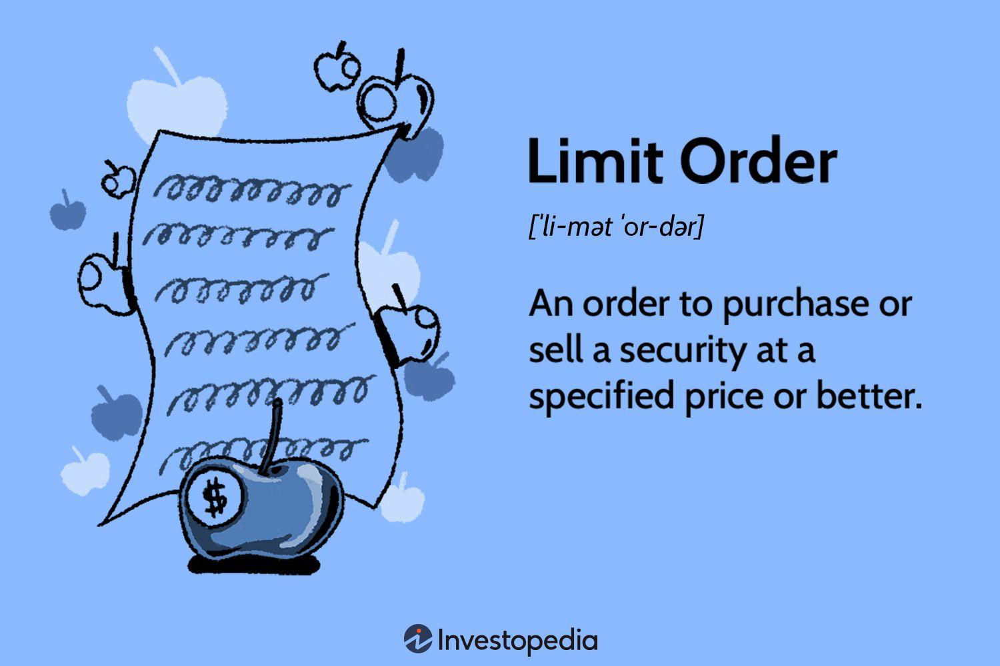

## Table of Contents

## What is a limit order in trading?

A limit order is a type of order you can use when you want to buy or sell a stock at a specific price or better. For example, if you want to buy a stock but only if it reaches a certain lower price, you can set a limit order at that price. This means your order will only be filled if the stock's price falls to your limit price or lower. It's a way to control the price you pay or receive, which can be helpful if you have a target price in mind.

However, there's a catch with limit orders. They are not guaranteed to be filled. If the stock never reaches your limit price, your order won't be executed. This can be frustrating if the stock price gets very close to your limit but doesn't quite reach it. On the other hand, limit orders can help you avoid buying or selling at a price you're not comfortable with, giving you more control over your trades.

## How does a limit order differ from a market order?

A limit order and a market order are two different ways to buy or sell stocks. A limit order lets you set a specific price at which you want to buy or sell a stock. For example, if you want to buy a stock but only if it's $50 or less, you can set a limit order at $50. Your order will only go through if the stock reaches that price or lower. This helps you control the price you pay or get, but there's no guarantee your order will be filled if the stock never hits your price.

On the other hand, a market order is simpler and more immediate. When you place a market order, you're telling the broker to buy or sell the stock right away at the current market price. This means your order will almost always be filled quickly, but you won't have control over the exact price. The price might be a bit different from what you see when you place the order, especially if the stock is moving fast or if it's not very liquid. So, market orders are good for getting the trade done fast, but limit orders give you more control over the price.

## What are the main advantages of using a limit order?

Using a limit order gives you more control over the price you buy or sell a stock. You can set a specific price and only buy if the stock falls to that price or lower, or sell if it rises to that price or higher. This means you won't end up paying more than you want or selling for less than you're happy with. It's like setting a rule for your trade that helps you stick to your plan.

Another advantage is that limit orders can help you save money. If you think a stock is going to drop to a certain price before it goes up again, a limit order lets you buy at that lower price. This can be a good way to get a better deal than if you bought right away. Plus, if you're selling, a limit order can help you get a higher price than the current market price, which means more money in your pocket.

## Can you explain the process of setting up a limit order?

Setting up a limit order is pretty easy. First, you need to decide if you want to buy or sell a stock and at what price. For example, if you want to buy a stock but only if it's $50 or less, you would set a limit order to buy at $50. You can do this through your online brokerage account. Just go to the trading section, choose the stock you're interested in, and select "limit order" as the order type. Then, enter the price you want, which in this case is $50, and the number of shares you want to buy. Once you've filled in all the details, you can submit the order.

After you submit the order, your broker will keep an eye on the stock's price for you. If the stock's price falls to $50 or lower, your order will be filled, and you'll buy the stock at that price or better. But if the stock never reaches $50, your order won't be filled, and you won't buy the stock. This means you have to wait and see if the price hits your limit. It's a good idea to keep an eye on your order and maybe adjust the price if the stock is getting close but not quite reaching your limit.

## What are the potential risks associated with limit orders?

One risk with limit orders is that they might not get filled. If you set a limit order to buy a stock at a certain price, but the stock never reaches that price, you won't buy the stock. This can be frustrating if the stock's price gets very close to your limit but doesn't quite hit it. You might miss out on a good opportunity if the stock then goes up a lot after not reaching your limit price.

Another risk is that the market can move quickly. If you set a limit order and the stock's price suddenly jumps past your limit, you'll miss out on buying or selling at the new price. For example, if you want to buy a stock at $50 but it suddenly goes from $52 to $55, your order won't be filled, and you'll have to decide if you want to chase the stock at a higher price. This can be tricky and might lead to missed chances or buying at a less favorable price.

## How do limit orders work in different market conditions?

In a fast-moving or volatile market, limit orders can be tricky. When stock prices are changing quickly, your limit order might not get filled if the price jumps past your limit. For example, if you want to buy a stock at $50 but it suddenly goes from $52 to $55, your order won't be filled. You'll have to decide if you want to chase the stock at a higher price. This can be frustrating and might lead to missed opportunities. On the other hand, if the market is moving in your favor and the stock slowly reaches your limit price, your order will be filled, and you'll get the stock at the price you wanted or better.

In a slow or stable market, limit orders work more smoothly. If the stock price is not changing much, your limit order has a better chance of being filled at your desired price. For example, if you set a limit order to buy a stock at $50 and the price slowly drops to $50, your order will be filled, and you'll get the stock at that price. However, if the stock price stays above your limit, your order won't be filled, and you'll have to wait or adjust your limit. This can be good if you're patient and want to stick to your price, but it can also mean you miss out if the stock never reaches your limit.

## What is the impact of order size on the execution of a limit order?

The size of your limit order can affect how easily it gets filled. If you want to buy or sell a lot of shares, it can be harder to find someone on the other side of the trade who wants to buy or sell that many shares at your limit price. This is especially true for stocks that don't trade a lot. If you set a big limit order, it might not get filled because there aren't enough people trading that stock at your price. On the other hand, if you're trading a popular stock with lots of buyers and sellers, a bigger order might still get filled, but it could take longer.

Also, big orders can affect the stock's price. If you put in a big limit order to buy a stock, it might push the price up because other traders see there's a lot of demand. If you're trying to sell a lot of shares with a limit order, it might push the price down because it looks like there's a lot of supply. This can make it harder for your order to get filled at your limit price because the market is moving away from it. So, it's good to think about how big your order is and how it might affect the market when you're setting a limit order.

## How can traders use limit orders to implement specific trading strategies?

Traders can use limit orders to buy low and sell high, which is a basic trading strategy. For example, if you think a stock is going to drop to a certain price before it goes back up, you can set a limit order to buy the stock at that lower price. This way, you can get a better deal than if you bought the stock right away. When the stock goes up again, you can sell it for a profit. Limit orders help you stick to your plan and not pay more than you want to.

Another way traders use limit orders is to protect their profits or limit their losses. If you own a stock and it's going up, you can set a limit order to sell it at a higher price to lock in your gains. This is called a take-profit order. If the stock reaches your limit price, it will be sold, and you'll keep the profit. On the other hand, if you're worried the stock might go down, you can set a limit order to sell it at a lower price to cut your losses. This is called a stop-loss order, but it's a bit different because it's triggered by the stock falling to a certain price. Limit orders give you control over when you buy and sell, helping you manage your trades better.

## What are the differences between a buy limit order and a sell limit order?

A buy limit order is when you want to buy a stock, but only if it reaches a certain lower price. For example, if you see a stock that's currently at $60 but you think it might drop to $50, you can set a buy limit order at $50. This means your order will only go through if the stock falls to $50 or lower. It's a way to get a better price than the current market price, but there's no guarantee the stock will ever reach your limit price.

A sell limit order is the opposite. It's when you want to sell a stock, but only if it reaches a certain higher price. Let's say you own a stock that's currently at $50, but you think it might go up to $60. You can set a sell limit order at $60. Your order will only be filled if the stock's price goes up to $60 or higher. This way, you can sell the stock at a better price than the current market price, but again, there's no guarantee the stock will reach your limit price. Both types of limit orders give you more control over the price you buy or sell at, but they might not always get filled if the stock doesn't reach your limit.

## How do partial fills affect the strategy when using limit orders?

When you use a limit order, sometimes you might get a partial fill. This means that only part of your order gets filled at your limit price, and the rest stays open. For example, if you want to buy 100 shares of a stock at $50, but only 50 shares are available at that price, you'll get those 50 shares, and the other 50 will still be waiting for the price to hit $50 again. Partial fills can affect your trading strategy because you might end up with fewer shares than you wanted, which can change how you plan to trade.

If you get a partial fill, you need to decide what to do next. You can leave the rest of your order open and hope it gets filled at your limit price later, or you can cancel the rest of the order and try again with a new limit order. Partial fills can be tricky because they might leave you with an incomplete position, and you have to think about whether to stick with your original plan or adjust it based on the new situation. It's important to keep an eye on your orders and be ready to make changes if you get a partial fill.

## What role does the order book play in the execution of limit orders?

The [order book](/wiki/order-book-trading-strategies) is like a list that shows all the buy and sell orders for a stock at different prices. When you place a limit order, it goes into this list. If you want to buy a stock at a certain price, your order will show up in the order book as a buy order at that price. If someone else wants to sell the stock at the same price or lower, your buy limit order can get filled. The same thing happens with sell limit orders. If you want to sell a stock at a certain price, your order goes into the order book as a sell order, and it can get filled if someone wants to buy at that price or higher.

The order book helps decide if your limit order will be filled and at what price. If there are a lot of people wanting to buy or sell at your limit price, your order is more likely to get filled quickly. But if there aren't many people trading at your price, your order might stay in the order book for a long time without getting filled. So, the order book is important because it shows you what other people are willing to buy or sell at different prices, which can help you decide if your limit order is likely to work out.

## How can advanced traders optimize the use of limit orders in algorithmic trading?

Advanced traders can use limit orders in [algorithmic trading](/wiki/algorithmic-trading) to make their strategies work better. They can set up algorithms to automatically place limit orders based on certain conditions, like price movements or trading [volume](/wiki/volume-trading-strategy). This can help them buy or sell stocks at the best possible prices without having to watch the market all the time. For example, if an algorithm sees that a stock's price is dropping and it thinks the price will go back up, it can place a limit order to buy the stock at a lower price. This way, the trader can get a good deal without having to be there to do it themselves.

Another way advanced traders can optimize limit orders is by using them to manage risk. They can set up their algorithms to place limit orders that act as stop-losses or take-profits. A stop-loss order can help limit losses by selling a stock if it falls to a certain price, while a take-profit order can lock in gains by selling when the stock reaches a higher price. By using these types of limit orders, traders can make sure their trades follow their plan, even when the market is moving fast. This can help them make more money and lose less, which is what every trader wants.

## References & Further Reading

[1]: Bertsimas, D., & Lo, A. W. (1998). ["Optimal control of execution costs."](http://web.mit.edu/dbertsim/www/papers/Finance/Optimal%20control%20of%20execution%20costs.pdf) Operations Research, 46(2), 176-181.

[2]: Harris, L. (1990). ["Statistical properties of the roll serial covariance bid/ask spread estimator."](https://onlinelibrary.wiley.com/doi/10.1111/j.1540-6261.1990.tb03704.x) Journal of Finance, 45(2), 579-590.

[3]: Hasbrouck, J. (2007). ["Empirical Market Microstructure: The Institutions, Economics, and Econometrics of Securities Trading."](https://archive.org/details/empiricalmarketm0000hasb) Oxford University Press.

[4]: Almgren, R., & Chriss, N. (2001). ["Optimal execution of portfolio transactions."](https://smallake.kr/wp-content/uploads/2016/03/optliq.pdf) Journal of Risk, 3(2), 5-39.

[5]: Kissell, R., & Glantz, M. (2013). ["Optimal Trading Strategies: Quantitative Approaches for Managing Market Impact and Trading Risk."](https://www.amazon.com/Optimal-Trading-Strategies-Quantitative-Approaches/dp/0814407242) Routledge.

[6]: Narang, M. (2013). ["Inside the Black Box: A Simple Guide to Quantitative and High Frequency Trading."](https://onlinelibrary.wiley.com/doi/book/10.1002/9781118662717) Wiley Finance.

[7]: Treleaven, P., Galas, M., & Lalchand, V. (2013). ["Algorithmic trading review."](https://dl.acm.org/doi/10.1145/2500117) Communications of the ACM, 56(11), 76-85.