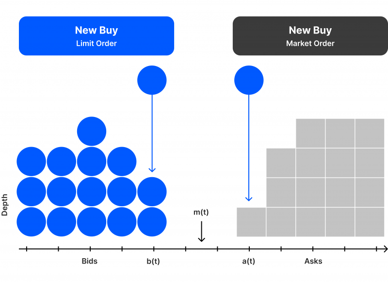

## Table of Contents

## What is a Limit Order Information System?

A Limit Order Information System is a tool used in stock markets to help people buy and sell stocks at specific prices. When someone wants to buy or sell a stock, they can set a limit order, which means they tell the system the exact price they are willing to pay or accept. The system then keeps track of all these orders and tries to match buyers and sellers at the prices they want.

This system is helpful because it gives people more control over their trades. Instead of buying or selling a stock right away at whatever price is available, they can wait for the price they want. This can be useful for people who want to make sure they get a good deal or who want to avoid sudden changes in the market price. Overall, a Limit Order Information System makes trading more organized and efficient.

## How does a Limit Order Information System work?

A Limit Order Information System helps people buy and sell stocks at the prices they want. When someone wants to buy a stock, they can set a limit order and say, "I want to buy this stock, but only if it costs $50 or less." The system keeps track of this order and waits until the stock's price drops to $50 or lower. If the price reaches $50, the system will buy the stock for them. The same thing happens when someone wants to sell a stock. They can say, "I want to sell this stock, but only if someone will pay $60 or more." The system will wait until someone is willing to pay $60 or more, and then it will sell the stock.

This system is helpful because it lets people set their own prices instead of having to buy or sell right away at whatever price is available. It's like shopping at a store where you can wait for a sale instead of buying something at full price. The system keeps track of all the orders and tries to match buyers and sellers at the prices they want. This makes trading more organized and helps people get better deals on their stocks.

## What are the main components of a Limit Order Information System?

A Limit Order Information System has a few main parts that help it work well. The first part is the [order book](/wiki/order-book-trading-strategies), which is like a list where all the limit orders are kept. When someone wants to buy or sell a stock at a specific price, their order goes into this list. The order book shows all the buy and sell orders, so the system can see if there are any matches between what people want to buy and what others want to sell.

The second important part is the matching engine. This part of the system looks at the order book and tries to match up buy and sell orders that have the same price. For example, if someone wants to buy a stock for $50 and someone else wants to sell it for $50, the matching engine will make the trade happen. The matching engine works quickly to make sure trades happen as soon as possible when the prices match.

The last part is the user interface, which is what people use to put in their orders and see what's happening with their trades. It's like a computer program or a website where people can type in the price they want to buy or sell a stock. The user interface also shows them the current prices and lets them know when their orders are filled. All these parts together make the Limit Order Information System work smoothly and help people trade stocks at the prices they want.

## What are the benefits of using a Limit Order Information System?

Using a Limit Order Information System helps people get better deals when they buy or sell stocks. Instead of buying a stock right away at a high price, someone can set a limit order to buy it only if the price drops to a level they like. This means they can wait for a sale and save money. When selling stocks, people can also use limit orders to make sure they get the best price possible. They can set a price they are happy with and wait for someone to buy at that price, which helps them make more money from their stocks.

Another benefit is that a Limit Order Information System makes trading more organized and fair. The system keeps track of all the orders and matches them up at the right prices. This means everyone gets a chance to buy or sell at the price they want, and no one can jump ahead in line. It also helps the market run smoothly because everyone knows what prices people are willing to buy and sell at. This can make the market more stable and predictable, which is good for everyone who trades stocks.

## How can a beginner set up a basic Limit Order Information System?

To set up a basic Limit Order Information System, a beginner should start by choosing a good trading platform that supports limit orders. Many online brokers and trading apps have this feature, so you'll need to sign up for an account with one of these services. Once you have an account, you can start setting up your limit orders. To do this, go to the trading section of the platform and look for an option to place a limit order. You'll need to enter the stock symbol, the number of shares you want to buy or sell, and the specific price at which you want the order to be executed. Make sure to double-check all the details before submitting your order.

After you've set up your limit orders, it's important to keep an eye on them. The trading platform will usually show you a list of all your active orders, so you can see if any of them have been filled or if they're still waiting for the right price. If you want to change or cancel an order, you can do that through the platform as well. It's a good idea to check your orders regularly, especially if the stock market is moving a lot. This way, you can make sure your orders are still set at the prices you want and make any adjustments if needed.

## What are the common challenges faced when implementing a Limit Order Information System?

One common challenge when setting up a Limit Order Information System is dealing with technical issues. The system needs to handle a lot of orders quickly and accurately, which can be hard to do. If the system is slow or makes mistakes, it can cause problems for people trying to trade. Another challenge is keeping the system safe from hackers. Since the system deals with people's money and important information, it needs strong security to stop bad people from getting in and messing things up.

Another challenge is making sure the system is easy to use. If the trading platform is confusing or hard to navigate, people might not want to use it. This means the system needs to have a good user interface that is simple and clear. It's also important to make sure the system works well on different devices, like computers and smartphones, so people can use it wherever they are. If the system is too complicated or doesn't work well on all devices, it can be frustrating for users and they might look for other options.

## How does a Limit Order Information System integrate with existing trading platforms?

A Limit Order Information System can be added to existing trading platforms by connecting its features with the platform's tools. This means making sure the system's order book and matching engine work well with what the trading platform already has. The system needs to be able to take in limit orders from users and then show these orders on the platform. It also has to match these orders with other buy and sell orders quickly and correctly. This can be tricky because the system has to work fast and not make mistakes, so it needs to be set up carefully.

Another important part is making the Limit Order Information System easy to use within the existing trading platform. The platform should have a simple way for people to put in their limit orders and see what's happening with them. This means the system's user interface needs to fit well with the platform's design. It should also work on different devices like computers and phones, so people can use it wherever they are. If the system is hard to use or doesn't work well with the trading platform, people might not want to use it, so it's important to make sure everything works together smoothly.

## What advanced features can be added to enhance a Limit Order Information System?

To make a Limit Order Information System even better, you can add some advanced features. One cool feature is real-time market data. This means the system can show you what's happening in the market right now, so you can make smart choices about your orders. Another useful feature is automated trading strategies. With this, you can set up rules for the system to follow, like buying a stock when it reaches a certain price or selling it if it drops too much. This can save you time and help you trade better.

Another advanced feature is order prioritization. This means the system can decide which orders to fill first based on things like the time the order was placed or the size of the order. This can make the system fairer and more efficient. You can also add risk management tools, which help you keep track of how much risk you're taking with your trades. These tools can warn you if you're taking too much risk or help you set limits on how much you're willing to lose. All these features can make the Limit Order Information System more powerful and helpful for traders.

## How do regulatory requirements impact the design of a Limit Order Information System?

Regulatory requirements play a big role in how a Limit Order Information System is made. Rules from places like the Securities and Exchange Commission (SEC) or other financial watchdogs say what the system has to do to keep trading fair and safe. For example, the system has to keep good records of all the orders it gets and show them to the right people if they ask. It also has to make sure that everyone gets a fair chance to buy and sell at the prices they want, without anyone getting special treatment. This means the system needs to be built in a way that follows all these rules, which can make things more complicated but also helps keep the market honest.

Another important part is protecting people's information and money. The system has to have strong security to stop hackers from getting in and messing things up. It also has to follow rules about keeping people's data private and safe. This means the people who make the system have to think about how to build it so it's secure and private, while still letting people trade easily. All these rules can make the system more complex, but they're important for making sure the market works well and people can trust it.

## What are the best practices for maintaining and updating a Limit Order Information System?

Keeping a Limit Order Information System running well means doing regular checks and updates. You should always be looking for any problems or bugs in the system and fixing them quickly. It's also a good idea to keep the system's software up to date. This means installing new versions of the software that can make the system work better or add new features. Regularly checking and updating the system helps make sure it keeps working smoothly and stays safe from hackers.

Another important thing is to listen to the people using the system. They can tell you what they like and what they don't like, which can help you make the system better. You can also use their feedback to decide what new features to add. It's also a good idea to keep learning about new technology and ideas that could make the system even better. By staying up to date and listening to users, you can keep the Limit Order Information System working well and helping people trade stocks effectively.

## How can data analytics be utilized to improve the performance of a Limit Order Information System?

Data analytics can help make a Limit Order Information System better by looking at lots of information about how people trade. By studying this data, the system can find patterns and see what people usually do when they buy and sell stocks. This can help the system guess what prices might do next, so it can make better choices about when to fill orders. For example, if the data shows that a certain stock often goes up at a certain time of day, the system can use this information to help people get better prices for their trades.

Another way data analytics can help is by making the system work faster and more smoothly. By looking at data about how the system is running, you can find any problems or slow parts and fix them. This means the system can handle more orders without getting stuck or making mistakes. Also, data analytics can help the system learn from past trades to make better decisions in the future. This can make the whole trading process easier and more successful for everyone using the system.

## What future trends are expected to influence the development of Limit Order Information Systems?

In the future, technology will keep changing how Limit Order Information Systems work. One big trend is using [artificial intelligence](/wiki/ai-artificial-intelligence) (AI) and [machine learning](/wiki/machine-learning). These technologies can help the system learn from past trades and make smarter choices about when to buy and sell stocks. They can also make the system faster and better at handling lots of orders at the same time. Another trend is using blockchain technology, which can make trading safer and more transparent. Blockchain can help keep track of all the orders and trades in a way that's hard to cheat or mess up.

Another important trend is making the system easier to use on different devices, like phones and tablets. As more people use these devices to trade, the system needs to work well on them. This means the system's user interface will need to be simple and easy to use, no matter what device someone is using. Also, as more people around the world start trading, the system will need to handle different languages and time zones. This can make the system more useful for people everywhere and help more people trade stocks easily and safely.

## References & Further Reading

[1]: ["Advances in Financial Machine Learning"](https://www.amazon.com/Advances-Financial-Machine-Learning-Marcos/dp/1119482089) by Marcos Lopez de Prado

[2]: ["Evidence-Based Technical Analysis: Applying the Scientific Method and Statistical Inference to Trading Signals"](https://www.amazon.com/Evidence-Based-Technical-Analysis-Scientific-Statistical/dp/0470008741) by David Aronson

[3]: ["Machine Learning for Algorithmic Trading"](https://github.com/stefan-jansen/machine-learning-for-trading) by Stefan Jansen

[4]: ["Quantitative Trading: How to Build Your Own Algorithmic Trading Business"](https://www.amazon.com/Quantitative-Trading-Build-Algorithmic-Business/dp/1119800064) by Ernest P. Chan

[5]: Bouchaud, J. P., Farmer, J. D., & Lillo, F. (2008). ["How markets slowly digest changes in supply and demand."](https://arxiv.org/abs/0809.0822) Physica A: Statistical Mechanics and its Applications, 387(15), 3629-3631.

[6]: Pardo, R. (2008). ["The Evaluation and Optimization of Trading Strategies."](https://onlinelibrary.wiley.com/doi/book/10.1002/9781119196969) Wiley Trading.