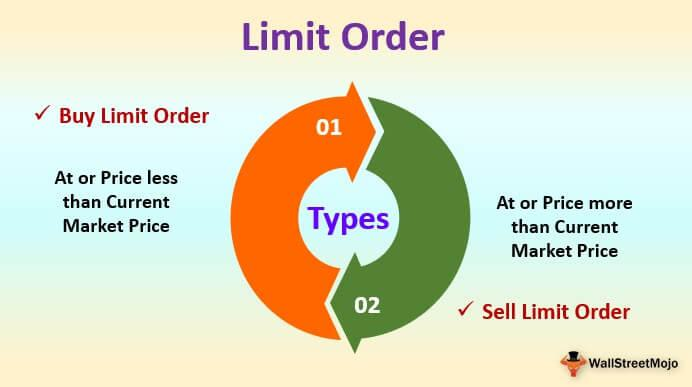

In today’s rapidly evolving financial markets, the demand for precise and efficient trading tools has reached an unprecedented level. As the landscape of trading continues to change with technological advancements, traders are increasingly relying on innovative systems to enhance their trading strategies and maintain a competitive edge. One notable system that addresses these growing needs is the Limit Order Information System (LOIS), designed to optimize the placement and execution of limit orders, a critical component of most trading strategies.

Limit orders allow traders to specify the maximum or minimum price at which they are willing to buy or sell a security, thereby providing greater control over their trading execution and potentially reducing transaction costs. However, effectively managing these orders requires sophisticated systems capable of processing large volumes of data in real-time and executing trades with precision. LOIS emerges as a powerful tool in this context, offering advanced functionalities to streamline limit order management and execution.

This article will explore various aspects of LOIS, focusing on its unique benefits to traders and how it differentiates itself from other systems in the marketplace. We will guide readers through the setup process, utilization techniques, and share insights from those traders who have leveraged LOIS to gain competitive advantages. By integrating LOIS into their trading toolkit, traders can transform their trading approaches, leading to improved outcomes by enhancing precision, efficiency, and risk management capabilities.

By the end of this article, readers will gain a comprehensive understanding of LOIS's potential to revolutionize trading strategies, providing them with the knowledge and tools necessary to implement LOIS effectively within their own trading operations.

## Table of Contents

## What is LOIS and Its Importance?

LOIS, an abbreviation for Limit Order Information System, is an advanced electronic system predominantly utilized by specialists and traders within stock markets. Its primary function is to furnish users with comprehensive price and size quotes for securities listed on exchanges. By offering such detailed data, LOIS aids traders in discerning optimal market conditions and venues for executing their trades, effectively enhancing their decision-making processes.

One of the critical advantages of LOIS is its potential to minimize slippage. Slippage occurs when there is a difference between the expected price of a trade and the actual price at which the trade is executed, often attributed to market volatility or delays in order execution. By providing real-time insights into market activities and facilitating the precise placement of limit orders, LOIS plays an instrumental role in reducing these discrepancies. This precision ensures that traders can set limits on the prices of their securities, thereby controlling their trading outcomes more effectively.

Moreover, LOIS significantly bolsters a trader's capacity to manage risk. Effective risk management is a cornerstone of successful trading, and the ability to execute limit orders with accuracy is a vital component of this. By leveraging LOIS, traders can establish specific entry and [exit](/wiki/exit-strategy) points, limit potential losses, and lock in profits without being subject to the whims of volatile markets. Consequently, the structured approach enabled by LOIS serves as a powerful tool in optimizing trade execution and enhancing overall trading efficiency.

Understanding how to utilize LOIS can not only streamline trading operations but also enhance a trader's strategic flexibility. With its detailed market data, traders can tailor their strategies to align with prevailing market conditions, thus fortifying their market positions and outmaneuvering less informed participants.

## Features and Benefits of Using LOIS

LOIS, or Limit Order Information System, is tailored to meet the diverse needs of different types of traders, such as scalpers, swing traders, and position traders. It stands out due to its ability to utilize real-time data and analytics, offering traders actionable insights into current market conditions. This feature is essential for informed decision-making, allowing traders to react swiftly to market changes and optimize their trading strategies.

One of the primary features of LOIS is its capability to display the limit [order book](/wiki/order-book-trading-strategies). This functionality provides traders with a transparent view of current buy and sell orders, helping them understand market depth and [liquidity](/wiki/liquidity-risk-premium). Access to this information can be crucial for executing trades at favorable prices and minimizing the impact of market [volatility](/wiki/volatility-trading-strategies).

Additionally, LOIS is equipped with alert systems for order execution. Traders receive timely notifications about their orders, enabling them to track performance and make necessary adjustments as market conditions evolve. This feature is particularly beneficial for maintaining precision in trade execution, which can be critical for minimizing slippage and achieving intended entry and exit points.

Moreover, LOIS provides comprehensive analytics on order performance. With detailed reports and performance metrics, traders can evaluate the effectiveness of their strategies over time. These analytics offer insights that can help in refining strategies, optimizing order placement, and improving overall trading outcomes.

These features collectively enhance trading precision and efficiency. By leveraging real-time data, alert systems, and advanced analytics, LOIS proves to be an invaluable tool for traders aiming to optimize their strategies. As a result, LOIS empowers traders to navigate complex market environments with increased confidence and effectiveness.

## Comparison of LOIS with Other Market Tools

In the world of trading, various tools are available to aid in limit order execution, yet the Limit Order Information System (LOIS) distinguishes itself due to its sophisticated functionalities. One of the most significant advantages of LOIS is its provision of real-time market data, which enables traders to make informed decisions swiftly and effectively. This real-time data feature is crucial for traders who need to react quickly to market changes to optimize their trading strategies.

Customization options are another key feature of LOIS, providing traders with the ability to tailor the system to their specific trading needs. Unlike many other trading tools, LOIS allows users to customize their interfaces, alerts, and data displays, thus accommodating the diverse needs of different traders, whether they are day traders, swing traders, or long-term investors.

LOIS also supports a wide variety of order types, including trailing stops and stop-limit orders. These advanced order capabilities permit traders to use sophisticated strategies that can protect against adverse market movements while capturing potential gains. The flexibility offered by LOIS in handling different order types is a major advantage for traders looking to implement nuanced strategies.

The seamless integration of LOIS with existing trading platforms is another significant benefit. This feature ensures that traders can easily incorporate LOIS into their existing workflows without disrupting their usual trading operations. The ability to integrate LOIS with various trading platforms means that traders can leverage its full potential alongside other trading tools, leading to a more efficient trading experience.

Finally, the adaptability and comprehensive suite of features offered by LOIS set it apart from other market tools. By providing a robust combination of real-time data, customizable options, and support for multiple order types, LOIS enhances trading performance. Traders benefit from a system that not only accommodates but actively supports sophisticated trading strategies across different market conditions.

In summary, while there are numerous tools available for limit order trading, LOIS’s advanced functionalities, flexibility, and user-friendly interface make it a superior choice for traders seeking to enhance their trading performance.

## How to Setup and Use LOIS

Setting up the Limit Order Information System (LOIS) is designed to be user-friendly and is compatible with a range of operating systems and trading platforms. To start using LOIS, traders must first create an account with the platform. This initial step involves providing basic personal information and setting up security credentials to ensure account safety.

Once the account is created, the next step is identity verification. This step is crucial to maintain the integrity and security of trading activities on the platform. Traders are typically required to submit identification documents such as a government-issued ID or passport. This process helps in confirming the identity of the user and adhering to regulatory compliance standards.

After successfully verifying their identity, traders need to link their trading accounts to LOIS. This process involves connecting LOIS with the broker or trading platform that the trader uses, which allows for a seamless flow of data between the platforms. This integration is essential for traders to execute their orders through LOIS and receive real-time data.

LOIS provides the flexibility to customize trading preferences according to individual trading strategies. Traders can set specific order parameters such as quantity, price limits, and triggers. Additionally, users can configure alerts to receive notifications about significant market movements or when certain conditions are met. This customization enables traders to align the tool with their unique trading objectives and manage their trades more efficiently.

Whether operating in manual or automatic modes, LOIS supports traders by maximizing trading opportunities. In manual mode, traders may wish to directly manage every aspect of their orders, while automatic mode allows LOIS to adjust and execute limit orders based on pre-set criteria without constant user intervention. This dual-mode functionality ensures that traders can adapt the tool to match their preferred level of interaction and control over trading activities.

The combination of easy setup, secure integration, and flexible options underscores LOIS's utility in enhancing trading performance with minimal effort, allowing traders to focus their attention on strategy rather than logistics.

## Best Practices for Optimizing Trading Performance with LOIS

To fully leverage the Limit Order Information System (LOIS) for trading optimization, traders should concentrate on fine-tuning their limit order parameters, which include quantity, price, duration, and trigger conditions. Each of these parameters plays a crucial role in ensuring that limit orders are executed efficiently and meet the trader's strategic objectives.

1. **Optimizing Limit Order Parameters**:
   - **Quantity**: Setting the appropriate order size is essential. Too large a size may lead to partial fills or market impact, while too small may not achieve the desired market exposure.
   - **Price**: The order price should align with the trader's valuation of the asset. For instance, setting a limit price that reflects anticipated support or resistance levels can increase the likelihood of order execution.
   - **Duration**: Utilize order duration settings that match the trading strategy, whether it be immediate or good until canceled, to manage exposure and commitment effectively.
   - **Trigger Conditions**: Consider the use of advanced conditions, such as volume or price thresholds, to activate or execute orders automatically under predefined market conditions.

2. **Real-time Monitoring and Adjustment**:
   Real-time monitoring is vital for maintaining control over active orders. Utilizing LOIS's real-time data feeds allows traders to adjust order parameters swiftly. For instance, if a stock's price approaches the set limit, an immediate review and potential modification can prevent adverse fills or missed opportunities, thus enhancing both execution quality and risk management.

3. **Combining LOIS with Other Trading Strategies**:
   Integrating LOIS with technical analysis enables traders to make informed limit orders based on pattern recognition, trend analysis, or indicators like moving averages. Similarly, coupling it with [fundamental analysis](/wiki/fundamental-analysis) can signal entry points aligned with intrinsic value changes or macroeconomic data releases. This synergistic approach can amplify the effectiveness of trades.

4. **Performance Evaluation and Data-driven Insights**:
   Regularly evaluating the performance of executed and unexecuted orders provides insights into the effectiveness of the current strategies. Utilizing back-testing or historical analysis via LOIS allows traders to refine their approach iteratively. By analyzing metrics such as fill rates, slippage, and execution times, traders can adjust their tactics to minimize costs and maximize gains.

By focusing on these best practices, traders can harness the full capability of LOIS, resulting in more precise, controlled, and profitable trading operations.

## Trader Experiences with LOIS

Traders using the Limit Order Information System (LOIS) have consistently observed notable advancements in trading accuracy and overall profitability. One of the most frequently cited advantages by traders is LOIS's capability to dynamically adjust orders in accordance with market fluctuations. This responsiveness is crucial for optimal execution, as it allows traders to adapt quickly to changing market conditions, reducing the likelihood of unfavorable trades.

Moreover, LOIS is equipped with a robust feedback mechanism that significantly contributes to the enhancement of traders' skills and market comprehension. The system's educational resources, which include detailed analytics and insights into order performance, have been pivotal for many users. These resources enable traders to learn from past trades and refine their strategies, fostering a deeper understanding of market dynamics.

The positive user experiences reported by traders underscore LOIS's effectiveness in revolutionizing trading strategies. By leveraging its features, users have achieved heightened precision in executing trades, leading to increased profitability. LOIS's role in transforming trading approaches is evident in the wide array of favorable outcomes shared by its users, making it a vital tool for various participants in the market.

## Conclusion and Call to Action

Limit Order Information System (LOIS) stands as a robust tool for traders aiming to fine-tune their limit order strategies. It bridges the gap between market volatility and trading precision, offering advanced features that cater to the modern trader's needs. With real-time market data, LOIS delivers the accuracy required to make informed decisions swiftly, thereby minimizing slippage and enhancing order execution quality.

Customization is another of LOIS's strong suits. The system's flexible configuration options allow traders to tailor order parameters and alerts according to their individual trading strategies. This adaptability ensures that traders, whether involved in [scalping](/wiki/gamma-scalping), swing trading, or positional trading, can optimize their use of LOIS to suit their specific operational frameworks.

We strongly recommend traders to integrate LOIS into their trading methodologies. Not only does it promise augmented precision and efficiency, but its user-friendly interface and seamless integration with existing platforms also make for a smooth transition. The potential for better risk management and improved trading performance that LOIS provides is substantial, and firsthand experience with the system is the best way to appreciate its full capabilities.

By adopting LOIS, traders are not just embracing a trading tool but investing in a significant upgrade to their toolkit, promising higher precision, better risk control, and an enhanced probability of favorable trading outcomes.

## References & Further Reading

[1]: ["Advances in Financial Machine Learning"](https://www.amazon.com/Advances-Financial-Machine-Learning-Marcos/dp/1119482089) by Marcos Lopez de Prado

[2]: ["Evidence-Based Technical Analysis: Applying the Scientific Method and Statistical Inference to Trading Signals"](https://www.amazon.com/Evidence-Based-Technical-Analysis-Scientific-Statistical/dp/0470008741) by David Aronson

[3]: ["Machine Learning for Algorithmic Trading"](https://github.com/stefan-jansen/machine-learning-for-trading) by Stefan Jansen

[4]: ["Quantitative Trading: How to Build Your Own Algorithmic Trading Business"](https://www.amazon.com/Quantitative-Trading-Build-Algorithmic-Business/dp/1119800064) by Ernest P. Chan

[5]: Bouchaud, J. P., Farmer, J. D., & Lillo, F. (2008). ["How markets slowly digest changes in supply and demand."](https://arxiv.org/abs/0809.0822) Physica A: Statistical Mechanics and its Applications, 387(15), 3629-3631.

[6]: Pardo, R. (2008). ["The Evaluation and Optimization of Trading Strategies."](https://onlinelibrary.wiley.com/doi/book/10.1002/9781119196969) Wiley Trading.