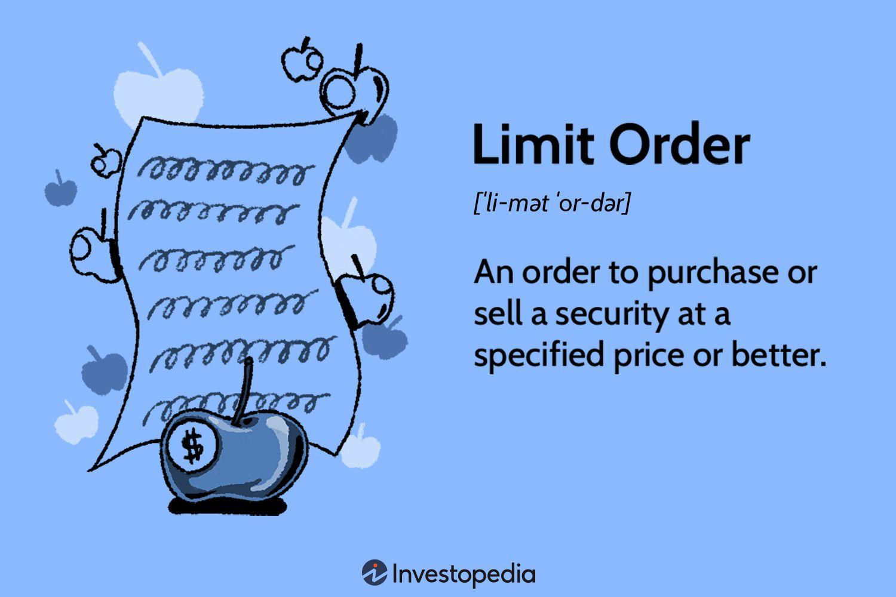

The world of financial markets is characterized by its complexity and diversity, where various financial instruments and strategies entice both traders and investors. Among the myriad of options available, stock trading stands out as a prominent avenue. This article focuses on two integral components of stock trading: limit orders and algorithmic (algo) trading. By understanding these core concepts, traders can enhance their ability to navigate and exploit opportunities within the market efficiently.

A limit order is a fundamental tool that enables traders to exercise precise control over their trades by setting a specific price at which they wish to buy or sell a stock. Unlike market orders, which are executed immediately at the current market price, limit orders ensure that transactions are executed only at the desired price or better. This offers significant advantages in managing entry and exit points in a volatile market.



Algorithmic trading, often referred to as algo trading, has revolutionized the financial markets by employing computer programs to execute trades based on predefined criteria such as timing, price, and volume. This approach minimizes human intervention and harnesses market efficiencies, providing traders with enhanced speed and accuracy. As financial markets have become more technology-driven, the interrelation between algorithmic trading and traditional trading strategies like limit orders has gained prominence.

This article explores the mechanics of limit orders, the benefits of engaging in algorithmic trading, and how these two elements interact within the broader financial markets. By understanding these components, traders and investors are better equipped to optimize their strategies and stay competitive in the rapidly evolving landscape of stock trading.

## Table of Contents

## Understanding Limit Orders in Stock Trading

A limit order is a type of order to buy or sell a stock at a specified price or better. Unlike market orders that execute a trade immediately at the current market price, limit orders provide traders with precise control over their entry and exit points. This method is particularly advantageous in a fluctuating market where immediate execution prices may not align with the trader's goals.

Limit orders come in two primary forms: buy limit orders and sell limit orders. A buy limit order involves setting a price below the current market price, ensuring that the order is filled only if the asset’s price dips to or below the specified limit. Conversely, a sell limit order is positioned above the current market price, ensuring a transaction occurs only when the price climbs to or surpasses the set limit.

To understand this better, consider the following example: A trader wants to purchase a stock currently trading at $50, but believes it would be a better deal if acquired at $48. By setting a buy limit order at $48, the trader ensures that the purchase happens only if the stock price hits or goes below $48. Similarly, if the trader owns a stock and wants to sell it at no less than $52, a sell limit order would be placed at this price point, triggering a sale only if the market price reaches $52 or more.

The primary advantage of using limit orders is the control it offers over trade prices, which can be crucial in managing investment strategies. Traders are able to outline precise buy or sell conditions, which helps in planning capital allocation and minimizing risks associated with volatile price movements.

However, while limit orders provide significant control over trading prices, they do not guarantee execution. If the market price never reaches the set limit price, the order remains unfilled. This can result in missed opportunities, especially in rapidly changing markets where prices may not linger at the desired levels. For example, if a limit buy order is set too low, a short-term dip may fill the order that might not align with long-term market movements, leading to potential setbacks.

In summary, limit orders are a powerful tool for traders wanting precise price control. They can be especially useful for executing trades that align with specific market strategies, but traders must balance the risk of unfilled orders against the benefits of set trade terms. Understanding how and when to deploy limit orders is an integral part of effective risk management and strategic financial planning.

## Algorithmic Trading: An Overview

Algorithmic trading, commonly referred to as algo trading, employs computer programs to execute trades based on a set of predefined criteria. These criteria can include factors such as timing, price, and [volume](/wiki/volume-trading-strategy) and are designed to optimize trading efficiency and accuracy while minimizing human involvement. By leveraging sophisticated algorithms, traders can exploit short-lived market opportunities that may not be evident through manual trading.

Algo trading operates on a straightforward principle: the automation of trading decisions. For example, an algorithm may be programmed to buy a stock when its price drops below a certain threshold and sell it once it reaches a predetermined high. This process not only streamlines execution but also helps manage the vast volumes of data and transactions that characterize modern financial markets.

The benefits of [algorithmic trading](/wiki/algorithmic-trading) are numerous. Speed is a critical advantage; algorithms can process multiple market conditions and execute transactions in fractions of a second, greatly surpassing human capabilities. This rapid execution allows traders to capture opportunities as they arise, potentially leading to improved profitability. Additionally, algorithms operate with precision and repeatability, eliminating the human emotions and biases that often interfere with trading decisions.

Moreover, algorithmic trading can enhance [liquidity](/wiki/liquidity-risk-premium) in the markets. By consistently buying and selling securities, algorithms can narrow bid-ask spreads and reduce market [volatility](/wiki/volatility-trading-strategies). This increased liquidity is beneficial for both individual traders and the market as a whole.

Nevertheless, algorithmic trading is not without its drawbacks. A primary concern is the focus on technology, which carries inherent risks. Software bugs or glitches can lead to erroneous trades, resulting in significant financial losses. The infamous "flash crash" of May 6, 2010, serves as a poignant example of how algo trading can exacerbate market instability when not adequately monitored.

Additionally, the competitive nature of algorithmic trading necessitates constant updates and improvements to maintain profitability. Financial markets are continually evolving, with new regulations, products, and technologies regularly emerging. As such, traders must invest in advanced infrastructure and systems to keep pace, which can be cost-prohibitive for smaller entities.

In summary, algorithmic trading presents a powerful tool for modern traders, offering unparalleled speed and accuracy in executing trades. However, the dependence on technology and the need for continuous adaptation present considerable challenges. Understanding these elements is crucial for traders seeking to leverage algorithmic strategies effectively.

## The Synergy of Limit Orders and Algorithmic Trading

Limit orders and algorithmic trading are complementary tools that can significantly enhance trade execution strategies. Limit orders provide traders with the ability to specify the price at which they are willing to buy or sell a stock, ensuring trades occur only at favorable prices. This price control becomes even more powerful when integrated with algorithmic trading, which automates the trading process based on predefined criteria.

Algorithms can handle limit orders more efficiently than manual trading by continuously monitoring market conditions and adjusting orders accordingly. This eliminates the need for constant market vigilance from traders. For instance, an algorithm can be programmed to place a buy limit order at a specific price and automatically adjust this order based on real-time data inputs such as stock volatility, trading volume, and market trends.

### Example Scenario

Consider a scenario where a trader wants to execute a large buy order without causing a significant price impact. A basic algorithm might be structured as follows:

```python
def limit_order_execution(target_price, quantity, price_data):
    executed_quantity = 0
    for price in price_data:
        if price <= target_price and executed_quantity < quantity:
            executed_quantity += execute_trade(price)
        update_market_conditions()
    return executed_quantity

def execute_trade(current_price):
    # Simulate trade execution at current_price
    # Return the quantity traded
    return 10

def update_market_conditions():
    # Update market conditions here (e.g., refresh price data)
    pass

# Example usage:
price_data_stream = [100, 99, 101, 98, 97]  # Simulated real-time price data
executed_quantity = limit_order_execution(99, 50, price_data_stream)
print(f"Executed Quantity: {executed_quantity}")
```

In this example, the algorithm is set to execute trades as each price point becomes favorable, up to a target quantity. By automating the process, the algorithm ensures the trader capitalizes on short-lived opportunities, something that might be missed if relying solely on manual input.

### Improved Trading Outcomes

Combining limit orders with algorithmic trading often leads to improved trading outcomes by minimizing the risk of emotional trading and allowing for a higher level of precision in trade execution. Algorithms can react to market changes faster than humans, ensuring orders are adjusted or canceled to prevent unfavorable trades. This synergy allows for better order filling rates and optimized trading costs by avoiding slippage—a common trading pitfall where the execution price deviates from the desired price.

In summary, the integration of limit orders into algorithmic trading strategies represents a powerful approach to managing stock trades efficiently. By leveraging technology to automate strategic decisions, traders can ensure that executions are not only aligned with their financial goals but also adapted in real time to the ever-changing market dynamics.

## Pros and Cons of Combining Limit Orders with Algo Trading

Combining limit orders with algorithmic trading strategies presents both advantages and disadvantages that traders need to consider. One significant benefit is the enhanced control over trade execution. Utilizing limit orders within an algorithmic framework allows traders to specify precise price points for buying or selling assets, thereby minimizing the risk of executing trades at unfavorable prices. This precision reduces the emotional impact of trading decisions, as the algorithm executes trades based on predefined parameters without human bias or impulse.

Another advantage is the reduction of trading costs. By using limit orders, traders can avoid paying high spreads and achieve better pricing. Algorithms can automatically place multiple small limit orders to minimize slippage and potentially capture price improvements when the market moves favorably. The automation aspect ensures that the trading strategy is consistently applied, providing an edge in highly volatile markets where human intervention might be slow or inconsistent.

Nevertheless, there are drawbacks to this approach. A primary disadvantage is the potential for missed opportunities if market conditions change rapidly. Limit orders may remain unfilled if the market price fails to reach the specified level, causing traders to miss beneficial trades that could have been executed with a market order. This is particularly problematic in fast-moving markets where prices can fluctuate significantly within short time spans.

Another challenge is the reliance on technology. While algorithmic trading can enhance efficiency, it also introduces the risk of technical failures. Software bugs, latency issues, and connectivity problems can adversely affect the execution of limit orders, potentially leading to unintended trading outcomes. Therefore, rigorous testing and robust infrastructure are essential to mitigate these risks.

Understanding these trade-offs is crucial for traders aiming to manage risk effectively while taking advantage of market opportunities. By balancing the control offered by limit orders with the efficiency of algorithmic trading, traders can develop robust strategies that capitalize on favorable conditions while mitigating potential downsides.

## Technical Requirements and Getting Started

Setting up an algorithmic trading system requires careful consideration of multiple technical elements to ensure efficient, timely, and secure trade execution. For traders aiming to embark on this endeavor, there are several key components to consider: software, market data access, and infrastructure needs.

### Software and Programming Skills

The cornerstone of an algorithmic trading system is the software platform used to write, test, and execute trading algorithms. Popular platforms for algorithmic trading include MetaTrader, TradeStation, and NinjaTrader, which offer scripting capabilities in languages like MQL4/5, EasyLanguage, and NinjaScript, respectively. However, for more custom and advanced systems, languages like Python, R, and C++ are often employed due to their extensive libraries and robust performance capabilities.

For instance, Python is widely favored due to its ease of learning and rich ecosystem. Libraries such as [Pandas](https://pandas.pydata.org/) for data manipulation, [NumPy](https://numpy.org/) for numerical computations, and [Scikit-learn](https://scikit-learn.org/stable/) for implementing [machine learning](/wiki/machine-learning) algorithms are invaluable tools for the development of sophisticated trading strategies.

### Market Data Access

Access to real-time and historical market data is crucial for both the development and execution phases of algorithmic trading. This data includes price feeds, volume, bid and ask prices, and other relevant metrics. Providers such as Bloomberg, Thomson Reuters, and [Interactive Brokers](/wiki/interactive-brokers-api) offer comprehensive data services, albeit often at a substantial cost. For individual traders or smaller firms, alternatives like [Alpha Vantage](https://www.alphavantage.co/) and [IEX Cloud](https://iexcloud.io/) can provide cost-effective solutions.

APIs from these providers allow programmatic access to market data, enabling the automation of key functions such as signal generation, [backtesting](/wiki/backtesting), and live trading. For instance, using Python with the [Alpha Vantage API](https://www.alphavantage.co/documentation/), traders can fetch data in a structured format for algorithmic analysis.

```python
import requests

def get_stock_data(symbol, api_key):
    base_url = 'https://www.alphavantage.co/query'
    params = {
        'function': 'TIME_SERIES_INTRADAY',
        'symbol': symbol,
        'interval': '1min',
        'apikey': api_key
    }
    response = requests.get(base_url, params=params)
    data = response.json()
    return data

stock_data = get_stock_data('AAPL', 'your_api_key')
```

### Infrastructure Needs

The infrastructure supporting an algorithmic trading system must be robust and reliable. Latency, the delay before a transfer of data begins following an instruction for its transfer, is a critical [factor](/wiki/factor-investing) that can influence trading performance. Reduced latency results in faster trade execution, which is essential in high-frequency trading strategies. To minimize latency, traders can use co-location services offered by exchanges, placing their trading algorithms on servers physically close to the exchange's data center.

Furthermore, cloud infrastructure services such as Amazon Web Services (AWS), Microsoft Azure, and Google Cloud Platform provide scalable resources that can support the demands of algorithmic trading, including real-time computing power and large data storage capabilities.

### Getting Started

Traders new to algorithmic trading should start by building a solid foundation in both market mechanics and programming. Courses and educational resources, both free (like those on Coursera or edX) and paid, can be invaluable. A basic understanding of financial markets, trading strategies, and statistical analysis is crucial. Coupled with programming skills, traders can begin to experiment with simple strategies before gradually increasing complexity.

Developing a basic algorithm and backtesting it against historical data is a practical way to start. Open-source platforms like QuantConnect and Zipline provide environments for developing and testing trading strategies in Python, offering a sandbox for beginners to hone their skills.

In summary, the development of an algorithmic trading system involves a blend of software proficiency, access to market data, and reliable infrastructure. With these components in place and a continuous commitment to learning, traders can effectively engage in the dynamic world of algorithmic trading.

## Conclusion

Understanding the intricacies of limit orders and algorithmic trading is invaluable for anyone participating in stock trading. These tools are essential components that can be effectively leveraged to navigate the complexities of the financial markets. Limit orders provide traders with precise control over trade execution, allowing them to buy or sell assets at specified prices, thus mitigating the risk of unfavorable market movements. On the other hand, algorithmic trading offers efficiency and speed beyond human capabilities, executing trades based on pre-set criteria with minimal intervention.

While both limit orders and algorithmic trading have their advantages and challenges, the synergy created by combining them can formulate a robust strategy for modern traders. Limit orders within an algorithmic framework can enhance trade execution by integrating systematic approaches, which are less prone to emotional biases and can adapt to market fluctuations efficiently. This amalgamation enables traders to capitalize on market movements swiftly and accurately, increasing their potential for profitable outcomes.

However, the fast-paced nature of financial markets demands continuous learning and adaptation of market strategies. Staying informed about technological advancements, market trends, and emerging trading techniques is crucial for maintaining a competitive edge. By continually expanding their knowledge base, traders can develop strategies that harness the full potential of limit orders and algorithmic trading, thus achieving greater success in their trading endeavors.

## References & Further Reading

[1]: ["Algorithmic Trading and DMA: An introduction to direct access trading strategies"](https://www.amazon.com/Algorithmic-Trading-DMA-introduction-strategies/dp/0956399207) by Barry Johnson

[2]: Linnainmaa, J. T. (2010). ["Do Limit Orders Alter Inference About Investor Performance and Behavior?"](https://onlinelibrary.wiley.com/doi/10.1111/j.1540-6261.2010.01576.x) The Review of Financial Studies, 23(4), 1387-1416.

[3]: ["Advances in Financial Machine Learning"](https://www.amazon.com/Advances-Financial-Machine-Learning-Marcos/dp/1119482089) by Marcos Lopez de Prado

[4]: Cartea, Á., Jaimungal, S., & Penalva, J. (2015). ["Algorithmic and High-Frequency Trading."](https://assets.cambridge.org/97811070/91146/frontmatter/9781107091146_frontmatter.pdf) Cambridge University Press.

[5]: Kissell, R. (2013). ["The Science of Algorithmic Trading and Portfolio Management."](https://www.sciencedirect.com/book/9780124016897/the-science-of-algorithmic-trading-and-portfolio-management) Academic Press.