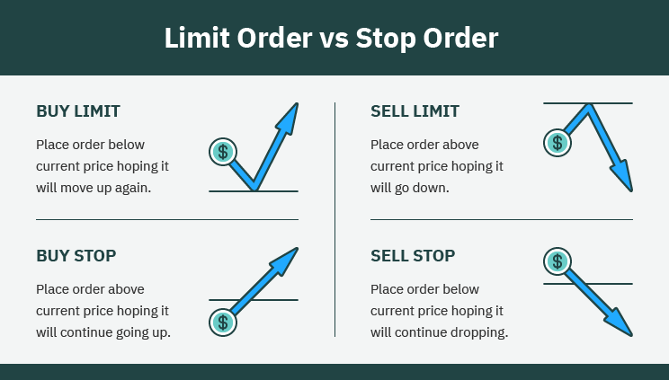

## Table of Contents

## What is a limit order?

A limit order is a type of order you can place with your broker to buy or sell a stock at a specific price or better. For example, if you want to buy a stock but only if it reaches a certain lower price, you can set a limit order at that price. Your order will only be executed if the stock's price hits or goes below your limit price.

On the other hand, if you want to sell a stock but only if it reaches a certain higher price, you can also use a limit order. You set your limit price, and your order will be executed only if the stock's price hits or goes above that limit. Limit orders give you more control over the price at which you buy or sell, but there's a risk that your order might not be filled if the stock never reaches your specified price.

## How does a limit order differ from a market order?

A limit order and a market order are two different ways to buy or sell stocks. A limit order lets you set a specific price at which you want to buy or sell a stock. If you want to buy a stock, you can set a limit order to buy it only if the price drops to your chosen price or lower. If you want to sell, you can set it to sell only if the price goes up to your chosen price or higher. The order will only happen if the stock reaches your price, so you have more control over what you pay or get.

A market order is simpler and faster. When you place a market order, you're telling your broker to buy or sell the stock right away at the current market price. You don't set a specific price; you just want the trade to happen as soon as possible. This means your order will almost always be filled quickly, but the price you get might be a bit different from what you saw when you placed the order, especially if the market is moving fast.

## When should you use a limit order?

You should use a limit order when you want to buy or sell a stock at a specific price. If you see a stock you like but it's a bit too expensive right now, you can set a limit order to buy it only if the price drops to what you're willing to pay. This way, you don't have to watch the stock all the time. Your order will only happen if the stock reaches your price, so you can be sure you're not paying more than you want.

Limit orders are also good when you want to sell a stock at a certain price. If you own a stock and you think it will go up to a certain price, you can set a limit order to sell it when it gets there. This can help you make sure you get the price you want, instead of selling it for less if the market goes down suddenly. But remember, there's a chance your order won't happen if the stock never reaches your price.

## What are the advantages of using a limit order?

Using a limit order gives you more control over the price at which you buy or sell a stock. If you want to buy a stock, you can set a limit order to only buy it if the price goes down to what you're willing to pay. This way, you don't have to watch the stock all the time. You can set your price and wait for the market to come to you. If you want to sell a stock, a limit order lets you set a price you're happy with, so you can make sure you get that price instead of selling for less if the market drops suddenly.

Another advantage of limit orders is that they can help you stick to your trading plan. If you've done your research and decided on a good price to buy or sell, a limit order helps you follow through on that plan. You won't be tempted to make a quick decision based on short-term market movements. However, keep in mind that there's a chance your order won't be filled if the stock never reaches your limit price. So, while limit orders give you control, they also come with the risk that your trade might not happen at all.

## What are the potential drawbacks of using a limit order?

One big drawback of using a limit order is that your order might not get filled. If you set a limit order to buy a stock at a certain price, but the stock never goes down to that price, you won't end up buying it. The same thing can happen if you want to sell a stock but it never goes up to your limit price. This means you could miss out on a good opportunity if the stock keeps moving and never hits your price.

Another problem with limit orders is that they can be tricky to use in fast-moving markets. If the stock price is changing quickly, your limit order might not get filled at the exact price you set. For example, if you want to buy a stock at $50, but the price jumps from $51 to $49 really fast, you might end up buying it at $49 instead of $50. This can be good or bad, depending on how you look at it, but it's something to keep in mind.

## How do you set up a limit order?

To set up a limit order, you first need to decide if you want to buy or sell a stock. Then, you choose the specific price at which you want the trade to happen. For example, if you want to buy a stock, you can tell your broker, "I want to buy this stock, but only if the price drops to $50 or less." If you want to sell, you might say, "I want to sell this stock, but only if the price goes up to $60 or more." You can do this through your broker's website or app, where you'll find an option to place a limit order. Just fill in the details like the stock symbol, the number of shares, and your limit price.

Once you've set your limit order, it will stay active until it's filled or until you cancel it. If the stock reaches your limit price, your order will be executed, and you'll buy or sell at that price or better. But if the stock never reaches your limit price, your order won't happen. You can usually set an expiration date for your limit order, like "good till canceled" or "good for the day," depending on how long you want it to stay active. This way, you can control when your order might be filled and make sure it fits with your trading plan.

## Can a limit order be used for both buying and selling?

Yes, a limit order can be used for both buying and selling stocks. If you want to buy a stock, you can set a limit order to buy it only if the price goes down to what you're willing to pay. For example, if a stock is trading at $100 but you think it's a good buy at $90, you can set a limit order to buy it at $90 or less. Your order will only happen if the stock price drops to $90 or lower.

If you want to sell a stock, you can also use a limit order. You can set it to sell the stock only if the price goes up to what you want. For instance, if you own a stock trading at $50 but you think it will go up to $60, you can set a limit order to sell it at $60 or more. Your order will only be filled if the stock price reaches $60 or higher. This way, you can make sure you sell at a price you're happy with, instead of selling it for less if the market goes down suddenly.

## What is a stop-limit order and how does it relate to a limit order?

A stop-limit order is a bit like a mix between a stop order and a limit order. It's used to buy or sell a stock at a specific price, but only after the stock has reached a certain "stop" price. For example, if you own a stock trading at $50 and you want to sell it if it drops to $45, you can set a stop-limit order with a stop price of $45 and a limit price of $44. Once the stock hits $45, your order turns into a limit order to sell at $44 or better. This gives you control over the price at which you sell, but there's a risk your order won't be filled if the stock keeps falling below your limit price.

A stop-limit order relates to a limit order because once the stop price is reached, it turns into a limit order. The key difference is that a regular limit order is active right away and waits for the stock to hit your limit price. A stop-limit order, on the other hand, waits for the stock to hit the stop price first before it becomes a limit order. This can be useful if you want to protect your investment by setting a stop price, but you still want to control the exact price at which your trade happens.

## How does the price of a limit order affect its execution?

The price you set for a limit order is very important because it decides when your order will happen. If you want to buy a stock, you set a limit price that's lower than where the stock is trading now. Your order will only happen if the stock's price goes down to your limit price or lower. For example, if a stock is at $100 and you set a limit order to buy at $90, your order will only go through if the stock price drops to $90 or less. If the stock never goes down to $90, your order won't happen.

If you want to sell a stock, you set a limit price that's higher than where the stock is trading now. Your order will only happen if the stock's price goes up to your limit price or higher. For instance, if a stock is at $50 and you set a limit order to sell at $60, your order will only go through if the stock price goes up to $60 or more. If the stock never goes up to $60, your order won't happen. So, the price you choose for your limit order is key because it controls when, or if, your order gets filled.

## What happens if the market price never reaches the limit order price?

If the market price never reaches the limit order price, your order won't happen. This means if you set a limit order to buy a stock at $50, but the stock stays above $50, you won't buy it. The same thing goes for selling. If you want to sell a stock at $60, but it never goes up to $60, you won't sell it. Your limit order will just stay open until it either gets filled or you cancel it.

This can be good or bad. It's good because you won't buy or sell at a price you don't like. But it's bad because you might miss out on a chance to buy or sell the stock if the price doesn't move the way you hoped. If you set a limit order and the stock never hits your price, you might need to change your order or wait longer to see if the price moves in your favor.

## How can you manage and adjust a limit order after it's been placed?

After you place a limit order, you can manage and adjust it easily through your broker's website or app. If you want to change the limit price, you can go to the section where your open orders are listed, find your limit order, and update the price to a new one. This can be helpful if the stock isn't moving the way you expected, and you want to give it a better chance of being filled. You can also change the number of shares you want to buy or sell, or even the expiration date of your order, depending on how long you want it to stay active.

If you decide you don't want the limit order anymore, you can cancel it completely. Just go to your open orders, find the limit order, and choose to cancel it. This is good if you change your mind about the trade or if the market conditions change and you want to do something different. Remember, managing your limit orders lets you stay in control of your trades and make sure they fit with your plan.

## What advanced strategies can be employed using limit orders in different market conditions?

Limit orders can be really helpful in different market conditions if you use them smartly. In a market that's moving up and down a lot, you can use limit orders to buy a stock at a lower price during the dips. For example, if a stock usually goes between $50 and $60, you can set a limit order to buy it at $52. This way, you're trying to get a good deal when the stock price goes down a bit. You can also use limit orders to sell the stock at a higher price during the peaks. If you think the stock might go up to $60, you can set a limit order to sell at $58. This strategy helps you make the most of the ups and downs in the market.

In a market that's going up slowly, you can use limit orders to buy a stock at a good price and then set another limit order to sell it at a higher price later on. For instance, if a stock is slowly going up from $100 to $110 over a few months, you can set a limit order to buy at $102 and then another one to sell at $108. This way, you're trying to make a profit from the slow rise in the stock's price. In a market that's going down, you can use limit orders to buy stocks at lower prices and wait for the market to go back up. If a stock drops from $70 to $60, you can set a limit order to buy at $62 and then another one to sell at $68 when the market starts to recover. Using limit orders like this can help you make smart moves no matter what the market is doing.

## References & Further Reading

[1]: ["Algorithmic Trading and DMA: An introduction to direct access trading strategies"](https://www.amazon.com/Algorithmic-Trading-DMA-introduction-strategies/dp/0956399207) by Barry Johnson

[2]: Linnainmaa, J. T. (2010). ["Do Limit Orders Alter Inference About Investor Performance and Behavior?"](https://onlinelibrary.wiley.com/doi/10.1111/j.1540-6261.2010.01576.x) The Review of Financial Studies, 23(4), 1387-1416.

[3]: ["Advances in Financial Machine Learning"](https://www.amazon.com/Advances-Financial-Machine-Learning-Marcos/dp/1119482089) by Marcos Lopez de Prado

[4]: Cartea, Á., Jaimungal, S., & Penalva, J. (2015). ["Algorithmic and High-Frequency Trading."](https://assets.cambridge.org/97811070/91146/frontmatter/9781107091146_frontmatter.pdf) Cambridge University Press.

[5]: Kissell, R. (2013). ["The Science of Algorithmic Trading and Portfolio Management."](https://www.sciencedirect.com/book/9780124016897/the-science-of-algorithmic-trading-and-portfolio-management) Academic Press.