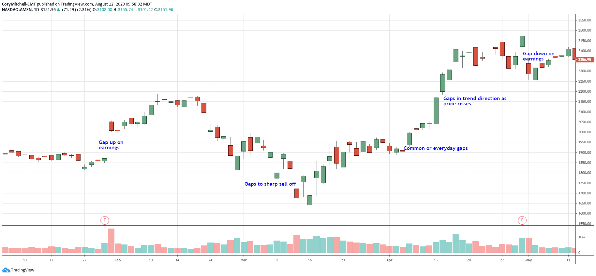

## Table of Contents

## What is a limit order?

A limit order is a type of order you can use when you want to buy or sell a stock at a specific price. For example, if you want to buy a stock but only if it's at $50 or less, you can set a limit order at $50. This means your order will only go through if the stock's price reaches $50 or lower. It's different from a market order, where you buy or sell the stock at whatever the current price is.

Using a limit order can be helpful because it gives you more control over the price you pay or receive. However, there's a downside: if the stock never reaches your limit price, your order won't be filled. So, you might miss out on buying or selling the stock if the price doesn't hit your limit. It's a good strategy if you're patient and have a clear price in mind.

## How does a limit order work?

A limit order is a way to buy or sell a stock at a specific price that you choose. Let's say you want to buy a stock, but you only want to pay $50 or less for it. You can set a limit order at $50. This means your order will only go through if the stock's price drops to $50 or lower. If the stock never reaches $50, your order won't be filled, and you won't buy the stock.

When you want to sell a stock, a limit order works the same way but in reverse. If you own a stock and you want to sell it, but only if you can get at least $60 for it, you can set a limit order at $60. Your order will only go through if someone is willing to buy the stock at $60 or more. If the stock's price never reaches $60, your order won't be filled, and you'll still own the stock. Limit orders give you control over the price, but you need to be patient because there's no guarantee your order will be filled.

## What is a price gap in trading?

A price gap in trading happens when a stock's price jumps from one price to another without any trading happening in between. Imagine you're looking at a chart of a stock's price. Normally, the price moves smoothly up and down. But sometimes, there's a big jump, like from $10 to $12, and there are no trades at $11. That jump is called a price gap.

Price gaps can happen for many reasons. Maybe there was big news about the company after the market closed, like a new product or a problem. Or maybe something important happened in the world that affects the stock. When the market opens the next day, the price might start at a different level than where it closed. Traders watch for these gaps because they can show big changes in how people feel about the stock.

## How can limit orders be affected by price gaps?

Limit orders can be affected by price gaps in a big way. If you set a limit order to buy a stock at $50, but there's a price gap and the stock opens at $55 the next day, your order won't be filled. This is because the stock never actually traded at $50. So, you miss out on buying the stock even though the price might have been close to what you wanted.

The same thing can happen when you want to sell a stock. Let's say you have a limit order to sell at $60, but a price gap makes the stock drop to $55 when the market opens. Your order won't be filled because the stock never reached $60. This means you're still holding onto the stock, even if you wanted to sell it at a higher price. Price gaps can make limit orders tricky because they depend on the stock reaching a specific price, which might not happen if there's a gap.

## What are the advantages of using limit orders?

Using limit orders gives you more control over the price you pay or receive for a stock. When you set a limit order, you decide the exact price at which you want to buy or sell. This means you can avoid buying a stock at a higher price than you want, or selling it for less than you think it's worth. It's like setting a rule for yourself that says, "I'll only buy this stock if it's $50 or less," or "I'll only sell if I can get $60 or more."

Limit orders can also help you plan your trades better. If you have a clear idea of the price you want, you can set your limit order and then wait. This way, you don't have to watch the stock's price all the time. It can be especially useful if you're busy or can't always check the market. Plus, if the stock reaches your limit price, your order will be filled automatically, so you don't have to worry about missing out on a good opportunity.

## What are the potential risks of limit orders during price gaps?

Limit orders can be risky during price gaps because your order might not get filled. If you set a limit order to buy a stock at $50, but the stock jumps to $55 because of a price gap, your order won't go through. This means you miss out on buying the stock even if you wanted it. The same thing can happen when you want to sell. If you set a limit order to sell at $60, but the stock drops to $55 overnight, your order won't be filled, and you'll still own the stock.

This can be frustrating because you might have had a good reason for setting your limit order at that price. You might miss out on a chance to buy a stock you really wanted or be stuck with a stock you wanted to sell. Price gaps can make limit orders tricky because they depend on the stock reaching your specific price, which might not happen if there's a gap. So, it's important to understand that using limit orders comes with the risk that your order might not be filled if there's a big jump in the stock's price.

## Can you explain the difference between a limit order and a market order in the context of price gaps?

A limit order and a market order work differently, especially when there are price gaps. A limit order is when you tell the stock market that you want to buy or sell a stock at a specific price. For example, you might say, "I want to buy this stock, but only if it's $50 or less." If the stock never reaches $50, your order won't go through. When there's a price gap, like the stock jumping from $45 to $55 overnight, your limit order at $50 won't be filled because the stock never actually traded at $50. So, you might miss out on buying or selling the stock.

On the other hand, a market order is when you tell the stock market to buy or sell a stock at whatever the current price is. If you place a market order to buy a stock and there's a price gap, your order will go through, but you might end up paying more than you expected. For example, if the stock was at $45 when you placed your order but jumped to $55 overnight, you'll buy it at $55. The same goes for selling: if you place a market order to sell and the stock drops from $60 to $55 overnight, you'll sell it at $55. Market orders guarantee that your order will be filled, but you might not get the price you wanted because of price gaps.

## How can traders use limit orders to manage price gaps effectively?

Traders can use limit orders to manage price gaps by setting their buy or sell orders at prices they are comfortable with. For example, if a trader wants to buy a stock but is worried about a price gap, they can set a limit order below the current price. This way, if the stock price jumps up overnight, the trader won't end up buying at a much higher price than they wanted. Similarly, if a trader wants to sell a stock and is concerned about a price gap, they can set a limit order above the current price. If the stock price drops overnight, the trader won't sell at a much lower price than they expected.

However, traders need to be aware that using limit orders during price gaps comes with the risk that their orders might not be filled. If the stock price gaps over the limit order price, the trader might miss out on the trade entirely. To manage this risk, traders can use a combination of limit orders and market orders. For instance, they might set a limit order at their ideal price but also place a market order to ensure they can buy or sell the stock if the price gaps beyond their limit. This way, they have a backup plan to handle unexpected price movements while still trying to get the best possible price.

## What strategies can be employed to minimize the risks associated with price gaps when using limit orders?

Traders can minimize the risks of price gaps when using limit orders by setting their orders at prices that give them some cushion. For example, if a trader wants to buy a stock and it's currently at $50, they might set their limit order at $48 instead of $50. This way, if the stock price jumps to $52 overnight, the trader still has a chance to buy it at $48 if it comes back down to that price. Similarly, if a trader wants to sell a stock at $60, they might set their limit order at $62. This gives them a bit of a buffer if the stock price drops suddenly.

Another strategy is to use a combination of limit orders and market orders. A trader can set a limit order at their ideal price but also place a market order as a backup. If the stock price gaps beyond the limit order, the market order will ensure the trade goes through, although at a possibly less favorable price. This way, the trader can still try to get the best price with the limit order but won't miss out on the trade entirely if there's a big price gap. By using both types of orders, traders can balance the need for a specific price with the need to execute the trade.

## How do different trading platforms handle limit orders during price gaps?

Different trading platforms might handle limit orders during price gaps a bit differently, but there are some common ways they do it. When there's a price gap, most platforms won't fill a limit order if the stock price jumps over the limit price without trading at that exact price. For example, if you set a limit order to buy a stock at $50 and the stock jumps from $45 to $55 overnight, your order won't be filled because the stock never traded at $50. Some platforms might have rules about how they handle these gaps, like not filling orders if the gap is too big.

However, some trading platforms might offer features to help with price gaps. For instance, they might let you set a "stop-limit" order, which combines a stop order with a limit order. If the stock price hits a certain "stop" price, it triggers the limit order. This can help you manage price gaps better because you can set the stop price to catch big jumps in the stock price. Still, it's important to understand how your specific trading platform works with limit orders during price gaps so you can use the right strategies to protect your trades.

## What historical examples illustrate the impact of price gaps on limit orders?

One famous example of price gaps affecting limit orders happened with the stock of Apple Inc. in 2012. After the company announced its quarterly earnings, the stock closed at around $600 per share. But the next day, when the market opened, the stock gapped up to around $615 because the earnings were better than expected. Traders who had set limit orders to buy Apple stock at $600 or less missed out on buying the stock because it never traded at that price. This shows how a price gap can make limit orders useless if the stock jumps over the limit price.

Another example is what happened with the stock of Tesla Inc. in 2020. The stock closed at around $1,000 per share one day, but the next day it gapped down to around $900 due to negative news about the company. Traders who had set limit orders to sell Tesla stock at $1,000 or more were stuck with their shares because the stock never reached that price. These examples show that price gaps can be a big problem for traders using limit orders. They need to be careful and think about how to handle these gaps to avoid missing out on trades or getting stuck with stocks they wanted to sell.

## How might advanced algorithms predict and mitigate the effects of price gaps on limit orders?

Advanced algorithms can help predict and mitigate the effects of price gaps on limit orders by analyzing lots of data to spot patterns and trends. These algorithms look at things like past price movements, news events, and even social media to figure out when a price gap might happen. For example, if there's a big news event coming up that could affect a stock's price, the algorithm might predict a gap and suggest setting limit orders at different prices to increase the chance of the order being filled. By using this data, the algorithms can give traders a heads-up about potential price gaps, helping them adjust their limit orders in time.

To mitigate the effects of price gaps, these algorithms can also suggest using different types of orders. For instance, they might recommend using a stop-limit order, which combines a stop order with a limit order. If the stock price hits a certain "stop" price, it triggers the limit order, which can help catch big jumps in the stock price. The algorithm can also suggest setting multiple limit orders at different price levels as a safety net. This way, if a price gap happens, at least one of the orders might get filled. By using these strategies, traders can better manage the risks of price gaps and increase their chances of getting the trades they want.

## References & Further Reading

[1]: Bouchaud, J.P., & Potters, M. (2003). ["Theory of Financial Risk and Derivative Pricing: From Statistical Physics to Risk Management."](https://www.cambridge.org/core/books/theory-of-financial-risk-and-derivative-pricing/5BBBA04CE72ED9E5E7C1C028D9A94FCB) Cambridge University Press.

[2]: Aldridge, I. (2013). ["High-Frequency Trading: A Practical Guide to Algorithmic Strategies and Trading Systems."](https://www.wiley.com/en-us/High+Frequency+Trading%3A+A+Practical+Guide+to+Algorithmic+Strategies+and+Trading+Systems%2C+2nd+Edition-p-9781118343500) Wiley.

[3]: Engle, R.F. (2000). ["The Econometrics of Ultra-High-Frequency Data."](https://www.jstor.org/stable/2999473) Econometrica, 68(1), 1-22.

[4]: Narang, R.K. (2013). ["Inside the Black Box: A Simple Guide to Quantitative and High-Frequency Trading."](https://onlinelibrary.wiley.com/doi/book/10.1002/9781118662717) Wiley.

[5]: O'Hara, M. (2015). ["High Frequency Market Microstructure."](https://www.sciencedirect.com/science/article/pii/S0304405X15000045) Journal of Financial Economics, 56(1), 1-30.

[6]: Harris, L. (2003). ["Trading and Exchanges: Market Microstructure for Practitioners."](https://academic.oup.com/book/52292) Oxford University Press.