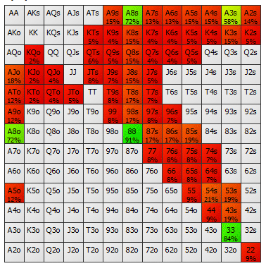

## Table of Contents

## What is a limit price in betting?

A limit price in betting is the highest amount of money you are willing to pay for a bet. When you set a limit price, you are telling the betting exchange that you will only accept the bet if the price is at or below your limit. This helps you control how much you spend and avoid paying more than you want for a bet.

For example, if you want to bet on a horse to win and you think the fair price is $5, you can set your limit price at $5. If someone else is willing to offer the bet at $5 or less, your bet will be matched. If the price goes above $5, your bet will not be matched until the price comes back down to $5 or lower. This way, you can stick to your budget and betting strategy.

## How does setting a limit price affect my betting strategy?

Setting a limit price helps you stick to your betting strategy by making sure you don't pay more than you think a bet is worth. When you decide on a limit price, you are saying, "I will only bet if the price is this good or better." This can help you avoid making bets when the odds are not in your favor, which can save you money and keep your betting under control.

Using a limit price also lets you be more patient with your bets. Instead of rushing to place a bet at a higher price, you can wait for the price to come down to your limit. This way, you can get the best value for your money and increase your chances of making a profit over time. By setting and sticking to limit prices, you can make smarter betting choices and manage your betting budget more effectively.

## Can you explain the difference between a limit price and a market price in betting?

A limit price in betting is the most you are willing to pay for a bet. When you set a limit price, you are telling the betting exchange that you only want to bet if the price is at or below your limit. This helps you control your spending and make sure you only bet when the price is right for you. For example, if you think a bet is worth $5, you can set your limit price at $5 and wait for someone to offer the bet at that price or lower.

A market price, on the other hand, is the current price at which a bet can be made right now. It is the price that people are willing to bet on at that moment. The market price can change quickly based on how many people want to bet and what they think the outcome will be. If you bet at the market price, you are taking the bet at whatever the current price is, without waiting for a better deal. So, the main difference is that a limit price lets you set your own price and wait, while a market price is what you get if you want to bet right away.

## What are the advantages of using limit prices when placing bets?

Using limit prices when placing bets helps you control how much you spend. When you set a limit price, you decide the most you are willing to pay for a bet. This means you won't accidentally spend more than you want. It's like setting a budget for each bet, which can help you manage your money better and avoid betting more than you can afford.

Another advantage of using limit prices is that it lets you wait for the best deal. Instead of betting right away at the current market price, you can set a limit price and wait for the price to come down to your level. This can help you get better odds and increase your chances of making a profit. By being patient and sticking to your limit prices, you can make smarter betting choices and improve your overall betting strategy.

## How do limit prices help in managing risk in bet sizing?

Limit prices help manage risk in bet sizing by letting you set a maximum amount you're willing to pay for a bet. This means you can control how much money you put into each bet, which is important for managing your overall betting budget. If you think a bet is only worth a certain amount, setting a limit price makes sure you don't spend more than that. This way, you can avoid big losses and keep your betting under control.

Using limit prices also helps you be more patient with your bets. Instead of rushing to bet at a higher price, you can wait for the price to drop to your limit. This can lower your risk because you're only betting when the odds are in your favor. By sticking to your limit prices, you can make smarter decisions about how much to bet and when, which helps you manage risk better and increase your chances of winning over time.

## What are some common mistakes beginners make when setting limit prices?

Beginners often set limit prices that are too high because they are too eager to make a bet. They might think a bet is worth more than it really is, so they set a high limit price. This can lead to them betting more money than they should, which can be risky. It's important for beginners to do their research and understand the true value of a bet before setting a limit price.

Another common mistake is not being patient enough. Beginners might get impatient and lower their limit price too quickly if the bet isn't matched right away. This can mean they end up betting at a worse price than they planned. It's better to stick to your limit price and wait for the right deal, even if it takes a bit longer. Patience can help you get better odds and manage your betting money more wisely.

## How can understanding odds and probabilities improve the effectiveness of limit prices?

Understanding odds and probabilities helps you set better limit prices because you know what a bet is really worth. Odds tell you how likely something is to happen, and they also show how much you can win. If you know the odds, you can figure out if a bet is a good deal or not. For example, if you think a bet has a 50% chance of winning and the odds are 2 to 1, you might set a limit price that reflects that value. By understanding these numbers, you can make sure your limit price is fair and gives you the best chance to win money.

Using odds and probabilities also helps you be more patient when setting limit prices. If you know the true value of a bet, you won't rush to bet at a higher price just because you want to place a bet quickly. Instead, you'll wait for the price to drop to your limit, knowing that you're getting a good deal. This patience can lead to better betting decisions and more wins over time. By combining your knowledge of odds and probabilities with smart limit prices, you can improve your betting strategy and manage your money more effectively.

## What role do limit prices play in different betting markets, such as sports and financial betting?

In sports betting, limit prices help you control how much you spend on each bet. For example, if you think a team has a good chance of winning but you only want to bet if the odds are at least 2 to 1, you can set a limit price at that level. This way, you won't bet unless the price is right for you. It also helps you be patient and wait for the best deal instead of rushing to bet at a higher price. By using limit prices, you can stick to your betting strategy and manage your money better in sports betting.

In financial betting, limit prices are also important for managing your bets. Financial markets can change quickly, so setting a limit price helps you decide the most you're willing to pay for a bet on something like stock prices or currency exchange rates. For example, if you think a stock will go up and you want to bet on it, you can set a limit price to make sure you only bet if the price is good enough. This can help you avoid big losses and make smarter betting choices in the fast-moving world of financial betting.

## How can advanced bettors use limit prices to exploit market inefficiencies?

Advanced bettors can use limit prices to take advantage of market inefficiencies by setting their bets at prices that are better than what the market currently offers. For example, if they think a bet is undervalued and the market price is too low, they can set a limit price higher than the market price. This way, they can wait for the market to correct itself and match their bet at a better price. By doing this, they can get more value out of their bets and increase their chances of making a profit.

Using limit prices also helps advanced bettors exploit short-term price movements. If they see a bet that they think will become more valuable soon, they can set a limit price and wait for the market to move in their favor. This strategy requires patience and a good understanding of how betting markets work, but it can lead to big wins. By carefully setting and sticking to their limit prices, advanced bettors can find and take advantage of opportunities that others might miss.

## What software tools are available to help manage and optimize limit prices in betting?

There are several software tools that can help you manage and optimize limit prices in betting. One popular tool is Betfair's Bet Angel, which lets you set and track your limit prices easily. It has features that help you keep an eye on the market and make quick changes to your bets if needed. Another tool is the Betfair Trading Software, which gives you detailed information about the market and helps you find the best limit prices for your bets.

These tools also offer features like automated betting, where you can set your limit prices and let the software place the bets for you when the market reaches your price. This can save you time and help you stick to your betting strategy. By using these tools, you can make better decisions about your limit prices and increase your chances of winning money in betting.

## How do limit prices interact with other betting strategies like Kelly Criterion?

Limit prices and the Kelly Criterion can work together to help you bet smarter. The Kelly Criterion is a way to figure out how much money to bet based on how likely you are to win and how much you can win. It tells you the best amount to bet to grow your money the fastest without taking too much risk. When you use limit prices with the Kelly Criterion, you can set the highest price you're willing to pay for a bet, and then use the Kelly Criterion to decide how much to bet at that price. This way, you make sure you're only betting when the price is good and you're betting the right amount to keep growing your money safely.

Using limit prices with the Kelly Criterion also helps you be more patient and stick to your betting plan. If you know the best price to bet at and how much to bet, you can wait for the market to reach your limit price. This can help you avoid betting at a bad price just because you want to bet quickly. By combining these two strategies, you can control how much you spend, wait for the best deals, and make the most of your betting money over time.

## Can you discuss case studies where limit prices significantly impacted betting outcomes?

In one case, a bettor used limit prices to make money on a soccer match. The bettor thought that Team A had a good chance to win, but the market price was too high. So, the bettor set a limit price lower than the market price and waited. After a while, the market price dropped to the bettor's limit price, and the bet was matched. Team A won the match, and the bettor made a big profit because they got a better price than most other bettors. This shows how using limit prices can help you wait for the right deal and make more money.

Another case was in horse racing, where a bettor used limit prices to avoid a big loss. The bettor thought Horse B was a good bet but only at a certain price. They set a limit price and waited. The market price kept going up, but the bettor did not change their limit price. The race happened, and Horse B did not win. Because the bettor stuck to their limit price, they did not bet at a higher price and saved their money. This case shows how limit prices can help you control your spending and avoid betting when the odds are not in your favor.

## What is the Role of Limit Prices in Bet Sizing Strategies?

Limit prices significantly impact how much capital a trader is willing to risk in a single trade. By setting a predetermined maximum or minimum price for executing trades, traders can better control their exposure to adverse market conditions. This approach is essential in managing potential losses and ensuring traders do not overcommit their capital.

Different bet sizing strategies integrate limit prices to optimize risk management. The Fixed Fractional method, for example, allocates a fixed percentage of capital to each trade. This strategy inherently incorporates limit prices by limiting the investment in any position, maintaining a balance between growth potential and risk exposure. The formula for determining the trade size in a Fixed Fractional strategy can be expressed as:

$$
\text{Trade Size} = \text{Account Equity} \times \text{Fraction}
$$

Here, "Fraction" refers to the fixed percentage of the account equity allocated per trade.

The Kelly Criterion, another popular strategy, uses mathematical models to determine the optimal size of a series of bets. This criterion considers both the probability of winning and the potential payout, adjusting the trade size to maximize geometric growth of capital over the long term. The integration of limit prices in the Kelly Criterion involves using them to estimate the payoff and thus influence the proportion of capital placed at risk. The basic formula for the Kelly Criterion is:

$$
f^* = \frac{bp - q}{b}
$$

Where:
- $f^*$ is the fraction of the capital to wager,
- $b$ is the ratio of the net odds received on the wager,
- $p$ is the probability of winning,
- $q$ is the probability of losing (i.e., $1 - p$).

A well-defined limit price helps manage the variability in returns anticipated by the Kelly Criterion, thereby reducing the risk of significant losses due to unexpected price fluctuations.

Setting accurate limit prices can effectively function as a safeguard against adverse market movements, defining a threshold for what level of trade risk is acceptable. These strategies ensure that regardless of market [volatility](/wiki/volatility-trading-strategies), the trades executed remain within the predefined risk parameters, allowing traders to avoid significant losses and maintain a stable growth trajectory. Understanding and integrating limit prices into bet sizing strategies enable algorithmic traders to enhance their strategy performance and risk management, crucial for sustainability in dynamic financial markets.

## How can limit prices be integrated with different bet sizing strategies?

In [algorithmic trading](/wiki/algorithmic-trading), integrating limit prices with various bet sizing strategies is essential for automating risk management and optimizing trade execution. Different bet sizing strategies, such as Fixed Ratio and Martingale, interact with limit prices to adjust trade sizes effectively, each offering unique advantages for traders aiming to manage risk and maximize returns.

Fixed Ratio bet sizing involves adjusting the size of trades based on the trader's capital growth. With this strategy, limit prices determine the entry and [exit](/wiki/exit-strategy) points for trades, ensuring that the trader does not exceed predetermined risk thresholds. By integrating limit prices with Fixed Ratio sizing, traders maintain discipline in their capital allocation, balancing potential profits with acceptable risk.

Conversely, the Martingale strategy doubles the trade size following a loss, aiming to recover previous losses and gain profits when a win occurs. When integrated with limit prices, the Martingale approach can help contain potential losses by ensuring that trades are executed only within acceptable price ranges. However, due to its inherently higher risk, Martingale requires careful consideration of market conditions and volatility.

Algo trading platforms have the capability to automate these strategies, facilitating consistent application and execution. For instance, the Fixed Fractional method, which involves dedicating a specific percentage of the trading account to each trade, can be automated to align with limit prices. This ensures trades are conducted within defined risk parameters while adjusting trade sizes based on changes in account equity.

The Kelly Criterion offers another sophisticated approach by dynamically adjusting trade size based on the expected return and the probability of winning. When integrated with limit prices, the Kelly Criterion calculates the optimal fraction of capital to invest in each trade. The formula for the Kelly Criterion is:

$$
f^* = \frac{bp - q}{b}
$$

where $f^*$ is the optimal fraction of the account to wager, $b$ is the odds received on the wager, $p$ is the probability of winning, and $q = 1 - p$ is the probability of losing. In practice, this strategy helps traders allocate the right amount of capital to each trade, maximizing growth while controlling risk within the constraints set by limit prices.

To illustrate how these strategies can be codified for automation, consider a Python snippet for Fixed Fractional sizing:

```python
def fixed_fractional_sizing(account_balance, fraction, entry_price, limit_price):
    risk_amount = account_balance * fraction
    trade_size = risk_amount / (entry_price - limit_price)
    return trade_size

# Example Usage
account_balance = 10000  # Example account balance
fraction = 0.02  # Example 2% risk per trade
entry_price = 50  # Entry price of the asset
limit_price = 49  # Limit price for risk calculation

trade_size = fixed_fractional_sizing(account_balance, fraction, entry_price, limit_price)
print(f"Trade size: {trade_size}")
```

By automating these strategies, algo trading platforms enable traders to consistently apply risk management rules, adapting trade sizes to align with market signals and predefined limits. This capability ensures disciplined execution and enhances the overall efficiency and effectiveness of trading operations.

## References & Further Reading

[1]: Bergstra, J., Bardenet, R., Bengio, Y., & Kégl, B. (2011). ["Algorithms for Hyper-Parameter Optimization."](https://proceedings.neurips.cc/paper/2011/file/86e8f7ab32cfd12577bc2619bc635690-Paper.pdf) Advances in Neural Information Processing Systems 24.

[2]: ["Advances in Financial Machine Learning"](https://www.amazon.com/Advances-Financial-Machine-Learning-Marcos/dp/1119482089) by Marcos Lopez de Prado

[3]: ["Evidence-Based Technical Analysis: Applying the Scientific Method and Statistical Inference to Trading Signals"](https://www.amazon.com/Evidence-Based-Technical-Analysis-Scientific-Statistical/dp/0470008741) by David Aronson

[4]: ["Machine Learning for Algorithmic Trading"](https://github.com/stefan-jansen/machine-learning-for-trading) by Stefan Jansen

[5]: ["Quantitative Trading: How to Build Your Own Algorithmic Trading Business"](https://books.google.com/books/about/Quantitative_Trading.html?id=j70yEAAAQBAJ) by Ernest P. Chan