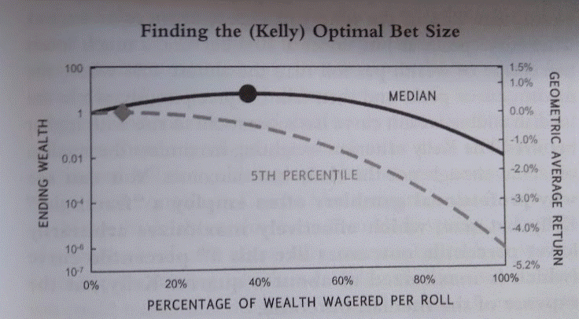

Algorithmic trading has become a transformative force in financial markets due to its capacity for efficiency and systematic execution. This type of trading employs complex algorithms to execute orders based on predetermined criteria, minimizing human intervention and maximizing consistency. A cornerstone of successful algorithmic trading is risk management, wherein traders must deftly balance potential rewards against possible losses. Two critical components in achieving this balance are bet sizing and limit pricing, which work in tandem to manage risk while capitalizing on market opportunities.

Bet sizing determines how much capital is allocated to a particular trade, a decision that directly impacts the potential gain or loss from the trade. Limit pricing, meanwhile, involves setting a specific price at which an order is to be executed, thus capping the trade execution price and offering protection against adverse price movements. Understanding how limit prices influence bet sizing decisions is fundamental for optimizing trade execution and enhancing both performance and risk management.



By comprehensively analyzing the intricacies of limit pricing and its effect on bet sizing strategies within algorithmic trading, traders can refine their strategic approaches. This article aims to provide insights into various bet sizing strategies and explore how they integrate with limit pricing to achieve optimal trading results. Through this understanding, traders can refine their strategies, improve performance, and enhance risk management capabilities, ultimately leading to more disciplined and successful trading operations.

## Table of Contents

## Understanding Limit Prices and Bet Sizing

Limit prices are a fundamental tool in [algorithmic trading](/wiki/algorithmic-trading), defining the maximum price at which a trader is willing to buy an asset or the minimum price at which they are prepared to sell. By setting a limit price, traders can prevent their orders from executing at unfavorable prices, thereby helping manage investment risk. For example, if a trader sets a buy limit order at $50, the trade will only be executed if the price falls to $50 or below, securing a potentially advantageous entry point.

Bet sizing, on the other hand, involves allocating a specific amount of capital to a trade while aiming to balance potential returns with associated risks. It is an essential risk management strategy that influences the trader's exposure to market [volatility](/wiki/volatility-trading-strategies). Effective bet sizing strategies can significantly impact a portfolio's performance, as overly large positions can lead to dramatic losses, while too-conservative allocations may result in missed opportunities.

In algorithmic trading, the automation of these processes is critical. Algorithms can systematically define limit prices and bet sizes, enabling consistent execution that adheres to pre-set risk parameters. This automation minimizes emotional decision-making, which can cloud judgment in high-pressure market environments. By using specified rules and historical data, trading systems ensure that executions are not only disciplined but also optimized for the trader's risk tolerance and market strategy.

The interplay between limit prices and bet sizing is crucial for crafting sophisticated trading algorithms. Limit prices directly influence the potential risk and return of trades, while bet sizing determines how much capital is put at risk. Together, these elements help traders design strategies that are robust across various market scenarios. By understanding these concepts, algorithmic traders can better anticipate market movements, setting the stage for informed decision-making and improved trading outcomes.

## The Role of Limit Prices in Bet Sizing Strategies

Limit prices significantly impact how much capital a trader is willing to risk in a single trade. By setting a predetermined maximum or minimum price for executing trades, traders can better control their exposure to adverse market conditions. This approach is essential in managing potential losses and ensuring traders do not overcommit their capital.

Different bet sizing strategies integrate limit prices to optimize risk management. The Fixed Fractional method, for example, allocates a fixed percentage of capital to each trade. This strategy inherently incorporates limit prices by limiting the investment in any position, maintaining a balance between growth potential and risk exposure. The formula for determining the trade size in a Fixed Fractional strategy can be expressed as:

$$
\text{Trade Size} = \text{Account Equity} \times \text{Fraction}
$$

Here, "Fraction" refers to the fixed percentage of the account equity allocated per trade.

The Kelly Criterion, another popular strategy, uses mathematical models to determine the optimal size of a series of bets. This criterion considers both the probability of winning and the potential payout, adjusting the trade size to maximize geometric growth of capital over the long term. The integration of limit prices in the Kelly Criterion involves using them to estimate the payoff and thus influence the proportion of capital placed at risk. The basic formula for the Kelly Criterion is:

$$
f^* = \frac{bp - q}{b}
$$

Where:
- $f^*$ is the fraction of the capital to wager,
- $b$ is the ratio of the net odds received on the wager,
- $p$ is the probability of winning,
- $q$ is the probability of losing (i.e., $1 - p$).

A well-defined limit price helps manage the variability in returns anticipated by the Kelly Criterion, thereby reducing the risk of significant losses due to unexpected price fluctuations.

Setting accurate limit prices can effectively function as a safeguard against adverse market movements, defining a threshold for what level of trade risk is acceptable. These strategies ensure that regardless of market volatility, the trades executed remain within the predefined risk parameters, allowing traders to avoid significant losses and maintain a stable growth trajectory. Understanding and integrating limit prices into bet sizing strategies enable algorithmic traders to enhance their strategy performance and risk management, crucial for sustainability in dynamic financial markets.

## Integrating Limit Prices with Different Bet Sizing Strategies

In algorithmic trading, integrating limit prices with various bet sizing strategies is essential for automating risk management and optimizing trade execution. Different bet sizing strategies, such as Fixed Ratio and Martingale, interact with limit prices to adjust trade sizes effectively, each offering unique advantages for traders aiming to manage risk and maximize returns.

Fixed Ratio bet sizing involves adjusting the size of trades based on the trader's capital growth. With this strategy, limit prices determine the entry and [exit](/wiki/exit-strategy) points for trades, ensuring that the trader does not exceed predetermined risk thresholds. By integrating limit prices with Fixed Ratio sizing, traders maintain discipline in their capital allocation, balancing potential profits with acceptable risk.

Conversely, the Martingale strategy doubles the trade size following a loss, aiming to recover previous losses and gain profits when a win occurs. When integrated with limit prices, the Martingale approach can help contain potential losses by ensuring that trades are executed only within acceptable price ranges. However, due to its inherently higher risk, Martingale requires careful consideration of market conditions and volatility.

Algo trading platforms have the capability to automate these strategies, facilitating consistent application and execution. For instance, the Fixed Fractional method, which involves dedicating a specific percentage of the trading account to each trade, can be automated to align with limit prices. This ensures trades are conducted within defined risk parameters while adjusting trade sizes based on changes in account equity.

The Kelly Criterion offers another sophisticated approach by dynamically adjusting trade size based on the expected return and the probability of winning. When integrated with limit prices, the Kelly Criterion calculates the optimal fraction of capital to invest in each trade. The formula for the Kelly Criterion is:

$$
f^* = \frac{bp - q}{b}
$$

where $f^*$ is the optimal fraction of the account to wager, $b$ is the odds received on the wager, $p$ is the probability of winning, and $q = 1 - p$ is the probability of losing. In practice, this strategy helps traders allocate the right amount of capital to each trade, maximizing growth while controlling risk within the constraints set by limit prices.

To illustrate how these strategies can be codified for automation, consider a Python snippet for Fixed Fractional sizing:

```python
def fixed_fractional_sizing(account_balance, fraction, entry_price, limit_price):
    risk_amount = account_balance * fraction
    trade_size = risk_amount / (entry_price - limit_price)
    return trade_size

# Example Usage
account_balance = 10000  # Example account balance
fraction = 0.02  # Example 2% risk per trade
entry_price = 50  # Entry price of the asset
limit_price = 49  # Limit price for risk calculation

trade_size = fixed_fractional_sizing(account_balance, fraction, entry_price, limit_price)
print(f"Trade size: {trade_size}")
```

By automating these strategies, algo trading platforms enable traders to consistently apply risk management rules, adapting trade sizes to align with market signals and predefined limits. This capability ensures disciplined execution and enhances the overall efficiency and effectiveness of trading operations.

## Impact of Market Conditions on Limit Prices and Bet Sizing

Market conditions significantly affect the effectiveness of limit prices and bet sizing in algorithmic trading. Volatility and [liquidity](/wiki/liquidity-risk-premium) are two primary factors influencing these components. 

**Volatility**, which measures the price variation of an asset, can lead to wider market swings that affect the execution of limit orders. High volatility may increase the likelihood of limit orders being hit as prices fluctuate more substantially. Consequently, traders may adjust their limit prices to either capture additional upside potential or protect against downside risks during volatile periods. Moreover, in times of high volatility, traders might adopt more conservative bet sizing strategies to mitigate risk exposure. For example, using a risk management strategy like the Fixed Fractional approach, a trader may reduce the percentage of capital allocated per trade in response to increasing volatility.

**Liquidity**, the availability of an asset to be bought or sold without causing a significant price change, also impacts limit price execution and bet sizing. In liquid markets, tighter bid-ask spreads facilitate the efficient execution of limit orders at desired prices. Conversely, in illiquid markets, wider spreads may necessitate more aggressive limit prices to ensure execution, potentially leading to adverse price impacts. Traders may opt for larger bet sizes in highly liquid markets due to the lower execution risk. 

To address these dynamics, algorithmic trading platforms integrate real-time data and analytics to adjust limit prices and bet sizes automatically, mitigating the risks associated with changing market conditions. These platforms typically use historical and real-time market data to compute metrics such as the Average True Range (ATR) for volatility and the bid-ask spread for liquidity. Algorithms can then adapt by applying these metrics to dynamically adjust limit prices and position sizes in accordance with predefined risk management rules.

For example, a simplified Python snippet for adjusting trade size based on volatility might look like this:

```python
def calculate_trade_size(account_equity, risk_per_trade, atr, atr_threshold=0.01):
    if atr < atr_threshold:
        return (account_equity * risk_per_trade) / atr
    else:
        return account_equity * (risk_per_trade / atr_threshold)

# Example usage
account_equity = 100000  # Account balance
risk_per_trade = 0.02    # 2% risk per trade
atr = 0.005              # Current ATR value

trade_size = calculate_trade_size(account_equity, risk_per_trade, atr)
print(f"Adjusted Trade Size: {trade_size}")
```

This function adjusts the trade size based on current volatility (ATR), ensuring that the trade remains within the trader's risk tolerance despite fluctuating market conditions. By leveraging such techniques, algo trading platforms help traders maintain optimal trade sizing, enhance strategy efficiency, and manage risk effectively.

## Conclusion

Limit prices and bet sizing are integral to successful algorithmic trading, impacting both risk management and strategy performance. Effective use of these components requires automation, which enables traders to achieve consistent and disciplined execution aligned with their strategic objectives. 

Automating the processes of limit pricing and bet sizing allows for precision and speed, minimizing human error and emotional bias that can disrupt trading decisions. Advanced trading platforms are equipped with the tools and capabilities to integrate limit prices with various bet sizing strategies, such as the Fixed Fractional method or the Kelly Criterion. These platforms analyze market conditions in real-time, adjusting limit prices and trade sizes to optimize the strategy's effectiveness.

Moreover, the synergy between limit prices and bet sizing can significantly enhance trading operations. This integration allows traders to maintain clear thresholds for trade execution, ensuring that each trade is conducted within acceptable risk parameters. By systematically managing capital allocation, traders can better navigate market volatility and liquidity fluctuations, thus maximizing potential returns while mitigating risks.

Continual assessment and refinement of these strategies are essential to adapt to ever-changing market environments. As market conditions evolve, traders must reevaluate their approach to ensure optimal performance. This ongoing process includes analyzing historical data, forecasting future trends, and implementing changes to trading algorithms as needed. By staying current with technological advancements and market dynamics, traders can maintain a competitive edge, ultimately leading to improved trading outcomes.

## References & Further Reading

[1]: Bergstra, J., Bardenet, R., Bengio, Y., & Kégl, B. (2011). ["Algorithms for Hyper-Parameter Optimization."](https://proceedings.neurips.cc/paper/2011/file/86e8f7ab32cfd12577bc2619bc635690-Paper.pdf) Advances in Neural Information Processing Systems 24.

[2]: ["Advances in Financial Machine Learning"](https://www.amazon.com/Advances-Financial-Machine-Learning-Marcos/dp/1119482089) by Marcos Lopez de Prado

[3]: ["Evidence-Based Technical Analysis: Applying the Scientific Method and Statistical Inference to Trading Signals"](https://www.amazon.com/Evidence-Based-Technical-Analysis-Scientific-Statistical/dp/0470008741) by David Aronson

[4]: ["Machine Learning for Algorithmic Trading"](https://github.com/stefan-jansen/machine-learning-for-trading) by Stefan Jansen

[5]: ["Quantitative Trading: How to Build Your Own Algorithmic Trading Business"](https://books.google.com/books/about/Quantitative_Trading.html?id=j70yEAAAQBAJ) by Ernest P. Chan