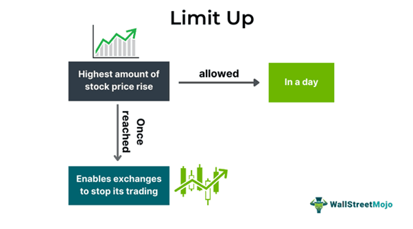

## Table of Contents

## What is the basic definition of 'Limit Up'?

Limit Up is a term used in trading, especially in futures markets. It means the price of a security or commodity has reached the maximum amount it is allowed to increase in one trading day. This maximum amount is set by the exchange where the security or commodity is traded. When a price hits the limit up, no more trading can happen at higher prices until the next trading day.

This rule helps to control big price swings and protect traders from sudden, large losses. It gives everyone time to think and decide what to do next. If a price keeps hitting the limit up for several days, the exchange might change the limit to let trading continue more smoothly.

## How does 'Limit Up' function in financial markets?

In financial markets, 'Limit Up' is a rule that stops the price of something from going up too much in one day. Imagine you're trading wheat futures, and the price can only go up by $1 per day. If the price reaches that $1 increase, it's at the 'Limit Up'. No one can buy or sell at a higher price until the next day. This rule is set by the place where you're trading, like the Chicago Mercantile Exchange. It's there to keep the market calm and stop prices from jumping around too wildly.

When a price hits the 'Limit Up', it means the market is really excited about that thing, and everyone wants to buy it. But this rule gives everyone a break. It stops the price from going even higher right away, which can be good because it gives traders time to think. If the price keeps hitting the 'Limit Up' for a few days, the exchange might decide to change the limit. They might make it higher so trading can keep going without stopping every day. This helps the market work better and keeps things fair for everyone trading.

## Can you provide a simple example of 'Limit Up' in action?

Imagine you're trading corn on a futures exchange, and the exchange has set a 'Limit Up' of $0.20 per bushel for the day. This means the price of corn can't go up more than $0.20 in one trading day. Let's say corn starts the day at $5.00 per bushel. As more and more people want to buy corn, the price starts to rise. By the end of the day, the price reaches $5.20 per bushel. At this point, the price can't go any higher because it has hit the 'Limit Up'. No one can buy or sell corn at a price above $5.20 until the next trading day.

If the next day, everyone still wants to buy corn and the price goes up again, it might hit the 'Limit Up' again. Let's say it starts at $5.20 and goes up to $5.40. The price can't go any higher that day. If this keeps happening for several days, the exchange might decide to change the 'Limit Up' to a higher amount, like $0.30, so trading can continue without stopping every day. This helps keep the market running smoothly and gives everyone a fair chance to trade.

## What are the common reasons for a stock to hit its 'Limit Up'?

A stock might hit its 'Limit Up' because a lot of people suddenly want to buy it. This can happen if the company announces good news, like better-than-expected earnings or a new product that everyone is excited about. It can also happen if something big happens in the world that makes people think the stock will do well, like a new law that helps the company's business.

Another reason is when the overall market is doing really well, and everyone is buying stocks. This can push the price of a stock up quickly until it hits the 'Limit Up'. Sometimes, it's because of rumors or speculation that the stock will go up in the future, making people rush to buy it now before the price gets even higher.

## How does 'Limit Up' affect trading and liquidity?

When a stock hits its 'Limit Up', it can stop trading for that day. This means no one can buy or sell the stock at a higher price until the next day. This can make it hard for traders who want to buy more of the stock or sell what they have. They have to wait until the next day to trade again. This can make the market feel less liquid because fewer people can trade the stock at the price they want.

On the other hand, 'Limit Up' can help keep the market calm. If the price of a stock goes up too fast, it might make people panic and start trading in a crazy way. By setting a 'Limit Up', the exchange helps keep the market stable. This can actually help with [liquidity](/wiki/liquidity-risk-premium) over time because it stops big price jumps that might scare people away from trading. So, while it might make trading harder on the day it happens, it can make the market more liquid and stable in the long run.

## What are the differences between 'Limit Up' and 'Limit Down'?

'Limit Up' and 'Limit Down' are rules that stop the price of something from moving too much in one day. 'Limit Up' is when the price can't go any higher. It's like a ceiling that stops the price from going up too fast. This happens when a lot of people want to buy something, and the price keeps going up until it hits this limit. On the other hand, 'Limit Down' is when the price can't go any lower. It's like a floor that stops the price from falling too fast. This happens when a lot of people want to sell something, and the price keeps going down until it hits this limit.

Both 'Limit Up' and 'Limit Down' are set by the place where you're trading, like a stock exchange. They help keep the market calm and stop big price swings that can scare people. When a price hits 'Limit Up' or 'Limit Down', it means no one can trade at a higher or lower price until the next day. This gives everyone time to think and decide what to do next. If the price keeps hitting these limits for several days, the exchange might change the limits to let trading continue more smoothly.

## How do regulatory bodies set the 'Limit Up' thresholds?

Regulatory bodies like stock exchanges set the 'Limit Up' thresholds to keep the market stable. They look at things like how much the price of a stock usually moves, the average trading [volume](/wiki/volume-trading-strategy), and what's happening in the market overall. They might also think about the kind of stock or commodity they're setting the limit for. For example, a stock that usually moves a lot might have a higher 'Limit Up' than a stock that doesn't move much.

These thresholds can change over time. If a stock keeps hitting its 'Limit Up' every day, the exchange might decide to raise the limit. This helps trading keep going without stopping all the time. The goal is to make sure the market works smoothly and everyone can trade fairly. By setting these limits, regulatory bodies help prevent big price swings that can scare people and make the market less stable.

## What impact does 'Limit Up' have on market volatility?

When a stock hits its 'Limit Up', it can help lower market [volatility](/wiki/volatility-trading-strategies). Volatility means how much the price of a stock goes up and down. If a stock's price goes up too fast, it can make people nervous and cause them to trade in a wild way. By setting a 'Limit Up', the exchange stops the price from going up too much in one day. This gives everyone a break and helps keep the market calm. It's like putting a speed limit on the price, so it doesn't go too fast and cause problems.

However, on the day a stock hits its 'Limit Up', it might actually increase volatility a bit. This is because when the price can't go any higher, it stops trading at that level. Traders who want to buy more or sell what they have can't do it at the price they want. This can make the market feel tense because people have to wait until the next day to trade again. But over time, the 'Limit Up' rule helps keep the market more stable and less volatile by preventing big price jumps that can scare people away from trading.

## How do traders and investors typically react to a 'Limit Up' scenario?

When a stock hits its 'Limit Up', traders and investors often feel excited because it means the stock's price has gone up a lot in one day. They might see it as a good sign and want to buy more of the stock. But they can't buy at a higher price until the next day, so they have to wait. Some might decide to buy as much as they can at the 'Limit Up' price before the market closes. Others might hold off and wait to see what happens the next day, hoping the price will keep going up.

On the other hand, some traders and investors might feel worried when a stock hits its 'Limit Up'. They might think the price has gone up too fast and could fall back down. If they already own the stock, they might want to sell it to lock in their profits before the price drops. But they can't sell at a higher price until the next day, so they have to decide whether to sell at the 'Limit Up' price or wait. This can make the market feel tense because people have to make quick decisions with limited options.

## Are there strategies to trade effectively around 'Limit Up' situations?

When a stock hits its 'Limit Up', traders can use different strategies to trade effectively. One way is to buy the stock right before it hits the 'Limit Up'. If you think the stock will keep going up the next day, you can buy it at the 'Limit Up' price and hope to sell it for a higher price later. Another strategy is to wait and see what happens the next day. If the stock keeps going up, you can buy it then. But if you think the price might go down after hitting the 'Limit Up', you might want to wait and see if you can buy it cheaper later.

Another approach is to sell the stock if you already own it and it hits the 'Limit Up'. If you think the price has gone up too fast and might fall back down, you can sell at the 'Limit Up' price to lock in your profits. Some traders might also use options to trade around 'Limit Up' situations. For example, you could buy call options if you think the stock will keep going up after hitting the 'Limit Up'. This can be a way to make money if the stock keeps going up without having to buy the stock itself.

## How does 'Limit Up' vary across different exchanges and markets globally?

'Limit Up' rules can be different depending on where you're trading. Each stock exchange or futures market sets its own 'Limit Up' thresholds based on the kind of stocks or commodities they trade and how much the prices usually move. For example, the Chicago Mercantile Exchange might set different 'Limit Up' levels for corn futures than the New York Stock Exchange does for stocks. Some exchanges might change their 'Limit Up' limits often, while others might keep them the same for a long time. It all depends on what the exchange thinks will help keep the market stable and fair for everyone trading.

In different countries, the 'Limit Up' rules can also be very different. In the United States, the stock exchanges might have strict rules about how much a stock's price can go up in one day. But in other countries, like some in Asia, the rules might be more relaxed or set up in a different way. For example, the Shanghai Stock Exchange might have different 'Limit Up' limits than the Tokyo Stock Exchange. Traders need to know the rules of the exchange they're trading on because what works in one place might not work in another. This helps them trade more effectively and avoid surprises.

## What advanced analytical tools can be used to predict 'Limit Up' occurrences?

To predict when a stock might hit its 'Limit Up', traders can use advanced tools like technical analysis. This means looking at charts and patterns to see how the stock's price has moved in the past. For example, they might use moving averages to see if the stock's price is going up faster than usual. They might also look at volume, which is how many people are buying and selling the stock. If the volume is high and the price is going up, it could mean the stock is about to hit its 'Limit Up'. Another tool is the Relative Strength Index (RSI), which can show if a stock is overbought and might be ready to hit its 'Limit Up'.

Another way to predict 'Limit Up' is by using [fundamental analysis](/wiki/fundamental-analysis). This means looking at the company's financials and news to see if something big is happening that could make the stock's price go up a lot. For example, if a company announces better-than-expected earnings or a new product that everyone is excited about, it could push the stock's price up to its 'Limit Up'. Traders might also use sentiment analysis, which looks at what people are saying on social media and news sites. If everyone is talking about the stock in a positive way, it could mean the stock is about to hit its 'Limit Up'. By combining these tools, traders can make better guesses about when a stock might hit its 'Limit Up'.

## References & Further Reading

[1]: CFTC, & SEC. (2010). ["Findings Regarding the Market Events of May 6, 2010."](https://www.sec.gov/news/studies/2010/marketevents-report.pdf) Report of the staffs of the CFTC and SEC to the Joint Advisory Committee on Emerging Regulatory Issues.

[2]: BBC. (2020). ["What are circuit breakers - and are they good for markets?"](https://www.bbc.co.uk/news/av/health-54563252)

[3]: Harris, L. (2003). ["Trading & Exchanges: Market Microstructure for Practitioners."](https://www.amazon.com/Trading-Exchanges-Market-Microstructure-Practitioners/dp/0195144708) Oxford University Press.

[4]: Lopez de Prado, M. (2018). ["Advances in Financial Machine Learning."](https://www.amazon.com/Advances-Financial-Machine-Learning-Marcos/dp/1119482089) Wiley.

[5]: Jarrow, R. A. (1992). ["Market Manipulation, Bubbles, Corners, and Short Squeezes."](https://www.jstor.org/stable/2331322) Journal of Financial and Quantitative Analysis, 27(3), 311-336.

[6]: SEC. (2023). ["Rule 201: Circuit Breaker."](https://www.sec.gov/rules-regulations/staff-guidance/trading-markets-frequently-asked-questions-7) Securities and Exchange Commission.